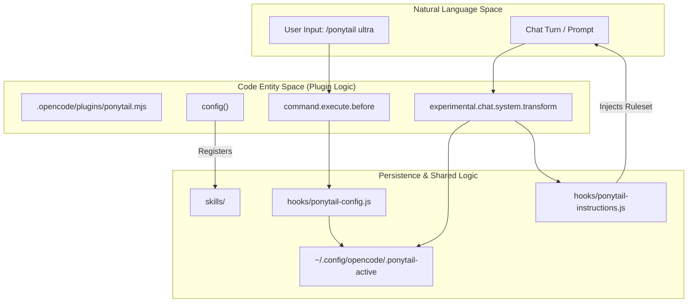
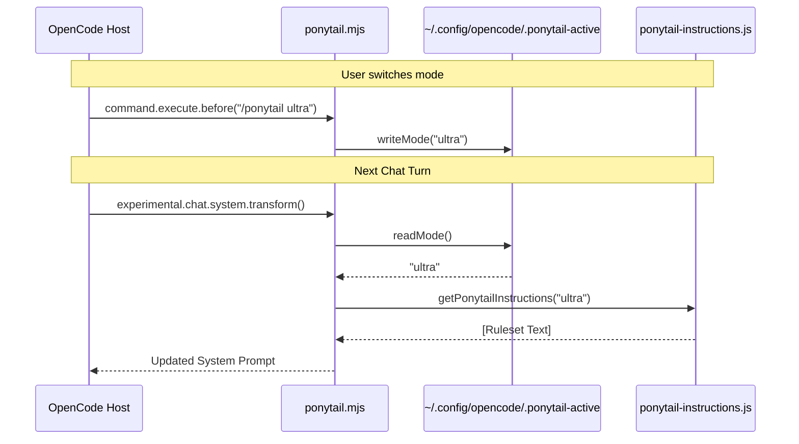

# OpenCode 플러그인

관련 소스 파일

다음 파일들은 이 위키 페이지를 생성하는 데 문맥 자료로 사용되었습니다:

- [.opencode/command/ponytail-review.md](.opencode/command/ponytail-review.md)
- [.opencode/command/ponytail.md](.opencode/command/ponytail.md)
- [.opencode/plugins/ponytail.mjs](.opencode/plugins/ponytail.mjs)
- [opencode.json](opencode.json)
- [tests/opencode-plugin.test.js](tests/opencode-plugin.test.js)

OpenCode 플러그인은 Ponytail 규칙셋을 [OpenCode](https://opencode.ai) 환경에 매끄럽게 통합합니다. 이 플러그인은 서버 측 플러그인으로 동작하며, 활성 Ponytail 모드의 상태를 영속화하고 모든 채팅 상호작용에 적절한 지침이 주입되도록 보장합니다. `hooks/` 디렉터리의 공유 로직을 활용해 Claude Code와 Codex 같은 다른 지원 호스트와의 정합성을 유지합니다.

## 플러그인 아키텍처

이 플러그인은 [./.opencode/plugins/ponytail.mjs:1-80]()에 위치한 ES 모듈로 구현됩니다. OpenCode 호스트와는 라이프사이클 훅과 설정 오버라이드를 통해 상호작용합니다.

### 진입점 및 등록
플러그인은 `opencode.json` 매니페스트 파일을 통해 등록됩니다 [opencode.json:1-5](). OpenCode는 `.mjs` 파일의 기본 export를 로드하여 플러그인 훅을 초기화합니다 [./.opencode/plugins/ponytail.mjs:43-79]().

### 데이터 흐름 및 라이프사이클 훅
플러그인은 세 가지 주요 메커니즘으로 동작합니다:

1.  **설정(`config` 훅)**: 로컬 `skills/` 디렉터리를 등록해 OpenCode가 `/ponytail-review` 같은 Ponytail 전용 명령을 발견하고 실행할 수 있게 합니다 [./.opencode/plugins/ponytail.mjs:52-58]().
2.  **시스템 변환(`experimental.chat.system.transform`)**: 모드가 `off`가 아닐 경우, 대화의 모든 턴에 Ponytail 규칙셋을 시스템 프롬프트에 주입합니다 [./.opencode/plugins/ponytail.mjs:61-65]().
3.  **명령 가로채기(`command.execute.before`)**: `/ponytail <level>` 명령을 포착해 다음 상호작용이 일어나기 전에 영구 상태를 갱신합니다 [./.opencode/plugins/ponytail.mjs:71-77]().

### 상태 관리
프로젝트 로컬 플래그 파일을 사용할 수 있는 다른 호스트들과 달리, OpenCode 플러그인은 세션 연속성을 유지하기 위해 활성 모드를 사용자의 설정 디렉터리에 저장합니다. 상태는 다음 위치에 저장됩니다:
`~/.config/opencode/.ponytail-active` (또는 `$XDG_CONFIG_HOME/opencode/.ponytail-active`) [./.opencode/plugins/ponytail.mjs:24-28]().

| 함수 | 목적 |
| :--- | :--- |
| `readMode()` | 상태 파일에서 모드를 읽고, 파일이 없거나 유효하지 않으면 `getDefaultMode()`로 되돌아갑니다 [./.opencode/plugins/ponytail.mjs:30-36](). |
| `writeMode(mode)` | 선택한 모드(예: `lite`, `full`, `ultra`, `off`)를 파일 시스템에 영속화합니다 [./.opencode/plugins/ponytail.mjs:38-41](). |

**출처:** [./.opencode/plugins/ponytail.mjs:1-80](), [opencode.json:1-5]()

## 구성 요소 상호작용 다이어그램

다음 다이어그램은 OpenCode 플러그인이 Natural Language Space(사용자 명령)와 Code Entity Space(지침 빌더 및 상태 파일)를 어떻게 연결하는지 보여줍니다.

**OpenCode 통합 흐름**

**출처:** [./.opencode/plugins/ponytail.mjs:20-28](), [./.opencode/plugins/ponytail.mjs:52-77](), [opencode.json:1-5]()

## 명령 구현

플러그인은 OpenCode가 파싱하는 Markdown 기반 정의를 통해 명령을 지원합니다. 이 파일들은 명령이 호출될 때 에이전트에게 전달되는 메타데이터와 초기 지침을 제공합니다.

*   **`/ponytail`**: [.opencode/command/ponytail.md:1-6]()에 정의되어 있습니다. 사용자가 강도 수준을 전환할 수 있게 합니다. 이 변경을 영속화하는 로직은 플러그인의 `command.execute.before` 훅이 처리합니다 [./.opencode/plugins/ponytail.mjs:71-77]().
*   **`/ponytail-review`**: [.opencode/command/ponytail-review.md:1-6]()에 정의되어 있습니다. 과도 설계와 삭제 가능한 코드를 식별하는 데 초점을 둔 특정 리뷰 패스를 트리거합니다.

**출처:** [.opencode/command/ponytail.md:1-6](), [.opencode/command/ponytail-review.md:1-6](), [./.opencode/plugins/ponytail.mjs:71-77]()

## 구현 세부 정보

### 지침 주입
플러그인은 공유 `ponytail-instructions.js` 모듈의 `getPonytailInstructions(mode)`를 사용합니다 [./.opencode/plugins/ponytail.mjs:20](). 이를 통해 "Lazy Senior Developer" 규칙셋이 모든 플랫폼에서 일관되게 유지됩니다. 주입은 매 턴 동적으로 발생합니다 [./.opencode/plugins/ponytail.mjs:61-65]().

### 플러그인 로직 흐름
다음 순서도는 OpenCode 호스트와 Ponytail 플러그인이 모드 전환 및 이후 프롬프트 동안 상호작용하는 방식을 보여줍니다.

**모드 전환 및 주입 시퀀스**

**출처:** [./.opencode/plugins/ponytail.mjs:30-41](), [./.opencode/plugins/ponytail.mjs:61-77]()

## 테스트

OpenCode 플러그인은 전용 테스트 스위트 `tests/opencode-plugin.test.js`로 검증됩니다. 이 스위트는 살아 있는 OpenCode 프로세스 없이 동작을 검증하기 위해 OpenCode 훅 환경을 모킹하는 "스모크 테스트" 방식을 사용합니다 [tests/opencode-plugin.test.js:1-4]().

### 주요 테스트 케이스
*   **기본 주입**: 상태 파일이 없을 때 규칙셋이 `full` 수준으로 주입되는지 검증합니다 [tests/opencode-plugin.test.js:32-39]().
*   **영속성**: `/ponytail ultra`가 상태 파일에 올바르게 기록되고, 이후 변환이 새 수준을 반영하는지 확인합니다 [tests/opencode-plugin.test.js:41-47]().
*   **비활성화**: `/ponytail off`가 모든 지침 주입을 중지하는지 확인합니다 [tests/opencode-plugin.test.js:49-55]().
*   **격리**: 관련 없는 명령이 Ponytail 상태를 변경하지 않는지 확인합니다 [tests/opencode-plugin.test.js:57-62]().

테스트 스위트는 개발자의 실제 설정과 분리되도록 `XDG_CONFIG_HOME`에 임시 디렉터리를 사용합니다 [tests/opencode-plugin.test.js:16-19]().

**출처:** [tests/opencode-plugin.test.js:1-65]()
