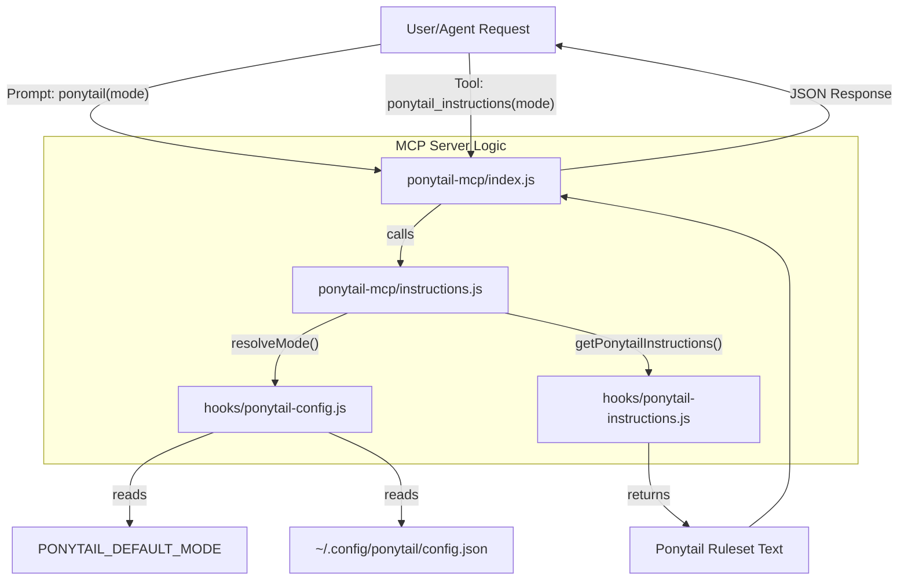
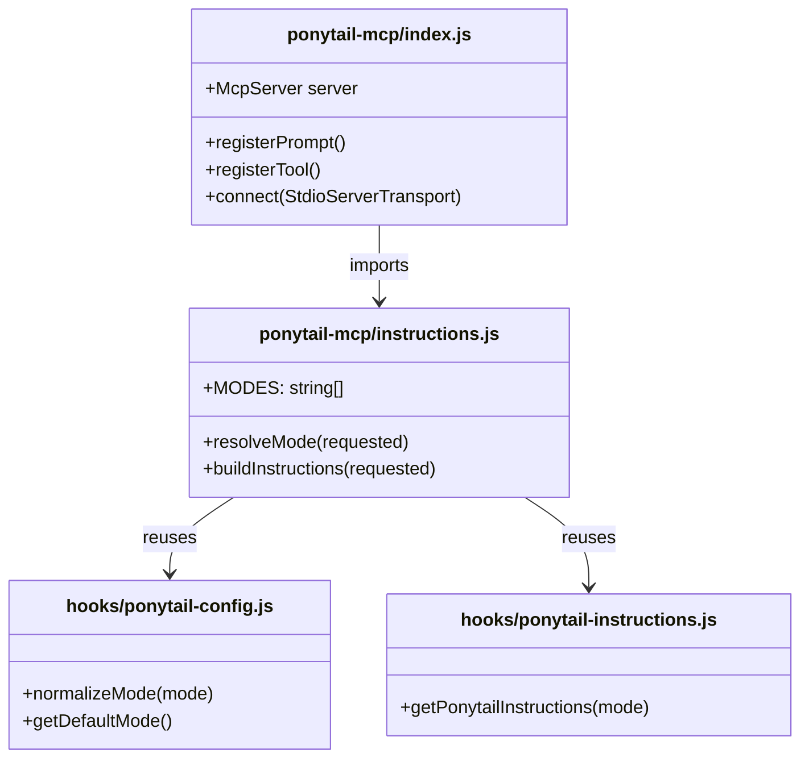

# MCP 서버(ponytail-mcp)

관련 소스 파일

다음 파일들은 이 위키 페이지를 생성하는 데 문맥 자료로 사용되었습니다:

- [ponytail-mcp/README.md](ponytail-mcp/README.md)
- [ponytail-mcp/index.js](ponytail-mcp/index.js)
- [ponytail-mcp/instructions.js](ponytail-mcp/instructions.js)
- [ponytail-mcp/package.json](ponytail-mcp/package.json)
- [ponytail-mcp/test/instructions.test.js](ponytail-mcp/test/instructions.test.js)

`ponytail-mcp` 패키지는 Ponytail의 "lazy senior dev" 지침을 프롬프트와 도구 양쪽으로 제공하는 Model Context Protocol(MCP) 서버를 구현합니다. 이 서버는 항상 켜져 있는 어댑터가 없는 MCP 준수 호스트(예: Claude Desktop 또는 다른 IDE 에이전트)나, 프롬프트 메뉴 또는 도구 실행을 통해 명시적으로 컨텍스트를 가져오는 환경을 위해 설계되었습니다 [ponytail-mcp/README.md:1-11]().

## 목적과 범위

MCP 서버는 네이티브 시스템 프롬프트 주입 훅이 없는 호스트를 위한 깔끔한 통합 지점을 제공합니다. Claude 훅과 Pi 확장에서 쓰는 핵심 로직을 재사용해, 출력되는 규칙셋이 모든 플랫폼에서 동일하도록 보장합니다 [ponytail-mcp/instructions.js:1-3]().

### MCP vs. 항상 켜진 어댑터
Claude Code 플러그인이나 OpenCode 확장처럼 모든 채팅 턴에 자동으로 규칙을 주입하는 방식과 달리, MCP 서버는 보통 **사용자 호출형**입니다. 다음을 위해 의도되었습니다:
1. **MCP 전용 호스트**: 유일한 주입 지점이 프롬프트 메뉴인 환경.
2. **도구 기반 컨텍스트**: 도구 호출이나 코드 실행을 통해 지침을 가져오는 호스트 [ponytail-mcp/README.md:7-11]().

**출처:** [ponytail-mcp/README.md:1-11](), [ponytail-mcp/index.js:1-5]().

---

## 기술 아키텍처

이 서버는 `@modelcontextprotocol/sdk`를 사용해 구축되며 `StdioServerTransport`를 통해 통신합니다 [ponytail-mcp/index.js:6-7, 48]().

### 데이터 흐름: 자연어에서 코드 엔터티로

다음 다이어그램은 특정 Ponytail 모드에 대한 사용자의 요청이 MCP 서버 구성 요소를 거쳐 공유 지침 빌더로 흐르는 과정을 보여줍니다.

**다이어그램: MCP 요청 해석**

**출처:** [ponytail-mcp/index.js:19-46](), [ponytail-mcp/instructions.js:4-26](), [ponytail-mcp/README.md:21-22]().

---

## 노출 기능

이 서버는 두 가지 주요 인터페이스를 등록합니다: 프롬프트와 도구입니다. 둘 다 선택적인 `mode` 인자(`lite`, `full`, `ultra`)를 받습니다 [ponytail-mcp/index.js:14-17]().

### 1. `ponytail` 프롬프트
사용자가 호출하는 프롬프트로, 규칙셋을 사용자 메시지로 반환합니다. 세션에서 Ponytail을 수동으로 "활성화"하는 기본 방법입니다 [ponytail-mcp/index.js:19-29]().

### 2. `ponytail_instructions` 도구
규칙셋 텍스트와 `structuredContent` 객체를 반환하는 읽기 전용 도구입니다. 이는 도구 호출을 통해 컨텍스트를 가져오도록 설계된 에이전트를 위한 것입니다 [ponytail-mcp/index.js:31-46]().

| 기능 | 유형 | 출력 |
| :--- | :--- | :--- |
| `ponytail` | Prompt | `messages: [{ role: "user", content: { type: "text", text: rules } }]` |
| `ponytail_instructions` | Tool | `content`(텍스트) 및 `structuredContent`(`{ mode, instructions }`) |

**출처:** [ponytail-mcp/index.js:19-46](), [ponytail-mcp/README.md:13-19]().

---

## 구현 세부 정보

### 모드 해석
이 서버는 모드에 대해 엄격한 해석 계층을 구현합니다. `off`나 `review`처럼 MCP를 통해 지침을 제공하기에 적합하지 않은 내부 모드는 걸러냅니다 [ponytail-mcp/instructions.js:10-15]().

`resolveMode(requested)` 함수는 다음 로직을 따릅니다:
1. **정규화**: `ponytail-config.js`의 `normalizeMode`를 사용합니다 [ponytail-mcp/instructions.js:17]().
2. **검증**: 모드가 유효하고 `off`가 아니면 그대로 사용합니다 [ponytail-mcp/instructions.js:18]().
3. **대체 경로**: 비어 있거나 유효하지 않으면 `getDefaultMode()`를 확인합니다(`PONYTAIL_DEFAULT_MODE`와 설정 파일을 봅니다) [ponytail-mcp/instructions.js:20-21]().
4. **하드 기본값**: 다른 설정이 없으면 `full`로 되돌아갑니다 [ponytail-mcp/instructions.js:21]().

### 구성 요소 상호작용
서버 로직은 단위 테스트에서 전체 MCP SDK가 필요하지 않도록 분리되어 있어 테스트 가능성을 유지합니다.

**다이어그램: 구성 요소 의존성**

**출처:** [ponytail-mcp/instructions.js:4-27](), [ponytail-mcp/index.js:6-12]().

---

## 테스트 스위트

이 서버에는 MCP 전송 계층과 분리된 상태에서 지침 선택 로직을 검증하는 `ponytail-mcp/test/instructions.test.js` 테스트 스위트가 포함되어 있습니다 [ponytail-mcp/package.json:8]().

주요 테스트 케이스는 다음과 같습니다:
* **유효한 강도 수준**: `lite`, `full`, `ultra`가 올바르게 그대로 통과되는지 확인합니다 [ponytail-mcp/test/instructions.test.js:6-8]().
* **대체 로직**: `off`, `review`, 또는 "nonsense" 같은 잡 문자열이 빈 지침을 반환하지 않고 유효한 제공 모드로 올바르게 되돌아가는지 검증합니다 [ponytail-mcp/test/instructions.test.js:10-16]().
* **지침 무결성**: `buildInstructions`가 "PONYTAIL MODE ACTIVE" 헤더와 올바른 모드 태그를 포함한 텍스트를 반환하는지 확인합니다 [ponytail-mcp/test/instructions.test.js:18-22]().

**출처:** [ponytail-mcp/test/instructions.test.js:1-23](), [ponytail-mcp/package.json:8]().
