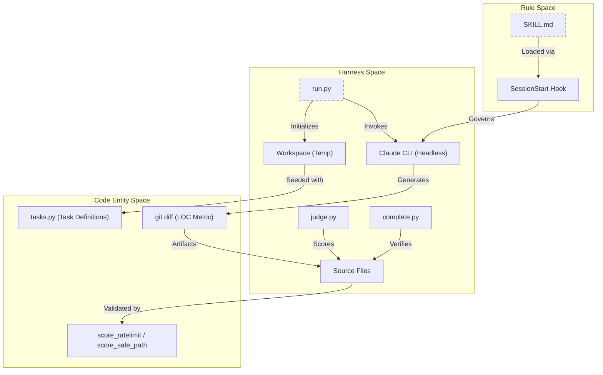
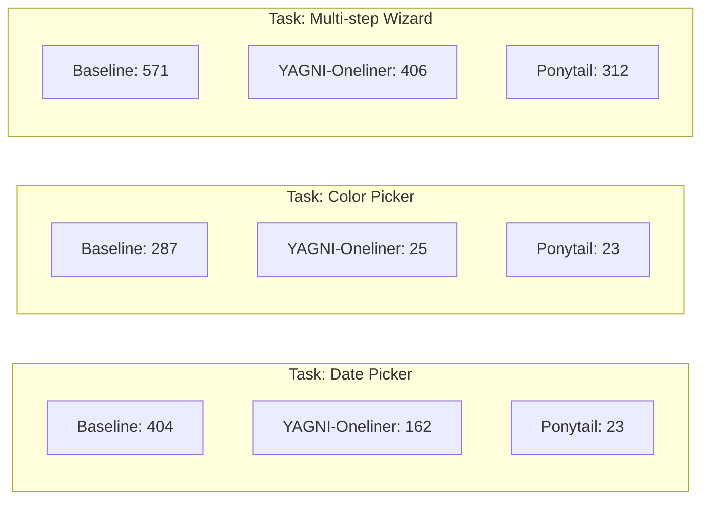

# 벤치마크 및 성능 결과

관련 소스 파일

다음 파일들은 이 위키 페이지를 생성하는 데 문맥 자료로 사용되었습니다:

- [.gitignore](.gitignore)
- [benchmarks/README.md](benchmarks/README.md)
- [benchmarks/agentic/README.md](benchmarks/agentic/README.md)
- [benchmarks/agentic/complete.py](benchmarks/agentic/complete.py)
- [benchmarks/agentic/judge.py](benchmarks/agentic/judge.py)
- [benchmarks/agentic/run.py](benchmarks/agentic/run.py)
- [benchmarks/agentic/tasks.py](benchmarks/agentic/tasks.py)
- [benchmarks/benchmark-local.py](benchmarks/benchmark-local.py)
- [benchmarks/loc.js](benchmarks/loc.js)
- [benchmarks/results/2026-06-15-llama3.2-local.md](benchmarks/results/2026-06-15-llama3.2-local.md)
- [benchmarks/results/2026-06-17-agentic-safety.md](benchmarks/results/2026-06-17-agentic-safety.md)
- [benchmarks/results/2026-06-18-agentic.md](benchmarks/results/2026-06-18-agentic.md)

Ponytail 프로젝트는 엄격한 벤치마킹 하니스를 사용해, 최소주의 원칙이 안전성이나 정확성을 희생하지 않으면서도 코드 밀도, 토큰 효율성, 개발자 속도에서 측정 가능한 향상으로 이어지는지 검증합니다. 벤치마크는 여러 "arm"(Control, Caveman, Ponytail)에서 새 에이전트 인스턴스를 사용해 수행되며, 공정한 일대일 비교를 보장합니다.

## 성능 개요

모든 벤치마크 버전에서 Ponytail은 일관되게 가장 가벼운 코드베이스를 만들어냅니다. 초기 단발(single-shot) 벤치마크에서는 80–94%라는 큰 감소가 관찰되었고 [benchmarks/README.md:62](), 최근의 실제 저장소 기반 agentic 평가는 더 정교한 그림을 보여줍니다. Ponytail은 과도한 구현 함정(예: 커스텀 컴포넌트 vs. 네이티브 플랫폼 입력)이 있는 기능에서 **60–94%**를 절감하면서도, 적대적 입력에 대해서는 **100% 안전**을 유지합니다 [benchmarks/README.md:67-71]().

### 벤치마크 아키텍처

다음 다이어그램은 벤치마킹 하니스 로직과 평가되는 코드 엔터티 및 규칙을 연결해 보여줍니다.

**벤치마크 라이프사이클 및 코드 엔터티**

출처: [benchmarks/agentic/run.py:4-24](), [benchmarks/agentic/tasks.py:1-22](), [benchmarks/agentic/judge.py:2-11](), [benchmarks/agentic/complete.py:4-14]()

### 요약 표: 중앙값 결과(Claude 모델)
단발 벤치마크는 Ponytail을 기준선(스킬 없음)과 Caveman 스킬에 대해 다섯 작업(email, debounce, csv-sum, react-countdown, rate-limit)에서 비교했습니다.

| 지표 | 기준선 | Caveman | **Ponytail** |
| :--- | :---: | :---: | :---: |
| **코드(줄 수) - Sonnet** | 693 | 120 | **44** |
| **비용(USD) - Sonnet** | 0.137 | 0.046 | **0.035** |
| **지연 시간(초) - Sonnet** | 124.1 | 34.7 | **20.1** |

출처: [benchmarks/README.md:36-60]()

## Agentic 성능 시각화

`tiangolo/full-stack-fastapi-template`를 사용한 실제 "Agentic" 시나리오에서, Ponytail은 복잡한 커스텀 빌드를 네이티브 플랫폼 기능으로 대체하는 핵심 강점을 보여줍니다.

**소스 LOC 비교(Agentic 실제 저장소 작업)**

출처: [benchmarks/results/2026-06-18-agentic.md:83-90]()

## 연구 영역

벤치마크 기록은 세 가지 주요 단계로 나뉩니다: 초기 최적화, 안전 강화, 그리고 agentic 실제 평가로의 전환입니다.

### [Caveman vs Ponytail (v1–v3) 연구](#5.1)
이 연구는 "Skill-Read Tax"와 "Prose vs Code" 트레이드오프에 초점을 맞췄습니다. 초창기 Ponytail 버전이 장황한 설명에 취약했고, 이후 간결함을 강제하기 위해 "Output Cap"이 도입되었다는 점을 문서화했습니다 [benchmarks/README.md:90]().

자세한 내용은 [Caveman vs Ponytail (v1–v3) 연구](#5.1)를 참조하세요.

### [v4 강화 벤치마크(A–F 작업)](#5.2)
v4 벤치마크는 최소주의가 취약하거나 테스트되지 않은 코드로 이어지지 않도록 "Hardening Rules"(Test Reflex, Ceiling Comments, Robust Variant)를 도입했습니다. 이를 통해 에이전트가 코드량에는 "게으르더라도" 정확성에는 "근면"할 수 있음을 검증했습니다.

자세한 내용은 [v4 강화 벤치마크(A–F 작업)](#5.2)를 참조하세요.

### [Agentic 벤치마크 스위트](#5.3)
현재 Ponytail 평가의 골드 스탠다드입니다. 단발 프롬프트를 넘어 실제 `Claude Code` 세션으로 이동합니다.
- **LOC 계층**: 실제 FastAPI/React 저장소를 대상으로 한 12개 기능 티켓 [benchmarks/agentic/README.md:44-47]().
- **안전 계층**: 안전 요구사항이 암묵적인 7개의 수술적 작업(예: 경로 탐색, SQL 인젝션) [benchmarks/agentic/tasks.py:8-13]().
- **LLM 심판**: `judge.py`와 `complete.py`를 사용해 과도 설계와 작업 완성도를 감사합니다 [benchmarks/agentic/README.md:74-110]().

자세한 내용은 [Agentic 벤치마크 스위트](#5.3)를 참조하세요.

## 안전성 및 로컬 모델

### 안전 하한
Agentic 벤치마크의 중요한 발견은 "one-liner를 선호하라" 같은 단순한 프롬프트가 코드 크기를 줄일 수는 있지만, 종종 안전 장치(예: 잘못된 CSV 행 처리 실패)를 떨어뜨린다는 점입니다. Ponytail은 원시 줄 수 감소보다 정확성과 보안을 우선하는 구조화된 "사다리" 의사결정을 제공함으로써 **100% 안전 기록**을 유지합니다 [benchmarks/results/2026-06-18-agentic.md:122-132]().

### 로컬 모델 성능
로컬 모델(예: Ollama를 통한 `llama3.2`)에서의 벤치마크는 Ponytail의 효과가 모델의 지침 따르기 능력과 맞물려 있음을 보여줍니다. 작은 모델에서는 LOC 신호가 종종 잡음 속에 묻히며, 증가한 시스템 프롬프트가 코드량 감소 없이 오히려 지연 시간을 늘릴 수 있습니다 [benchmarks/results/2026-06-15-llama3.2-local.md:34-45]().

출처: [benchmarks/benchmark-local.py:1-11](), [benchmarks/results/2026-06-15-llama3.2-local.md:71-76]()
