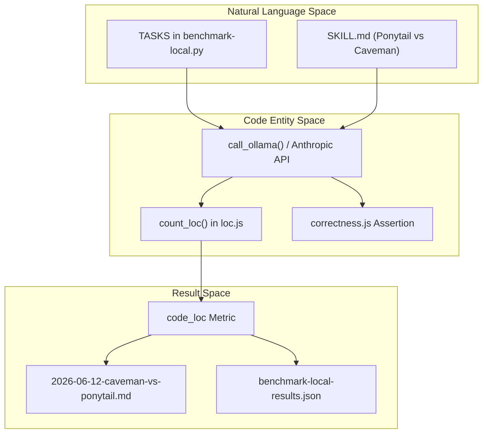
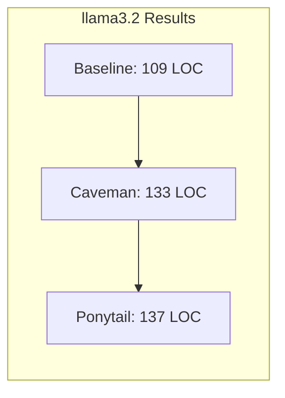
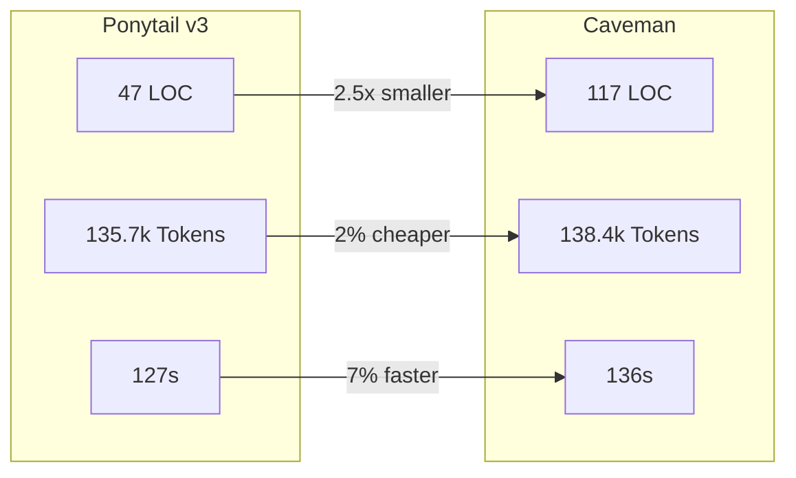

# Caveman 대 Ponytail (v1–v3) 연구

관련 소스 파일

다음 파일들은 이 위키 페이지를 생성하는 데 문맥 자료로 사용되었습니다:

- [.env.example](.env.example)
- [.gitignore](.gitignore)
- [benchmarks/arms/baseline.js](benchmarks/arms/baseline.js)
- [benchmarks/arms/caveman-SKILL.md](benchmarks/arms/caveman-SKILL.md)
- [benchmarks/arms/caveman.js](benchmarks/arms/caveman.js)
- [benchmarks/arms/ponytail.js](benchmarks/arms/ponytail.js)
- [benchmarks/benchmark-local.py](benchmarks/benchmark-local.py)
- [benchmarks/loc.js](benchmarks/loc.js)
- [benchmarks/promptfooconfig.yaml](benchmarks/promptfooconfig.yaml)
- [benchmarks/prompts.json](benchmarks/prompts.json)
- [benchmarks/results/2026-06-12-caveman-vs-ponytail.md](benchmarks/results/2026-06-12-caveman-vs-ponytail.md)
- [benchmarks/results/2026-06-15-llama3.2-local.md](benchmarks/results/2026-06-15-llama3.2-local.md)
- [tests/correctness.test.js](tests/correctness.test.js)

이 페이지는 기준선 에이전트 성능과 "Caveman" 스킬, 그리고 Ponytail 스킬(v1부터 v3까지)의 반복적 진화를 비교한 초기 벤치마크를 문서화합니다. 이 연구는 다섯 개의 특정 엔지니어링 작업 전반에서 이러한 구성을 평가해 코드 최소주의, 토큰 효율성, 실행 속도를 측정합니다.

## 연구 개요

이 벤치마크는 서로 다른 스킬 버전과 구성 간 비교 가능한 결과를 확보하기 위해 일관된 방법론을 사용했습니다.

### 방법론
*   **환경**: 각 구성과 작업마다 새 Claude Code 하위 에이전트 1개 [benchmarks/results/2026-06-12-caveman-vs-ponytail.md:3-3]().
*   **지표**: 총 토큰(내부 사고 포함), 지속 시간(벽시계 시간), 그리고 최종 산출물의 fenced 블록에서 계산한 코드 줄 수(LOC) [benchmarks/results/2026-06-12-caveman-vs-ponytail.md:3-5]().
*   **작업**:
    1.  `email`: Python 이메일 검증 함수 [benchmarks/benchmark-local.py:23-23]().
    2.  `debounce`: 순수 JavaScript 검색 입력 디바운싱 [benchmarks/benchmark-local.py:24-24]().
    3.  `csv-sum`: Python CSV 처리 [benchmarks/benchmark-local.py:25-25]().
    4.  `react-countdown`: React 컴포넌트 개발 [benchmarks/benchmark-local.py:26-26]().
    5.  `rate-limit`: FastAPI 엔드포인트 보호 [benchmarks/benchmark-local.py:27-27]().

### 구성(Arm)
이 벤치마크는 세 가지 서로 다른 "arm"을 비교합니다:
*   **Baseline**: 특수 스킬이나 지침이 제공되지 않습니다 [benchmarks/arms/baseline.js:1-2]().
*   **Caveman**: 전체 Caveman `SKILL.md`(MIT, JuliusBrussee 작성)를 시스템 프롬프트로 사용합니다 [benchmarks/arms/caveman.js:4-7]().
*   **Ponytail**: 저장소 자체의 `skills/ponytail/SKILL.md`를 시스템 프롬프트로 사용합니다 [benchmarks/arms/ponytail.js:4-7]().

출처: [benchmarks/benchmark-local.py:22-36](), [benchmarks/promptfooconfig.yaml:19-25]()

## 데이터 흐름 및 시스템 매핑

다음 다이어그램은 벤치마킹 과정을 자연어 프롬프트에서 특정 코드 엔터티와 출력 지표로 어떻게 매핑하는지 보여줍니다.

**벤치마크 실행 흐름**

출처: [benchmarks/benchmark-local.py:55-78](), [benchmarks/loc.js:4-13](), [benchmarks/promptfooconfig.yaml:27-35]()

## 반복적 진화(v1–v3)

### Ponytail v1: 최소주의 프로토타입
초기 버전은 코드 출력 감소에 크게 초점을 맞췄습니다. 코드 감소에는 성공했지만, 절약한 토큰을 "왜 더 많은 코드를 쓰지 않았는지" 설명하는 데 써버리는 상당한 "prose tax"를 낳았습니다.

| 작업 | Baseline (Tok/Time/LOC) | Caveman (Tok/Time/LOC) | Ponytail v1 (Tok/Time/LOC) |
| :--- | :--- | :--- | :--- |
| **합계** | **161,955 · 479s · ~293** | **138,410 · 136s · ~117** | **143,588 · 228s · ~53** |

**발견 사항(v1):**
*   **코드 최소주의**: Ponytail v1은 기준선보다 5.5배, Caveman보다 2.2배 적은 줄 수를 생성했습니다 [benchmarks/results/2026-06-12-caveman-vs-ponytail.md:20-20]().
*   **숙고 비용**: Ponytail은 무엇을 만들지 "숙고"하느라 더 느렸습니다(228s vs 136s) [benchmarks/results/2026-06-12-caveman-vs-ponytail.md:23-23]().
*   **바닥 효과**: `csv-sum` 같은 단순 작업에서는 지침을 읽어들이는 것만으로도 약 3k 토큰의 "skill-read tax"가 발생합니다 [benchmarks/results/2026-06-12-caveman-vs-ponytail.md:24-25]().

출처: [benchmarks/results/2026-06-12-caveman-vs-ponytail.md:9-25]()

### Ponytail v2: 숙고 억제
v2는 에이전트가 장황한 에세이를 쓰지 못하도록 "Ladder-is-a-reflex" 조항과 엄격한 출력 상한을 도입했습니다 [benchmarks/results/2026-06-12-caveman-vs-ponytail.md:29-31]().

**v2의 핵심 변경 사항:**
*   **출력 상한**: 코드와 ≤3줄의 짧은 설명으로 제한 [benchmarks/results/2026-06-12-caveman-vs-ponytail.md:29-30]().
*   **Ship-and-Question**: "X가 필요한가?"를 묻느라 작업을 멈추지 말고, 최소 버전을 내보내고 X의 트리거만 언급합니다 [benchmarks/results/2026-06-12-caveman-vs-ponytail.md:31-31]().

**v2 결과:**
*   **토큰 감소**: v1 대비 −6,964 토큰(−4.8%) [benchmarks/results/2026-06-12-caveman-vs-ponytail.md:40-40]().
*   **속도 향상**: v1 대비 −70초(−31%) [benchmarks/results/2026-06-12-caveman-vs-ponytail.md:40-40]().

출처: [benchmarks/results/2026-06-12-caveman-vs-ponytail.md:27-40]()

### Ponytail v3: 스킬 압축
v3는 `SKILL.md` 파일 자체를 115줄에서 95줄로 압축해 "read tax"를 줄이는 데 집중했으며, 내용은 잃지 않았습니다 [benchmarks/results/2026-06-12-caveman-vs-ponytail.md:44-46]().

**최종 v3 성능 vs Caveman:**
*   **토큰**: −2,701(−2.0%) [benchmarks/results/2026-06-12-caveman-vs-ponytail.md:55-55]().
*   **벽시계 시간**: −9초(−7%) [benchmarks/results/2026-06-12-caveman-vs-ponytail.md:55-55]().
*   **LOC**: 47줄 대 Caveman의 117줄(2.5배 감소) [benchmarks/results/2026-06-12-caveman-vs-ponytail.md:61-61]().

출처: [benchmarks/results/2026-06-12-caveman-vs-ponytail.md:42-56]()

## 로컬 모델 변동성(llama3.2)

동일한 벤치마크를 로컬 모델(예: llama3.2 3B)에 대해 실행하면 결과가 Claude와 크게 다릅니다.

**llama3.2 비교(n=5, 중앙값)**

**로컬 모델에서의 핵심 발견:**
*   **신호 소실**: llama3.2에서는 LOC 효과가 잡음 수준 안에 있습니다. Ponytail은 실행마다 기준선보다 17% 낮은 값에서 50% 높은 값까지 다양하게 나타났습니다 [benchmarks/results/2026-06-15-llama3.2-local.md:34-39]().
*   **지침 추종**: 작은 모델(3B 범위)은 지침 추종 비용(더 느린 벽시계 시간)을 치르지만, 그 비용을 더 적은 코드로 안정적으로 전환하지는 못합니다 [benchmarks/results/2026-06-15-llama3.2-local.md:47-50]().
*   **정확성 가드**: `benchmarks/correctness.js` 로직(`tests/correctness.test.js`에서 검증됨)은 최소주의를 추구하더라도 깨진 코드를 내보내지 않도록 하는 데 중요합니다 [tests/correctness.test.js:1-10]().

출처: [benchmarks/results/2026-06-15-llama3.2-local.md:14-51](), [tests/correctness.test.js:16-180]()

## 최종 판정

v3 연구는 Ponytail 철학이 Claude 같은 고추론 모델에서 기준선 에이전트가 보이는 퇴행적 사례(예: 단순 타이머에 190줄짜리 React 대시보드)를 효과적으로 제거함을 확인했습니다 [benchmarks/results/2026-06-12-caveman-vs-ponytail.md:67-69]().

**비교 지표(Claude에서 v3 vs Caveman)**

출처: [benchmarks/results/2026-06-12-caveman-vs-ponytail.md:57-65]()

### 효율성 메모
이 연구는 사소한 작업에서 기준선 대비 약 3.6k 토큰의 바닥 비용이 있음을 지적했습니다. 이는 주로 벤치마크 중 `SKILL.md`를 수동으로 읽는 데서 비롯됩니다. 운영 환경에서는 자동 규칙 주입으로 이 비용이 완화됩니다 [benchmarks/results/2026-06-12-caveman-vs-ponytail.md:69-71]().
