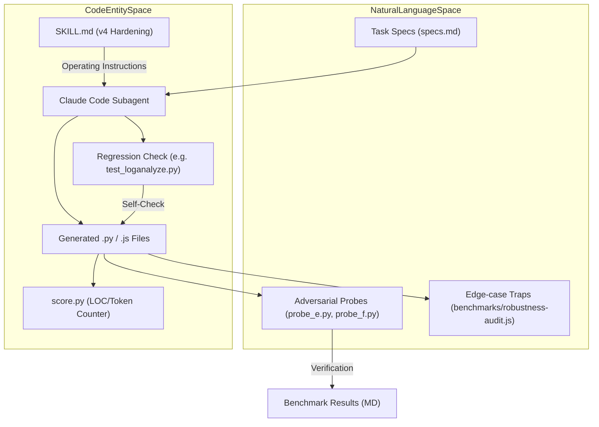
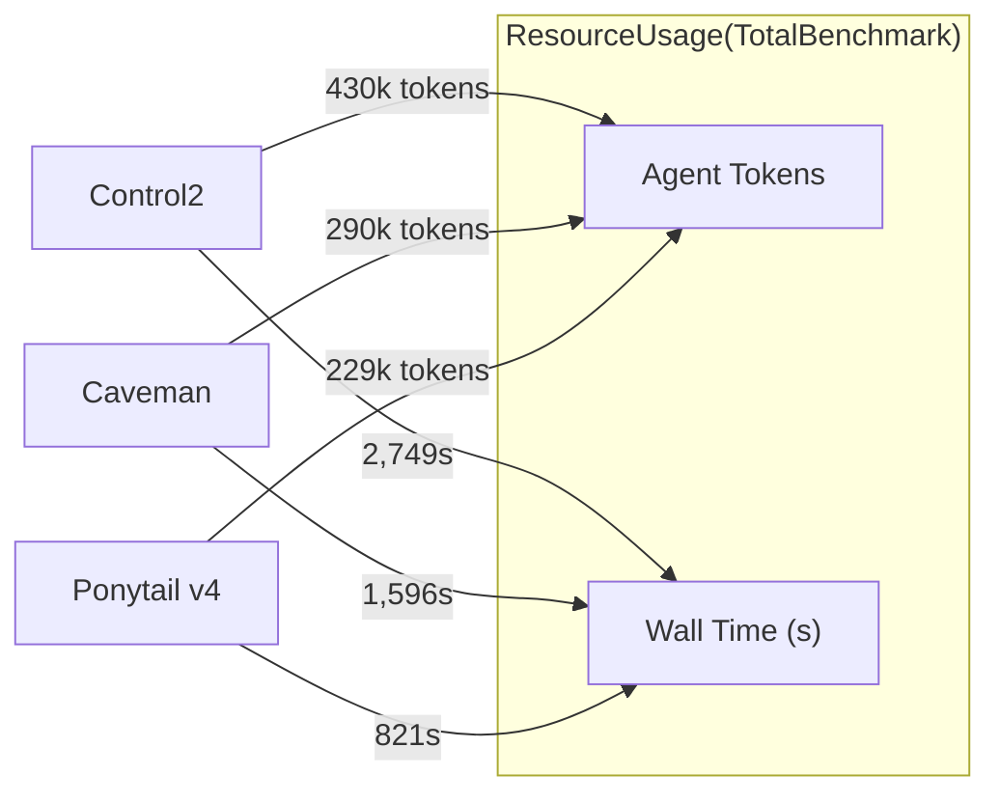

# v4 강화 벤치마크(A–F 작업)

관련 소스 파일

다음 파일들은 이 위키 페이지를 생성하는 데 문맥 자료로 사용되었습니다:

- [.agents/rules/ponytail.md](.agents/rules/ponytail.md)
- [.kiro/steering/ponytail.md](.kiro/steering/ponytail.md)
- [benchmarks/behavior.js](benchmarks/behavior.js)
- [benchmarks/behavior.yaml](benchmarks/behavior.yaml)
- [benchmarks/promptfooconfig.gpt.yaml](benchmarks/promptfooconfig.gpt.yaml)
- [benchmarks/results/2026-06-12-v4-hardening-vs-caveman.md](benchmarks/results/2026-06-12-v4-hardening-vs-caveman.md)
- [benchmarks/results/2026-06-16-correctness-gate-fix.md](benchmarks/results/2026-06-16-correctness-gate-fix.md)
- [benchmarks/results/2026-06-16-robustness-audit.md](benchmarks/results/2026-06-16-robustness-audit.md)
- [benchmarks/robustness-audit.js](benchmarks/robustness-audit.js)
- [scripts/check-rule-copies.js](scripts/check-rule-copies.js)

이 페이지는 안전이 중요한 요구사항과 적대적 탐색에 노출되었을 때 Ponytail의 최소주의 철학을 평가한 v4 강화 벤치마크를 문서화합니다. 이 벤치마크는 Ponytail v4를 "Control" arm(지침 없음)과 "Caveman" arm(대안 최소주의 스킬)과 비교합니다.

## 목적과 범위
v4 벤치마크는 Ponytail의 최소주의 추구가 정확성이나 보안을 희생하지 않는지 검증하도록 설계되었습니다. 핵심 지침에 세 가지 구체적인 "Hardening Rules"를 추가하고, 이를 여섯 개의 복잡한 작업(A–F)에 걸쳐 시험합니다. 평가 항목은 다음을 측정합니다:
*   **빌드 단계:** 코드 줄 수(LOC), 토큰 사용량, 벽시계 시간.
*   **확장 단계:** 새로운 요구사항을 충족하기 위해 기존 코드를 수정하는 비용.
*   **안전 검증:** 보안과 동시성을 노리는 적대적 탐색에 대한 회복력.
*   **강건성 감사:** 약한 모델(GPT-mini 계열)에서의 엣지 케이스 처리 검증.

## v4 강화 규칙
v4 업데이트는 `AGENTS.md`와 `.kiro/steering/ponytail.md` 같은 플랫폼별 규칙 파일에 약 10줄의 프롬프트 하드닝을 추가했습니다 [benchmarks/results/2026-06-12-v4-hardening-vs-caveman.md:14-25](), [.kiro/steering/ponytail.md:26-29]().

| 규칙 | 설명 | 구현 목표 |
| :--- | :--- | :--- |
| **Test Reflex** | 사소하지 않은 로직에는 반드시 실행 가능한 체크가 하나 있어야 합니다(예: `if __name__ == "__main__":` 또는 작은 `test_*.py`). | 프레임워크 비대로부터 벗어난 최소 코드가 실제로 동작하도록 보장합니다 [.kiro/steering/ponytail.md:29](). |
| **Ceiling Comments** | 모든 `ponytail:` 지름길은 구체적인 상한과 업그레이드 경로를 명시해야 합니다. | 최소 해법이 더 이상 맞지 않게 될 때 미래 엔지니어를 위한 로드맵을 제공합니다 [.kiro/steering/ponytail.md:27](). |
| **Robust Variant** | 같은 크기의 stdlib 옵션 둘 중 하나를 고를 때는 엣지 케이스에 올바른 쪽을 선택합니다. | 절대적인 문자 수보다 정확성을 우선합니다 [.kiro/steering/ponytail.md:26](). |

## 벤치마크 아키텍처: 작업 흐름
다음 다이어그램은 초기 프롬프트에서 안전 검증에 이르기까지 벤치마크 작업의 수명 주기를 보여줍니다.

**벤치마크 작업 수명 주기**

출처: [benchmarks/results/2026-06-12-v4-hardening-vs-caveman.md:4-9](), [benchmarks/results/2026-06-12-v4-hardening-vs-caveman.md:77-78](), [benchmarks/robustness-audit.js:35-93]()

## 작업 A–F: 빌드 단계 결과
이 벤치마크는 "Test Reflex"와 "Ceiling Comments"를 평가하기 위해 여섯 개의 서로 다른 작업을 사용했습니다 [benchmarks/results/2026-06-12-v4-hardening-vs-caveman.md:31-37]().

| ID | 작업 이름 | Ponytail v4 (LOC/파일) | Caveman (LOC/파일) | Control (LOC/파일) |
| :--- | :--- | :--- | :--- | :--- |
| **A** | 로그 분석 CLI | 145 / 2 | 283 / 1 | 946 / 13 |
| **B** | 파일 동기화 | 99 / 1 | 228 / 2 | 656 / 9 |
| **C** | 알림 디스패처 | 73 / 1 | 396 / 10 | 808 / 13 |
| **D** | 검증 엔진 | 70 / 1 | 218 / 3 | 677 / 8 |
| **E** | 인증 모듈 | 49 / 1 | 148 / 1 | 260 / 1 |
| **F** | 금전 원장 | 54 / 1 | 167 / 1 | 282 / 1 |
| **Total** | | **490** | **1,440** | **3,629** |

### 핵심 발견: Test Reflex
실행 가능한 체크를 반드시 함께 내보내야 한다는 새 요구사항이 있었음에도, Ponytail v4는 6/6 작업 모두에서 테스트 요구사항이 없던 v3보다 더 가벼웠습니다 [benchmarks/results/2026-06-12-v4-hardening-vs-caveman.md:39-44](). 작업 A는 Ponytail이 Caveman보다 더 많은 파일을 만든 유일한 사례(2 vs 1)인데, 이는 Ponytail이 24줄짜리 회귀 체크를 `test_loganalyze.py`로 분리한 반면 Caveman은 테스트를 완전히 생략했기 때문입니다 [benchmarks/results/2026-06-12-v4-hardening-vs-caveman.md:41-44]().

## 확장 단계(작업 C & D)
장기 유지보수성을 시험하기 위해, 에이전트들은 작업 C와 D에 대한 "깜짝 요구사항"을 받았습니다. Ponytail은 "seam"(예: 덕 타이핑 레지스트리)을 사용해 훨씬 저렴하게 수정할 수 있었습니다 [benchmarks/results/2026-06-12-v4-hardening-vs-caveman.md:46-56]().

| 지표 | 작업 C(v4) | 작업 C(Caveman) | 작업 D(v4) | 작업 D(Caveman) |
| :--- | :--- | :--- | :--- | :--- |
| 변경된 줄 수 | **41** | 156 | **55** | 257 |
| 건드린 파일 수 | 1 | 7 | 1 | 3 |

출처: [benchmarks/results/2026-06-12-v4-hardening-vs-caveman.md:48-51]()

## 안전성 및 적대적 탐색
최소 코드가 안전하지 않은 코드는 아님을 검증하기 위해 적대적 탐색이 별도로 수행되었습니다.

### 탐색 E: 보안(인증 모듈)
에이전트는 인증 모듈을 만드는 임무를 받았습니다. Ponytail v4는 강건한 프리미티브를 선택해 8/8 보안 검사를 통과했습니다 [benchmarks/results/2026-06-12-v4-hardening-vs-caveman.md:64-65]():
*   **해싱:** 600k 반복의 PBKDF2-HMAC-SHA256.
*   **솔팅:** 16바이트 `secrets` 솔트.
*   **비교:** `hmac.compare_digest`(타이밍 공격 방지).
*   **토큰:** `token_urlsafe(32)`.

### 탐색 F: 동시성(금전 원장)
에이전트는 전역 락이 있는 원장을 만들었습니다. `ponytail:` 주석은 "계정별 락"으로의 업그레이드 경로를 명시적으로 적었습니다 [benchmarks/results/2026-06-12-v4-hardening-vs-caveman.md:66-68](). Caveman 구현보다 3배 적은 코드를 사용하면서도 6/6 동시성 검사를 통과했습니다 [benchmarks/results/2026-06-12-v4-hardening-vs-caveman.md:66-68]().

## 효율성 지표(동일 모델 Control)
에이전트 실행에서 얻은 정확한 텔레메트리를 사용했을 때, Ponytail v4는 표준 "production-normal" 접근(Control2)과 Caveman 스킬 모두에 비해 상당한 비용 및 시간 절감을 보여주었습니다 [benchmarks/results/2026-06-12-v4-hardening-vs-caveman.md:102-109]().

**효율성 비교**

출처: [benchmarks/results/2026-06-12-v4-hardening-vs-caveman.md:104-108]()

## 강건성 감사 및 엣지 케이스 트랩
Ponytail의 간결성 압박이 `gpt-4.1-mini` 같은 약한 모델에서 성능을 저하시키는지 검증하기 위해 `benchmarks/robustness-audit.js`를 사용한 특수 감사가 수행되었습니다 [benchmarks/robustness-audit.js:1-5]().

### 알고리즘 엣지 케이스
감사는 `is_prime`(음수), `binary_search`(빈 리스트), `is_leap_year`(세기 규칙) 등을 포함한 12개의 고전적 함정을 시험했습니다 [benchmarks/robustness-audit.js:35-93](). Ponytail은 12/12 알고리즘 작업에서 기준선과 동등한 성능을 유지했습니다 [benchmarks/results/2026-06-16-robustness-audit.md:31-49]().

### 이메일 검증 실수
OpenAI 모델에서 이메일 검증에 특정 결함이 발견되었습니다. "stdlib-first" 압박 아래 이 모델들은 엄격한 검증기가 아닌 파서인 `email.utils.parseaddr`를 사용하게 되며, `@missing-local.com` 같은 잘못된 문자열도 허용합니다 [benchmarks/results/2026-06-16-robustness-audit.md:53-67](). 이 동작은 Claude 모델에서는 특히 **없었고**, Ponytail은 100% 정확도를 달성했습니다 [benchmarks/results/2026-06-16-robustness-audit.md:68-77]().

## 수용 기준 요약
벤치마크 브리프에 정의된 다섯 가지 기준은 모두 충족되었습니다 [benchmarks/results/2026-06-12-v4-hardening-vs-caveman.md:74-92]():
1.  **Probes 100%:** 통과(보안 8/8, 동시성 6/6).
2.  **실행 가능한 체크:** 모든 arm이 테스트/데모를 포함함(A: `test_loganalyze.py`; B–F: `__main__` 체크) [benchmarks/results/2026-06-12-v4-hardening-vs-caveman.md:77-78]().
3.  **LOC 목표:** 모든 arm이 v3 이하였음(비대함 증가 없음).
4.  **Ceiling Comments:** 주석에 문서화된 업그레이드 경로를 검증함(예: 작업 F의 전역 락 → 계정별 락) [benchmarks/results/2026-06-12-v4-hardening-vs-caveman.md:81-85]().
5.  **정면 비교:** 크기, 확장 비용, 검토 가능성에서 Caveman보다 엄격하게 우수함.

출처: [benchmarks/results/2026-06-12-v4-hardening-vs-caveman.md:76-92](), [benchmarks/results/2026-06-16-robustness-audit.md:9-21]()
