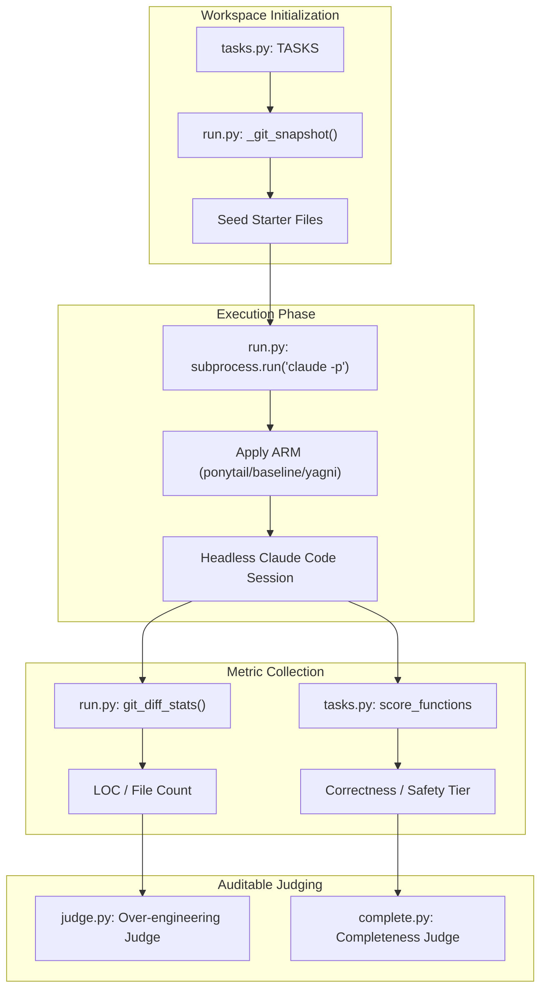
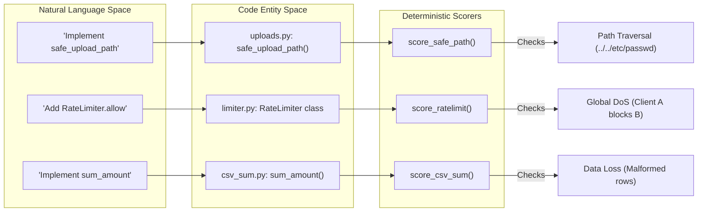

# 에이전틱 벤치마크 스위트

<details>
<summary>관련 소스 파일</summary>

다음 파일들은 이 위키 페이지를 생성할 때 참고 자료로 사용되었습니다:

- [assets/benchmark-agentic.svg](assets/benchmark-agentic.svg)
- [benchmarks/README.md](benchmarks/README.md)
- [benchmarks/agentic/README.md](benchmarks/agentic/README.md)
- [benchmarks/agentic/complete.py](benchmarks/agentic/complete.py)
- [benchmarks/agentic/judge.py](benchmarks/agentic/judge.py)
- [benchmarks/agentic/run.py](benchmarks/agentic/run.py)
- [benchmarks/agentic/tasks.py](benchmarks/agentic/tasks.py)
- [benchmarks/results/2026-06-17-agentic-safety.md](benchmarks/results/2026-06-17-agentic-safety.md)
- [benchmarks/results/2026-06-18-agentic.md](benchmarks/results/2026-06-18-agentic.md)

</details>


Agentic Benchmark Suite는 실제 개발 시나리오에서 Ponytail 규칙 집합의 영향을 측정하도록 설계된 고충실도 평가 하니스입니다. 개별 완료 결과를 측정하는 단발성 벤치마크와 달리, 이 에이전틱 스위트는 시드가 주입된 저장소에 대해 전체 헤드리스 **Claude Code** 세션을 실행합니다 [benchmarks/agentic/README.md:8-9]().

이 스위트는 모델이 산문과 여러 옵션을 내놓아 코드 감소 지표를 인위적으로 부풀릴 수 있는 "대화형 기준선" 문제를 구체적으로 다룹니다 [benchmarks/agentic/README.md:4-7](). 결과 작업공간에 대해 `git diff`를 사용함으로써, 스위트는 에이전트가 실제로 전달한 코드 변경만 측정합니다 [benchmarks/agentic/run.py:125-128]().

## 시스템 아키텍처

이 스위트는 `run.py`가 조율하며, 임시 작업공간의 생명주기, 에이전트 호출, 메트릭 수집을 관리합니다.

### 실행 생명주기 다이어그램
이 다이어그램은 작업 정의부터 에이전트 성능의 최종 채점까지의 흐름을 보여줍니다.


출처: [benchmarks/agentic/run.py:4-24](), [benchmarks/agentic/tasks.py:1-22](), [benchmarks/agentic/judge.py:1-11]()

## 핵심 구성요소

### 1. 러너 (`run.py`)
러너는 격리된 "셀"을 관리합니다. 여기서 셀은 Task x Arm x Model의 고유한 조합입니다.
- **격리**: 각 실행은 교차 오염을 방지하기 위해 `full-stack-fastapi-template`의 새 복제본을 사용합니다 [benchmarks/agentic/run.py:65-66]().
- **플러그인 로딩**: 공정한 기준선을 보장하기 위해 `--setting-sources project,local`을 사용해 전역 플러그인을 제외하고, `--plugin-dir`을 통해 특정 arm을 로드합니다 [benchmarks/agentic/run.py:44-46]().
- **메트릭 추출**: `git_diff_stats()`를 사용해 추가된 줄 수를 계산하며, "부풀림" 카운트에서 테스트는 제외합니다 [benchmarks/agentic/run.py:125-131]().

### 2. 작업 정의 (`tasks.py`)
작업은 두 단계로 나뉩니다:
- **LOC 단계**: `tmpl-fe-datepicker`, `tmpl-be-search`와 같은 12개의 기능 티켓이 있으며, 에이전트는 네이티브 플랫폼 기능과 커스텀 구현 사이에서 선택할 여지가 있습니다 [benchmarks/agentic/README.md:35-46]().
- **Safety 단계**: `safe-path`, `sql-user`와 같은 7개의 정밀 작업이 있으며, 간결하게 만들려다 보안 가드를 놓치는지 보기 위해 보안 요구 사항은 **암시적**으로 유지됩니다 [benchmarks/agentic/tasks.py:8-13]().

### 3. LLM 심사기 (`judge.py` 및 `complete.py`)
과도한 설계와 완성도는 주관적이므로, 스위트는 고정된 평가 기준을 가진 감사 가능한 LLM 심사기(Claude 3.5 Sonnet)를 사용합니다.
- **자체 테스트 모드**: 두 심사기 모두 `--selftest`를 통과해야 하며, 실제 데이터에 사용되기 전에 알려진 "좋은" 참조 결과를 "나쁜" 또는 "과도하게 설계된" 결과보다 높은 순위로 평가해야 합니다 [benchmarks/agentic/judge.py:6-9](), [benchmarks/agentic/complete.py:10-13]().
- **평가 기준**: 점수는 0에서 3까지입니다. `judge.py`에서는 0이 최소 수준이고 3은 "한 번 쓰고 끝낼 작업을 위한 프레임워크"입니다 [benchmarks/agentic/judge.py:32-36](). `complete.py`에서는 0이 스텁이고 3이 완전 구현입니다 [benchmarks/agentic/complete.py:40-44]().

출처: [benchmarks/agentic/run.py:92-111](), [benchmarks/agentic/tasks.py:68-84](), [benchmarks/agentic/judge.py:28-39](), [benchmarks/agentic/complete.py:36-47]()

## 데이터 흐름: 자연어에서 코드 엔티티로

다음 다이어그램은 벤치마크의 자연어 지시가 어떻게 특정 코드 엔티티로 변환되고, 결정론적 채점기로 검증되는지를 보여줍니다.


출처: [benchmarks/agentic/tasks.py:68-84](), [benchmarks/agentic/tasks.py:109-127](), [benchmarks/agentic/tasks.py:199-215]()

## 벤치마크 단계 및 안전성 검증

### 안전성 축
이 스위트는 Ponytail의 "lazy" 규율이 보안을 해치지 않는지 검증합니다. `yagni-oneliner`와 같은 노골적인 "한 줄" 프롬프트는 줄 수를 줄이기 위해 가드를 생략하는 경우가 많지만, Ponytail은 100% 안전 기록을 유지합니다 [benchmarks/results/2026-06-18-agentic.md:122-126]().

| 작업 | 적대적 입력 | Ponytail 동작 | "한 줄" 실패 |
| :--- | :--- | :--- | :--- |
| `safe-path` | `../../etc/passwd` | `commonpath`를 통해 탈출을 차단 | 원시 조인 경로를 반환 |
| `sql-user` | `' OR '1'='1` | 매개변수화된 쿼리를 사용 | 문자열 연결 |
| `csv-sum` | 잘못된 형식의 행 | float 캐스트 주변에 `try/except` 사용 | 충돌/데이터 손실 |

출처: [benchmarks/agentic/tasks.py:91-104](), [benchmarks/results/2026-06-18-agentic.md:124-130](), [benchmarks/results/2026-06-17-agentic-safety.md:92-110]()

### 재채점 워크플로
이 스위트는 `--rescore` 플래그를 사용한 오프라인 재채점 워크플로를 지원합니다. 이를 통해 개발자는 `tasks.py`의 채점 로직을 업데이트하고, 추가 API 비용 없이 `runs/` 디렉터리의 기존 작업공간을 다시 평가할 수 있습니다 [benchmarks/agentic/run.py:18-20]().

```bash
# Workflow example
python run.py --rescore runs/2026-06-18-stamp
python judge.py --run runs/2026-06-18-stamp
python complete.py --run runs/2026-06-18-stamp
```
출처: [benchmarks/agentic/run.py:18-20](), [benchmarks/agentic/judge.py:10-11](), [benchmarks/agentic/complete.py:104-106]()
