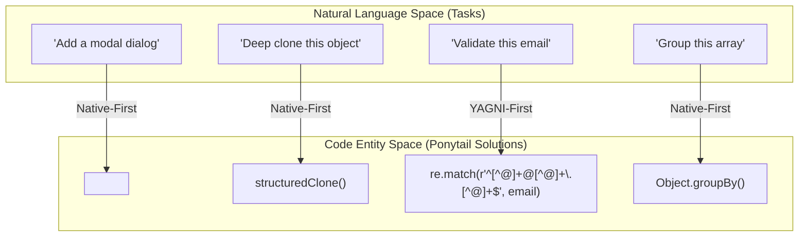
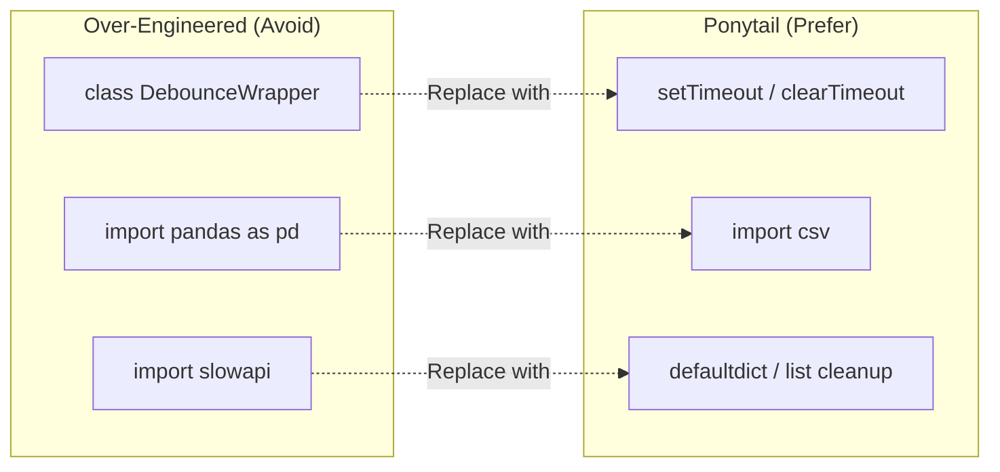

# 예시

관련 소스 파일

다음 파일들은 이 위키 페이지를 생성할 때 참고 자료로 사용되었습니다:

- [docs/platform-native.md](docs/platform-native.md)
- [examples/README.md](examples/README.md)
- [examples/csv-sum.md](examples/csv-sum.md)
- [examples/debounce.md](examples/debounce.md)
- [examples/deep-clone.md](examples/deep-clone.md)
- [examples/email-validation.md](examples/email-validation.md)
- [examples/group-by.md](examples/group-by.md)
- [examples/infinite-scroll.md](examples/infinite-scroll.md)
- [examples/modal-dialog.md](examples/modal-dialog.md)
- [examples/rate-limit.md](examples/rate-limit.md)
- [examples/react-countdown.md](examples/react-countdown.md)

이 페이지는 실무에서 Ponytail 철학을 보여주는 고수준의 설명용 예시를 제공합니다. 여기서는 "The Ladder" 의사결정 계층, 즉 커스텀 코드보다 네이티브 플랫폼 기능과 표준 라이브러리를 우선시하는 방식이 코드베이스의 복잡성과 유지보수 표면적을 얼마나 극적으로 줄이는지 보여줍니다.

아래 예시들은 일반적인 과도 설계 해결책과 Ponytail 접근법을 비교하며, 종종 **코드 줄 수(LOC)를 90% 줄이면서** 신뢰성은 높입니다. 모든 예시는 스킬이 없는 arm과 Ponytail이 활성화된 arm을 비교한 벤치마크 실행에서 나온 모델 출력의 원문입니다 [examples/README.md:3-9]().

### 엔지니어링 전환

다음 다이어그램은 Ponytail 원칙을 적용할 때 고수준 엔지니어링 작업(Natural Language Space)과 그 결과로 생성되는 코드 구현(Code Entity Space) 사이의 간극을 메워줍니다.

**Ponytail Decision Mapping**

Sources: [examples/modal-dialog.md:44-51](), [examples/deep-clone.md:26-29](), [examples/email-validation.md:147-152](), [examples/group-by.md:29-33]()

---

### 네이티브 플랫폼 예시
Ponytail은 서드파티 라이브러리를 끌어오기 전에 호스트 환경(브라우저, OS, 런타임)의 기능을 활용할 것을 권장합니다. 흔한 안티패턴은 브라우저가 이미 네이티브로 해결할 수 있는 문제를 풀기 위해 무거운 의존성을 설치하는 것입니다.

| Feature | Over-Engineered Approach | Ponytail Approach |
| :--- | :--- | :--- |
| **Modal Dialog** | 1 Dependency + 30 lines (Radix/Portal) [examples/modal-dialog.md:7-38]() | 8 lines of native `<dialog>` [examples/modal-dialog.md:44-62]() |
| **Infinite Scroll** | `react-infinite-scroll-component` [examples/infinite-scroll.md:7-28]() | Native `IntersectionObserver` [examples/infinite-scroll.md:34-56]() |
| **Deep Clone** | `lodash.clonedeep` or `JSON` hacks [examples/deep-clone.md:7-22]() | Native `structuredClone()` [examples/deep-clone.md:26-29]() |

플랫폼 기능으로 의존성을 대체하는 방법에 대한 더 자세한 내용(예: CSS와 HTML5 입력 요소 포함)은 [Native Platform Examples](#6.1)를 참조하세요.

Sources: [examples/modal-dialog.md:1-63](), [examples/infinite-scroll.md:1-59](), [examples/deep-clone.md:1-32](), [docs/platform-native.md:9-27]()

---

### 표준 라이브러리 예시
표준 라이브러리는 현대 개발에서 가장 덜 활용되는 도구입니다. Ponytail은 일반적인 작업을 위해 직접 로직을 짜거나 무거운 프레임워크를 가져오는 대신, 엔진에 최적화된 함수를 사용할 것을 권장합니다.

**Standard Library & Built-in Substitution**

Sources: [examples/debounce.md:195-207](), [examples/csv-sum.md:62-67](), [examples/rate-limit.md:80-119]()

| Task | Over-Engineered Implementation | Ponytail Implementation |
| :--- | :--- | :--- |
| **Email Validation** | 75 lines (Regex + RFC checks + Libs) [examples/email-validation.md:7-133]() | 3 lines of "fat-finger" regex [examples/email-validation.md:147-152]() |
| **CSV Sum** | 20 lines (Pandas dependency) [examples/csv-sum.md:11-22]() | 3 lines using `import csv` [examples/csv-sum.md:62-67]() |
| **Debounce** | 116 lines (Utility classes + options) [examples/debounce.md:7-130]() | 10 lines (Inline timer logic) [examples/debounce.md:195-207]() |
| **Countdown** | 267 lines (Custom hooks + styled components) [examples/react-countdown.md:7-243]() | 9 lines (Simple `useEffect` + `setInterval`) [examples/react-countdown.md:301-310]() |

Node.js, Python, and Browser 런타임 전반에서 표준 라이브러리를 활용하는 방법에 대한 더 자세한 내용은 [Standard Library Examples](#6.2)를 참조하세요.

Sources: [examples/email-validation.md:1-157](), [examples/csv-sum.md:1-72](), [examples/debounce.md:1-212](), [examples/react-countdown.md:1-313](), [examples/rate-limit.md:253-266]()
