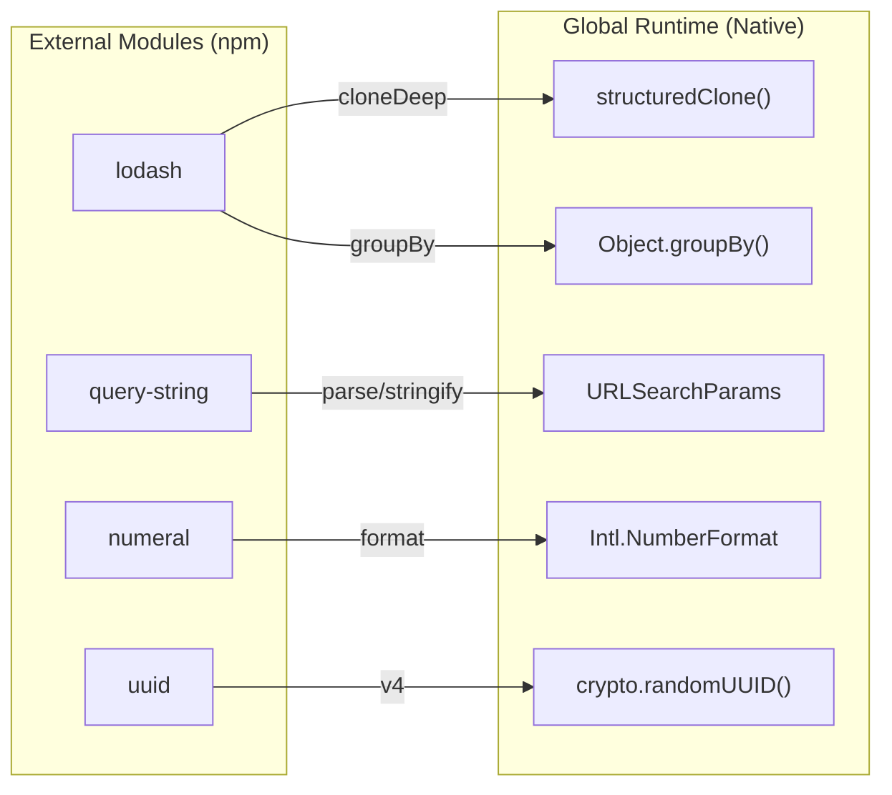

# 네이티브 플랫폼 예시

<details>
<summary>관련 소스 파일</summary>

다음 파일들은 이 위키 페이지를 생성할 때 참고 자료로 사용되었습니다:

- [docs/platform-native.md](docs/platform-native.md)
- [examples/deep-clone.md](examples/deep-clone.md)
- [examples/group-by.md](examples/group-by.md)
- [examples/infinite-scroll.md](examples/infinite-scroll.md)
- [examples/modal-dialog.md](examples/modal-dialog.md)
- [examples/number-formatting.md](examples/number-formatting.md)
- [examples/url-params.md](examples/url-params.md)

</details>


이 페이지는 Ponytail 철학을 실무에서 적용한 기술적 예시를 제공하며, 특히 외부 의존성과 커스텀 구현을 네이티브 브라우저 및 플랫폼 기능으로 대체하는 데 초점을 맞춥니다. **The Ladder**의 "Native" 단계(즉, Ponytail의 의사결정 계층)를 우선시하면, 개발자는 유지보수 오버헤드를 줄이고 번들 크기를 축소하며, 플랫폼에 직접 내장된 접근성 기능을 활용할 수 있습니다.

## 네이티브 우선 패턴

여기서 보여주는 핵심 원칙은 브라우저가 기능이 풍부한 환경이라는 점입니다. Ponytail은 특정하고 비표준적인 요구 사항이 없는 한, 서드파티 라이브러리보다 네이티브 요소와 API를 선호하도록 에이전트에 지시합니다 [docs/platform-native.md:3-6]().

### 예시 1: 무한 스크롤 (IntersectionObserver)

일반적인 과도 설계 패턴은 스크롤 감지를 처리하기 위해 `react-infinite-scroll-component` 같은 특수 라이브러리를 가져오는 것입니다. 이는 스크롤 위치를 감시하고 콜백을 발생시키는 의존성을 추가하며, 적절히 throttle하지 않으면 종종 끊김 현상을 유발합니다 [examples/infinite-scroll.md:7-30]().

#### Ponytail 구현
Ponytail 철학에 따라 개발자는 `IntersectionObserver`를 사용합니다. 이 API는 "sentinel" 요소가 뷰포트에 들어올 때만 실행되므로, 스크롤 이벤트 리스너나 수동 throttle이 필요 없습니다 [examples/infinite-scroll.md:35-58]().

```jsx
// ponytail: IntersectionObserver does this, no scroll listener needed
export function Feed({ items, fetchMore, hasMore }) {
  const sentinel = useRef(null);

  useEffect(() => {
    const observer = new IntersectionObserver(([entry]) => {
      if (entry.isIntersecting && hasMore) fetchMore();
    });
    if (sentinel.current) observer.observe(sentinel.current);
    return () => observer.disconnect();
  }, [hasMore, fetchMore]);

  return (
    <>
      {items.map(item => <Card key={item.id} item={item} />)}
      <div ref={sentinel} />
    </>
  );
}
```

**영향:**
- **감소:** 1 dependency → 0 dependencies [examples/infinite-scroll.md:58-58]().
- **성능:** 가시성 감지를 브라우저 엔진의 최적화된 내부 루프에 맡깁니다.

Sources: [examples/infinite-scroll.md:1-58]()

---

### 예시 2: 모달 대화상자 (`<dialog>` element)

간단한 확인 대화상자에 대해 포털, 오버레이, 포커스 트래핑을 관리하려고 `@radix-ui/react-dialog` 또는 `react-modal` 같은 라이브러리를 자주 사용합니다 [examples/modal-dialog.md:7-40]().

#### Ponytail 구현
네이티브 `<dialog>` element는 내장된 포커스 트래핑, `::backdrop`을 통한 backdrop 렌더링, 그리고 `Escape` 키에 대한 자동 닫기 기능을 제공합니다 [examples/modal-dialog.md:45-62]().

```html
<!-- ponytail: browser has one, with focus trapping and backdrop built in -->
<dialog id="confirm-delete">
  <p>This action cannot be undone.</p>
  <button id="cancel">Cancel</button>
  <button id="confirm">Delete</button>
</dialog>
```

```js
const dialog = document.getElementById("confirm-delete");
dialog.showModal(); // Native method to open as modal
```

**영향:**
- **감소:** 1 dependency + 30 lines → 0 dependencies + 8 lines [examples/modal-dialog.md:62-62]().
- **접근성:** 네이티브 포커스 관리는 기본적으로 접근 가능합니다 [examples/modal-dialog.md:62-62]().

Sources: [examples/modal-dialog.md:1-63]()

---

## 네이티브 API 데이터 흐름

다음 다이어그램은 Ponytail이 UI 상태와 상호작용의 책임을 애플리케이션 계층(JavaScript)에서 플랫폼 계층(Browser/OS)으로 어떻게 이동시키는지 보여줍니다.

### 로직 전이 다이어그램: 네이티브 UI 컴포넌트

```mermaid
graph TD
    subgraph "Application Space (Over-engineered)"
        A["External Library (Radix/Flatpickr)"] -- "manages" --> B["Custom DOM Tree"]
        C["JS Event Listeners"] -- "throttle/debounce" --> A
        D["Portal/Overlay Logic"] -- "mounts" --> A
    end

    subgraph "Native Platform Space (Ponytail)"
        E["<dialog> / <input type='date'>"] -- "Browser Engine" --> F["Shadow DOM / OS UI"]
        G["Built-in Accessibility"] -- "Focus Trapping" --> E
        H["CSS ::backdrop"] -- "Styling" --> E
    end

    style E stroke-width:4px
    style F stroke-width:4px
```



Sources: [examples/modal-dialog.md:42-63](), [docs/platform-native.md:9-27]()

---

## JavaScript 및 런타임 내장 기능

Ponytail은 `lodash`나 `query-string` 같은 오래된 유틸리티 라이브러리를 대체하는 현대적인 JS API를 식별합니다.

### 딥 클론 및 그룹화
`lodash.clonedeep` 또는 `lodash.groupby` 대신, Ponytail은 전역 `structuredClone`과 `Object.groupBy`를 사용합니다 [docs/platform-native.md:61-62]().

| 작업 | Ponytail 없음(라이브러리) | Ponytail 사용(네이티브) |
| :--- | :--- | :--- |
| **딥 클론** | `import { cloneDeep } from "lodash"` | `structuredClone(obj)` |
| **그룹화** | `import { groupBy } from "lodash"` | `Object.groupBy(arr, fn)` |
| **URL 매개변수** | `import qs from "query-string"` | `new URLSearchParams(query)` |
| **UUID** | `import { v4 } from "uuid"` | `crypto.randomUUID()` |

Sources: [examples/deep-clone.md:12-28](), [examples/group-by.md:12-31](), [examples/url-params.md:13-35](), [docs/platform-native.md:69-69]()

### 포맷팅 및 국제화
`Intl` object는 로케일 인식 포맷팅에서 `numeral`이나 `accounting` 같은 라이브러리를 대체합니다 [examples/number-formatting.md:7-35]().

```js
// ponytail: Intl.NumberFormat does this, locale-aware
new Intl.NumberFormat("en-US", { style: "currency", currency: "USD" }).format(1234.56);
// → "$1,234.56"
```

Sources: [examples/number-formatting.md:21-38](), [docs/platform-native.md:64-67]()

---

## 엔티티 매핑: 유틸리티 라이브러리 vs. 플랫폼

이 다이어그램은 특정 유틸리티 함수가 서드파티 모듈에서 전역 런타임 네임스페이스로 어떻게 이동되는지를 보여줍니다.

### 엔티티 매핑: 유틸리티 마이그레이션



Sources: [docs/platform-native.md:58-78](), [examples/deep-clone.md:27-28](), [examples/url-params.md:27-38]()

## 핵심 요약

1.  **의존성 회피:** 플랫폼(Browser, Node.js, Python Framework)에 문제를 해결하는 내장 방식이 있다면 그것이 "Native" 솔루션이며, 라이브러리보다 우선시되어야 합니다 [docs/platform-native.md:3-6]().
2.  **현대 표준:** 많은 라이브러리(예: `query-string`)는 이제 수년간 모든 곳에 배포된 API를 위한 폴리필이었습니다 [examples/url-params.md:41-42]().
3.  **자기 설명적 최소주의:** 더 단순한 네이티브 접근을 선택한 *이유*를 설명하기 위해 `ponytail:` 주석 접두사를 사용하세요(예: `// ponytail: structuredClone does this`) [examples/deep-clone.md:27-27]().

Sources: [examples/infinite-scroll.md:35](), [examples/modal-dialog.md:45](), [examples/group-by.md:30]()
