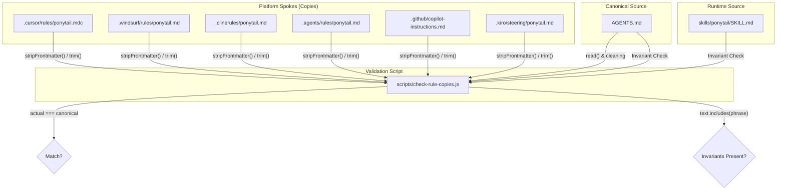
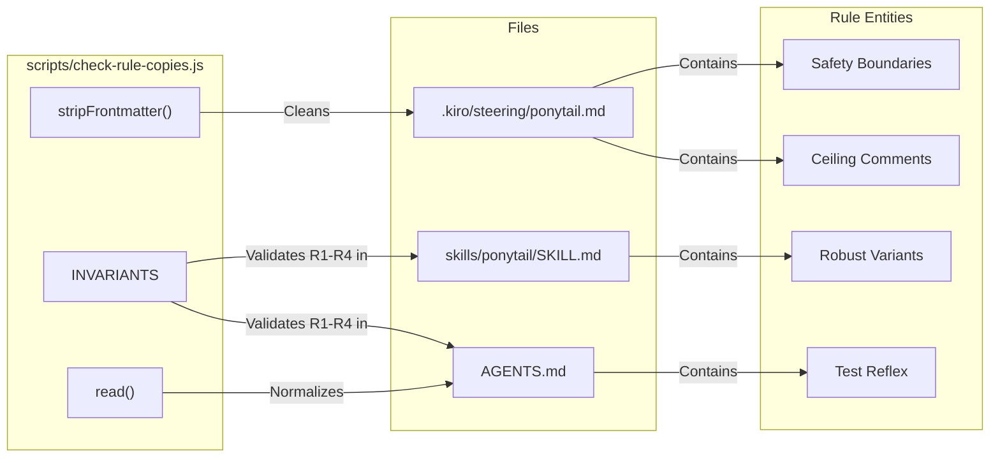

# 규칙 동기화 (check-rule-copies.js)

관련 소스 파일

다음 파일들은 이 위키 페이지를 생성할 때 참고 자료로 사용되었습니다:

- [.agents/rules/ponytail.md](.agents/rules/ponytail.md)
- [.kiro/steering/ponytail.md](.kiro/steering/ponytail.md)
- [AGENTS.md](AGENTS.md)
- [benchmarks/behavior.js](benchmarks/behavior.js)
- [benchmarks/behavior.yaml](benchmarks/behavior.yaml)
- [scripts/check-rule-copies.js](scripts/check-rule-copies.js)

Ponytail 프로젝트는 핵심 규칙 집합을 여러 AI 에이전트 플랫폼 전반에 배포합니다. 수작업 오버헤드 없이 일관성을 유지하기 위해, 저장소는 허브 앤 스포크(hub-and-spoke) 배포 모델을 사용합니다. `scripts/check-rule-copies.js` 스크립트는 강제 집행 메커니즘으로 동작하며, 플랫폼별 규칙 파일이 정규 원본과 동기화되어 있는지, 그리고 런타임 스킬 정의에서 핵심 안전 불변식이 보존되는지를 검증합니다.

## 허브 앤 스포크 배포 모델

Ponytail은 지원되는 여러 환경 전반에서 "instruction drift"를 방지하기 위해 규칙 집합의 단일 진실 공급원(single source of truth)을 유지합니다.

*   **정규 원본**: `AGENTS.md`는 "lazy senior dev" 규칙 집합의 전체 본문을 담고 있는 마스터 문서입니다 [AGENTS.md:1-27]().
*   **플랫폼 스포크(축약 복사본)**: 여섯 개의 플랫폼별 파일이 다양한 숨김 디렉터리에 존재하며, 해당 에이전트가 자동으로 가져갑니다. 여기에는 Cursor, Windsurf, Cline, generic agents, GitHub Copilot, Kiro가 포함됩니다 [scripts/check-rule-copies.js:19-26]().
*   **런타임 원본**: `skills/ponytail/SKILL.md`는 동적 플러그인/확장 훅에서 사용되는 지침을 담고 있습니다. 내부 스킬 시스템용 추가 메타데이터와 형식이 포함되어 있으므로 축약 복사본보다 길어집니다 [scripts/check-rule-copies.js:38-42]().

### 규칙 동기화 흐름
다음 다이어그램은 `check-rule-copies.js`가 정규 원본, 플랫폼별 스포크, 런타임 스킬 파일 사이의 관계를 어떻게 검증하는지 보여줍니다.

**규칙 검증 데이터 흐름**

출처: [scripts/check-rule-copies.js:5-26](), [scripts/check-rule-copies.js:30-36](), [scripts/check-rule-copies.js:58-67]()

## check-rule-copies.js 구현

동기화 스크립트는 두 가지 주요 전략을 사용합니다. 하나는 플랫폼 복사본에 대한 엄격한 바이트 비교이고, 다른 하나는 런타임 스킬 파일에 대한 불변식 검증입니다.

### 정규화와 비교
플랫폼마다 서로 다른 메타데이터 형식(예: YAML frontmatter)이 필요하므로, 스크립트는 각 파일에 대해 `normalize` 함수 매핑을 사용합니다 [scripts/check-rule-copies.js:19-26]().

1.  **Frontmatter 제거**: Cursor와 Kiro 같은 플랫폼의 경우, 스크립트는 비교 전에 `---`로 구분된 YAML 블록을 제거하기 위해 `stripFrontmatter`를 사용합니다 [scripts/check-rule-copies.js:11-13]().
2.  **줄 끝 정규화**: `read()` 함수는 파일을 처리하여 `\n` 줄 끝을 사용하고 공백을 제거해 플랫폼 간 일관성을 보장합니다 [scripts/check-rule-copies.js:7-9]().
3.  **정규 원본 정리**: 스크립트는 비교 기준으로 사용하기 전에 `AGENTS.md`에서 자기 참조 꼬리말 `(Yes, this file also applies...)`를 제거합니다 [scripts/check-rule-copies.js:15-16]().

### 하중을 받는 불변식
런타임 파일 `skills/ponytail/SKILL.md`는 축약된 본문보다 훨씬 길며, 바이트 단위로 비교할 수 없습니다 [scripts/check-rule-copies.js:38-41](). 대신 스크립트는 Ponytail 철학의 핵심 로직과 안전 경계를 나타내는 문구를 담은 `INVARIANTS` 배열의 존재를 검증합니다 [scripts/check-rule-copies.js:43-56]().

| 불변 문구 | 보호하는 규칙/경계 |
| :--- | :--- |
| `naive heuristic` | 의도적인 단순화를 위한 ceiling-comment 규칙 [scripts/check-rule-copies.js:44]() |
| `ONE runnable check` | 비자명한 로직에 대한 test reflex 규칙 [scripts/check-rule-copies.js:45]() |
| `flimsier algorithm` | robust-variant 규칙(lazy != flimsy) [scripts/check-rule-copies.js:46]() |
| `input validation at trust boundaries` | 검증을 위한 안전 예외 조항 [scripts/check-rule-copies.js:51]() |
| `prevents data loss` | 데이터 무결성을 위한 안전 예외 조항 [scripts/check-rule-copies.js:52]() |
| `security` | 보안을 위한 안전 예외 조항 [scripts/check-rule-copies.js:53]() |
| `accessibility` | 접근성을 위한 안전 예외 조항 [scripts/check-rule-copies.js:54]() |
| `Lazy code without its check is unfinished` | one-check 헤드라인 규칙 [scripts/check-rule-copies.js:55]() |

출처: [scripts/check-rule-copies.js:11-13](), [scripts/check-rule-copies.js:19-26](), [scripts/check-rule-copies.js:43-56](), [scripts/check-rule-copies.js:58-67]()

## 기술 로직 매핑

다음 다이어그램은 `check-rule-copies.js`의 논리 검증 단계를 실제 파일과 그 안에 담긴 규칙에 매핑합니다.

**코드-규칙 매핑**

출처: [scripts/check-rule-copies.js:11-13](), [scripts/check-rule-copies.js:43-56](), [.kiro/steering/ponytail.md:21-29](), [AGENTS.md:21-24]()

## 실행 및 실패 처리

이 스크립트는 유지보수 중 규칙 드리프트가 발생하지 않도록 CI 또는 pre-commit 검사로 실행되도록 설계되었습니다.

*   **드리프트 감지**: 어떤 플랫폼 복사본에서든 `actual !== canonical`이면, 스크립트는 드리프트가 발생한 파일명을 포함한 오류를 기록합니다 [scripts/check-rule-copies.js:32-35]().
*   **불변식 검증**: 스크립트는 `INVARIANTS`를 순회하며 `SKILL.md`와 `AGENTS.md`를 모두 검사합니다 [scripts/check-rule-copies.js:60-67]().
*   **종료 상태**: 어떤 검사라도 실패하면 `failed`가 `true`로 설정되고, 오류 메시지가 출력되며, 프로세스는 종료 코드 `1`로 끝납니다 [scripts/check-rule-copies.js:69-72]().

출처: [scripts/check-rule-copies.js:28-36](), [scripts/check-rule-copies.js:60-72]()
