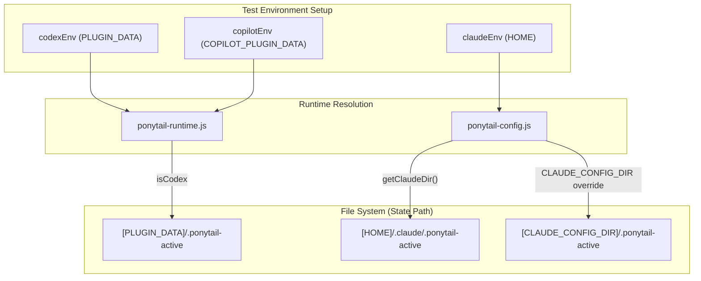

# 훅 테스트 및 CI

<details>
<summary>관련 소스 파일</summary>

다음 파일들은 이 위키 페이지를 생성할 때 참고 자료로 사용되었습니다:

- [.agents/plugins/marketplace.json](.agents/plugins/marketplace.json)
- [.github/plugin/marketplace.json](.github/plugin/marketplace.json)
- [.github/workflows/test.yml](.github/workflows/test.yml)
- [benchmarks/correctness.js](benchmarks/correctness.js)
- [hooks/claude-codex-hooks.json](hooks/claude-codex-hooks.json)
- [hooks/copilot-hooks.json](hooks/copilot-hooks.json)
- [hooks/ponytail-config.js](hooks/ponytail-config.js)
- [hooks/ponytail-mode-tracker.js](hooks/ponytail-mode-tracker.js)
- [hooks/ponytail-runtime.js](hooks/ponytail-runtime.js)
- [package.json](package.json)
- [tests/behavior.test.js](tests/behavior.test.js)
- [tests/copilot-plugin.test.js](tests/copilot-plugin.test.js)
- [tests/gemini-extension.test.js](tests/gemini-extension.test.js)
- [tests/hooks-windows.test.js](tests/hooks-windows.test.js)
- [tests/hooks.test.js](tests/hooks.test.js)

</details>


`tests/hooks.test.js` 스위트는 Claude Code, Codex, Copilot 통합에서 사용되는 생명주기 훅을 자동으로 검증합니다. 이 스위트는 서로 다른 런타임 환경 전반에서 상태 지속성, 모드 전환, JSON I/O가 일관되게 유지되는지 보장합니다.

## 테스트 스위트 개요

이 테스트 스위트는 `assert`와 `child_process`의 네이티브 모듈을 사용해 훅 스크립트를 격리된 환경에서 실행하는 독립형 Node.js 스크립트입니다. 환경 변수와 파일 시스템 구조를 모킹해 호스트 환경을 시뮬레이션하는 데 중점을 둡니다.

### 주요 커버리지 영역
- **활성화 생명주기**: `ponytail-activate.js`가 상태 파일을 올바르게 초기화하고 기대한 시스템 메시지를 출력하는지 검증합니다 [tests/hooks.test.js:50-59]().
- **모드 추적**: `ponytail-mode-tracker.js`가 사용자 프롬프트(예: `@ponytail lite`)를 파싱하고 지속 상태를 업데이트하는지 보장합니다 [tests/hooks.test.js:60-69]().
- **비활성화 로직**: "normal mode"가 비활성화를 트리거하고 상태 파일을 제거하는지 검증합니다 [tests/hooks.test.js:70-79]().
- **환경 감지**: 훅이 Claude 스타일 경로(`~/.claude/`), Codex 스타일 경로(`PLUGIN_DATA`), Copilot 경로(`COPILOT_PLUGIN_DATA`) 사이를 올바르게 전환하는지 확인합니다 [tests/hooks.test.js:97-109](), [tests/hooks.test.js:132-147]().
- **셸 안전성**: 상태줄 스크립트에 경로를 삽입할 때 셸 인젝션을 방지하도록 `isShellSafe` 유틸리티를 검증합니다 [tests/hooks.test.js:14-19]().

**출처:**
- [tests/hooks.test.js:1-171]()
- [hooks/ponytail-config.js:50-52]()

---

## `run()` 헬퍼 패턴

테스트 스위트는 중앙화된 `run()` 헬퍼를 사용해 훅 스크립트를 실행합니다. 이를 통해 모든 테스트 케이스가 제어된 환경 변수와 표준 입력을 가진 깨끗한 프로세스에서 실행됩니다.

### 실행 흐름
1. **프로세스 생성**: `spawnSync`를 사용해 `hooks/` 디렉터리의 특정 스크립트에 대해 Node.js 실행 파일을 호출합니다 [tests/hooks.test.js:21-22]().
2. **환경 주입**: 현재 `process.env`를 테스트별 오버라이드(`HOME`, `PLUGIN_DATA`, `CLAUDE_CONFIG_DIR` 등)와 병합합니다 [tests/hooks.test.js:23]().
3. **I/O 처리**: JSON 문자열을 `stdin`에 전달하고(호스트의 payload를 시뮬레이션), `stdout`과 `stderr`를 캡처해 검증에 사용합니다 [tests/hooks.test.js:24-26]().

### 다이어그램: `run()` 헬퍼 실행
이 다이어그램은 `run()` 헬퍼가 테스트 스크립트와 훅 구현 사이를 어떻게 연결하는지 보여줍니다.

"Natural Language Space" | "Code Entity Space"
--- | ---
"Test Script" | `tests/hooks.test.js`
"Execution Helper" | `run(script, env, input)`
"System Call" | `spawnSync(process.execPath, ...)`
"Hook Implementation" | `hooks/ponytail-activate.js` or `hooks/ponytail-mode-tracker.js`
"Result Validation" | `assert.equal(result.status, 0)`

**출처:**
- [tests/hooks.test.js:21-27]()

---

## 환경 모킹 및 데이터 흐름

테스트는 환경 변수를 조작해 세 가지 서로 다른 호스트 환경을 시뮬레이션합니다. 이는 경로 해석과 관련된 `ponytail-runtime.js`와 `ponytail-config.js` 내부 로직을 테스트하는 데 중요합니다.

### 호스트 감지 로직
`ponytail-runtime.js` 모듈은 환경 존재 여부를 기준으로 호스트를 결정합니다:
- **Copilot**: `COPILOT_PLUGIN_DATA`가 설정되어 있습니다 [hooks/ponytail-runtime.js:6]().
- **Codex**: `PLUGIN_DATA`가 설정되어 있고(Copilot은 아님) [hooks/ponytail-runtime.js:7]().
- **Claude**: `getClaudeDir()`를 사용하는 기본 폴백 [hooks/ponytail-runtime.js:9]().

### 다이어그램: 상태 지속 로직
이 다이어그램은 환경 변수가 상태 데이터의 파일 시스템 대상 경로를 어떻게 결정하는지 보여줍니다.



**출처:**
- [hooks/ponytail-runtime.js:5-13]()
- [hooks/ponytail-config.js:71-74]()
- [tests/hooks.test.js:111-130]()

---

## 어댑터 및 플러그인 테스트

핵심 훅을 넘어서, 이 스위트는 설정 드리프트를 방지하기 위해 다양한 플랫폼 어댑터에 대한 특화 테스트를 포함합니다.

### Gemini 확장 (`tests/gemini-extension.test.js`)
- **고정된 버전**: 공급망 문제를 막기 위해 매니페스트 버전이 고정된 semver인지 확인합니다 [tests/gemini-extension.test.js:17-24]().
- **규칙 불변식**: `contextFileName`이 가리키는 파일(보통 `AGENTS.md`)에 실제로 하중을 받는 Ponytail 규칙이 들어 있는지 검증합니다 [tests/gemini-extension.test.js:32-38]().
- **훅 격리**: Gemini가 지원되지 않는 이벤트를 사용하는 Claude/Codex 훅을 자동으로 불러오려 시도하지 않는지 확인합니다 [tests/gemini-extension.test.js:85-91]().

### Windows 호환성 (`tests/hooks-windows.test.js`)
- **PowerShell 문법**: `commandWindows` 항목에서 `%VAR%` 문법을 사용하는 것을 막고, Claude Code에서 PowerShell 실행에 필요한 `$env:VAR`를 강제합니다 [tests/hooks-windows.test.js:33-41]().
- **스크립트 존재 여부**: 모든 훅 명령이 `hooks/` 디렉터리에 실제로 존재하는 스크립트를 가리키는지 검증합니다 [tests/hooks-windows.test.js:43-52]().

### 명령 무결성 (`tests/commands.test.js` 및 `tests/copilot-plugin.test.js`)
- **명령 표면**: Copilot 매니페스트가 기대하는 대로 `ponytail-debt.toml` 같은 필수 명령이 `commands/` 디렉터리에 있는지 확인합니다 [tests/copilot-plugin.test.js:22-33]().

**출처:**
- [tests/gemini-extension.test.js:1-91]()
- [tests/hooks-windows.test.js:1-60]()
- [tests/copilot-plugin.test.js:1-34]()

---

## CI 통합

이 테스트 스위트는 모든 PR이 훅 호환성과 규칙 무결성을 유지하도록 GitHub Actions 워크플로에 통합되어 있습니다.

### 워크플로 단계 (`.github/workflows/test.yml`)
1. **규칙 동기화 검사**: `scripts/check-rule-copies.js`를 실행해 모든 어댑터 파일 전반에서 규칙 집합이 동일한지 확인합니다 [ .github/workflows/test.yml:25-26]().
2. **테스트 실행**: `npm test`를 실행하며, 이는 `tests/*.test.js` 파일 전부에 대해 Node.js 테스트 러너를 트리거합니다 [package.json:8](), [.github/workflows/test.yml:28-29]().
3. **정합성 게이트**: `benchmarks/correctness.js`를(에이전틱 스위트를 통해) 실행해 Ponytail의 "less code" 철학이 기능 로직의 파괴로 이어지지 않음을 증명합니다 [benchmarks/correctness.js:1-7]().

### 로컬 실행
```bash
# Run all tests including hooks and extensions
npm test

# Run only the hook tests
node tests/hooks.test.js
```

**출처:**
- [.github/workflows/test.yml:1-30]()
- [package.json:7-9]()
- [benchmarks/correctness.js:1-12]()
