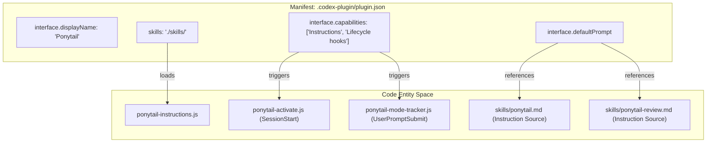
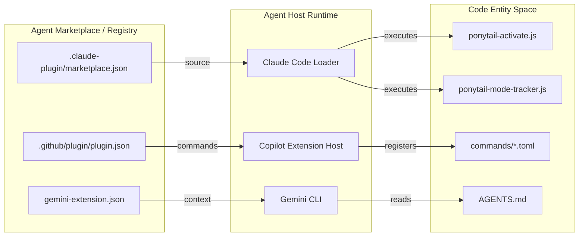

# 마켓플레이스 및 플러그인 매니페스트

관련 소스 파일

다음 파일들은 이 위키 페이지를 생성할 때 참고 자료로 사용되었습니다:

- [.claude-plugin/marketplace.json](.claude-plugin/marketplace.json)
- [.claude-plugin/plugin.json](.claude-plugin/plugin.json)
- [.codex-plugin/plugin.json](.codex-plugin/plugin.json)
- [.github/plugin/plugin.json](.github/plugin/plugin.json)
- [gemini-extension.json](gemini-extension.json)

이 페이지는 여러 AI 에이전트 마켓플레이스와 플러그인 생태계 전반에서 Ponytail을 등록하는 데 사용되는 메타데이터 구조를 문서화합니다. Ponytail은 여러 매니페스트 파일을 활용해 다양한 호스트 환경에서 자신의 정체성, 기능, 배포 원본을 정의하며, 이를 통해 "Lazy Senior Dev" 규칙 집합이 Claude, Copilot, Gemini, 그리고 Codex 호환 에이전트 전반에서 이식 가능하도록 보장합니다.

## 매니페스트 파일 개요

Ponytail은 다중 플랫폼 플러그인으로 배포됩니다. 일관된 동작과 발견 가능성을 보장하기 위해 다음과 같은 전용 매니페스트 파일을 유지합니다:

| 매니페스트 파일 | 대상 환경 | 주요 역할 |
|:---|:---|:---|
| `.claude-plugin/plugin.json` | Claude Code | 훅 등록을 포함한 Claude Code용 핵심 플러그인 정의 |
| `.claude-plugin/marketplace.json` | Claude Code Marketplace | Anthropic 마켓플레이스 생태계에 등록 |
| `.codex-plugin/plugin.json` | Codex / Pi Agent | 스킬, 훅, UI 브랜딩을 포함한 상세 메타데이터 |
| `.github/plugin/plugin.json` | GitHub Copilot | Copilot Extensions용 통합, 명령과 훅 정의 |
| `gemini-extension.json` | Gemini CLI / Extension | Gemini 기반 환경을 위한 간소화된 매니페스트 |

---

## Claude Code 및 Marketplace 매니페스트

Ponytail은 `.claude-plugin/` 디렉터리 안의 두 파일을 사용해 Claude Code 생태계에서의 존재를 관리합니다.

### 플러그인 정의
`.claude-plugin/plugin.json` 파일은 플러그인 버전을 정의하고 생명주기 훅 설정을 가리킵니다.
- **`version`**: 현재 버전은 `4.7.0`입니다 [.claude-plugin/plugin.json:3-3]().
- **`hooks`**: `./hooks/claude-codex-hooks.json`을 가리키며 `SessionStart`와 `UserPromptSubmit` 로직을 등록합니다 [.claude-plugin/plugin.json:9-9]().

### 마켓플레이스 등록
`.claude-plugin/marketplace.json`에 있는 매니페스트는 Anthropic Claude Code 스키마를 따릅니다. 이 파일은 플러그인의 고수준 메타데이터를 정의하고, 로컬 디렉터리를 소스로 가리킵니다.
- **`$schema`**: 검증을 위해 공식 Anthropic marketplace schema를 가리킵니다 [.claude-plugin/marketplace.json:2-2]().
- **`owner`**: 플러그인을 개발자에게 귀속시키고 GitHub 프로필로 연결합니다 [.claude-plugin/marketplace.json:5-8]().
- **`plugins`**: 플러그인 정의를 담은 배열입니다. Ponytail의 경우 `source`는 `./`로 설정되어 있으며, 이는 플러그인 자산이 저장소 루트 안에 있음을 나타냅니다 [.claude-plugin/marketplace.json:9-16]().

**출처:**
- [.claude-plugin/plugin.json:1-10]()
- [.claude-plugin/marketplace.json:1-17]()

---

## Codex 및 Pi Agent 플러그인 매니페스트

`.codex-plugin/plugin.json` 파일은 저장소에서 가장 상세한 매니페스트입니다. 고급 생명주기 훅과 풍부한 UI 요소를 지원하는 에이전트를 위한 설정을 제공합니다.

### 기술 사양
- **메타데이터**: 버전 `4.7.0`과 `yagni`, `minimalism`, `code-review` 같은 키워드를 정의합니다 [.codex-plugin/plugin.json:3-12]().
- **기능**: `Instructions`와 `Lifecycle hooks` 지원을 명시적으로 선언합니다 [.codex-plugin/plugin.json:21-21]().
- **스킬**: 지시 세트를 위해 `./skills/` 디렉터리를 가리킵니다 [.codex-plugin/plugin.json:13-13]().
- **훅**: Claude Code에서 사용하는 것과 동일한 `./hooks/claude-codex-hooks.json`을 공유합니다 [.codex-plugin/plugin.json:14-14]().
- **인터페이스 및 브랜딩**:
    - **`defaultPrompt`**: "Review this diff for over-engineering" 같은 사용자용 시작점을 제안합니다 [.codex-plugin/plugin.json:23-27]().
    - **Assets**: 로컬 경로를 사용해 `composerIcon`과 `logo`를 정의합니다 [.codex-plugin/plugin.json:29-30]().

### 매니페스트에서 코드로의 매핑 (자연어에서 엔티티 공간으로)

다음 다이어그램은 `plugin.json` 매니페스트가 어떻게 고수준 의도를 특정 코드 기능과 UI 구성 요소로 연결하는지 보여줍니다.

**매니페스트 엔티티 매핑**

**출처:**
- [.codex-plugin/plugin.json:1-32]()
- [.claude-plugin/plugin.json:1-10]()

---

## GitHub Copilot 및 Gemini 매니페스트

Ponytail은 명령과 컨텍스트 파일을 매핑하는 전용 매니페스트를 통해 Copilot과 Gemini까지 범위를 확장합니다.

### GitHub Copilot 확장
`.github/plugin/plugin.json`의 매니페스트는 GitHub 생태계를 위한 플러그인을 설정합니다.
- **`commands`**: TOML 정의가 들어 있는 `commands/` 디렉터리를 가리킵니다 [.github/plugin/plugin.json:13-13]().
- **`hooks`**: Copilot 전용 생명주기 관리를 위해 `hooks/copilot-hooks.json`을 가리킵니다 [.github/plugin/plugin.json:15-15]().

### Gemini 확장
`gemini-extension.json` 파일은 Gemini CLI 또는 extensions를 위해 설계된 최소형 매니페스트입니다.
- **`contextFileName`**: 규칙 집합 컨텍스트의 기준 원본으로 `AGENTS.md`를 명시적으로 가리킵니다 [.gemini-extension.json:5-5]().

---

## 플러그인 등록 흐름

이 다이어그램은 서로 다른 에이전트 런타임이 각자의 매니페스트를 사용해 Ponytail 플러그인을 실행 가능한 로직과 명령으로 해석하는 방식을 보여줍니다.

**플러그인 등록 데이터 흐름**

**출처:**
- [.claude-plugin/marketplace.json:1-17]()
- [.github/plugin/plugin.json:1-16]()
- [gemini-extension.json:1-6]()
- [.codex-plugin/plugin.json:1-32]()
