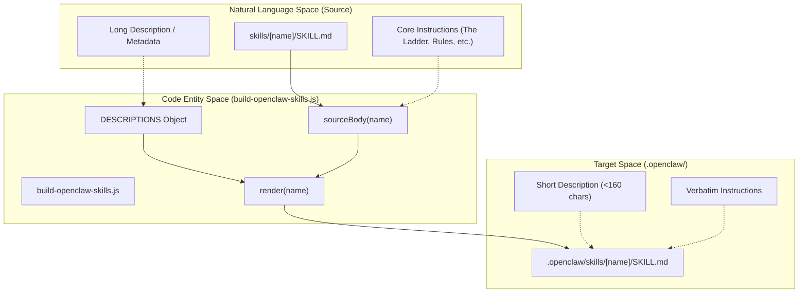
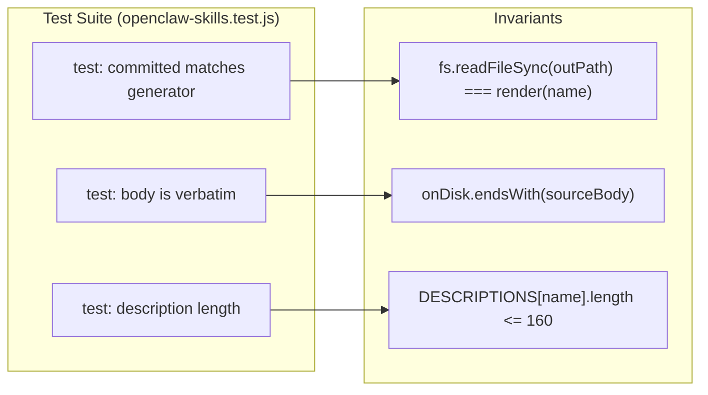

# OpenClaw 스킬 빌드 (build-openclaw-skills.js)

관련 소스 파일

다음 파일들은 이 위키 페이지를 생성할 때 참고 자료로 사용되었습니다:

- [.openclaw/skills/ponytail-audit/SKILL.md](.openclaw/skills/ponytail-audit/SKILL.md)
- [.openclaw/skills/ponytail-debt/SKILL.md](.openclaw/skills/ponytail-debt/SKILL.md)
- [.openclaw/skills/ponytail-gain/SKILL.md](.openclaw/skills/ponytail-gain/SKILL.md)
- [.openclaw/skills/ponytail-help/SKILL.md](.openclaw/skills/ponytail-help/SKILL.md)
- [.openclaw/skills/ponytail-review/SKILL.md](.openclaw/skills/ponytail-review/SKILL.md)
- [.openclaw/skills/ponytail/SKILL.md](.openclaw/skills/ponytail/SKILL.md)
- [.opencode/command/ponytail-gain.md](.opencode/command/ponytail-gain.md)
- [scripts/build-openclaw-skills.js](scripts/build-openclaw-skills.js)
- [skills/ponytail-gain/SKILL.md](skills/ponytail-gain/SKILL.md)
- [tests/openclaw-skills.test.js](tests/openclaw-skills.test.js)

OpenClaw 플랫폼은 스킬을 특정 YAML frontmatter 제약과 함께 패키징할 것을 요구하며, 특히 설명 길이에 엄격한 제한이 있습니다. `build-openclaw-skills.js` 스크립트는 정규 원본 파일로부터 이러한 패키지 생성을 자동화하여, OpenClaw의 메타데이터 요구 사항을 만족하면서 Ponytail 규칙 집합이 플랫폼 전반에서 일관되게 유지되도록 보장합니다.

## 개요 및 목적

OpenClaw 스킬 빌드 시스템은 Claude Code/Codex에서 사용하는 고맥락 스킬 정의와 OpenClaw/ClawHub가 요구하는 메타데이터 제약 형식 사이의 간극을 메웁니다 [scripts/build-openclaw-skills.js:2-8]().

빌드 스크립트가 처리하는 핵심 요구 사항:
*   **설명 제약**: OpenClaw 설명은 반드시 한 줄이어야 하고, 큰따옴표를 포함해서는 안 되며, 160자 미만이어야 합니다 [scripts/build-openclaw-skills.js:39-41]().
*   **원문 무결성**: 지시 본문(즉, "ruleset")은 논리 드리프트를 방지하기 위해 `skills/` 디렉터리의 원본에서 정확히 복사되어야 합니다 [scripts/build-openclaw-skills.js:6-8]().
*   **Frontmatter 주입**: 표준화된 메타데이터(homepage, license, name)가 각 `SKILL.md` 파일에 주입됩니다 [scripts/build-openclaw-skills.js:42-44]().

### 데이터 흐름: 정규 원본에서 OpenClaw로

다음 다이어그램은 빌드 스크립트가 소스 스킬 정의를 OpenClaw 호환 패키지로 변환하는 방식을 보여줍니다.

**스킬 변환 파이프라인**

출처: [scripts/build-openclaw-skills.js:19-51](), [tests/openclaw-skills.test.js:11-26]()

## 구현 세부사항

### 빌드 스크립트 로직
`build-openclaw-skills.js` 스크립트는 각 스킬에 대한 축약 설명을 담은 하드코딩된 `DESCRIPTIONS` 맵을 정의합니다 [scripts/build-openclaw-skills.js:19-26](). 

`sourceBody` 함수는 정규식을 사용해 원본 frontmatter를 제거함으로써 `skills/` 디렉터리에서 내용을 추출합니다 [scripts/build-openclaw-skills.js:30-35](). 그런 다음 `render` 함수가 새 OpenClaw 호환 파일을 조립합니다 [scripts/build-openclaw-skills.js:37-45]().

| 함수 | 역할 |
| :--- | :--- |
| `sourceBody(name)` | `replace()`와 `match()`를 사용해 원본 `SKILL.md`를 읽고 YAML frontmatter를 제거합니다. |
| `render(name)` | 설명 길이/형식을 검증하고, 본문 앞에 새 YAML frontmatter를 덧붙입니다. |
| `outPath(name)` | `.openclaw/skills/[name]/SKILL.md`의 대상 경로를 결정합니다. |
| `main` block | `NAMES`를 순회하고, 디렉터리를 생성하며, 파일을 디스크에 씁니다. |

출처: [scripts/build-openclaw-skills.js:30-60]()

### 검증 및 안전장치
빌드 프로세스는 `tests/openclaw-skills.test.js`로 보호되며, 이 테스트는 `.openclaw/`에 커밋된 파일이 원본이나 생성기 로직에서 드리프트하지 않도록 보장합니다 [tests/openclaw-skills.test.js:2-4]().

**검증 로직 연계**

출처: [tests/openclaw-skills.test.js:11-26]()

## OpenClaw 플랫폼 요구 사항

생성된 `SKILL.md` 파일은 OpenClaw 환경에서 요구하는 특정 구조를 따릅니다.

### YAML Frontmatter
OpenClaw는 에이전트 환경에서 스킬을 올바르게 등록하기 위해 frontmatter에 특정 키를 요구합니다:
*   **name**: 스킬의 고유 식별자(예: `ponytail-audit`) [.openclaw/skills/ponytail-audit/SKILL.md:2]().
*   **description**: 에이전트가 언제 스킬을 호출할지 결정할 때 사용하는 간결한 요약 [.openclaw/skills/ponytail-audit/SKILL.md:3]().
*   **homepage**: 문서용 저장소 링크 [.openclaw/skills/ponytail-audit/SKILL.md:4]().
*   **license**: 표준 MIT 라이선스 [.openclaw/skills/ponytail-audit/SKILL.md:5]().

### 지시 본문
파일의 본문은 실제로 에이전트의 동작을 제어하는 프롬프트를 담고 있습니다. 예를 들어 `ponytail` 스킬에는 다음이 포함됩니다:
*   **The Ladder**: 가장 단순한 솔루션을 고르기 위한 의사결정 계층 [.openclaw/skills/ponytail/SKILL.md:20-33]().
*   **Intensity Levels**: `lite`, `full`, `ultra` 모드에 대한 정의 [.openclaw/skills/ponytail/SKILL.md:55-67]().
*   **Boundaries**: 에이전트가 언제 *lazy* 하면 안 되는지에 대한 명시적 지침(예: 보안, 데이터 손실) [.openclaw/skills/ponytail/SKILL.md:68-74]().

출처: [.openclaw/skills/ponytail/SKILL.md:1-93](), [.openclaw/skills/ponytail-audit/SKILL.md:1-38]()
