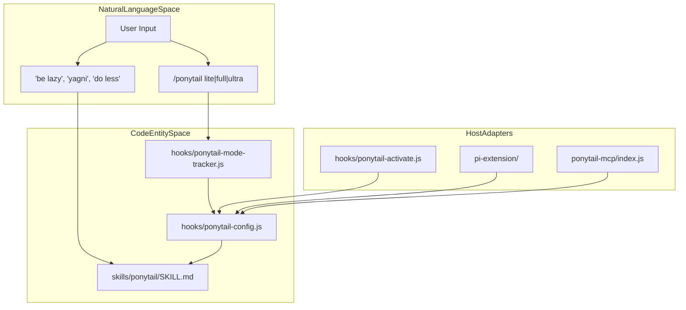
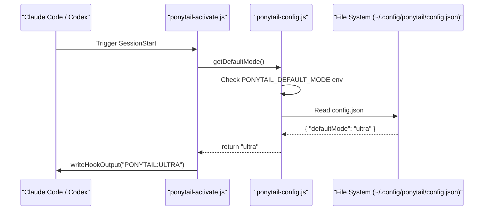

# 용어집

관련 소스 파일

다음 파일들은 이 위키 페이지를 생성할 때 참고 자료로 사용되었습니다:

- [.agents/plugins/marketplace.json](.agents/plugins/marketplace.json)
- [.agents/rules/ponytail.md](.agents/rules/ponytail.md)
- [.kiro/steering/ponytail.md](.kiro/steering/ponytail.md)
- [.openclaw/skills/ponytail-audit/SKILL.md](.openclaw/skills/ponytail-audit/SKILL.md)
- [.openclaw/skills/ponytail-review/SKILL.md](.openclaw/skills/ponytail-review/SKILL.md)
- [.openclaw/skills/ponytail/SKILL.md](.openclaw/skills/ponytail/SKILL.md)
- [.opencode/plugins/ponytail.mjs](.opencode/plugins/ponytail.mjs)
- [README.md](README.md)
- [benchmarks/behavior.js](benchmarks/behavior.js)
- [benchmarks/behavior.yaml](benchmarks/behavior.yaml)
- [docs/agent-portability.md](docs/agent-portability.md)
- [hooks/ponytail-config.js](hooks/ponytail-config.js)
- [hooks/ponytail-mode-tracker.js](hooks/ponytail-mode-tracker.js)
- [opencode.json](opencode.json)
- [ponytail-mcp/README.md](ponytail-mcp/README.md)
- [scripts/check-rule-copies.js](scripts/check-rule-copies.js)
- [skills/ponytail-help/SKILL.md](skills/ponytail-help/SKILL.md)
- [skills/ponytail/SKILL.md](skills/ponytail/SKILL.md)
- [tests/hooks.test.js](tests/hooks.test.js)
- [tests/openclaw-skills.test.js](tests/openclaw-skills.test.js)
- [tests/opencode-plugin.test.js](tests/opencode-plugin.test.js)

이 페이지는 Ponytail 전용 용어, 구현 개념, 그리고 에이전트가 사용하는 의사결정 프레임워크의 정의를 제공합니다. 코드베이스에 온보딩하는 엔지니어가 자연어 지시가 시스템 동작으로 어떻게 매핑되는지 이해할 수 있도록 돕는 참고 자료 역할을 합니다.

## 핵심 개념

### The Ladder
코드를 작성하기 전에 에이전트가 따라야 하는 핵심 의사결정 계층입니다. 더 단순한 대안을 먼저 모두 소진함으로써, 에이전트를 가능한 가장 최소한의 솔루션으로 유도하도록 설계되어 있습니다 [README.md:82-91]().

| 단계 | 논리 | 코드 엔티티 / 지시 |
| :--- | :--- | :--- |
| **1. YAGNI** | 이것이 정말 존재해야 하나요? | `skip it` [skills/ponytail/SKILL.md:33]() |
| **2. Stdlib** | 표준 라이브러리가 할 수 있나요? | `Use it` [skills/ponytail/SKILL.md:34]() |
| **3. Native** | 네이티브 플랫폼 기능인가요? | `CSS over JS`, `<input type="date">` [skills/ponytail/SKILL.md:35]() |
| **4. Deps** | 이미 설치된 의존성인가요? | `Never add a new one` [skills/ponytail/SKILL.md:36]() |
| **5. One-line** | 한 줄로 가능하나요? | `One line` [skills/ponytail/SKILL.md:37]() |
| **6. Minimum** | 그제서야: 코드를 작성합니다. | `minimum code that works` [skills/ponytail/SKILL.md:38]() |

### Intensity Levels
Ponytail은 The Ladder를 얼마나 공격적으로 적용할지 결정하는 세 가지 뚜렷한 운영 모드를 지원합니다 [skills/ponytail/SKILL.md:64-70]().

*   **Lite**: 요청된 작업은 수행하되, 더 게으른 대안을 한 줄 주석으로 제안합니다 [skills/ponytail/SKILL.md:68]().
*   **Full**: 기본 모드입니다. The Ladder를 엄격히 적용하며, diff와 설명은 가능한 한 짧게 유지합니다 [skills/ponytail/SKILL.md:69]().
*   **Ultra**: 극단적 YAGNI입니다. 에이전트는 코드를 추가하기 전에 삭제하도록 장려되며, 요구 사항에 도전합니다 [skills/ponytail/SKILL.md:70]().

### Ponytail Comment (`ponytail:`)
의도적인 단순화를 표시하는 데 쓰이는 필수 소스 코드 주석입니다. 이는 사람이 아닌 무지가 아니라 설계 의도에 따라 지름길을 택했음을 리뷰어에게 알립니다 [skills/ponytail/SKILL.md:51]().
*   **Ceiling**: 지름길에 알려진 한계가 있다면(예: O(n²) 복잡도), 주석은 그 한계와 업그레이드 경로를 명시해야 합니다 [skills/ponytail/SKILL.md:51](), [scripts/check-rule-copies.js:43-44]().

### Test Reflex
비자명한 로직(분기, 루프, 파서)은 반드시 정확히 **하나의** 실행 가능한 검사를 남겨야 한다는 하드닝 규칙입니다 [skills/ponytail/SKILL.md:88-93]().
*   **구현**: 보통 `assert` 기반의 `demo()` 함수 또는 작은 `test_*.py` 파일입니다 [skills/ponytail/SKILL.md:89-91]().
*   **예외**: 자명한 한 줄 코드는 테스트가 필요 없습니다 [skills/ponytail/SKILL.md:92]().

**출처:** [README.md](), [skills/ponytail/SKILL.md](), [scripts/check-rule-copies.js]()

---

## 기술 아키텍처 및 코드 엔티티

### 자연어에서 코드로의 매핑
다음 다이어그램은 사용자 대상 명령과 자연어 트리거가 어떻게 기본 Node.js 모듈과 스킬 정의로 이어지는지 보여줍니다.

**다이어그램: 인터페이스에서 구현으로의 매핑**

**출처:** [skills/ponytail/SKILL.md](), [hooks/ponytail-config.js](), [hooks/ponytail-mode-tracker.js](), [ponytail-mcp/README.md]()

### 상태 및 생명주기 엔티티

*   **`.ponytail-active`**: 현재 모드를 턴 간 유지하기 위해 `getClaudeDir()`(보통 `~/.claude/`) 또는 `PLUGIN_DATA`에 기록되는 플래그 파일입니다 [hooks/ponytail-config.js:71-74](), [tests/hooks.test.js:48-52]().
*   **`ponytail-activate.js`**: Ponytail이 상태 파일을 초기화하고 세션에 대한 시스템 메시지를 반환하는 SessionStart 훅입니다 [tests/hooks.test.js:50-58]().
*   **`ponytail-mode-tracker.js`**: `/ponytail lite` 같은 모드 전환 명령이나 비활성화 문구에 대해 사용자 입력을 파싱하는 UserPromptSubmit 훅입니다 [tests/hooks.test.js:60-68]().
*   **`check-rule-copies.js`**: 플랫폼별 규칙 파일(Cursor, Windsurf 등)이 기준 원본 `AGENTS.md`와 동기화되어 있는지 보장하는 유지보수 스크립트입니다 [scripts/check-rule-copies.js:19-26]().

**다이어그램: 모드 해석을 위한 데이터 흐름**

**출처:** [hooks/ponytail-config.js](), [hooks/ponytail-activate.js](), [tests/hooks.test.js]()

---

## 메트릭 및 벤치마크 용어

### LOC / Net-Lines
Ponytail 성공의 핵심 지표입니다. 기준선과 비교했을 때 생성된 코드 줄 수를 의미합니다. Ponytail은 평균 약 54% 적은 코드를 목표로 합니다 [README.md:22-23]().
*   **Net-Lines Metric**: `ponytail-review`와 `ponytail-audit`에서 잠재적 절감을 점수화할 때 사용됩니다: `net: -<N> lines possible` [.openclaw/skills/ponytail-review/SKILL.md:41]().

### Safety Tier / Trust Boundaries
Ponytail은 "lazy" 로직에서 중요한 경로를 제외함으로써 100% 안전 기록을 유지합니다 [README.md:59-61]().
*   **예외 항목**: trust boundary에서의 입력 검증, 데이터 손실을 막는 오류 처리, 보안, 접근성 [skills/ponytail/SKILL.md:79-82]().

### Rule Invariants
`scripts/check-rule-copies.js`에 하드코딩된 부분 문자열로, `SKILL.md`와 `AGENTS.md` 둘 다에 반드시 존재해야 합니다. 규칙이 다시 표현되면서 이들 파일 사이에서 어긋나면 CI가 실패합니다 [scripts/check-rule-copies.js:43-56]().
1.  `naive heuristic` (Ceiling comments)
2.  `ONE runnable check` (Test reflex)
3.  `flimsier algorithm` (Robust variant)
4.  `input validation at trust boundaries` (Security boundary)

**출처:** [README.md](), [scripts/check-rule-copies.js](), [.openclaw/skills/ponytail-review/SKILL.md]()
