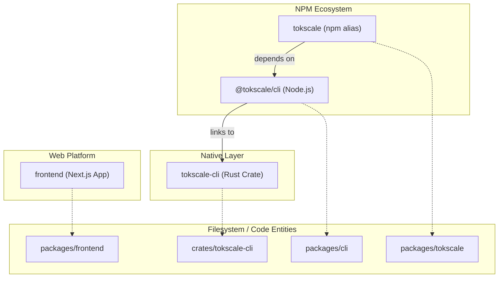
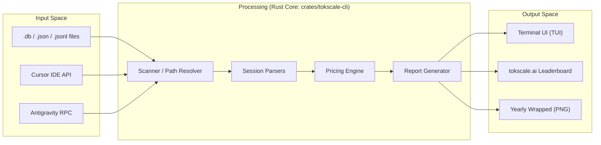

# 개요

관련 소스 파일

다음 파일들은 이 위키 페이지를 생성하는 맥락으로 사용되었습니다.

- [README.ja.md](README.ja.md)
- [README.ko.md](README.ko.md)
- [README.md](README.md)
- [README.zh-cn.md](README.zh-cn.md)
- [crates/tokscale-cli/src/antigravity.rs](crates/tokscale-cli/src/antigravity.rs)
- [crates/tokscale-cli/src/paths.rs](crates/tokscale-cli/src/paths.rs)
- [packages/cli/package.json](packages/cli/package.json)
- [packages/tokscale/package.json](packages/tokscale/package.json)

## 목적과 범위

이 문서는 Tokscale에 대한 상위 수준의 소개를 제공하며, AI 토큰 사용량 추적 시스템으로서의 목적, 주요 아키텍처 구성 요소, 그리고 이들이 함께 동작하는 방식을 설명합니다. Tokscale은 개발자가 다양한 **AI 코딩 어시스턴트의 비용과 소비 패턴을 투명하게 파악**할 수 있도록 설계되었습니다.

## Tokscale이란?

Tokscale은 AI 코딩 어시스턴트의 **토큰 소비량을 추적, 분석, 시각화**하기 위한 고성능 시스템입니다. OpenCode, Claude Code, Cursor, Gemini, GitHub Copilot CLI를 포함해 25개 이상의 다양한 클라이언트를 지원합니다 [[README.md:54-78]]().

이 시스템은 세 가지 주요 구성 요소로 이루어져 있습니다.
1.  **CLI 도구** (`@tokscale/cli`): 로컬 데이터 탐색을 위한 대화형 터미널 UI(TUI)를 갖춘 명령줄 인터페이스입니다 [[packages/cli/package.json:2-10]]().
2.  **네이티브 Rust 코어** (`tokscale-cli` crate): 로컬 세션 데이터베이스와 파일을 파싱하고, 비용을 계산하며, 보고서를 생성하는 고성능 엔진입니다 [[crates/tokscale-cli/src/lib.rs:1-10]]().
3.  **웹 플랫폼** (`tokscale.ai`): 소셜 리더보드, 공개 프로필, 3D 사용량 시각화를 위한 **Next.js 애플리케이션**입니다 [[README.md:46-48]]().

**출처:** [README.md:9-10](), [README.md:54-78](), [packages/cli/package.json:2-10]()

## 시스템 구성 요소

Tokscale 모노레포는 애플리케이션의 특정 계층을 처리하는 여러 패키지와 crate로 구성됩니다.

| 패키지/Crate | 유형 | 목적 |
| :--- | :--- | :--- |
| `@tokscale/cli` | TypeScript / Node.js | `tokscale` 명령을 제공하고 TUI 환경을 관리합니다 [[packages/cli/package.json:2-10]](). |
| `tokscale-cli` | Rust Crate | 파일 스캔, 세션 파싱, 가격 결정 해결을 담당하는 고성능 코어입니다 [[crates/tokscale-cli/src/lib.rs:1-10]](). |
| `tokscale` | npm Wrapper | 사용자 편의를 위해 `@tokscale/cli`를 설치하는 별칭 패키지입니다 [[packages/tokscale/package.json:2-10]](). |
| `frontend` | Next.js | [tokscale.ai](https://tokscale.ai)의 웹 애플리케이션입니다 [[README.md:48]](). |

### 모노레포 의존성 그래프

다음 다이어그램은 서로 다른 코드 엔티티가 어떤 관계를 맺는지 보여주며, 상위 수준의 시스템 이름을 구체적인 디렉터리와 패키지에 연결합니다.

**출처:** [packages/cli/package.json:2-10](), [packages/tokscale/package.json:2-10](), [README.md:145-150]()

## 지원되는 AI 코딩 어시스턴트

Tokscale은 다양한 AI 코딩 어시스턴트의 로컬 저장소 경로를 스캔하여 토큰 사용량을 추적합니다. 주요 지원 클라이언트는 다음과 같습니다.

| 클라이언트 | 기본 데이터 위치 |
| :--- | :--- |
| **OpenCode** | `~/.local/share/opencode/opencode.db` [[README.md:58]]() |
| **Claude Code** | `~/.claude/projects/` 및 `~/.claude/transcripts/` [[README.md:59]]() |
| **GitHub Copilot** | `~/.copilot/otel/*.jsonl` [[README.md:62]]() |
| **Cursor IDE** | `~/.config/tokscale/cursor-cache/` (API 동기화를 통해) [[README.md:65]]() |
| **Gemini CLI** | `~/.gemini/tmp/*/chats/*.json` [[README.md:64]]() |
| **Antigravity** | `~/.config/tokscale/antigravity-cache/` [[crates/tokscale-cli/src/antigravity.rs:30-35]]() |

**출처:** [README.md:58-78](), [crates/tokscale-cli/src/antigravity.rs:30-35]()

## 데이터 흐름 파이프라인

이 시스템은 로컬 원시 데이터에서 집계 보고서와 선택적 소셜 제출로 이어지는 파이프라인을 따릅니다.

**출처:** [README.md:58-78](), [crates/tokscale-cli/src/lib.rs:1-10](), [crates/tokscale-cli/src/antigravity.rs:147-160]()

## 핵심 기술과 성능

Tokscale은 특히 수천 개의 세션 파일을 처리할 때 속도와 효율성을 위해 만들어졌습니다.

*   **Rust 코어**: 파일 I/O와 파싱에 네이티브 성능을 제공하며, 대규모 데이터셋에서 **순수 TypeScript 구현보다 훨씬 뛰어난 성능**을 보입니다 [[README.md:13]]().
*   **SIMD JSON**: **SIMD 가속 JSON 파싱**을 사용하여 대량의 세션 로그를 빠르게 처리합니다.
*   **Rayon**: 여러 CPU 코어에 걸쳐 디렉터리를 스캔하고 파일을 파싱하기 위해 데이터 병렬성을 활용합니다.
*   **Antigravity 동기화**: Google Antigravity 세션을 위한 사용자 지정 RPC 기반 동기화를 구현합니다 [[crates/tokscale-cli/src/antigravity.rs:147-155]]().
*   **크로스 플랫폼 지원**: macOS(Intel/M1), Linux(glibc/musl), Windows용 네이티브 바이너리로 배포됩니다 [[packages/cli/package.json:32-39]]().

**출처:** [README.md:13](), [packages/cli/package.json:32-39](), [crates/tokscale-cli/src/antigravity.rs:147-155]()

## 설정과 저장소

Tokscale은 설정과 캐시 데이터를 저장할 때 플랫폼 표준 디렉터리를 따릅니다.

| 항목 | 경로 |
| :--- | :--- |
| **Config Dir** | `~/.config/tokscale/` (또는 `TOKSCALE_CONFIG_DIR`) [[crates/tokscale-cli/src/paths.rs:23-30]]() |
| **Cache Dir** | `~/.cache/tokscale/` [[crates/tokscale-cli/src/paths.rs:70]]() |
| **Antigravity Cache**| `~/.config/tokscale/antigravity-cache/` [[crates/tokscale-cli/src/antigravity.rs:30-31]]() |
| **Legacy macOS** | `~/Library/Application Support/tokscale` [[crates/tokscale-cli/src/paths.rs:25-30]]() |

**출처:** [crates/tokscale-cli/src/paths.rs:23-35](), [crates/tokscale-cli/src/antigravity.rs:30-35]()
