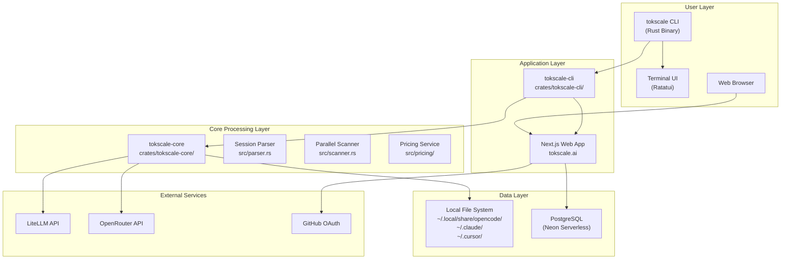
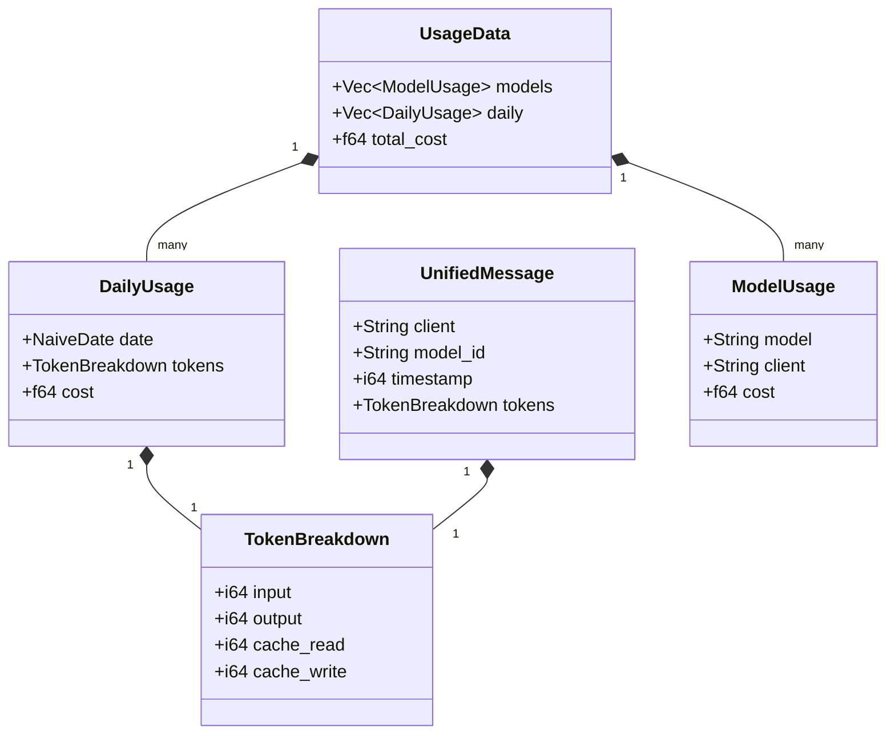

# 아키텍처

관련 소스 파일

다음 파일들은 이 위키 페이지를 생성하는 맥락으로 사용되었습니다.

- [Cargo.toml](Cargo.toml)
- [crates/tokscale-cli/src/commands/wrapped.rs](crates/tokscale-cli/src/commands/wrapped.rs)
- [crates/tokscale-cli/src/main.rs](crates/tokscale-cli/src/main.rs)
- [crates/tokscale-cli/src/tui/client_ui.rs](crates/tokscale-cli/src/tui/client_ui.rs)
- [crates/tokscale-cli/src/tui/data/mod.rs](crates/tokscale-cli/src/tui/data/mod.rs)
- [crates/tokscale-cli/src/tui/ui/widgets.rs](crates/tokscale-cli/src/tui/ui/widgets.rs)
- [crates/tokscale-core/src/aggregator.rs](crates/tokscale-core/src/aggregator.rs)
- [crates/tokscale-core/src/clients.rs](crates/tokscale-core/src/clients.rs)
- [crates/tokscale-core/src/lib.rs](crates/tokscale-core/src/lib.rs)
- [crates/tokscale-core/src/scanner.rs](crates/tokscale-core/src/scanner.rs)
- [crates/tokscale-core/src/sessions/mod.rs](crates/tokscale-core/src/sessions/mod.rs)
- [packages/cli-darwin-arm64/package.json](packages/cli-darwin-arm64/package.json)
- [packages/cli-darwin-x64/package.json](packages/cli-darwin-x64/package.json)
- [packages/cli-linux-arm64-gnu/package.json](packages/cli-linux-arm64-gnu/package.json)
- [packages/cli-linux-arm64-musl/package.json](packages/cli-linux-arm64-musl/package.json)
- [packages/cli-linux-x64-gnu/package.json](packages/cli-linux-x64-gnu/package.json)
- [packages/cli-linux-x64-musl/package.json](packages/cli-linux-x64-musl/package.json)
- [packages/cli-win32-arm64-msvc/package.json](packages/cli-win32-arm64-msvc/package.json)
- [packages/cli-win32-x64-msvc/package.json](packages/cli-win32-x64-msvc/package.json)

이 문서는 모노레포 구조, 구성 요소 간 관계, CLI, 네이티브 Rust 코어, 웹 프런트엔드가 함께 동작하는 방식을 포함해 Tokscale의 전체 시스템 아키텍처를 설명합니다. 특정 하위 시스템에 대한 자세한 내용은 [Monorepo Structure](#2.1)와 [Data Flow Pipeline](#2.2)을 참조하세요.

## 시스템 개요

Tokscale은 고성능 네이티브 **Rust 코어**와 **명령줄 인터페이스**를 포함하는 모노레포로 설계되었습니다. 이 시스템은 네이티브 **Rust 코어가 데이터 집약적 작업(파싱, 가격 계산, 집계)을 처리**하고, CLI가 전통적인 명령 인터페이스와 풍부한 터미널 UI(TUI)를 모두 제공하는 계층형 아키텍처를 따릅니다.

**출처:** [crates/tokscale-cli/src/main.rs:1-126](), [crates/tokscale-core/src/lib.rs:1-19]()

## 3계층 아키텍처

### CLI 도구(`tokscale-cli`)

CLI는 주요 사용자 인터페이스를 제공합니다. Rust로 작성되었으며 명령줄 인자 파싱에는 `clap`을, 대화형 터미널 UI에는 `ratatui`를 사용합니다.

**주요 구성 요소:**
- **진입점:** [crates/tokscale-cli/src/main.rs:19-87]() - `Cli` struct를 통한 명령 라우팅입니다.
- **TUI 애플리케이션:** [crates/tokscale-cli/src/tui/client_ui.rs]() - `ratatui`를 사용하는 대화형 대시보드입니다.
- **명령 핸들러:** [crates/tokscale-cli/src/commands/]() - `models`, `monthly`, `wrapped` 같은 특정 명령의 로직입니다.
- **소셜 통합:** [crates/tokscale-cli/src/auth.rs]() - 소셜 플랫폼으로의 인증과 데이터 제출을 담당합니다.

**출처:** [crates/tokscale-cli/src/main.rs:89-215](), [crates/tokscale-cli/src/commands/wrapped.rs:100-158]()

### 네이티브 Rust 코어(`tokscale-core`)

코어 라이브러리는 모든 성능 핵심 작업을 처리합니다. **디렉터리 스캔과 파일 파싱에 `rayon`을 활용하여 높은 병렬성**을 갖도록 설계되었습니다.

**주요 구성 요소:**
- **병렬 스캐너:** [crates/tokscale-core/src/scanner.rs:59-121]() - 25개 이상의 지원 AI 클라이언트에서 세션 파일을 찾아냅니다.
- **세션 파서:** [crates/tokscale-core/src/parser.rs]() - 이기종 JSON/SQLite 데이터를 `UnifiedMessage` 구조로 정규화합니다.
- **가격 계산 엔진:** [crates/tokscale-core/src/pricing/mod.rs]() - LiteLLM과 OpenRouter 데이터를 사용하여 모델 ID를 비용으로 해석합니다.
- **집계기:** [crates/tokscale-core/src/aggregator.rs]() - 원시 메시지 데이터를 `TokenBreakdown`과 `DailyTotals`로 요약합니다.

**출처:** [crates/tokscale-core/src/lib.rs:137-170](), [crates/tokscale-core/src/scanner.rs:1-8]()

### 프런트엔드 웹 애플리케이션

웹 애플리케이션(tokscale.ai에서 호스팅)은 소셜 허브 역할을 하는 **Next.js 프로젝트**입니다. 리더보드, 사용자 프로필, 대화형 3D 기여 그래프를 표시합니다.

**주요 기능:**
- **리더보드:** 서로 다른 기간의 토큰 사용량과 비용을 기준으로 사용자의 순위를 매깁니다.
- **사용자 프로필:** 개인별 사용 기록과 모델 선호도를 시각화합니다.
- **임베드:** GitHub README에서 사용할 SVG 배지와 프로필 카드를 생성합니다.

## 데이터 구조와 코드 엔티티

다음 다이어그램은 상위 수준 개념과 코드베이스에서 사용되는 구체적인 Rust struct 사이의 간극을 연결합니다.

**출처:** [crates/tokscale-core/src/lib.rs:137-150](), [crates/tokscale-cli/src/tui/data/mod.rs:48-58](), [crates/tokscale-cli/src/tui/data/mod.rs:136-149]()

## 빌드와 배포

Tokscale은 주로 npm을 통해 네이티브 바이너리로 배포됩니다. 모노레포에는 운영체제 간 호환성을 보장하기 위해 여러 플랫폼별 패키지가 포함되어 있습니다.

**네이티브 플랫폼 대상:**
| 패키지 이름 | OS | 아키텍처 | Libc |
|--------------|----|--------------|------|
| `@tokscale/cli-darwin-arm64` | macOS | ARM64 | - |
| `@tokscale/cli-linux-x64-gnu` | Linux | x64 | glibc |
| `@tokscale/cli-linux-x64-musl` | Linux | x64 | musl |
| `@tokscale/cli-win32-x64-msvc` | Windows | x64 | - |

**출처:** [packages/cli-darwin-arm64/package.json:1-12](), [packages/cli-linux-x64-gnu/package.json:1-15](), [packages/cli-win32-x64-msvc/package.json:1-12]()

## 구성 요소 간 통신

### CLI에서 네이티브 코어로
`tokscale-cli` crate는 `tokscale-core`에 직접 의존합니다. 로컬 파일시스템에서 데이터를 가져와 처리하기 위해 `parse_local_unified_messages` 같은 코어 함수를 호출합니다.

**출처:** [crates/tokscale-cli/src/tui/data/mod.rs:8-12]()

### CLI에서 소셜 API로
CLI는 HTTPS를 통해 웹 백엔드와 통신합니다. 인증에는 device flow([crates/tokscale-cli/src/auth.rs]())를 사용하고, 집계된 JSON 보고서를 `/api/submit` 엔드포인트로 제출합니다.

**출처:** [crates/tokscale-cli/src/main.rs:204-215]()

### TUI 데이터 로딩
TUI는 비동기 데이터 가져오기를 관리하기 위해 `DataLoader` struct를 사용합니다. UI 렌더링 스레드를 차단하지 않고 코어의 파싱 로직을 실행하기 위해 `tokio`를 활용합니다.

**출처:** [crates/tokscale-cli/src/tui/data/mod.rs:151-156]()
