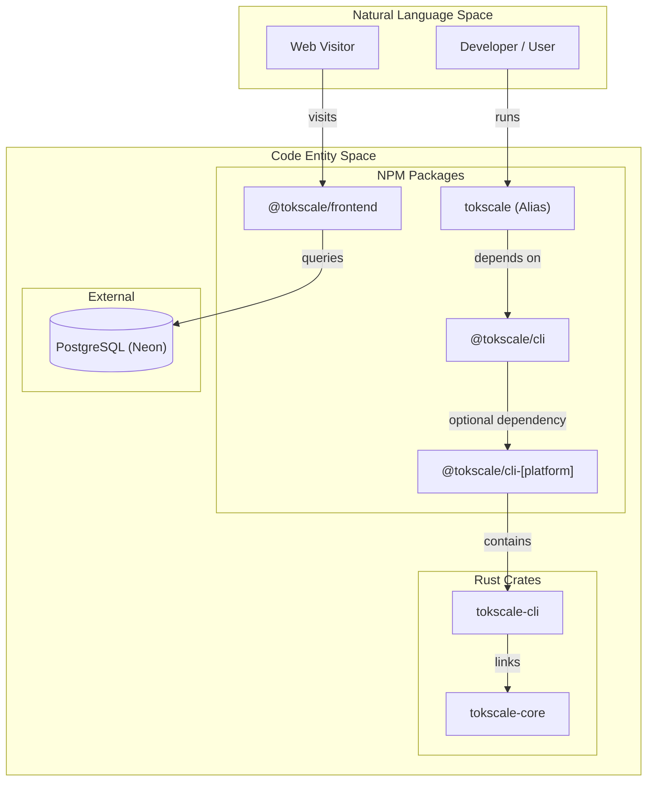
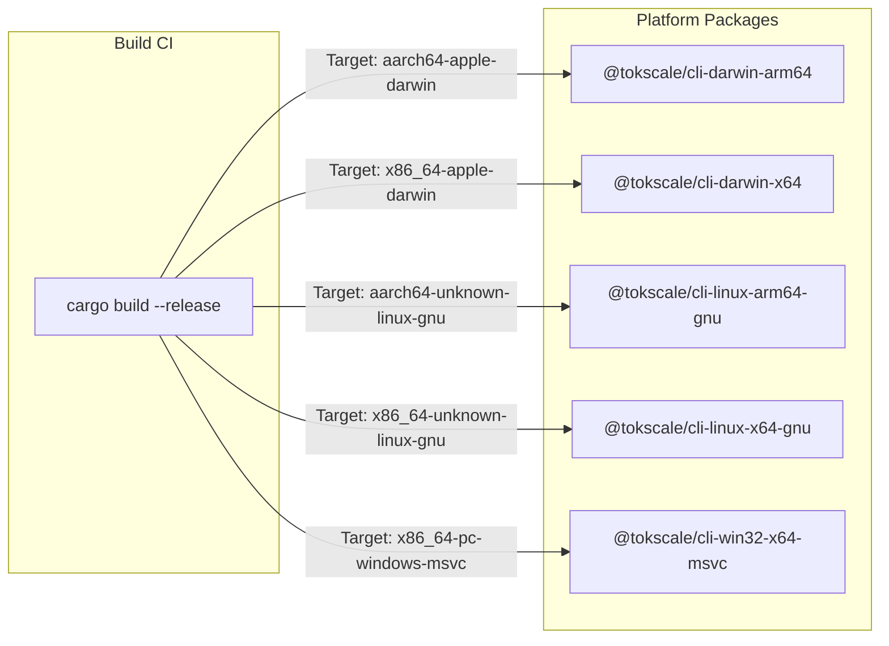

# 모노레포 구조

<details>
<summary>관련 소스 파일</summary>

다음 파일들은 이 위키 페이지를 생성하는 맥락으로 사용되었습니다.

- [Cargo.toml](Cargo.toml)
- [bun.lock](bun.lock)
- [packages/cli-darwin-arm64/package.json](packages/cli-darwin-arm64/package.json)
- [packages/cli-darwin-x64/package.json](packages/cli-darwin-x64/package.json)
- [packages/cli-linux-arm64-gnu/package.json](packages/cli-linux-arm64-gnu/package.json)
- [packages/cli-linux-arm64-musl/package.json](packages/cli-linux-arm64-musl/package.json)
- [packages/cli-linux-x64-gnu/package.json](packages/cli-linux-x64-gnu/package.json)
- [packages/cli-linux-x64-musl/package.json](packages/cli-linux-x64-musl/package.json)
- [packages/cli-win32-arm64-msvc/package.json](packages/cli-win32-arm64-msvc/package.json)
- [packages/cli-win32-x64-msvc/package.json](packages/cli-win32-x64-msvc/package.json)
- [packages/cli/package.json](packages/cli/package.json)
- [packages/frontend/package.json](packages/frontend/package.json)
- [packages/frontend/src/app/layout.tsx](packages/frontend/src/app/layout.tsx)
- [packages/frontend/src/lib/providers/Providers.tsx](packages/frontend/src/lib/providers/Providers.tsx)
- [packages/frontend/src/lib/providers/index.ts](packages/frontend/src/lib/providers/index.ts)
- [packages/tokscale/package.json](packages/tokscale/package.json)

</details>


이 문서는 Tokscale 모노레포의 구성을 자세히 설명하며, 워크스페이스 구조, 패키지 의존성, 고성능 Rust 코어와 Node.js/TypeScript 패키지 사이의 빌드 관계를 다룹니다.

## 워크스페이스 구성

Tokscale은 **Bun workspaces**를 사용하는 모노레포로 구성되어 있습니다. 프로젝트 구조는 **고성능 네이티브 코어, CLI 애플리케이션, 웹 프런트엔드, 플랫폼별 바이너리 배포를 분리**합니다.

### 디렉터리 구조

```text
tokscale/
├── packages/
│   ├── cli/              # Main CLI logic (@tokscale/cli)
│   ├── tokscale/         # Entry point alias (tokscale)
│   ├── frontend/         # Next.js web application (@tokscale/frontend)
│   ├── benchmarks/       # Performance testing suite
│   └── cli-[platform]/   # 8 platform-specific binary packages
├── crates/
│   ├── tokscale-core/    # Native Rust core library
│   └── tokscale-cli/     # Native Rust CLI implementation
├── Cargo.toml            # Rust workspace configuration
└── bun.lock              # Unified Bun lockfile
```

**출처:** [bun.lock:4-115](), [Cargo.toml:1-6]()

## 패키지 의존성 아키텍처

이 시스템은 사용자에게 노출되는 `tokscale` 패키지가 기본 CLI 패키지를 감싸는 얇은 래퍼 역할을 하고, 기본 CLI 패키지가 성능 핵심 작업을 위해 네이티브 바이너리를 활용하는 계층형 의존성 모델을 따릅니다.

### 의존성 그래프

제목: 패키지 의존성과 데이터 흐름


**출처:** [packages/tokscale/package.json:29-31](), [packages/cli/package.json:31-40](), [Cargo.toml:15-17](), [bun.lock:73-84]()

## 핵심 패키지

### 1. @tokscale/cli
CLI 도구의 기본 로직입니다. 핵심 처리는 Rust에서 수행되지만, 이 패키지는 배포와 오케스트레이션을 관리합니다.
- **Main Entry:** `./dist/index.js` [packages/cli/package.json:7]()
- **Binary Mapping:** `tokscale` 명령을 `./bin.js`에 매핑합니다 [packages/cli/package.json:8-10]()
- **Optional Dependencies:** 설치 중 올바른 네이티브 바이너리가 가져와지도록 8개의 플랫폼별 패키지(예: `@tokscale/cli-darwin-arm64`)를 포함합니다 [packages/cli/package.json:31-40]().

### 2. tokscale(별칭 패키지)
깔끔한 설치 명령(`npm install -g tokscale`)을 제공하기 위해 npm에 `tokscale`이라는 이름으로 게시된 편의 패키지입니다.
- **Dependency:** `@tokscale/cli`에 직접 의존합니다 [packages/tokscale/package.json:30]().
- **Role:** 실행을 기본 CLI 패키지로 전달합니다 [packages/tokscale/bin.js:8]().

### 3. @tokscale/frontend
`tokscale.ai`를 구동하는 Next.js 애플리케이션입니다.
- **Framework:** Next.js 16 [bun.lock:81]().
- **Data Access:** Neon PostgreSQL 데이터베이스와 연동하기 위해 `drizzle-orm`을 사용합니다 [bun.lock:74,79]().
- **Visualization:** 아이소메트릭 3D 그래프 렌더링에 `obelisk.js`를 활용합니다 [bun.lock:83]().

**출처:** [packages/cli/package.json:1-44](), [packages/tokscale/package.json:1-31](), [bun.lock:70-92]()

## Rust 워크스페이스와 네이티브 코어

**성능 핵심 구성 요소는 Rust로 작성**되었으며 Cargo workspace로 관리됩니다 [Cargo.toml:1-6]().

### Crate 관계

| Crate | 경로 | 역할 | 주요 의존성 |
|-------|------|------|------------------|
| `tokscale-core` | `crates/tokscale-core` | 세션 파싱, 가격 조회, 보고서 생성을 위한 코어 라이브러리입니다. | `rayon`, `simd-json`, `rusqlite` |
| `tokscale-cli` | `crates/tokscale-cli` | TUI와 CLI 명령 구현입니다. | `ratatui`, `clap`, `tokscale-core` |

### 네이티브 의존성
Rust 코어는 **대용량 세션 파일을 빠르게 처리하기 위해 여러 고성능 라이브러리를 활용**합니다.
- **Parallelism:** 멀티스레드 세션 파싱을 위한 `rayon` [Cargo.toml:20]().
- **JSON Parsing:** SIMD 가속 JSON 처리를 위한 `simd-json` [Cargo.toml:23]().
- **Database:** 로컬 캐싱과 데이터 관리를 위한 `rusqlite`(bundled) [Cargo.toml:49-50]().
- **UI:** 터미널 사용자 인터페이스를 위한 `ratatui`와 `crossterm` [Cargo.toml:59-61]().

**출처:** [Cargo.toml:1-93]()

## 플랫폼별 바이너리

Rust 툴체인이 없는 사용자에게 의존성 없는 설치 경험을 제공하기 위해, Tokscale은 Rust crate를 플랫폼별 NPM 패키지로 사전 컴파일합니다.

제목: 바이너리 배포 전략


각 플랫폼 패키지는 컴파일된 실행 파일이 들어 있는 `bin` 디렉터리를 포함하며, 자체 `package.json`에 `os`와 `cpu` 제약 조건을 정의합니다 [packages/cli-darwin-arm64/package.json:7-16](), [packages/cli-linux-x64-gnu/package.json:7-16]().

**출처:** [packages/cli-darwin-arm64/package.json:1-20](), [packages/cli-linux-x64-gnu/package.json:1-20](), [packages/cli-win32-x64-msvc/package.json:1-20]()

## 버전 관리 전략

게시되는 모든 패키지(CLI, Core, Platform Binaries)는 호환성을 보장하기 위해 단일 버전 번호로 동기화됩니다.
- **Current Workspace Version:** `2.1.0` [Cargo.toml:9]().
- **Synchronization:** `@tokscale/cli` 패키지는 플랫폼별 optional dependencies의 정확한 버전을 요구합니다 [packages/cli/package.json:32-39]().

**출처:** [Cargo.toml:9](), [packages/cli/package.json:3]()
