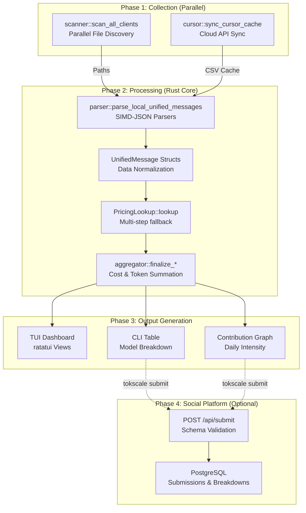

# 데이터 흐름 파이프라인

관련 소스 파일

다음 파일들은 이 위키 페이지를 생성하는 맥락으로 사용되었습니다.

- [AGENTS.md](AGENTS.md)
- [crates/tokscale-cli/src/commands/wrapped.rs](crates/tokscale-cli/src/commands/wrapped.rs)
- [crates/tokscale-cli/src/main.rs](crates/tokscale-cli/src/main.rs)
- [crates/tokscale-cli/src/tui/client_ui.rs](crates/tokscale-cli/src/tui/client_ui.rs)
- [crates/tokscale-cli/src/tui/data/mod.rs](crates/tokscale-cli/src/tui/data/mod.rs)
- [crates/tokscale-cli/src/tui/ui/widgets.rs](crates/tokscale-cli/src/tui/ui/widgets.rs)
- [crates/tokscale-cli/tests/cli_tests.rs](crates/tokscale-cli/tests/cli_tests.rs)
- [crates/tokscale-core/src/aggregator.rs](crates/tokscale-core/src/aggregator.rs)
- [crates/tokscale-core/src/clients.rs](crates/tokscale-core/src/clients.rs)
- [crates/tokscale-core/src/lib.rs](crates/tokscale-core/src/lib.rs)
- [crates/tokscale-core/src/message_cache.rs](crates/tokscale-core/src/message_cache.rs)
- [crates/tokscale-core/src/pricing/litellm.rs](crates/tokscale-core/src/pricing/litellm.rs)
- [crates/tokscale-core/src/pricing/lookup.rs](crates/tokscale-core/src/pricing/lookup.rs)
- [crates/tokscale-core/src/pricing/mod.rs](crates/tokscale-core/src/pricing/mod.rs)
- [crates/tokscale-core/src/pricing/openrouter.rs](crates/tokscale-core/src/pricing/openrouter.rs)
- [crates/tokscale-core/src/provider_identity.rs](crates/tokscale-core/src/provider_identity.rs)
- [crates/tokscale-core/src/scanner.rs](crates/tokscale-core/src/scanner.rs)
- [crates/tokscale-core/src/sessions/codex.rs](crates/tokscale-core/src/sessions/codex.rs)
- [crates/tokscale-core/src/sessions/gemini.rs](crates/tokscale-core/src/sessions/gemini.rs)
- [crates/tokscale-core/src/sessions/mod.rs](crates/tokscale-core/src/sessions/mod.rs)
- [crates/tokscale-core/src/sessions/opencode.rs](crates/tokscale-core/src/sessions/opencode.rs)

이 문서는 로컬 세션 파일 발견부터 파싱, 가격 계산, 집계, 최종 출력 생성까지 Tokscale의 엔드투엔드 데이터 흐름을 설명합니다. 이 파이프라인은 병렬 처리와 SIMD 가속 JSON 파싱을 갖춘 네이티브 Rust 코어를 사용하여 고성능으로 설계되었습니다.

## 파이프라인 개요

Tokscale 데이터 파이프라인은 순차적으로 실행되는 네 가지 주요 단계로 구성됩니다. Rust 코어는 1단계와 2단계의 무거운 작업을 처리하고, CLI와 TUI는 수명주기와 표시를 관리합니다.

**출처:** [crates/tokscale-cli/src/main.rs:19-87](), [crates/tokscale-core/src/lib.rs:1-19](), [crates/tokscale-core/src/aggregator.rs:1-50]()

## 1단계: 데이터 수집

### 로컬 파일 시스템 스캔
로컬 세션 파일은 병렬 디렉터리 순회를 사용하여 발견됩니다. 스캐너는 특정 디렉터리 패턴을 지원되는 AI 클라이언트에 매핑합니다.

| 클라이언트 | 경로 패턴 | 루트 전략 |
| :--- | :--- | :--- |
| **OpenCode** | `opencode/storage/message/*.json` | `XdgData` |
| **Claude** | `.claude/projects/*.jsonl` | `Home` |
| **Codex** | `sessions/*.jsonl` | `EnvVar(CODEX_HOME)` |
| **Cursor** | `cursor-cache/usage*.csv` | `Home` |
| **Gemini** | `.gemini/tmp/*.json` | `Home` |

`ScannerSettings` struct를 통해 사용자는 `~/.config/tokscale/settings.json`에서 추가 경로를 제공할 수 있습니다 [crates/tokscale-core/src/scanner.rs:25-48](). `scan_all_clients` 함수는 `walkdir`와 `rayon`을 사용해 고속 발견을 수행합니다 [crates/tokscale-core/src/scanner.rs:168-210]().

**출처:** [crates/tokscale-core/src/clients.rs:167-215](), [crates/tokscale-core/src/scanner.rs:59-77]()

### Cursor IDE API 동기화
Cursor는 사용량 데이터를 클라우드에 저장하므로, CLI에는 이 데이터를 가져와 로컬에 캐시하는 전용 모듈이 포함되어 있습니다.
1. `cursor::is_cursor_logged_in()`은 로컬 자격 증명을 확인합니다 [crates/tokscale-cli/src/commands/wrapped.rs:179-181]().
2. `cursor::sync_cursor_cache()`는 사용량 행을 가져와 `~/.config/tokscale/cursor-cache/usage.csv`에 씁니다 [crates/tokscale-cli/src/commands/wrapped.rs:180-185]().
3. 이후 파서는 이 CSV를 표준 로컬 소스로 취급합니다 [crates/tokscale-core/src/clients.rs:198-206]().

**출처:** [crates/tokscale-cli/src/commands/wrapped.rs:160-204]()

## 2단계: Rust 코어에서 처리

### 파싱과 정규화
코어는 이기종 JSON/CSV 형식을 `UnifiedMessage`로 변환합니다 [crates/tokscale-core/src/sessions/mod.rs:32-52](). 

- **SIMD-JSON:** `opencode`와 `claudecode` 같은 파서는 처리량을 극대화하기 위해 SIMD 가속 JSON 파싱을 사용합니다.
- **상태 기반 파싱:** `Codex` 파서는 누적 토큰 수와 델타 계산을 처리하기 위해 `CodexParseState`를 유지합니다 [crates/tokscale-core/src/sessions/codex.rs:152-163]().
- **Agent 정규화:** `OpenCode` 같은 도구에서는 agent 이름을 title case로 바꾸고 정규화합니다(예: "omo" → "Sisyphus") [crates/tokscale-core/src/sessions/mod.rs:58-81]().

**출처:** [crates/tokscale-core/src/sessions/mod.rs:191-212](), [crates/tokscale-core/src/sessions/codex.rs:66-150]()

### 가격 조회
`PricingLookup` struct는 정교한 해석 전략을 관리합니다 [crates/tokscale-core/src/pricing/lookup.rs:81-94]().

1. **정확한 일치:** 내부 LiteLLM 및 OpenRouter 맵을 확인합니다.
2. **별칭 해석:** 별칭(예: `gpt-4o-latest`)을 기본 모델로 해석합니다.
3. **티어 제거:** `(high)` 또는 `(low)` 같은 reasoning effort 접미사를 제거합니다 [crates/tokscale-core/src/lib.rs:34-50]().
4. **Provider 순위 지정:** 리셀러보다 원 제작자를 선호합니다(예: `azure/`보다 `openai/`를 선호) [crates/tokscale-core/src/pricing/lookup.rs:19-45]().

**출처:** [crates/tokscale-core/src/pricing/lookup.rs:168-213](), [crates/tokscale-core/src/lib.rs:52-86]()

### 메시지 캐싱과 핑거프린팅
수천 개의 파일을 다시 파싱하지 않기 위해 Tokscale은 바이너리 캐시(`source-message-cache.bin`)를 사용합니다.
- **핑거프린팅:** 파일은 크기, 수정 시간, 샘플링된 해시를 사용해 핑거프린팅됩니다 [crates/tokscale-core/src/message_cache.rs:103-110]().
- **증분 파싱:** 대용량 JSONL 파일(Codex 등)의 경우, 캐시는 `consumed_offset`을 저장하여 새 줄만 파싱하도록 합니다 [crates/tokscale-core/src/message_cache.rs:181-187]().

**출처:** [crates/tokscale-core/src/message_cache.rs:13-20]()

## 3단계: 집계와 보고

`aggregator` 모듈은 `UnifiedMessage` 객체 스트림을 받아 최종 보고서를 생성합니다.

### 집계 로직
TUI의 `DataLoader` 또는 CLI 명령은 `GroupBy` 전략에 따라 데이터를 그룹화합니다 [crates/tokscale-core/src/lib.rs:99-106]().
- `Model`: 모델 ID별 전역 합계입니다.
- `ClientModel`: (Client, Model) 쌍별 합계입니다.
- `WorkspaceModel`: (Workspace, Model) 쌍별 합계이며, 프로젝트 기반 추적에 유용합니다 [crates/tokscale-cli/src/tui/data/mod.rs:161-176]().

### 데이터 구조
| 구조 | 설명 | 출처 |
| :--- | :--- | :--- |
| `ModelUsage` | 모델, provider, 클라이언트별로 그룹화된 사용량 통계 | [crates/tokscale-cli/src/tui/data/mod.rs:48-58]() |
| `DailyUsage` | 날짜별로 집계된 토큰, 비용, turn 수 | [crates/tokscale-cli/src/tui/data/mod.rs:93-101]() |
| `GraphData` | 기여도 그리드를 위한 강도 매핑 데이터 | [crates/tokscale-cli/src/tui/data/mod.rs:131-134]() |
| `AgentUsage` | AI agent별 사용량 내역(예: Sisyphus) | [crates/tokscale-cli/src/tui/data/mod.rs:60-67]() |

**출처:** [crates/tokscale-cli/src/tui/data/mod.rs:189-213](), [crates/tokscale-core/src/lib.rs:137-150]()

## 4단계: 소셜 제출

사용자가 `tokscale submit`을 실행하면 파이프라인은 클라우드까지 확장됩니다.
1. **직렬화:** 집계된 `UsageData`가 JSON으로 직렬화됩니다.
2. **인증:** CLI는 저장된 GitHub OAuth 토큰을 사용합니다 [crates/tokscale-cli/src/main.rs:172-179]().
3. **API 제출:** 데이터가 `tokscale.ai/api/submit`으로 전송됩니다.
4. **병합 로직:** 서버는 소스 수준 병합을 수행하여, 한 머신(예: Cursor가 있는 노트북)의 데이터 제출이 다른 머신(예: OpenCode가 있는 데스크톱)의 데이터를 덮어쓰지 않도록 합니다.

**출처:** [crates/tokscale-cli/src/main.rs:204-215](), [crates/tokscale-core/src/lib.rs:225-232]()
