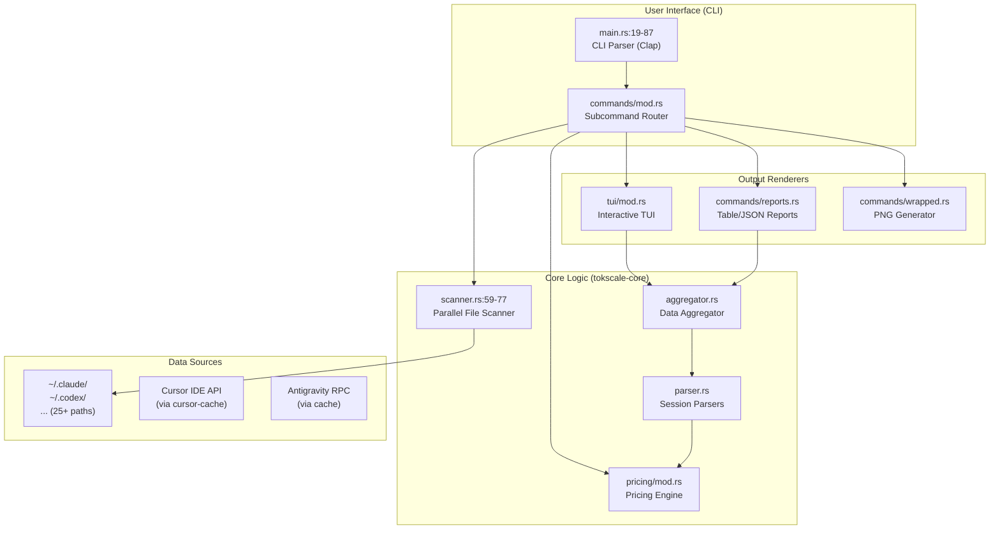
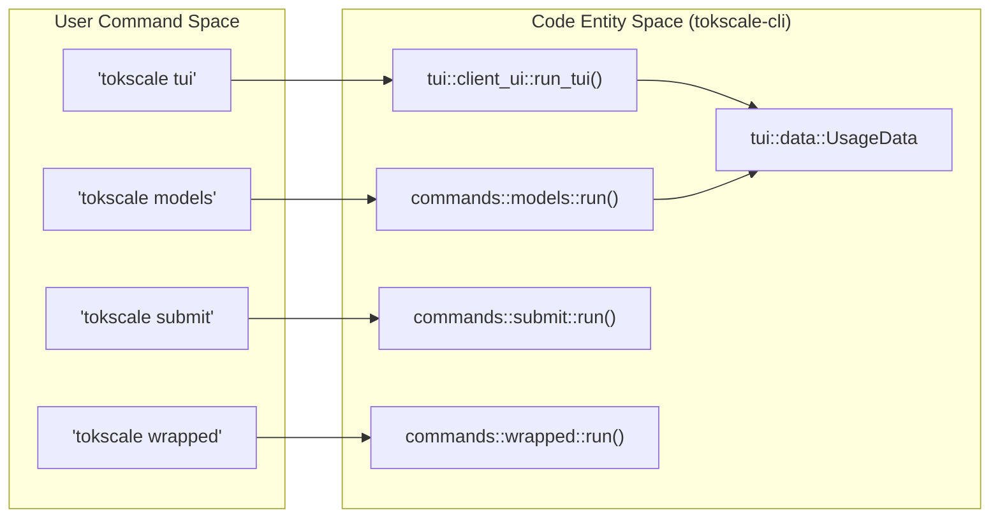
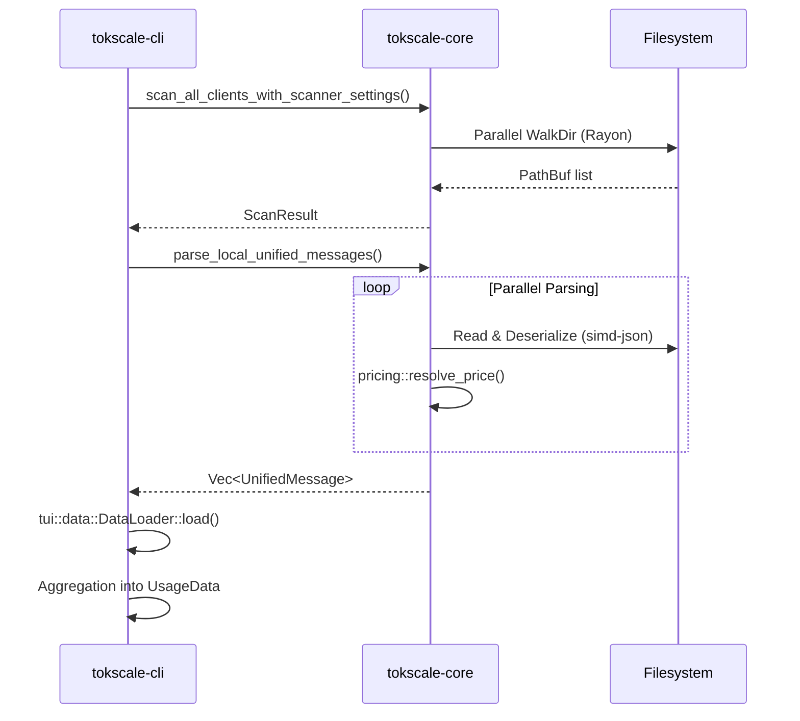

# CLI 도구

관련 소스 파일

다음 파일들은 이 위키 페이지를 생성하는 맥락으로 사용되었습니다.

- [README.ja.md](README.ja.md)
- [README.ko.md](README.ko.md)
- [README.md](README.md)
- [README.zh-cn.md](README.zh-cn.md)
- [crates/tokscale-cli/src/antigravity.rs](crates/tokscale-cli/src/antigravity.rs)
- [crates/tokscale-cli/src/commands/wrapped.rs](crates/tokscale-cli/src/commands/wrapped.rs)
- [crates/tokscale-cli/src/main.rs](crates/tokscale-cli/src/main.rs)
- [crates/tokscale-cli/src/paths.rs](crates/tokscale-cli/src/paths.rs)
- [crates/tokscale-cli/src/tui/client_ui.rs](crates/tokscale-cli/src/tui/client_ui.rs)
- [crates/tokscale-cli/src/tui/data/mod.rs](crates/tokscale-cli/src/tui/data/mod.rs)
- [crates/tokscale-cli/src/tui/ui/widgets.rs](crates/tokscale-cli/src/tui/ui/widgets.rs)
- [crates/tokscale-core/src/aggregator.rs](crates/tokscale-core/src/aggregator.rs)
- [crates/tokscale-core/src/clients.rs](crates/tokscale-core/src/clients.rs)
- [crates/tokscale-core/src/lib.rs](crates/tokscale-core/src/lib.rs)
- [crates/tokscale-core/src/scanner.rs](crates/tokscale-core/src/scanner.rs)
- [crates/tokscale-core/src/sessions/mod.rs](crates/tokscale-core/src/sessions/mod.rs)

Tokscale CLI는 여러 AI 코딩 agent 전반의 토큰 사용량을 추적, 분석, 시각화하는 Rust로 작성된 고성능 명령줄 유틸리티입니다. 로컬 데이터 수집을 위한 기본 인터페이스 역할을 하며, 대화형 터미널 UI(TUI), 표준 보고서 명령, Tokscale 소셜 플랫폼과의 통합을 제공합니다.

자세한 설치 단계는 [Installation and Basic Usage](#3.1)를 참조하세요. 플래그와 하위 명령의 전체 목록은 [Commands Reference](#3.2)를 참조하세요. 대화형 인터페이스에 대한 자세한 내용은 [Terminal UI (TUI)](#3.3)를 참조하세요.

## 아키텍처 개요

CLI는 세션 파일을 스캔하기 위해 로컬 파일시스템과 인터페이스하고, 고속 파싱과 가격 해석을 위해 `tokscale-core` 라이브러리를 활용하며, `ratatui`를 통해 출력을 렌더링하는 오케스트레이션 계층 역할을 합니다.

**출처:** [crates/tokscale-cli/src/main.rs:19-87](), [crates/tokscale-core/src/lib.rs:205-216](), [crates/tokscale-core/src/scanner.rs:59-77]()

## 자연어와 코드 엔티티 매핑

CLI는 사용자 친화적인 명령 이름을 `tokscale-cli` crate 내부의 특정 Rust 모듈 및 데이터 구조와 연결합니다.

**출처:** [crates/tokscale-cli/src/main.rs:90-230](), [crates/tokscale-cli/src/tui/data/mod.rs:137-149]()

## 데이터 로딩 파이프라인

CLI는 수천 개의 세션 파일을 효율적으로 처리하기 위해 `tokscale-core`의 스캐너와 `rayon` 라이브러리를 사용하는 병렬 로딩 전략을 구현합니다.

**출처:** [crates/tokscale-core/src/scanner.rs:59-77](), [crates/tokscale-cli/src/tui/data/mod.rs:151-156](), [crates/tokscale-core/src/lib.rs:171-175]()

## 명령 실행 흐름

하위 명령은 `clap` derive macro를 사용해 정의됩니다. 실행 흐름은 `main.rs`를 거쳐 특화된 명령 핸들러로 라우팅됩니다.

| 명령 범주 | 명령 | 핸들러 파일 |
| :--- | :--- | :--- |
| **Analytics** | `models`, `monthly`, `hourly`, `graph` | `crates/tokscale-cli/src/main.rs` |
| **Interactive** | `tui` | `crates/tokscale-cli/src/tui/client_ui.rs` |
| **Social** | `login`, `logout`, `whoami`, `submit` | `crates/tokscale-cli/src/auth.rs` |
| **IDE Sync** | `cursor login`, `antigravity sync` | `crates/tokscale-cli/src/cursor.rs` |
| **Visualization** | `wrapped` | `crates/tokscale-cli/src/commands/wrapped.rs` |

**출처:** [crates/tokscale-cli/src/main.rs:90-230](), [crates/tokscale-cli/src/commands/wrapped.rs:100-103]()

## 네이티브 성능 기능

Rust 기반 CLI는 이전 반복 버전보다 몇 가지 성능상 이점을 제공합니다.
*   **Parallel Scanning**: 모든 CPU 코어에 걸쳐 세션 디렉터리를 순회하기 위해 `walkdir`와 `rayon`을 사용합니다 [crates/tokscale-core/src/scanner.rs:1-8]().
*   **SIMD JSON Parsing**: 대용량 세션 로그를 고속으로 역직렬화하기 위해 `simd-json`를 활용합니다.
*   **Atomic Caching**: 쓰기 중 TUI 상태와 Cursor 캐시가 손상되지 않도록 `fs_atomic`을 사용합니다 [crates/tokscale-core/src/fs_atomic.rs]().
*   **Zero-Copy Aggregation**: 중복 할당 없이 모델, 클라이언트, 워크스페이스별로 데이터를 효율적으로 그룹화합니다 [crates/tokscale-core/src/lib.rs:99-106]().

## 설정과 테마

CLI 동작은 `~/.config/tokscale/settings.json` 또는 명령줄 플래그를 통해 사용자 지정할 수 있습니다.

*   **Themes**: `--theme` 플래그를 통해 색상 테마(기본값: `blue`)를 지원합니다 [crates/tokscale-cli/src/main.rs:26-27]().
*   **Custom Paths**: 사용자는 비표준 위치의 agent를 추적하기 위해 `ScannerSettings`에 추가 스캔 디렉터리를 정의할 수 있습니다 [crates/tokscale-core/src/scanner.rs:25-48]().
*   **Refresh Rate**: TUI는 `--refresh`를 통해 자동 새로고침 간격(초 단위)을 지원합니다 [crates/tokscale-cli/src/main.rs:29-30]().

**출처:** [crates/tokscale-cli/src/main.rs:26-30](), [crates/tokscale-core/src/scanner.rs:25-48]()
