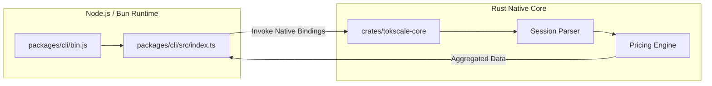

# 설치와 기본 사용법

<details>
<summary>관련 소스 파일</summary>

다음 파일들은 이 위키 페이지를 생성하는 맥락으로 사용되었습니다.

- [Cargo.toml](Cargo.toml)
- [packages/cli-darwin-arm64/package.json](packages/cli-darwin-arm64/package.json)
- [packages/cli-darwin-x64/package.json](packages/cli-darwin-x64/package.json)
- [packages/cli-linux-arm64-gnu/package.json](packages/cli-linux-arm64-gnu/package.json)
- [packages/cli-linux-arm64-musl/package.json](packages/cli-linux-arm64-musl/package.json)
- [packages/cli-linux-x64-gnu/package.json](packages/cli-linux-x64-gnu/package.json)
- [packages/cli-linux-x64-musl/package.json](packages/cli-linux-x64-musl/package.json)
- [packages/cli-win32-arm64-msvc/package.json](packages/cli-win32-arm64-msvc/package.json)
- [packages/cli-win32-x64-msvc/package.json](packages/cli-win32-x64-msvc/package.json)
- [packages/cli/bunfig.toml](packages/cli/bunfig.toml)
- [packages/cli/package.json](packages/cli/package.json)
- [packages/tokscale/package.json](packages/tokscale/package.json)
- [scripts/cli.sh](scripts/cli.sh)

</details>


이 문서는 npm을 통한 Tokscale 설치와 기본 명령줄 사용법을 다룹니다. Tokscale은 AI 토큰 사용량을 추적하기 위한 고성능 시스템으로 설계되었으며, 속도를 위해 네이티브 Rust 코어를 사용하고 사용자 인터페이스에는 TypeScript 기반 CLI를 사용합니다.

## 설치

Tokscale은 다중 패키지 모노레포로 배포됩니다. 사용자를 위한 기본 진입점은 핵심 CLI 기능의 별칭 역할을 하는 `tokscale` 패키지입니다.

### npm을 통한 전역 설치

CLI를 설치하는 권장 방식은 npm 또는 호환 패키지 매니저를 통해 전역으로 설치하는 것입니다.

```bash
npm install -g tokscale
```

이 명령은 `tokscale` 바이너리를 설치하며 [packages/tokscale/package.json:7-9](), 이 바이너리는 `@tokscale/cli`의 기본 CLI 로직에 의존합니다 [packages/tokscale/package.json:29-31]().

### 패키지 의존성 구조

설치 과정은 사용자의 아키텍처에 맞는 올바른 네이티브 바이너리를 사용할 수 있도록 의존성 체인을 해석합니다.

```mermaid
graph TD
    subgraph "NPM Registry"
        [tokscale] --> ["@tokscale/cli"]
        ["@tokscale/cli"] -.-> ["@tokscale/cli-darwin-arm64"]
        ["@tokscale/cli"] -.-> ["@tokscale/cli-linux-x64-gnu"]
        ["@tokscale/cli"] -.-> ["@tokscale/cli-win32-x64-msvc"]
    end

    subgraph "Local Installation"
        BIN["/usr/local/bin/tokscale"]
        JS_LOGIC["CLI Logic (TypeScript/Node)"]
        NATIVE_BIN["Native Rust Binary (.exe / elf)"]
        
        BIN --> JS_LOGIC
        JS_LOGIC --> NATIVE_BIN
    end

    [tokscale] -- "Installs" --> BIN
    ["@tokscale/cli"] -- "Provides" --> JS_LOGIC
    ["@tokscale/cli-linux-x64-gnu"] -- "Provides" --> NATIVE_BIN
```

**출처:** [packages/tokscale/package.json:1-41](), [packages/cli/package.json:1-54]()

---

## 기본 사용법과 명령 구문

`tokscale` 명령의 기본 구문은 표준 CLI 패턴을 따릅니다.

```bash
tokscale [command] [options]
```

### 인자 없이 실행하기
일반적으로 `tokscale`을 아무 인자 없이 실행하면 **Terminal User Interface (TUI)**가 시작되며, 토큰 사용량을 보여주는 대화형 대시보드를 제공합니다.

### 핵심 명령 예시

| 명령 | 설명 |
| :--- | :--- |
| `tokscale` | 대화형 TUI 대시보드를 시작합니다 |
| `tokscale models` | 감지된 모든 모델과 누적 비용을 나열합니다 |
| `tokscale monthly` | 월별 사용량 내역을 보여줍니다 |
| `tokscale pricing` | AI 모델의 최신 가격 데이터를 가져옵니다 |
| `tokscale login` | GitHub를 통해 tokscale.ai에 인증합니다 |

**출처:** [packages/cli/package.json:8-10](), [Cargo.toml:56-61]()

---

## 구현과 실행 흐름

사용자가 `tokscale`을 실행하면, 시스템은 Node.js/Bun 환경에서 고성능 Rust 코어로 이어지는 데이터 흐름을 시작합니다.

### 데이터 흐름 파이프라인

CLI는 세션 로그의 파일 시스템 스캔과 JSON 파싱 같은 무거운 작업을 처리하기 위해 `tokscale-core` Rust crate를 호출하는 래퍼 역할을 합니다.



### 네이티브 바이너리 배포
Tokscale은 optional dependencies를 사용해 플랫폼별 네이티브 바이너리를 배포합니다. 이를 통해 사용자가 Rust 툴체인을 설치하지 않아도 됩니다. 지원되는 플랫폼은 다음과 같습니다.

*   **macOS**: `darwin-arm64`, `darwin-x64` [packages/cli/package.json:32-33]()
*   **Linux**: `linux-x64-gnu`, `linux-x64-musl`, `linux-arm64-gnu`, `linux-arm64-musl` [packages/cli/package.json:34-37]()
*   **Windows**: `win32-x64-msvc`, `win32-arm64-msvc` [packages/cli/package.json:38-39]()

각 플랫폼별 패키지(예: `@tokscale/cli-linux-arm64-gnu`)는 사전 컴파일된 `tokscale` 바이너리를 자체 `bin/` 디렉터리에 포함합니다 [packages/cli-linux-arm64-gnu/package.json:16-19]().

**출처:** [packages/cli/package.json:31-40](), [packages/cli-linux-arm64-gnu/package.json:1-29](), [Cargo.toml:1-6]()

---

## 일반적인 사용 패턴

### 1. 개발자 로컬 미리보기
코드베이스에서 작업하는 개발자는 제공된 헬퍼 스크립트를 사용해 전역 설치를 우회할 수 있습니다.

```bash
./scripts/cli.sh [args]
```
이 스크립트는 `bun`을 사용하여 `packages/cli/src/index.ts`에서 TypeScript 소스를 직접 실행합니다 [scripts/cli.sh:1-8]().

### 2. CI/CD와 스크립팅
비대화형 환경에서는 CLI를 사용해 원시 데이터나 특정 보고서를 출력할 수 있습니다. TUI가 기본값이지만, 하위 명령은 로그에 적합한 구조화된 텍스트 출력을 제공합니다.

### 3. Cursor IDE 동기화
가장 일반적인 사용 패턴 중 하나는 Cursor IDE에서 데이터를 동기화하는 것입니다. 사용자는 다음을 실행할 수 있습니다.
```bash
tokscale cursor login
```
이 명령은 로컬 Cursor 사용량 데이터베이스에 접근하고 이를 클라우드 리더보드와 동기화하는 데 필요한 인증 흐름을 시작합니다.

**출처:** [scripts/cli.sh:1-8](), [packages/cli/package.json:45-53]()
