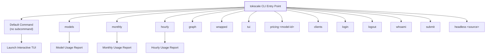
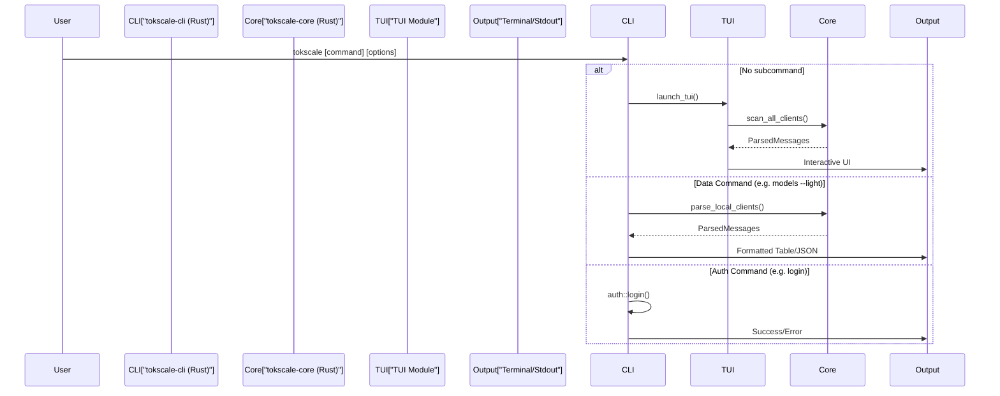
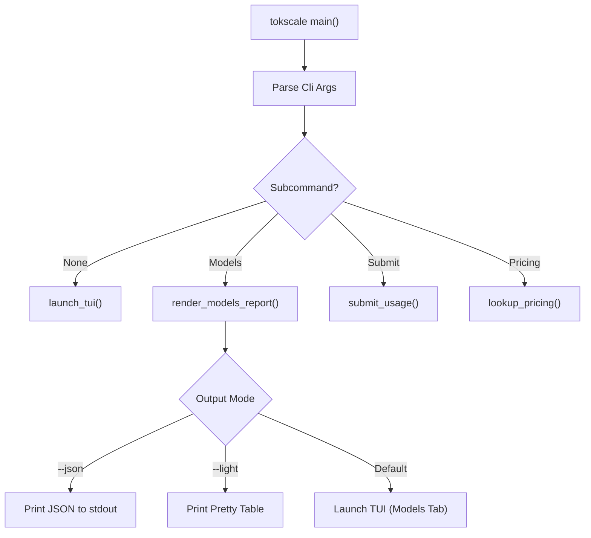

# 명령 참조

관련 소스 파일

다음 파일들은 이 위키 페이지를 생성하는 맥락으로 사용되었습니다.

- [crates/tokscale-cli/src/commands/mod.rs](crates/tokscale-cli/src/commands/mod.rs)
- [crates/tokscale-cli/src/commands/wrapped.rs](crates/tokscale-cli/src/commands/wrapped.rs)
- [crates/tokscale-cli/src/main.rs](crates/tokscale-cli/src/main.rs)
- [crates/tokscale-cli/src/tui/client_ui.rs](crates/tokscale-cli/src/tui/client_ui.rs)
- [crates/tokscale-cli/src/tui/data/mod.rs](crates/tokscale-cli/src/tui/data/mod.rs)
- [crates/tokscale-cli/src/tui/ui/widgets.rs](crates/tokscale-cli/src/tui/ui/widgets.rs)
- [crates/tokscale-core/src/aggregator.rs](crates/tokscale-core/src/aggregator.rs)
- [crates/tokscale-core/src/clients.rs](crates/tokscale-core/src/clients.rs)
- [crates/tokscale-core/src/lib.rs](crates/tokscale-core/src/lib.rs)
- [crates/tokscale-core/src/scanner.rs](crates/tokscale-core/src/scanner.rs)
- [crates/tokscale-core/src/sessions/mod.rs](crates/tokscale-core/src/sessions/mod.rs)

이 페이지는 Tokscale에서 사용할 수 있는 모든 CLI 명령의 종합 참조를 제공합니다. CLI는 Rust로 구현되어 있으며 인자 파싱에 `clap` crate를 사용합니다.

특정 명령 범주에 대한 자세한 문서는 다음을 참조하세요.
- [Data Visualization Commands](#3.2.1) — `models`, `monthly`, `graph`, `wrapped`
- [Social Platform Commands](#3.2.2) — `login`, `logout`, `whoami`, `submit`
- [Cursor IDE Integration](#3.2.3) — `cursor login/logout/status`
- [Pricing Lookup](#3.2.4) — `pricing` 명령

일반적인 CLI 사용 패턴과 터미널 UI(TUI)는 [Installation and Basic Usage](#3.1)와 [Terminal UI (TUI)](#3.3)를 참조하세요.

## 명령 구조

Tokscale CLI 진입점은 `crates/tokscale-cli/src/main.rs`에 정의되어 있습니다. 테마, 데이터 필터링, 출력 형식을 위한 전역 플래그와 함께 하위 명령 기반 아키텍처를 사용합니다.

### 명령 계층

**출처:** [crates/tokscale-cli/src/main.rs:19-215]()

## 명령 실행 흐름

CLI는 사용자 입력을 `Cli` struct와 `Commands` enum에 매핑합니다. 하위 명령이 제공되지 않으면 기본적으로 대화형 TUI를 시작합니다.

**출처:** [crates/tokscale-cli/src/main.rs:22-87](), [crates/tokscale-cli/src/main.rs:90-215]()

## 사용 가능한 모든 명령

| 명령 | 설명 | 주요 옵션 |
|---------|-------------|-------------|
| `tokscale` | 기본값: TUI를 시작합니다 | `--light`, `--json`, `--theme`, source/date 필터 |
| `tokscale models` | 모델 사용량 내역 | `--group-by`, `--write-cache`, `--light`, `--json` |
| `tokscale monthly` | 월별 사용량 보고서 | `--light`, `--json`, source/date 필터 |
| `tokscale hourly` | 시간대별 사용량 보고서 | `--light`, `--json`, source/date 필터 |
| `tokscale pricing` | 모델 가격 조회 | `model_id`, `--provider`, `--json` |
| `tokscale clients` | 로컬 스캔 위치 표시 | `--json` |
| `tokscale login` | GitHub 인증 | `--token`(수동 저장) |
| `tokscale logout` | Tokscale에서 로그아웃 | 없음 |
| `tokscale whoami` | 현재 사용자 표시 | 없음 |
| `tokscale graph` | 그래프 데이터 내보내기 | `--output <file>`, source/date 필터 |
| `tokscale wrapped` | Wrapped 이미지 생성 | `--year`, `--output`, `--agents`, `--short` |
| `tokscale submit` | 리더보드에 제출 | `--dry-run`, source/date 필터 |
| `tokscale headless` | 하위 프로세스 출력 캡처 | `source`, `args`, `--format`, `--output` |

**출처:** [crates/tokscale-cli/src/main.rs:90-215]()

## 전역 옵션

### 소스 필터(`ClientFlags`)

이 플래그를 사용하면 특정 AI 클라이언트별로 데이터를 필터링할 수 있습니다. 여러 플래그를 제공할 수 있습니다.

| 플래그 | 클라이언트 ID | 기본 루트 경로 |
|------|-----------|-------------------|
| `--opencode` | `opencode` | `XDG_DATA_HOME/opencode/storage/message` |
| `--claude` | `claude` | `~/.claude/projects` |
| `--codex` | `codex` | `$CODEX_HOME/sessions` |
| `--cursor` | `cursor` | `~/.config/tokscale/cursor-cache` |
| `--gemini` | `gemini` | `~/.gemini/tmp` |
| `--amp` | `amp` | `XDG_DATA_HOME/amp/threads` |
| `--droid` | `droid` | `~/.factory/sessions` |
| `--openclaw` | `openclaw` | `~/.openclaw/transcripts` |

**출처:** [crates/tokscale-core/src/clients.rs:167-250](), [crates/tokscale-cli/src/main.rs:60-61]()

### 날짜 필터(`DateRangeFlags`)

사용량 데이터 분석 범위를 제한하는 데 사용됩니다.

| 플래그 | 설명 |
|------|-------------|
| `--today` | 현재 날짜의 데이터만 |
| `--week` | 최근 7일의 데이터 |
| `--month` | 현재 달력 월의 데이터 |
| `--since <YYYY-MM-DD>` | 시작 날짜(포함) |
| `--until <YYYY-MM-DD>` | 종료 날짜(포함) |
| `--year <YYYY>` | 특정 연도로 필터링 |

**출처:** [crates/tokscale-cli/src/main.rs:63-64]()

### 출력 및 처리 옵션

| 플래그 | 설명 |
|------|-------------|
| `--light` | 대화형 TUI 대신 레거시 CLI 테이블 출력을 사용 |
| `--json` | 스크립트 통합을 위해 원시 데이터를 JSON으로 출력 |
| `--group-by <strategy>` | 그룹화: `model`, `client,model`, `client,provider,model`, `workspace,model` |
| `--benchmark` | 처리 시간을 밀리초 단위로 출력 |
| `--no-spinner` | 터미널 로딩 스피너를 비활성화(CI/AI agents에 유용) |
| `--home <PATH>` | 스캔할 홈 디렉터리 재정의 |

**출처:** [crates/tokscale-cli/src/main.rs:38-87](), [crates/tokscale-core/src/lib.rs:99-135]()

## 명령 라우팅 로직

CLI는 `Commands` enum을 매칭하여 동작을 결정합니다. `Cli.command`가 `None`이면 TUI를 시작합니다.

**출처:** [crates/tokscale-cli/src/main.rs:22-87](), [crates/tokscale-cli/src/tui/mod.rs:56-110]()

## 데이터 집계 패턴

대부분의 보고서 명령(`models`, `monthly`, `hourly`)은 `UnifiedMessage` 스트림을 처리하기 위해 `tokscale-core` 집계기를 활용합니다.

| 패턴 | 데이터 구조 | 출처 |
|---------|----------------|--------|
| **Daily** | `DailyContribution` | [crates/tokscale-core/src/aggregator.rs:14-58]() |
| **Summary** | `DataSummary` | [crates/tokscale-core/src/aggregator.rs:61-102]() |
| **Yearly** | `YearSummary` | [crates/tokscale-core/src/aggregator.rs:105-141]() |
| **Graph** | `GraphResult` | [crates/tokscale-core/src/aggregator.rs:144-172]() |

## 오류 처리와 종료 코드

CLI는 오류 전파에 `anyhow::Result`를 사용합니다.

1. **스캔 오류**: 세션 디렉터리가 없으면 스캐너는 실패하는 대신 빈 목록을 반환합니다. [crates/tokscale-core/src/scanner.rs:168-172]()
2. **인증 오류**: `submit` 또는 `whoami` 같은 명령은 config에서 유효한 토큰을 찾을 수 없으면 실패합니다. [crates/tokscale-cli/src/main.rs:182-183]()
3. **패닉 처리**: TUI는 종료 전에 터미널 상태(raw mode, alternate screen)를 복원하기 위해 panic hook을 구현합니다. [crates/tokscale-cli/src/tui/mod.rs:113-125]()

**출처:** [crates/tokscale-cli/src/main.rs:9-10](), [crates/tokscale-cli/src/tui/mod.rs:113-125]()
