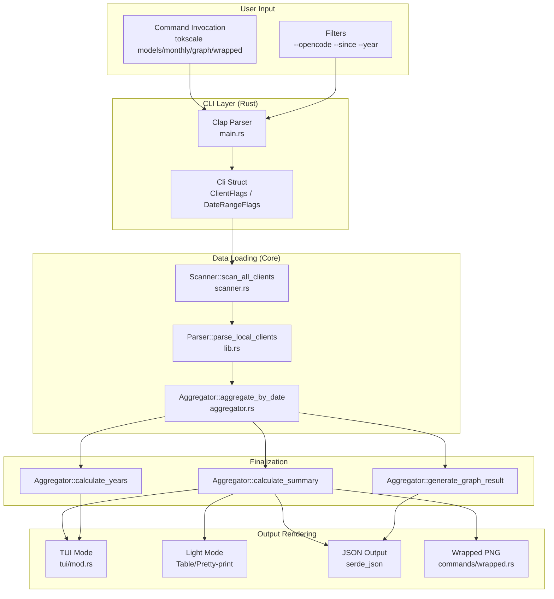

# 데이터 시각화 명령

<details>
<summary>관련 소스 파일</summary>

다음 파일들은 이 위키 페이지를 생성하는 맥락으로 사용되었습니다.

- [crates/tokscale-cli/src/commands/mod.rs](crates/tokscale-cli/src/commands/mod.rs)
- [crates/tokscale-cli/src/commands/wrapped.rs](crates/tokscale-cli/src/commands/wrapped.rs)
- [crates/tokscale-cli/src/main.rs](crates/tokscale-cli/src/main.rs)
- [crates/tokscale-cli/src/tui/client_ui.rs](crates/tokscale-cli/src/tui/client_ui.rs)
- [crates/tokscale-cli/src/tui/data/mod.rs](crates/tokscale-cli/src/tui/data/mod.rs)
- [crates/tokscale-cli/src/tui/ui/widgets.rs](crates/tokscale-cli/src/tui/ui/widgets.rs)
- [crates/tokscale-core/src/aggregator.rs](crates/tokscale-core/src/aggregator.rs)
- [crates/tokscale-core/src/clients.rs](crates/tokscale-core/src/clients.rs)
- [crates/tokscale-core/src/lib.rs](crates/tokscale-core/src/lib.rs)
- [crates/tokscale-core/src/scanner.rs](crates/tokscale-core/src/scanner.rs)
- [crates/tokscale-core/src/sessions/mod.rs](crates/tokscale-core/src/sessions/mod.rs)

</details>


## 목적과 범위

이 페이지는 사용자가 다양한 형식으로 토큰 사용량 데이터를 보고 내보낼 수 있게 해주는 Tokscale CLI의 데이터 시각화 명령을 문서화합니다. 이 명령들은 토큰 소비 패턴을 모델별, 날짜별, 기여도 그래프, 또는 연간 회고 요약 형태로 서로 다른 관점에서 제공합니다.

시각화 계층은 Rust 코어가 파싱한 원시 세션 데이터를 사람이 읽을 수 있는 보고서와 시각적 자산으로 연결합니다.

## 명령 개요

Tokscale은 네 가지 주요 시각화 명령을 제공합니다.

| 명령 | 목적 | 주요 출력 |
|---------|---------|----------------|
| `tokscale models` | AI 모델별 토큰 사용량 내역 보기 | TUI/Table/JSON |
| `tokscale monthly` | 날짜별 토큰 사용량 내역 보기 | TUI/Table/JSON |
| `tokscale graph` | 기여도 그래프 데이터 내보내기 | JSON file |
| `tokscale wrapped` | 연간 회고 이미지 생성 | PNG image |

모든 명령은 소스 필터링과 날짜 필터링을 지원하며, 로컬 세션 파일과 선택적으로 Cursor API 동기화 데이터에서 작동합니다.

출처: [crates/tokscale-cli/src/main.rs:91-156](), [crates/tokscale-cli/src/main.rs:185-196](), [crates/tokscale-cli/src/commands/wrapped.rs:44-51]()

## 명령 데이터 흐름



출처: [crates/tokscale-cli/src/main.rs:19-87](), [crates/tokscale-core/src/lib.rs:171-175](), [crates/tokscale-core/src/aggregator.rs:143-172]()

## Models 명령

### 목적

`models` 명령은 AI 모델별로 그룹화된 토큰 사용량 통계를 표시하며, 선택된 모든 데이터 소스에서 각 모델의 input/output tokens, cache usage, 추정 비용을 보여줍니다.

### 명령 구문

```bash
tokscale models [options]
```

### 옵션

| 옵션 | 설명 |
|--------|-------------|
| `--light` | TUI 대신 레거시 CLI 테이블 출력 사용 |
| `--json` | 스크립팅/자동화를 위해 JSON으로 출력 |
| `--group-by <strategy>` | 그룹화 전략: `model`, `client,model`, `client,provider,model`, `workspace,model` |
| `--write-cache` | 이 보고서의 데이터로 TUI 캐시 덮어쓰기 |
| `--benchmark` | 처리 시간 표시 |
| `--no-spinner` | 스피너 비활성화 |

출처: [crates/tokscale-cli/src/main.rs:92-126]()

### 구현 세부 사항

`models` 명령은 토큰 사용량을 어떤 버킷으로 나눌지 결정하기 위해 `GroupBy` enum을 활용합니다.

1. **옵션 파싱**: `main.rs`의 `Cli` 파서가 처리합니다 [crates/tokscale-cli/src/main.rs:19-24]().
2. **그룹화 전략**: `group_by` 인자(기본값은 `client,model`)는 `tokscale_core::GroupBy` variant로 변환됩니다 [crates/tokscale-core/src/lib.rs:100-135]().
3. **데이터 로딩**: TUI 모드에서는 `crates/tokscale-cli/src/tui/data/mod.rs`의 `DataLoader`가 `ModelUsage` struct의 비동기 가져오기와 정규화를 처리합니다 [crates/tokscale-cli/src/tui/data/mod.rs:49-58]().
4. **정규화**: 공급자 전반에서 일관된 보고를 보장하기 위해 모델 ID는 `normalize_model_for_grouping`을 통해 정규화됩니다(예: 괄호로 묶인 reasoning tier 또는 날짜 접미사 제거) [crates/tokscale-core/src/lib.rs:52-86]().

출처: [crates/tokscale-core/src/lib.rs:52-86](), [crates/tokscale-cli/src/tui/data/mod.rs:137-149]()

## Monthly 명령

### 목적

`monthly` 명령은 달력 월별로 그룹화된 토큰 사용량 통계를 표시합니다. 이름은 monthly이지만 TUI에서 시작하면 기본적으로 일별 내역 보기로 표시됩니다.

### 명령 구문

```bash
tokscale monthly [options]
```

### 구현 세부 사항

`monthly` 명령은 `models`와 동일한 필터링 플래그를 사용합니다. 주로 코어의 `aggregate_by_date` 함수와 상호작용하며, 이 함수는 `rayon`을 사용해 `UnifiedMessage` 객체를 `DailyContribution` 버킷으로 병렬 fold-reduce 집계합니다 [crates/tokscale-core/src/aggregator.rs:14-41]().

CLI의 TUI에서는 이 데이터가 `DailyUsage` struct로 매핑되며, 여기에는 `source_breakdown`(소스 이름에서 `DailySourceInfo`로 이어지는 `BTreeMap`)이 포함됩니다 [crates/tokscale-cli/src/tui/data/mod.rs:94-101]().

출처: [crates/tokscale-core/src/aggregator.rs:14-41](), [crates/tokscale-cli/src/tui/data/mod.rs:94-101]()

## Graph 명령

### 목적

`graph` 명령은 기여도 그래프 데이터를 JSON으로 내보냅니다. 이는 웹 프런트엔드의 3D 기여도 그래프나 외부 도구에서 소비되도록 설계되었습니다.

### 명령 구문

```bash
tokscale graph [--output <file>] [filters]
```

### 구현 세부 사항

`graph` 명령은 Rust 코어의 `generate_graph_result`를 트리거합니다 [crates/tokscale-core/src/aggregator.rs:144-172](). 이 함수는 다음을 수행합니다.
1. `calculate_summary`를 통해 요약 통계를 계산합니다 [crates/tokscale-core/src/aggregator.rs:61-102]().
2. `calculate_years`를 통해 전년 대비 요약을 계산합니다 [crates/tokscale-core/src/aggregator.rs:105-141]().
3. 메타데이터, 연도별 요약, `DailyContribution` 항목의 평면 목록을 포함하는 `GraphResult`를 반환합니다 [crates/tokscale-core/src/aggregator.rs:160-171]().

출처: [crates/tokscale-core/src/aggregator.rs:61-172]()

## Wrapped 명령

### 목적

`wrapped` 명령은 "Year in Review" PNG 이미지를 생성합니다. 특정 연도의 사용량 데이터를 집계하고 시각적 인포그래픽을 렌더링합니다.

### 구현 세부 사항

`wrapped` 명령은 `crates/tokscale-cli/src/commands/wrapped.rs`에 구현되어 있습니다. 전체 로컬 스캔을 수행하고, 선택적으로 Cursor 데이터를 동기화하여 `WrappedData` struct를 만듭니다 [crates/tokscale-cli/src/commands/wrapped.rs:54-65]().

**시각적 구성 요소**:
- **기여도 그래프**: `imageproc`와 `ab_glyph`를 사용하여 GitHub 스타일 그리드를 렌더링합니다 [crates/tokscale-cli/src/commands/wrapped.rs:2-7]().
- **Agent 순위**: `--include-agents`가 설정되면 OpenCode agent 데이터를 구체적으로 찾아보며, `normalize_opencode_agent_name`을 사용해 "sisyphus" 같은 이름을 "Sisyphus"로 정규화합니다 [crates/tokscale-core/src/sessions/mod.rs:83-95]().
- **색상 테마**: Tokscale 브랜드에 맞추기 위해 서로 다른 기여도 "levels"(Grade 0부터 Grade 4까지)에 하드코딩된 RGBA 값을 사용합니다 [crates/tokscale-cli/src/commands/wrapped.rs:33-40]().

출처: [crates/tokscale-cli/src/commands/wrapped.rs:105-158](), [crates/tokscale-core/src/sessions/mod.rs:83-95]()

## 공통 시각 요소

### 모델과 Provider 색상 지정

CLI TUI와 Wrapped 명령은 provider를 기준으로 모델에 색상을 할당하는 로직을 공유합니다.

| Provider | 기본 색상(HEX) | 팔레트 참조 |
|----------|------------------|-------------------|
| Anthropic | #DA7756 | `ANTHROPIC_SHADES` |
| OpenAI | #10B981 | `OPENAI_SHADES` |
| Google | #3B82F6 | `GOOGLE_SHADES` |
| DeepSeek | #06B6D4 | `DEEPSEEK_SHADES` |
| Meta | #6366F1 | `META_SHADES` |

`get_provider_shade` 함수는 이러한 기본 색상에서 흰색 방향으로 보간하여 7단계 단색 팔레트를 도출하며, UI가 같은 provider의 서로 다른 모델을 순위/사용량에 따라 시각적으로 구분할 수 있게 합니다 [crates/tokscale-cli/src/tui/ui/widgets.rs:69-106]().

출처: [crates/tokscale-cli/src/tui/ui/widgets.rs:108-176]()

### 토큰 형식 지정

토큰 수는 `format_tokens_compact`를 사용해 모든 시각화 명령에서 읽기 쉽게 형식화됩니다.
- **십억 단위**: `1.2B`
- **백만 단위**: `450.5M`
- **천 단위**: `15K`
- **작은 값**: `1,234`(쉼표 포함)

출처: [crates/tokscale-cli/src/tui/ui/widgets.rs:7-17]()

### 캐시 적중률

`models`와 `monthly` 보기에서 표시되는 고유한 지표는 **Cache Reuse Multiplier**입니다. 이는 `cache_read / (input + cache_write)`로 계산되며, 정가로 지불한 토큰 하나당 얼마나 많은 저비용 읽기를 얻었는지를 나타냅니다 [crates/tokscale-cli/src/tui/ui/widgets.rs:49-60]().

출처: [crates/tokscale-cli/src/tui/ui/widgets.rs:49-60]()
