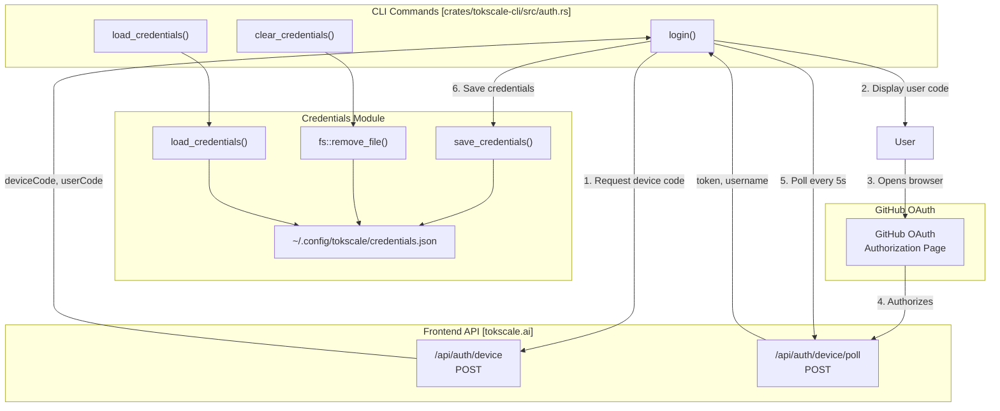

# 소셜 플랫폼 명령

<details>
<summary>관련 소스 파일</summary>

다음 파일들은 이 위키 페이지를 생성하는 맥락으로 사용되었습니다.

- [Cargo.lock](Cargo.lock)
- [crates/tokscale-cli/Cargo.toml](crates/tokscale-cli/Cargo.toml)
- [crates/tokscale-cli/src/auth.rs](crates/tokscale-cli/src/auth.rs)
- [crates/tokscale-cli/src/commands/wrapped.rs](crates/tokscale-cli/src/commands/wrapped.rs)
- [crates/tokscale-cli/src/cursor.rs](crates/tokscale-cli/src/cursor.rs)
- [crates/tokscale-cli/src/main.rs](crates/tokscale-cli/src/main.rs)
- [crates/tokscale-cli/src/tui/client_ui.rs](crates/tokscale-cli/src/tui/client_ui.rs)
- [crates/tokscale-cli/src/tui/data/mod.rs](crates/tokscale-cli/src/tui/data/mod.rs)
- [crates/tokscale-cli/src/tui/ui/widgets.rs](crates/tokscale-cli/src/tui/ui/widgets.rs)
- [crates/tokscale-core/Cargo.toml](crates/tokscale-core/Cargo.toml)
- [crates/tokscale-core/src/aggregator.rs](crates/tokscale-core/src/aggregator.rs)
- [crates/tokscale-core/src/clients.rs](crates/tokscale-core/src/clients.rs)
- [crates/tokscale-core/src/lib.rs](crates/tokscale-core/src/lib.rs)
- [crates/tokscale-core/src/scanner.rs](crates/tokscale-core/src/scanner.rs)
- [crates/tokscale-core/src/sessions/mod.rs](crates/tokscale-core/src/sessions/mod.rs)

</details>


이 페이지는 사용자가 tokscale.ai 소셜 플랫폼과 상호작용할 수 있게 해주는 인증 및 데이터 제출 명령을 문서화합니다. 이 명령을 통해 사용자는 GitHub OAuth로 인증하고, 로그인 상태를 확인하며, **로컬 토큰 사용량 데이터를 공개 리더보드에 제출**할 수 있습니다.

## 개요

소셜 플랫폼 명령은 네 가지 주요 작업을 제공합니다.

| 명령 | 목적 | 인증 필요 여부 |
|---------|---------|------------------------|
| `tokscale login` | device flow를 사용해 GitHub OAuth로 인증 | 아니요 |
| `tokscale logout` | 디스크에서 저장된 자격 증명 제거 | 예 |
| `tokscale whoami` | 현재 인증된 사용자 정보 표시 | 예 |
| `tokscale submit` | 로컬 사용량 데이터를 tokscale.ai 리더보드에 제출 | 예 |

모든 인증 상태는 제한된 파일 권한(0600)으로 `~/.config/tokscale/credentials.json`에 로컬 저장됩니다.

**출처:** [crates/tokscale-cli/src/main.rs:172-183](), [crates/tokscale-cli/src/main.rs:204-215](), [crates/tokscale-cli/src/auth.rs:72-114]()

## 인증 아키텍처



**다이어그램: Device Flow 인증 프로세스**

인증 시스템은 CLI 애플리케이션에 최적화된 OAuth 2.0 Device Authorization Grant flow를 구현합니다.

**출처:** [crates/tokscale-cli/src/auth.rs:219-270](), [crates/tokscale-cli/src/auth.rs:90-114]()

## Login 명령

### 명령 구문

```bash
tokscale login [--token <existing-token>]
```

login 명령은 device flow 인증을 시작합니다. 또는 `--token` 플래그를 사용해 기존 API 토큰을 직접 저장할 수 있습니다.

**출처:** [crates/tokscale-cli/src/main.rs:173-179]()

### Device Flow 구현

device flow는 다음 단계로 진행됩니다.

1. **Device Code 요청**: 장치 이름(예: "CLI on hostname")과 함께 `/api/auth/device`로 POST합니다. [crates/tokscale-cli/src/auth.rs:243-249]()
2. **User Code 표시**: 검증 URL과 사용자 코드를 보여줍니다. [crates/tokscale-cli/src/auth.rs:257-266]()
3. **브라우저 시작**: `open_browser()`를 사용해 URL을 자동으로 열려고 시도합니다. [crates/tokscale-cli/src/auth.rs:189-217]()
4. **Poll Loop**: 서버가 제공한 간격에 따라 `/api/auth/device/poll`을 폴링합니다. [crates/tokscale-cli/src/auth.rs:271-315]()
5. **자격 증명 저장**: `Credentials` struct(token, username, avatar)를 디스크에 저장합니다. [crates/tokscale-cli/src/auth.rs:90-114]()

### 자격 증명 저장 형식

자격 증명은 `~/.config/tokscale/credentials.json`에 JSON으로 저장됩니다.

```rust
pub struct Credentials {
    pub token: String,
    pub username: String,
    pub avatar_url: Option<String>,
    pub created_at: String,
}
```

이 파일은 Unix 시스템에서 mode `0o600`으로 생성됩니다.

**출처:** [crates/tokscale-cli/src/auth.rs:14-22](), [crates/tokscale-cli/src/auth.rs:95-106]()

## Logout과 Whoami

### Logout
`logout` 명령은 `clear_credentials()`를 호출하며, 이 함수는 `credentials.json` 파일을 삭제합니다.

**출처:** [crates/tokscale-cli/src/auth.rs:152-160]()

### Whoami
`whoami` 명령은 `load_credentials()`를 호출하고 인증된 사용자 이름과 세션 생성 날짜를 표시합니다.

**출처:** [crates/tokscale-cli/src/auth.rs:116-124](), [crates/tokscale-cli/src/auth.rs:356-370]()

## Submit 명령

### 명령 구문

```bash
tokscale submit [filters] [--dry-run]
```

`submit` 명령은 로컬 사용량 데이터를 집계하여 tokscale.ai 리더보드로 전송합니다.

### 제출 데이터 흐름

```mermaid
sequenceDiagram
    participant User
    participant Main["main.rs::Commands::Submit"]
    participant Auth["auth.rs::resolve_api_token"]
    participant Scanner["scanner.rs::scan_all_clients"]
    participant Parser["parser.rs::parse_local_unified_messages"]
    participant Cursor["cursor.rs::sync_cursor_cache"]
    participant API["POST /api/submit"]
    
    User->>Main: tokscale submit
    Main->>Auth: resolve_api_token()
    Auth-->>Main: ApiTokenAuth
    
    rect rgb(240, 240, 240)
    Note over Main, Parser: Data Collection Phase
    Main->>Scanner: scan_all_clients()
    Main->>Cursor: sync_cursor_cache() (if enabled)
    Main->>Parser: parse_local_unified_messages()
    end
    
    Main->>User: Display summary (tokens, cost, sources)
    
    opt Not dry-run
        Main->>API: POST with Bearer token
        API-->>Main: Success/Error
    end
```

**다이어그램: Submit 명령 데이터 흐름**

**출처:** [crates/tokscale-cli/src/main.rs:204-215](), [crates/tokscale-core/src/parser.rs:23-50](), [crates/tokscale-cli/src/cursor.rs:230-260]()

### 인증 해석
이 명령은 먼저 `TOKSCALE_API_TOKEN` 환경 변수에서 토큰을 로드하려고 시도합니다. 없으면 저장된 `credentials.json`으로 폴백합니다.

**출처:** [crates/tokscale-cli/src/auth.rs:136-150]()

### 데이터 수집
이 명령은 `tokscale-core` 스캐너와 파서를 사용해 지원되는 클라이언트(OpenCode, Claude, Codex 등)의 메시지를 집계합니다. `cursor` 클라이언트가 포함된 경우 Cursor의 dashboard API와 동기화를 트리거하여 로컬 CSV 캐시를 업데이트합니다.

**출처:** [crates/tokscale-core/src/scanner.rs:59-77](), [crates/tokscale-cli/src/cursor.rs:230-260]()

### 요약과 제출
전송하기 전에 CLI는 다음을 포함한 요약을 표시합니다.
- 총 토큰과 추정 비용.
- 활성 날짜와 날짜 범위.
- 포함된 소스의 내역.

`--dry-run`이 설정되지 않은 경우 데이터는 직렬화되어 API 기본 URL(기본값: `https://tokscale.ai`)로 POST됩니다.

**출처:** [crates/tokscale-cli/src/auth.rs:162-164](), [crates/tokscale-cli/src/main.rs:210-214]()
