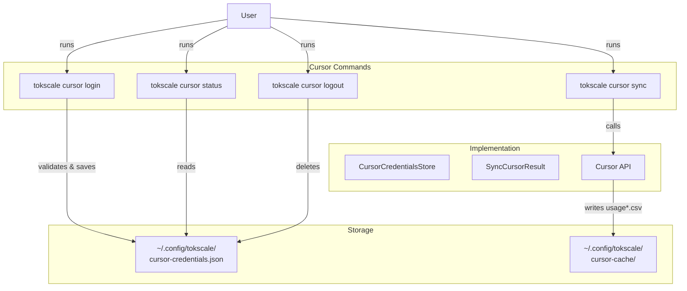
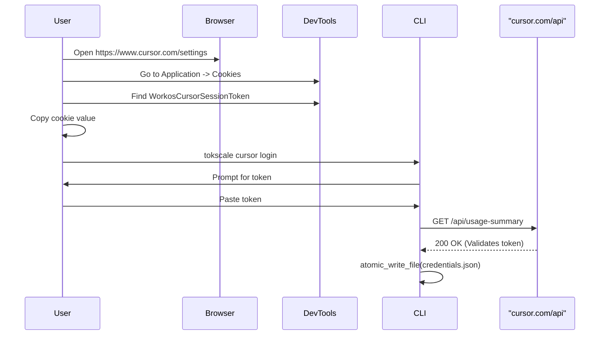
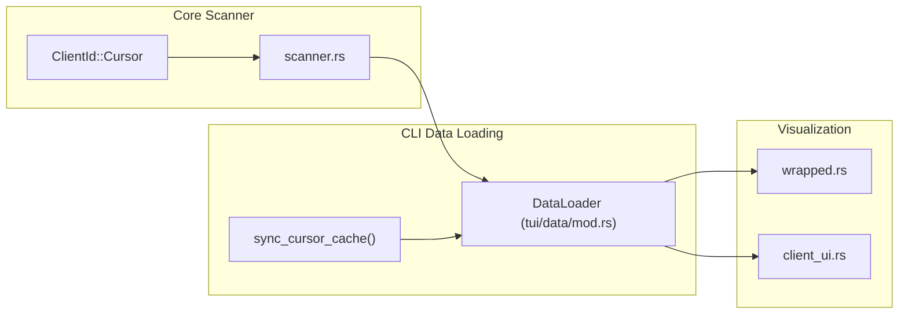

# Cursor IDE 통합

관련 소스 파일

다음 파일들은 이 위키 페이지를 생성하는 맥락으로 사용되었습니다.

- [Cargo.lock](Cargo.lock)
- [crates/tokscale-cli/Cargo.toml](crates/tokscale-cli/Cargo.toml)
- [crates/tokscale-cli/src/auth.rs](crates/tokscale-cli/src/auth.rs)
- [crates/tokscale-cli/src/commands/wrapped.rs](crates/tokscale-cli/src/commands/wrapped.rs)
- [crates/tokscale-cli/src/cursor.rs](crates/tokscale-cli/src/cursor.rs)
- [crates/tokscale-cli/src/main.rs](crates/tokscale-cli/src/main.rs)
- [crates/tokscale-cli/src/tui/client_ui.rs](crates/tokscale-cli/src/tui/client_ui.rs)
- [crates/tokscale-cli/src/tui/data/mod.rs](crates/tokscale-cli/src/tui/data/mod.rs)
- [crates/tokscale-cli/src/tui/ui/widgets.rs](crates/tokscale-cli/src/tui/ui/widgets.rs)
- [crates/tokscale-core/Cargo.toml](crates/tokscale-core/Cargo.toml)
- [crates/tokscale-core/src/aggregator.rs](crates/tokscale-core/src/aggregator.rs)
- [crates/tokscale-core/src/clients.rs](crates/tokscale-core/src/clients.rs)
- [crates/tokscale-core/src/lib.rs](crates/tokscale-core/src/lib.rs)
- [crates/tokscale-core/src/scanner.rs](crates/tokscale-core/src/scanner.rs)
- [crates/tokscale-core/src/sessions/mod.rs](crates/tokscale-core/src/sessions/mod.rs)

## 목적과 범위

이 문서는 Tokscale의 Cursor IDE 통합 하위 시스템을 설명합니다. 세션 파일을 디스크에서 직접 읽는 다른 지원 플랫폼(OpenCode, Claude Code, Codex, Gemini, Amp, Droid)과 달리, Cursor 통합은 인증된 API 요청을 통해 사용량 데이터를 가져오고 이를 통합 CSV 형식으로 로컬에 캐시합니다.

소셜 플랫폼 로그인(GitHub OAuth)에 대한 정보는 [Social Platform Commands](#3.2.2)를 참조하세요. Cursor 데이터가 다른 소스와 함께 파싱되고 집계되는 방식에 대한 자세한 내용은 [Session Parsing and Data Sources](#3.4.2)를 참조하세요.

---

## 인증 모델

Cursor IDE는 Tokscale 소셜 플랫폼 로그인과 **별도의 인증**을 요구합니다. Cursor 데이터는 로컬 파일시스템 파싱이 아니라 Cursor의 독점 API를 통해 접근되기 때문입니다.

### 소셜 플랫폼 인증과의 주요 차이점

| 측면 | 소셜 플랫폼(`tokscale login`) | Cursor 통합(`tokscale cursor login`) |
|--------|-----------------------------------|---------------------------------------------|
| **목적** | tokscale.ai 리더보드에 데이터 제출 | Cursor API에서 사용량 데이터 가져오기 |
| **인증 방식** | GitHub OAuth device flow | 브라우저의 수동 세션 토큰 |
| **토큰 저장소** | `~/.config/tokscale/credentials.json` | `~/.config/tokscale/cursor-credentials.json` |
| **토큰 유형** | Tokscale API token | Cursor `WorkosCursorSessionToken` cookie |
| **범위** | 보고서 업로드, 프로필 보기 | 읽기 전용 사용량 데이터 |

**보안 경고**: Cursor 세션 토큰은 사용자의 Cursor 계정에 대한 전체 접근 권한을 부여합니다. 비밀번호처럼 취급해야 합니다. Tokscale은 이를 제한된 파일 권한(Unix에서 0o600)으로 로컬에 저장합니다 [crates/tokscale-cli/src/cursor.rs:187]().

출처: [crates/tokscale-cli/src/auth.rs:73](), [crates/tokscale-cli/src/cursor.rs:33-35](), [crates/tokscale-cli/src/cursor.rs:187]()

---

## 명령 참조

Cursor 통합은 CLI의 `cursor` 하위 명령을 통해 관리됩니다 [crates/tokscale-cli/src/main.rs:232-247]().

출처: [crates/tokscale-cli/src/main.rs:232-247](), [crates/tokscale-cli/src/cursor.rs:68-73](), [crates/tokscale-cli/src/cursor.rs:161-218]()

### `tokscale cursor login`

세션 토큰 입력을 요청하여 Cursor로 인증합니다. 이 명령은 `CursorCredentialsStore` struct를 통해 다중 계정 관리를 지원합니다 [crates/tokscale-cli/src/cursor.rs:68-73]().

### `tokscale cursor status`

인증 상태와 세션 유효성을 확인합니다. 활성 및 비활성 계정을 보여주는 `AccountInfo` 목록을 반환합니다 [crates/tokscale-cli/src/cursor.rs:75-86]().

### `tokscale cursor logout`

저장된 Cursor 자격 증명을 제거합니다. CLI는 `get_cursor_credentials_path()`가 반환하는 경로의 파일을 제거하는 `clear_cursor_credentials` 함수를 제공합니다 [crates/tokscale-cli/src/cursor.rs:95-97]().

---

## 세션 토큰 획득

Cursor 세션 토큰은 브라우저의 Developer Tools에서 수동으로 추출해야 하는 브라우저 cookie(`WorkosCursorSessionToken`)입니다.

출처: [crates/tokscale-cli/src/cursor.rs:51](), [crates/tokscale-cli/src/cursor.rs:130-151](), [crates/tokscale-cli/src/cursor.rs:161-218]()

---

## 데이터 동기화 프로세스

Cursor 사용량 데이터는 Cursor API에서 가져와 로컬에 캐시됩니다. CLI는 브라우저를 모방하기 위한 특정 timeout과 header 집합으로 `reqwest`를 사용합니다 [crates/tokscale-cli/src/cursor.rs:14-27]().

### 동기화 동작

**자동 동기화 트리거**:
캐시된 `usage.csv`가 5분(`CURSOR_AUTO_SYNC_FRESHNESS`)보다 오래된 경우 CLI는 암시적 보고 전 동기화를 수행합니다 [crates/tokscale-cli/src/cursor.rs:20](). 이를 통해 TUI나 `models` 명령의 보고서가 중복 API 호출 없이 최신 상태를 유지합니다.

**구현 세부 사항**:
- **Endpoints**: 데이터에 `/api/dashboard/export-usage-events-csv?strategy=tokens`를 사용합니다 [crates/tokscale-cli/src/cursor.rs:49-50]().
- **Headers**: `User-Agent`(Chrome/macOS), `Referer`, `Cookie` header를 포함합니다 [crates/tokscale-cli/src/cursor.rs:130-151]().
- **Atomic Writes**: 임시 파일과 `fs::rename`(또는 copy fallback)을 사용하여 동기화 중 캐시가 손상되지 않도록 보장합니다 [crates/tokscale-cli/src/cursor.rs:161-218]().

출처: [crates/tokscale-cli/src/cursor.rs:14-20](), [crates/tokscale-cli/src/cursor.rs:49-51](), [crates/tokscale-cli/src/cursor.rs:130-151](), [crates/tokscale-cli/src/cursor.rs:161-218]()

### 캐시 구조

**위치**: `~/.config/tokscale/cursor-cache/` [crates/tokscale-cli/src/cursor.rs:41-43]().

캐시 디렉터리는 `usage` 접두사가 붙은 CSV 파일에 사용량 데이터를 저장합니다 [crates/tokscale-core/src/clients.rs:202]().

| 구성 요소 | 파일/경로 |
|-----------|-----------|
| **Credentials** | `~/.config/tokscale/cursor-credentials.json` |
| **Usage Cache** | `~/.config/tokscale/cursor-cache/usage-[hash].csv` |

출처: [crates/tokscale-cli/src/cursor.rs:33-43](), [crates/tokscale-core/src/clients.rs:198-206]()

---

## Core 및 TUI와의 통합

Cursor는 core crate에서 인덱스 `3`의 `ClientId`로 정의됩니다 [crates/tokscale-core/src/clients.rs:198]().

### 데이터 흐름에서의 구현

**주요 코드 엔티티**:
- `ClientId::Cursor`: Cursor를 식별하는 enum variant입니다 [crates/tokscale-core/src/clients.rs:198]().
- `sync_cursor_cache()`: 로컬 데이터를 가져오고 업데이트하는 기본 함수입니다 [crates/tokscale-cli/src/cursor.rs:89-93]().
- `CURSOR_SHADES`: TUI에서 Cursor에 사용되는 색상 팔레트입니다 [crates/tokscale-cli/src/tui/ui/widgets.rs:168-176]().
- `hotkey: '4'`: Cursor 보기를 위한 기본 TUI 단축키입니다 [crates/tokscale-cli/src/tui/client_ui.rs:21-24]().

출처: [crates/tokscale-core/src/clients.rs:198-206](), [crates/tokscale-cli/src/tui/client_ui.rs:21-24](), [crates/tokscale-cli/src/tui/ui/widgets.rs:168-176](), [crates/tokscale-cli/src/commands/wrapped.rs:176-182]()

### Wrapped 보고서
`wrapped` 명령은 구체적으로 `cursor::has_cursor_usage_cache()`를 확인하고 연말 요약을 생성하기 전에 동기화를 시도합니다 [crates/tokscale-cli/src/commands/wrapped.rs:176-182](). 동기화가 실패하면 오프라인에서도 보고서를 계속 생성할 수 있도록 캐시된 데이터로 폴백합니다 [crates/tokscale-cli/src/commands/wrapped.rs:185-194]().

출처: [crates/tokscale-cli/src/commands/wrapped.rs:176-204]()
