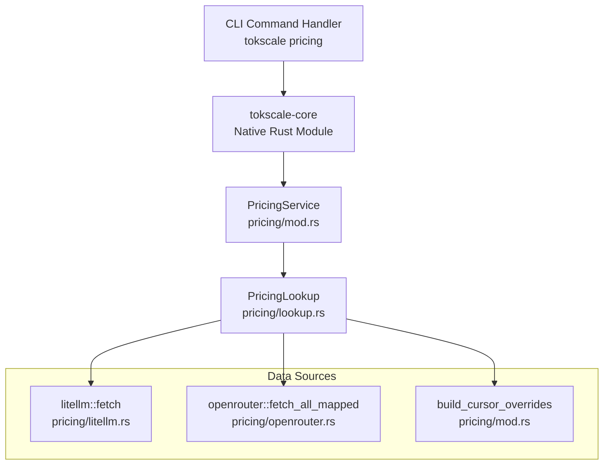
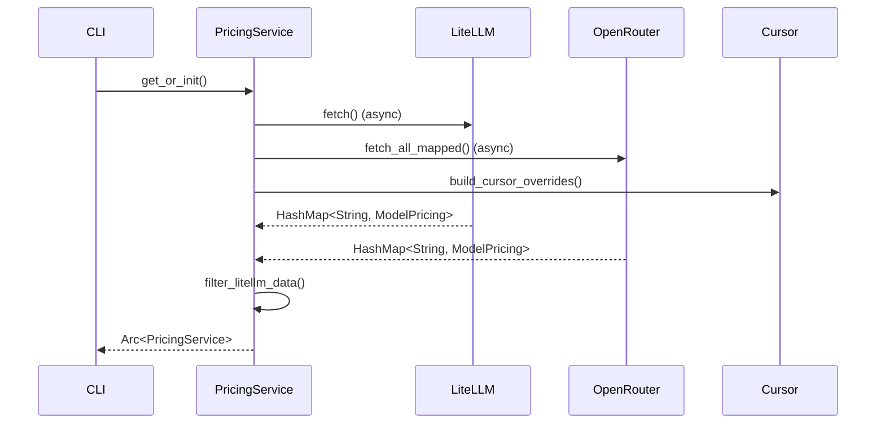
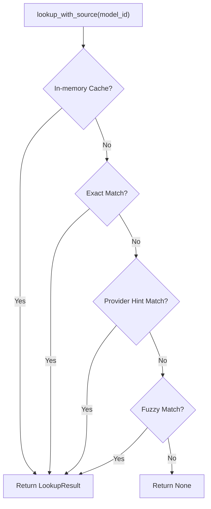

# 가격 조회

<details>
<summary>관련 소스 파일</summary>

다음 파일들은 이 위키 페이지를 생성하는 맥락으로 사용되었습니다.

- [README.ja.md](README.ja.md)
- [README.ko.md](README.ko.md)
- [README.md](README.md)
- [README.zh-cn.md](README.zh-cn.md)
- [crates/tokscale-cli/src/antigravity.rs](crates/tokscale-cli/src/antigravity.rs)
- [crates/tokscale-cli/src/paths.rs](crates/tokscale-cli/src/paths.rs)
- [crates/tokscale-core/src/pricing/litellm.rs](crates/tokscale-core/src/pricing/litellm.rs)
- [crates/tokscale-core/src/pricing/lookup.rs](crates/tokscale-core/src/pricing/lookup.rs)
- [crates/tokscale-core/src/pricing/mod.rs](crates/tokscale-core/src/pricing/mod.rs)
- [crates/tokscale-core/src/pricing/openrouter.rs](crates/tokscale-core/src/pricing/openrouter.rs)
- [crates/tokscale-core/src/provider_identity.rs](crates/tokscale-core/src/provider_identity.rs)

</details>


## 목적과 범위

가격 조회 명령(`tokscale pricing <model-id>`)은 **LiteLLM 및 OpenRouter API에서 실시간 모델 가격 정보를 질의하는 CLI 인터페이스를 제공**합니다. 이 명령을 통해 사용자는 **특정 AI 모델을 사용하기 전에 비용을 확인할 수 있으며, 비용 추정과 예산 계획에 도움**이 됩니다.

이 페이지는 사용자에게 노출되는 pricing 명령만 다룹니다. 보고서 생성과 비용 계산 중 사용되는 내부 pricing 시스템에 대한 정보는 Native Rust Core 문서를 참조하세요.

출처: [crates/tokscale-core/src/pricing/lookup.rs:81-100](), [crates/tokscale-core/src/pricing/mod.rs:158-186]()

## 명령 구문

pricing 명령은 모델 식별자와 선택적 플래그를 받습니다.

```bash
tokscale pricing <model-id> [options]
```

### 옵션

| 옵션 | 설명 | 기본값 |
|--------|-------------|---------|
| `--json` | 사람이 읽을 수 있는 형식 대신 JSON으로 결과 출력 | false |
| `--provider <source>` | 가격 소스 강제 지정: `litellm` 또는 `openrouter` | auto-select |
| `--no-spinner` | 스크립팅 용도로 로딩 스피너 비활성화 | false |

### 사용 예시

```bash
# Basic lookup with human-readable output
tokscale pricing "gpt-4o"

# Force LiteLLM as pricing source
tokscale pricing "claude-3-opus" --provider litellm

# JSON output for scripting
tokscale pricing "gemini-pro" --json
```

출처: [crates/tokscale-core/src/pricing/mod.rs:140-156]()

## 아키텍처 개요



**그림 1: Pricing Lookup 명령 아키텍처**

가격 조회 명령은 CLI에서 네이티브 Rust 코어를 거쳐 `PricingService`로 흐르며, `PricingService`는 LiteLLM, OpenRouter, 내부 Cursor override를 참조합니다.

출처: [crates/tokscale-core/src/pricing/mod.rs:24-40](), [crates/tokscale-core/src/pricing/lookup.rs:81-94]()

## 구현 세부 사항

### PricingService 초기화

`PricingService`는 `OnceCell`을 사용하는 지연 초기화 패턴을 따르며, 데이터셋이 필요할 때만 가져와지고 프로세스 전반에서 공유되도록 보장합니다.



**그림 2: Pricing Service 초기화 흐름**

서비스는 초기화 중 `github_copilot/` 같은 구독 기반 항목을 필터링합니다. 이러한 항목의 $0.00 가격은 토큰당 비용 추정에 유용하지 않기 때문입니다.

출처: [crates/tokscale-core/src/pricing/mod.rs:16-22](), [crates/tokscale-core/src/pricing/mod.rs:102-110](), [crates/tokscale-core/src/pricing/mod.rs:46-56]()

### Cursor Overrides

Tokscale은 Cursor의 사용자 지정 모델처럼 upstream LiteLLM/OpenRouter 데이터셋에 아직 없는 모델에 대해 하드코딩된 가격을 포함합니다.

| 모델 ID | Input(1M당) | Output(1M당) | Cache Read(1M당) |
|----------|----------------|-----------------|---------------------|
| `gpt-5.3` | $1.75 | $14.00 | $0.175 |
| `composer-2` | $0.50 | $2.50 | $0.20 |
| `composer-2-fast` | $1.50 | $7.50 | $0.35 |

출처: [crates/tokscale-core/src/pricing/mod.rs:62-84]()

## 조회 알고리즘

`PricingLookup` struct는 모델 ID를 가격 데이터와 매칭하기 위한 다단계 해석 전략을 구현합니다.

### 1. 키 정규화
조회 전에 모델 ID는 이름 변형을 처리하기 위해 정규화됩니다.
- **Provider Tags**: `openrouter/google/gemini-pro` 같은 중첩 세그먼트를 처리하기 위해 `provider_tags`와 `key_provider_tags`를 사용해 추출됩니다.
- **Canonicalization**: `x-ai`와 `xai` 같은 provider는 하나의 정규 tag로 매핑됩니다.

출처: [crates/tokscale-core/src/provider_identity.rs:36-55](), [crates/tokscale-core/src/provider_identity.rs:58-81]()

### 2. 조회 전략
조회 알고리즘은 소스의 우선순위를 정하고 tier 기반 가격(예: 128k 토큰 초과 prompt에 대한 더 높은 비용)을 처리합니다.



**그림 3: 다단계 조회 로직**

출처: [crates/tokscale-core/src/pricing/lookup.rs:168-190](), [crates/tokscale-core/src/pricing/lookup.rs:215-240]()

### 3. Provider 순위 지정
여러 소스(LiteLLM과 OpenRouter)가 같은 모델의 데이터를 제공하는 경우 Tokscale은 순위 시스템을 사용합니다.
- **원 Provider**: 직접 provider(예: `openai/`)가 리셀러보다 우선됩니다.
- **리셀러**: `azure/` 또는 `together/` 같은 서비스는 원 제작자보다 낮은 순위를 받습니다.

출처: [crates/tokscale-core/src/pricing/lookup.rs:19-45](), [crates/tokscale-core/src/pricing/lookup.rs:261-285]()

## 데이터 소스

### LiteLLM
LiteLLM은 모델 가격의 대규모 JSON 데이터셋을 제공합니다. Tokscale은 BerriAI GitHub 저장소에서 이를 가져와 로컬에 캐시합니다.
- **URL**: `https://raw.githubusercontent.com/BerriAI/litellm/main/model_prices_and_context_window.json`
- **Cache File**: `pricing-litellm.json`

출처: [crates/tokscale-core/src/pricing/litellm.rs:5-7]()

### OpenRouter
OpenRouter 데이터는 두 단계로 가져옵니다.
1. **Model List**: `https://openrouter.ai/api/v1/models`에서 **사용 가능한 모든 모델을 가져옵**니다.
2. **Author Pricing**: 각 모델에 대해 Tokscale은 정확성을 보장하기 위해 "author" 가격(직접 provider 비용)을 가져오려고 시도합니다.

출처: [crates/tokscale-core/src/pricing/openrouter.rs:8-12](), [crates/tokscale-core/src/pricing/openrouter.rs:179-210]()

## 캐싱과 성능

### 조회 캐시
반복 조회 속도를 높이기 위해 `PricingLookup`은 결과의 내부 `RwLock<HashMap>` 캐시를 유지합니다.
- **Max Entries**: 512 entries.
- **Eviction**: 캐시가 가득 차면 "thundering herd" miss를 피하기 위해 항목의 약 25%를 제거합니다.

출처: [crates/tokscale-core/src/pricing/lookup.rs:49](), [crates/tokscale-core/src/pricing/lookup.rs:194-213]()

### Tiered Pricing 지원
모델 가격 데이터에 tier가 포함되어 있는 경우 시스템은 context window 임계값(128k, 200k, 256k, 272k tokens)을 기준으로 비용을 계산합니다.

출처: [crates/tokscale-core/src/pricing/lookup.rs:50-53](), [crates/tokscale-core/src/pricing/litellm.rs:12-28]()
