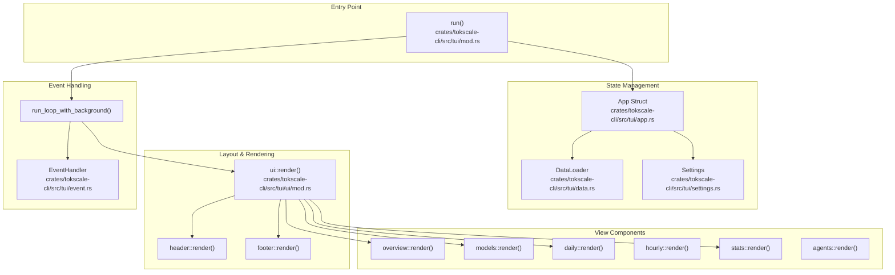
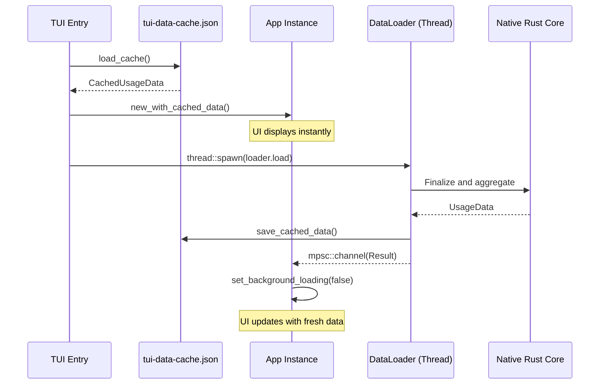

# 터미널 UI(TUI)

관련 소스 파일

다음 파일들은 이 위키 페이지를 생성하는 맥락으로 사용되었습니다.

- [crates/tokscale-cli/src/tui/app.rs](crates/tokscale-cli/src/tui/app.rs)
- [crates/tokscale-cli/src/tui/cache.rs](crates/tokscale-cli/src/tui/cache.rs)
- [crates/tokscale-cli/src/tui/mod.rs](crates/tokscale-cli/src/tui/mod.rs)
- [crates/tokscale-cli/src/tui/settings.rs](crates/tokscale-cli/src/tui/settings.rs)
- [crates/tokscale-cli/src/tui/ui/daily.rs](crates/tokscale-cli/src/tui/ui/daily.rs)
- [crates/tokscale-cli/src/tui/ui/footer.rs](crates/tokscale-cli/src/tui/ui/footer.rs)
- [crates/tokscale-cli/src/tui/ui/hourly.rs](crates/tokscale-cli/src/tui/ui/hourly.rs)
- [crates/tokscale-cli/src/tui/ui/mod.rs](crates/tokscale-cli/src/tui/ui/mod.rs)
- [crates/tokscale-cli/src/tui/ui/models.rs](crates/tokscale-cli/src/tui/ui/models.rs)
- [crates/tokscale-cli/src/tui/ui/overview.rs](crates/tokscale-cli/src/tui/ui/overview.rs)
- [crates/tokscale-cli/src/tui/ui/stats.rs](crates/tokscale-cli/src/tui/ui/stats.rs)
- [crates/tokscale-core/src/pricing/cache.rs](crates/tokscale-core/src/pricing/cache.rs)

터미널 UI(TUI)는 AI 토큰 사용량 데이터를 실시간으로 시각화하는 Tokscale CLI의 대화형 대시보드 모드입니다. 정적 테이블 출력을 전체 화면 반응형 인터페이스로 대체하며, 여러 탐색 가능한 보기, 키보드/마우스 컨트롤, `ratatui`와 네이티브 Rust 코어가 구동하는 고성능 렌더링을 제공합니다 [crates/tokscale-cli/src/tui/mod.rs:40]().

CLI 명령 구조와 TUI 실행 방법에 대한 정보는 [Commands Reference](#3.2)를 참조하세요. 데이터 처리를 구동하는 네이티브 Rust 코어에 대한 자세한 내용은 [Native Rust Core](#3.4)를 참조하세요.

## 아키텍처 개요

TUI는 터미널 그리기에 `ratatui` crate를 사용하고 백엔드 이벤트 처리에 `crossterm`을 사용해 만들어졌습니다 [crates/tokscale-cli/src/tui/mod.rs:33-40](). 아키텍처는 전역 상태, 탭 간 라우팅, 백그라운드 데이터 로딩을 관리하는 `App` struct를 중심으로 합니다 [crates/tokscale-cli/src/tui/app.rs:139-192]().

**출처:** [crates/tokscale-cli/src/tui/mod.rs:55-191](), [crates/tokscale-cli/src/tui/app.rs:139-192](), [crates/tokscale-cli/src/tui/ui/mod.rs:20-60]()

### 구성 요소 계층

TUI는 `Tab` enum으로 정의된 탭 기반 탐색 시스템을 사용합니다 [crates/tokscale-cli/src/tui/app.rs:33-41](). `App` struct는 `current_tab`을 추적하고 `ui::render` 함수를 통해 렌더링을 조율합니다 [crates/tokscale-cli/src/tui/ui/mod.rs:45-52]().

| 구성 요소 | 파일 | 목적 |
|-----------|------|---------|
| `App` | [crates/tokscale-cli/src/tui/app.rs]() | 루트 상태 컨테이너(탭, 정렬, 필터, 스크롤) |
| `Header` | [crates/tokscale-cli/src/tui/ui/header.rs]() | 탭 탐색 바와 현재 제목 렌더링 |
| `Overview` | [crates/tokscale-cli/src/tui/ui/overview.rs]() | 누적 막대 차트와 상위 모델 목록 |
| `Models` | [crates/tokscale-cli/src/tui/ui/models.rs]() | 모델별 사용량 세부 정보의 정렬 가능한 테이블 |
| `Daily` | [crates/tokscale-cli/src/tui/ui/daily.rs]() | 날짜별로 그룹화된 사용량을 보여주는 테이블 |
| `Hourly` | [crates/tokscale-cli/src/tui/ui/hourly.rs]() | 시간대별 사용량의 테이블 또는 프로필 보기 |
| `Stats` | [crates/tokscale-cli/src/tui/ui/stats.rs]() | GitHub 스타일 기여도 그래프와 통계 내역 |
| `Footer` | [crates/tokscale-cli/src/tui/ui/footer.rs]() | 전역 합계, 정렬 표시기, 키보드 도움말 |

**출처:** [crates/tokscale-cli/src/tui/app.rs:33-53](), [crates/tokscale-cli/src/tui/ui/mod.rs:45-52]()

## 데이터 로딩과 캐싱

즉시 시작을 보장하기 위해 TUI는 디스크 기반 캐싱 메커니즘을 구현합니다. 실행 직후 캐시된 데이터를 즉시 로드하고, 네이티브 Rust 코어에서 새 데이터를 가져오기 위해 백그라운드 스레드를 생성합니다 [crates/tokscale-cli/src/tui/mod.rs:98-167]().

**출처:** [crates/tokscale-cli/src/tui/cache.rs:1-60](), [crates/tokscale-cli/src/tui/mod.rs:138-167]()

### 상태 지속성

TUI는 사용자 환경설정(테마, 자동 새로고침, 스캐너 경로)을 `settings.json` 파일에 유지합니다 [crates/tokscale-cli/src/tui/settings.rs:31-64]().
- **Path:** `~/.config/tokscale/settings.json` [crates/tokscale-cli/src/tui/settings.rs:134-142]().
- **Default Theme:** "blue" [crates/tokscale-cli/src/tui/settings.rs:85-87]().
- **Auto-Refresh:** 30초에서 1시간 사이의 구성 가능한 간격 [crates/tokscale-cli/src/tui/settings.rs:11-13]().

**출처:** [crates/tokscale-cli/src/tui/settings.rs:11-142]()

## 보기 세부 정보

### Overview View
시간에 따른 토큰 사용량(Daily 또는 Hourly)을 보여주는 `StackedBarChart`를 제공합니다 [crates/tokscale-cli/src/tui/ui/overview.rs:76-144](). 상위 모델의 범례와 모델 세부 정보의 스크롤 가능한 목록을 포함합니다 [crates/tokscale-cli/src/tui/ui/overview.rs:146-183]().

### Stats View
52주 기여도 그래프를 렌더링합니다 [crates/tokscale-cli/src/tui/ui/stats.rs:62-83](). 사용자는 개별 셀(날짜)을 선택하여 해당 날짜의 모델과 비용 세부 내역을 볼 수 있습니다 [crates/tokscale-cli/src/tui/ui/stats.rs:138-163]().

### Hourly View
두 가지 모드를 지원합니다. `Table`(표준 행 기반 데이터)과 `Profile`(하루 동안의 사용량 강도를 보여주는 시각적 타임라인)입니다 [crates/tokscale-cli/src/tui/app.rs:115-119]().

## 키보드 컨트롤

탐색과 상호작용은 주로 키보드로 이루어집니다.

| 키 | 동작 |
|-----|--------|
| `Tab` / `Right` | 다음 탭 [crates/tokscale-cli/src/tui/app.rs:77-86]() |
| `Left` | 이전 탭 [crates/tokscale-cli/src/tui/app.rs:88-97]() |
| `Up` / `Down` | 목록/테이블 스크롤 [crates/tokscale-cli/src/tui/ui/footer.rs:187]() |
| `d` / `t` / `c` | 날짜, 토큰, 비용으로 정렬 [crates/tokscale-cli/src/tui/ui/footer.rs:190]() |
| `r` | 수동 새로고침 [crates/tokscale-cli/src/tui/ui/footer.rs:171]() |
| `s` | Source Picker 대화상자 열기 [crates/tokscale-cli/src/tui/ui/footer.rs:165]() |
| `g` | 그룹화 토글(Model vs Workspace) [crates/tokscale-cli/src/tui/ui/footer.rs:167]() |
| `q` | TUI 종료 [crates/tokscale-cli/src/tui/ui/footer.rs:173]() |

**출처:** [crates/tokscale-cli/src/tui/ui/footer.rs:154-200](), [crates/tokscale-cli/src/tui/app.rs:77-97]()

## 하위 페이지

더 자세한 기술 정보는 다음 하위 페이지를 참조하세요.
- [TUI Architecture and State Management](#3.3.1) — TUI의 구성 요소 계층, `App` struct를 사용한 상태 관리, 데이터 로딩 hook, 캐싱, 설정 지속성을 자세히 설명합니다.
- [TUI Views and Navigation](#3.3.2) — 키보드 단축키와 필터링을 포함하여 Overview, Models, Daily, Hourly, Hourly Profile, Stats, Agents 보기를 문서화합니다.
- [TUI Components](#3.3.3) — `StatsView`, `DailyView`, `ModelView`, `Footer`, 막대 차트, 대화상자 같은 개별 TUI 구성 요소를 설명합니다.
