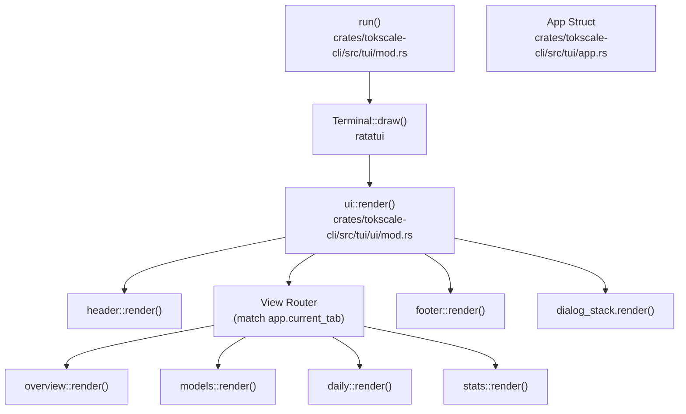
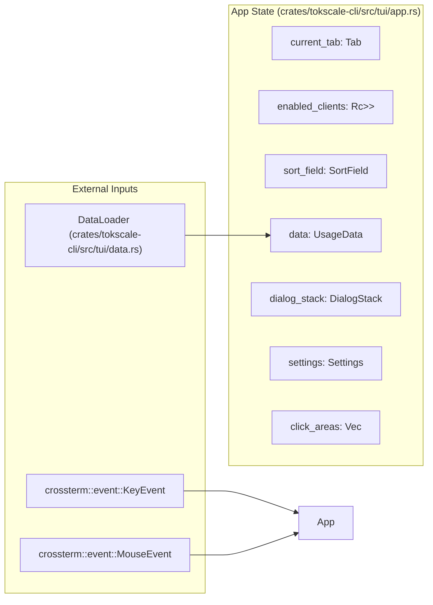
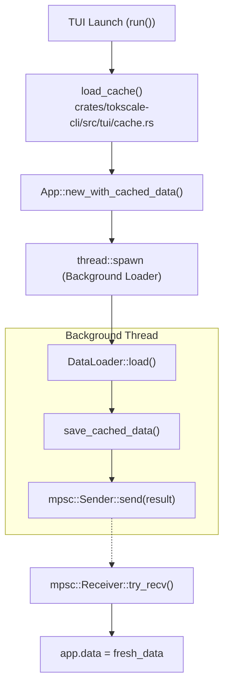

# TUI 아키텍처와 상태 관리

관련 소스 파일

다음 파일들은 이 위키 페이지를 생성하는 맥락으로 사용되었습니다.

- [crates/tokscale-cli/src/tui/app.rs](crates/tokscale-cli/src/tui/app.rs)
- [crates/tokscale-cli/src/tui/cache.rs](crates/tokscale-cli/src/tui/cache.rs)
- [crates/tokscale-cli/src/tui/event.rs](crates/tokscale-cli/src/tui/event.rs)
- [crates/tokscale-cli/src/tui/mod.rs](crates/tokscale-cli/src/tui/mod.rs)
- [crates/tokscale-cli/src/tui/settings.rs](crates/tokscale-cli/src/tui/settings.rs)
- [crates/tokscale-cli/src/tui/ui/daily.rs](crates/tokscale-cli/src/tui/ui/daily.rs)
- [crates/tokscale-cli/src/tui/ui/footer.rs](crates/tokscale-cli/src/tui/ui/footer.rs)
- [crates/tokscale-cli/src/tui/ui/hourly.rs](crates/tokscale-cli/src/tui/ui/hourly.rs)
- [crates/tokscale-cli/src/tui/ui/mod.rs](crates/tokscale-cli/src/tui/ui/mod.rs)
- [crates/tokscale-cli/src/tui/ui/models.rs](crates/tokscale-cli/src/tui/ui/models.rs)
- [crates/tokscale-cli/src/tui/ui/overview.rs](crates/tokscale-cli/src/tui/ui/overview.rs)
- [crates/tokscale-cli/src/tui/ui/stats.rs](crates/tokscale-cli/src/tui/ui/stats.rs)
- [crates/tokscale-core/src/pricing/cache.rs](crates/tokscale-core/src/pricing/cache.rs)

## 목적과 범위

이 문서는 Tokscale의 터미널 사용자 인터페이스(TUI) 구성 요소의 아키텍처와 상태 관리를 자세히 설명합니다. TUI는 `ratatui` 라이브러리를 사용해 Rust로 구현된 고성능 대화형 대시보드입니다. 중앙 집중식 상태 관리 시스템, stale-while-revalidate 의미론을 갖춘 백그라운드 데이터 로딩, 영구 설정을 제공합니다.

개별 TUI 보기와 렌더링 로직에 대한 정보는 [TUI Components](3.3.3)를 참조하세요. 키보드 컨트롤과 탐색 패턴은 [TUI Views and Navigation](3.3.2)을 참조하세요.

**출처:** [crates/tokscale-cli/src/tui/app.rs:139-192](), [crates/tokscale-cli/src/tui/mod.rs:1-41]()

---

## 구성 요소 계층

TUI는 중앙 `App` struct가 상태를 조율하고, 특화된 모듈들이 함수형 합성 패턴을 통해 렌더링을 처리하는 모듈식 구조를 따릅니다.

### 최상위 구조

**출처:** [crates/tokscale-cli/src/tui/mod.rs:55-191](), [crates/tokscale-cli/src/tui/ui/mod.rs:20-60]()

### 구성 요소 책임

| 구성 요소 | 파일 | 주요 책임 |
|-----------|------|----------------------|
| `run` | [crates/tokscale-cli/src/tui/mod.rs:55]() | 진입점, 터미널 초기화, 백그라운드 스레드 생성, 이벤트 루프 |
| `App` | [crates/tokscale-cli/src/tui/app.rs:139]() | 중앙 상태 컨테이너, 정렬 로직, 필터 관리, 클릭 영역 추적 |
| `ui::render` | [crates/tokscale-cli/src/tui/ui/mod.rs:20]() | 메인 레이아웃 정의와 보기 간 라우팅 |
| `Header` | [crates/tokscale-cli/src/tui/ui/header.rs]() | 탭 표시와 제목 바 |
| `Footer` | [crates/tokscale-cli/src/tui/ui/footer.rs:8]() | 전역 합계, 정렬 표시기, 도움말 텍스트, 상태 메시지 |
| `OverviewView` | [crates/tokscale-cli/src/tui/ui/overview.rs:45]() | 다중 모델 막대 차트와 상위 사용량 요약 |
| `DialogStack` | [crates/tokscale-cli/src/tui/ui/dialog.rs]() | 모달 오버레이 관리(Source Picker, Grouping 등) |

**출처:** [crates/tokscale-cli/src/tui/app.rs:139-192](), [crates/tokscale-cli/src/tui/ui/mod.rs:40-60]()

---

## 상태 관리 시스템

TUI는 전체 애플리케이션 상태를 유지하기 위해 중앙 집중식 `App` struct를 사용합니다. 웹 기반 프레임워크와 달리 상태 전이는 `App` 인스턴스를 변경하는 명시적 이벤트 처리와 메서드 호출을 통해 처리됩니다.

### App 상태 아키텍처

**출처:** [crates/tokscale-cli/src/tui/app.rs:139-192](), [crates/tokscale-cli/src/tui/event.rs:1-16]()

### 핵심 상태 기본 요소

| 필드 | 타입 | 역할 |
|-------|------|------|
| `data` | `UsageData` | 주요 사용량 통계(models, daily, hourly, graph) |
| `enabled_clients` | `Rc<RefCell<HashSet<ClientFilter>>>` | 필터링과 백그라운드 로드에 사용되는 활성 소스의 공유 집합 |
| `sort_field` | `SortField` | 현재 정렬 기준(Cost, Tokens 또는 Date) |
| `dialog_stack` | `DialogStack` | 활성 모달 대화상자의 LIFO 스택 관리 |
| `click_areas` | `Vec<ClickArea>` | 마우스 지원을 위해 동작에 매핑되는 화면 영역의 동적 목록 |

**출처:** [crates/tokscale-cli/src/tui/app.rs:140-192]()

---

## 데이터 로딩과 캐싱

TUI는 인터페이스가 실행 직후 즉시 상호작용 가능하면서도 백그라운드에서 데이터가 업데이트되도록 "Stale-While-Revalidate" 패턴을 구현합니다.

### 데이터 로딩 흐름

**출처:** [crates/tokscale-cli/src/tui/mod.rs:98-167](), [crates/tokscale-cli/src/tui/cache.rs:1-24]()

### 캐싱 전략

캐싱 시스템은 세션 사이를 연결하기 위해 디스크 기반 JSON 저장소를 사용합니다.

*   **위치:** 캐시는 레거시 TypeScript 구현과의 호환성을 유지하기 위해 `~/.cache/tokscale/tui-data-cache.json`에 저장됩니다 [crates/tokscale-cli/src/tui/cache.rs:28-34]().
*   **오래됨 기준:** 캐시는 5분(`CACHE_STALE_THRESHOLD_MS`) 후 오래된 것으로 간주됩니다 [crates/tokscale-cli/src/tui/cache.rs:22-23]().
*   **스키마 버전 관리:** 캐시에는 호환되지 않는 데이터 구조를 로드하지 않도록 `schema_version`(현재 7)이 포함됩니다 [crates/tokscale-cli/src/tui/cache.rs:24, 52]().
*   **원자적 쓰기:** 캐시 업데이트는 충돌 중 손상을 방지하기 위해 임시 파일 rename 패턴을 사용합니다 [crates/tokscale-core/src/pricing/cache.rs:86-96]().

**출처:** [crates/tokscale-cli/src/tui/cache.rs:1-60](), [crates/tokscale-core/src/pricing/cache.rs:62-103]()

---

## 설정 지속성

TUI의 동작은 `settings.json`을 통해 사용자 지정되며, 이 파일은 초기화 시 `App` struct로 로드됩니다.

### Settings 스키마

`Settings` struct는 TUI 환경설정과 스캐너 설정을 모두 관리합니다.

| 필드 | 타입 | 설명 |
|-------|------|-------------|
| `color_palette` | `String` | 테마 이름(예: "blue", "ocean") |
| `auto_refresh_enabled` | `bool` | TUI가 데이터를 자동으로 다시 로드하는지 여부 |
| `auto_refresh_ms` | `u64` | 밀리초 단위 새로고침 간격 |
| `scanner` | `ScannerSettings` | OpenCode SQLite 데이터베이스의 사용자 지정 경로 |
| `default_clients` | `Vec<String>` | CLI 플래그가 제공되지 않았을 때 로드할 고정 소스 |

**출처:** [crates/tokscale-cli/src/tui/settings.rs:31-64]()

### 구현 세부 사항

*   **경로 해석:** 설정은 `~/.config/tokscale/settings.json`에 저장되며, macOS 경로에 대한 레거시 폴백이 있습니다 [crates/tokscale-cli/src/tui/settings.rs:134-169]().
*   **손실 허용 역직렬화:** `default_clients` 필드는 잘못된 JSON 항목이 있어도 전체 설정 로드가 실패하지 않도록 손실 허용 역직렬화기를 사용합니다 [crates/tokscale-cli/src/tui/settings.rs:73-83]().
*   **검증:** `auto_refresh_ms`와 `native_timeout_ms` 같은 숫자 설정은 로드 중 안전한 최솟값/최댓값으로 제한됩니다 [crates/tokscale-cli/src/tui/settings.rs:172-180]().

**출처:** [crates/tokscale-cli/src/tui/settings.rs:151-182]()
