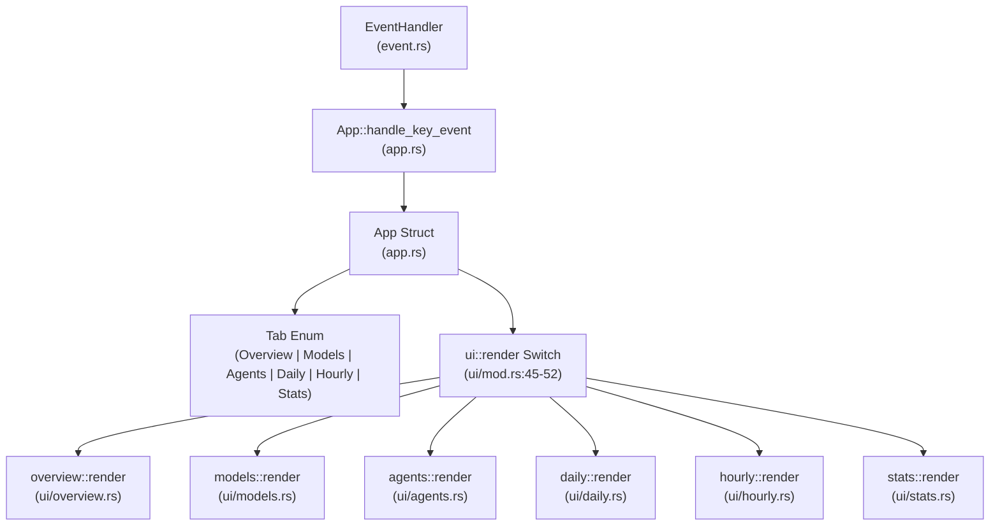

# TUI 보기와 탐색

관련 소스 파일

다음 파일들은 이 위키 페이지를 생성하는 맥락으로 사용되었습니다.

- [crates/tokscale-cli/src/tui/app.rs](crates/tokscale-cli/src/tui/app.rs)
- [crates/tokscale-cli/src/tui/mod.rs](crates/tokscale-cli/src/tui/mod.rs)
- [crates/tokscale-cli/src/tui/ui/agents.rs](crates/tokscale-cli/src/tui/ui/agents.rs)
- [crates/tokscale-cli/src/tui/ui/daily.rs](crates/tokscale-cli/src/tui/ui/daily.rs)
- [crates/tokscale-cli/src/tui/ui/footer.rs](crates/tokscale-cli/src/tui/ui/footer.rs)
- [crates/tokscale-cli/src/tui/ui/hourly.rs](crates/tokscale-cli/src/tui/ui/hourly.rs)
- [crates/tokscale-cli/src/tui/ui/hourly_profile.rs](crates/tokscale-cli/src/tui/ui/hourly_profile.rs)
- [crates/tokscale-cli/src/tui/ui/mod.rs](crates/tokscale-cli/src/tui/ui/mod.rs)
- [crates/tokscale-cli/src/tui/ui/models.rs](crates/tokscale-cli/src/tui/ui/models.rs)
- [crates/tokscale-cli/src/tui/ui/overview.rs](crates/tokscale-cli/src/tui/ui/overview.rs)
- [crates/tokscale-cli/src/tui/ui/stats.rs](crates/tokscale-cli/src/tui/ui/stats.rs)
- [crates/tokscale-core/src/sessions/claudecode.rs](crates/tokscale-core/src/sessions/claudecode.rs)

이 문서는 Tokscale 터미널 UI의 주요 보기(Overview, Models, Agents, Daily, Hourly, Stats), 사용자가 이들 사이를 탐색하는 방식, 데이터 탐색에 사용할 수 있는 키보드 단축키를 설명합니다. 상태 관리에 대한 정보는 [TUI Architecture and State Management](#3.3.1)를 참조하세요. 개별 구성 요소 구현에 대한 자세한 내용은 [TUI Components](#3.3.3)를 참조하세요.

## 목적과 범위

TUI는 여섯 가지 고유한 보기를 통해 토큰 사용량 데이터를 표시하며, 각 보기는 서로 다른 분석 작업에 최적화되어 있습니다. 사용자는 키보드 단축키나 마우스 클릭을 사용해 이러한 보기 사이를 탐색합니다. 각 보기는 정렬, 소스별 필터링, 드릴다운 탐색을 위한 특정 상호작용을 제공합니다.

## 보기 관리 아키텍처

`App` struct는 `Tab` enum variant를 보관하는 `current_tab` 필드를 통해 활성 보기를 관리합니다 [crates/tokscale-cli/src/tui/app.rs:141](). 탐색은 `Tab::next()`와 `Tab::prev()` 메서드가 처리합니다 [crates/tokscale-cli/src/tui/app.rs:77-97]().

**출처:** [crates/tokscale-cli/src/tui/app.rs:34-98](), [crates/tokscale-cli/src/tui/ui/mod.rs:20-60]()

## 여섯 가지 보기

### Overview View
최근 사용량(마지막 60개 구간)의 누적 막대 차트와 상위 모델의 스크롤 가능한 목록을 표시합니다.
- **누적 막대 차트**: 시간에 따른 모델별 토큰 분포를 시각화합니다 [crates/tokscale-cli/src/tui/ui/overview.rs:76-144]().
- **세분성**: `v` 키를 사용해 Daily와 Hourly 차트 보기 사이를 전환합니다 [crates/tokscale-cli/src/tui/ui/overview.rs:79-114]().
- **범례**: 색상으로 구분된 표시기와 함께 상위 3-5개 모델을 보여줍니다 [crates/tokscale-cli/src/tui/ui/overview.rs:146-183]().

### Models View
활성화된 소스 전반의 모든 모델에 대한 상세 테이블이며, 세부 토큰 내역을 포함합니다.
- **열**: Provider, Source, Input, Output, Cache Read/Write, Cost [crates/tokscale-cli/src/tui/ui/models.rs:72-91]().
- **그룹화**: `g` 키를 사용해 `Model`과 `WorkspaceModel` 그룹화 사이를 전환할 수 있습니다 [crates/tokscale-cli/src/tui/ui/models.rs:20-26]().

### Agents View
AI Agent별 토큰 사용량 내역입니다(예: Claude Code subagents).
- **Subagent 해석**: Claude Code JSONL과 meta 파일을 파싱하여 특정 subagent 유형을 식별합니다 [crates/tokscale-core/src/sessions/claudecode.rs:71-111]().
- **표시**: Agent 이름, 연결된 소스, 총 비용을 보여줍니다 [crates/tokscale-cli/src/tui/ui/agents.rs:47-53]().

### Daily View
일별 사용량의 시간순 집계입니다.
- **표시기**: "Today"를 노란색으로 강조합니다 [crates/tokscale-cli/src/tui/ui/daily.rs:122-133]().
- **Turn 데이터**: 세션 유형에서 사용할 수 있는 경우 turn 수와 message 수를 표시합니다 [crates/tokscale-cli/src/tui/ui/daily.rs:56-65]().

### Hourly View
두 가지 모드인 **Table**(시간순 목록)과 **Profile**(행동 분석)을 제공합니다.
- **Hourly Profile**: 데이터를 집계하여 "When You Work Most"(시간대)와 "Most Productive Day"(요일)를 보여줍니다 [crates/tokscale-cli/src/tui/ui/hourly_profile.rs:94-196]().
- **Peak Hour**: 소비량이 가장 높은 단일 시간을 식별합니다 [crates/tokscale-cli/src/tui/ui/hourly_profile.rs:199-210]().

### Stats View
52주 기여도 그래프와 집계 통계를 제공합니다.
- **대화형 그래프**: 사용자는 특정 셀을 클릭하거나 탐색하여 해당 날짜의 내역을 볼 수 있습니다 [crates/tokscale-cli/src/tui/ui/stats.rs:62-167]().
- **레이아웃**: 그래프, compact stats, breakdown panel을 위한 동적 영역입니다 [crates/tokscale-cli/src/tui/ui/stats.rs:15-60]().

**출처:** [crates/tokscale-cli/src/tui/ui/overview.rs:1-183](), [crates/tokscale-cli/src/tui/ui/models.rs:1-127](), [crates/tokscale-cli/src/tui/ui/agents.rs:1-53](), [crates/tokscale-cli/src/tui/ui/daily.rs:1-105](), [crates/tokscale-cli/src/tui/ui/hourly.rs:1-115](), [crates/tokscale-cli/src/tui/ui/hourly_profile.rs:1-210](), [crates/tokscale-cli/src/tui/ui/stats.rs:1-188]()

## 탐색과 컨트롤

Tokscale은 통합된 키보드 및 마우스 상호작용 모델을 사용합니다.

### 키보드 단축키 참조

| 키 | 동작 | 컨텍스트 |
|-----|--------|---------|
| `Tab` / `→` | 다음 탭 | 전역 |
| `Shift+Tab` / `←` | 이전 탭 | 전역 |
| `↑` / `↓` | 스크롤 / 선택 | Tables / Overview |
| `d` | 날짜로 정렬 | Models, Daily, Hourly, Agents |
| `t` | 토큰으로 정렬 | Models, Daily, Hourly, Agents |
| `c` | 비용으로 정렬 | Models, Daily, Hourly, Agents |
| `s` | Source Picker 열기 | 전역 |
| `g` | 그룹화 토글 | Models, Overview |
| `v` | 보기 모드 토글 | Hourly(Table/Profile), Overview(Daily/Hourly) |
| `r` | 수동 새로고침 | 전역 |
| `e` | JSON으로 내보내기 | 전역 |
| `q` / `Esc` | 종료 / 대화상자 닫기 | 전역 |

**출처:** [crates/tokscale-cli/src/tui/ui/footer.rs:154-213](), [crates/tokscale-cli/src/tui/app.rs:77-97]()

### 마우스 상호작용

TUI는 탐색과 선택을 위한 마우스 클릭을 지원합니다.
- **탭 헤더**: 헤더에서 탭 이름을 클릭하면 보기가 전환됩니다 [crates/tokscale-cli/src/tui/app.rs:134]().
- **정렬 버튼**: Footer의 정렬 레이블은 클릭 가능하며 테이블 순서를 변경할 수 있습니다 [crates/tokscale-cli/src/tui/ui/footer.rs:83-88]().
- **그래프 셀**: Stats 보기에서는 기여도 그래프의 개별 셀을 클릭하여 일별 세부 정보를 볼 수 있습니다 [crates/tokscale-cli/src/tui/ui/stats.rs:165-167]().

## 반응형 레이아웃

TUI는 사용 가능한 공간을 계산하고 구성 요소 가시성을 조정합니다.
- **Narrow Mode**: (< 100 chars) 세부 토큰 열(Input/Output/Cache)을 숨기고 레이블을 줄입니다 [crates/tokscale-cli/src/tui/ui/models.rs:152-157]().
- **Very Narrow Mode**: (< 80 chars) "Model"과 "Cost" 같은 필수 필드만 표시합니다 [crates/tokscale-cli/src/tui/ui/agents.rs:106-111]().
- **Dynamic Sizing**: `ui/mod.rs`의 `render` 함수는 `Layout` constraints를 사용해 터미널을 Header(3줄), Content(Min 0), Footer(5줄)로 나눕니다 [crates/tokscale-cli/src/tui/ui/mod.rs:29-36]().

**출처:** [crates/tokscale-cli/src/tui/ui/mod.rs:20-60](), [crates/tokscale-cli/src/tui/ui/models.rs:147-185](), [crates/tokscale-cli/src/tui/ui/footer.rs:17-44]()
