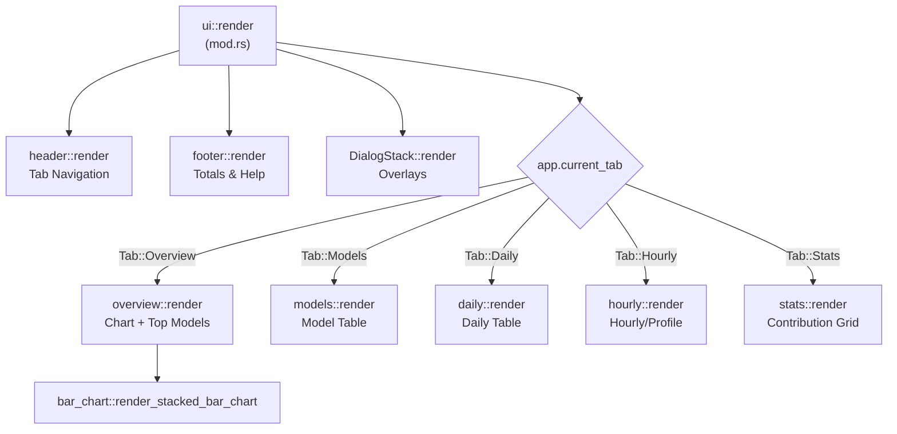

# TUI 구성 요소

관련 소스 파일

다음 파일들은 이 위키 페이지를 생성하는 맥락으로 사용되었습니다.

- [crates/tokscale-cli/src/tui/app.rs](crates/tokscale-cli/src/tui/app.rs)
- [crates/tokscale-cli/src/tui/mod.rs](crates/tokscale-cli/src/tui/mod.rs)
- [crates/tokscale-cli/src/tui/themes.rs](crates/tokscale-cli/src/tui/themes.rs)
- [crates/tokscale-cli/src/tui/ui/bar_chart.rs](crates/tokscale-cli/src/tui/ui/bar_chart.rs)
- [crates/tokscale-cli/src/tui/ui/daily.rs](crates/tokscale-cli/src/tui/ui/daily.rs)
- [crates/tokscale-cli/src/tui/ui/dialog/mod.rs](crates/tokscale-cli/src/tui/ui/dialog/mod.rs)
- [crates/tokscale-cli/src/tui/ui/dialog/overlay.rs](crates/tokscale-cli/src/tui/ui/dialog/overlay.rs)
- [crates/tokscale-cli/src/tui/ui/dialog/source_picker.rs](crates/tokscale-cli/src/tui/ui/dialog/source_picker.rs)
- [crates/tokscale-cli/src/tui/ui/dialog/stack.rs](crates/tokscale-cli/src/tui/ui/dialog/stack.rs)
- [crates/tokscale-cli/src/tui/ui/footer.rs](crates/tokscale-cli/src/tui/ui/footer.rs)
- [crates/tokscale-cli/src/tui/ui/header.rs](crates/tokscale-cli/src/tui/ui/header.rs)
- [crates/tokscale-cli/src/tui/ui/hourly.rs](crates/tokscale-cli/src/tui/ui/hourly.rs)
- [crates/tokscale-cli/src/tui/ui/mod.rs](crates/tokscale-cli/src/tui/ui/mod.rs)
- [crates/tokscale-cli/src/tui/ui/models.rs](crates/tokscale-cli/src/tui/ui/models.rs)
- [crates/tokscale-cli/src/tui/ui/overview.rs](crates/tokscale-cli/src/tui/ui/overview.rs)
- [crates/tokscale-cli/src/tui/ui/stats.rs](crates/tokscale-cli/src/tui/ui/stats.rs)
- [crates/tokscale-core/src/sessions/codebuff.rs](crates/tokscale-core/src/sessions/codebuff.rs)
- [crates/tokscale-core/src/sessions/utils.rs](crates/tokscale-core/src/sessions/utils.rs)
- [crates/tokscale-core/tests/codebuff.rs](crates/tokscale-core/tests/codebuff.rs)

이 페이지는 터미널 사용자 인터페이스(TUI)를 구성하는 개별 UI 구성 요소를 문서화하며, 렌더링 로직, 데이터 흐름, 반응형 동작을 포함합니다. TUI는 터미널 렌더링을 위한 widget 기반 시스템을 제공하는 `ratatui` 라이브러리를 사용해 만들어졌습니다.

## 구성 요소 계층

TUI는 `crates/tokscale-cli/src/tui/ui/mod.rs`의 메인 `render` 함수가 애플리케이션 상태에 따라 특정 보기 모듈로 그리기를 위임하는 계층 구조를 따릅니다.

**구성 요소 트리 다이어그램**

출처: [crates/tokscale-cli/src/tui/ui/mod.rs:20-60](), [crates/tokscale-cli/src/tui/app.rs:33-41]()

## 공유 Widget과 로직

공통 UI 요소는 `widgets` 모듈에 캡슐화되어 있습니다. 여기에는 통화와 토큰 형식 지정, 색상 할당 로직이 포함됩니다.

### 모델 색상 지정
모델 색상은 동적으로 결정됩니다. TUI는 서로 다른 보기 전반에서 시각적 일관성을 보장하기 위해 `App` struct에 `model_shade_map`을 유지합니다.
- `get_model_color`: 모델 이름을 기준으로 기본 색상을 할당합니다 [crates/tokscale-cli/src/tui/ui/widgets.rs:172-195]().
- `get_provider_shade`: 주요 provider(예: Anthropic, OpenAI, Google)에 대한 특정 색상 테마를 제공합니다 [crates/tokscale-cli/src/tui/ui/widgets.rs:117-154]().

### 형식 지정
- `format_tokens`: 큰 숫자를 사람이 읽을 수 있는 문자열로 변환합니다(예: "1.2M", "450K") [crates/tokscale-cli/src/tui/ui/widgets.rs:34-49]().
- `format_cost`: 센트 미만 값에 대한 정밀도 처리를 포함해 부동소수점 값을 통화 문자열로 형식화합니다 [crates/tokscale-cli/src/tui/ui/widgets.rs:51-64]().

출처: [crates/tokscale-cli/src/tui/ui/widgets.rs:1-200](), [crates/tokscale-cli/src/tui/app.rs:191-191]()

## Overview 구성 요소

`OverviewView`는 기본 랜딩 페이지입니다. 시각적 막대 차트와 소비량이 가장 많은 모델의 스크롤 가능한 목록을 결합합니다.

### 레이아웃 할당
이 보기는 세로 공간을 비율에 따라 나눕니다.
1. **차트**: 높이의 약 35%(최소 5행) [crates/tokscale-cli/src/tui/ui/overview.rs:54-55]().
2. **범례**: 1행 [crates/tokscale-cli/src/tui/ui/overview.rs:56-56]().
3. **모델 목록**: 남은 공간 [crates/tokscale-cli/src/tui/ui/overview.rs:63-63]().

### 누적 막대 차트
`render_stacked_bar_chart` 함수는 하위 셀 정밀도 블록 문자(` ▁▂▃▄▅▆▇█`)를 사용해 토큰 볼륨을 시각화합니다 [crates/tokscale-cli/src/tui/ui/bar_chart.rs:6-7]().
- **데이터 세분성**: `Daily`와 `Hourly` 보기 사이를 전환할 수 있습니다 [crates/tokscale-cli/src/tui/app.rs:100-105]().
- **모델 세그먼트**: 각 막대는 모델별로 "stacked"됩니다. 이 로직은 전체 볼륨에 대한 기여도를 기준으로 특정 수직 임계값에서 어떤 모델의 색상을 표시할지 결정합니다 [crates/tokscale-cli/src/tui/ui/bar_chart.rs:192-212]().

출처: [crates/tokscale-cli/src/tui/ui/overview.rs:45-74](), [crates/tokscale-cli/src/tui/ui/bar_chart.rs:30-190]()

## 테이블 보기(Models, Daily, Hourly)

이 구성 요소들은 `ratatui::widgets::Table`을 사용해 상세 데이터를 렌더링합니다. 반응형 열과 정렬을 처리하기 위한 공통 패턴을 공유합니다.

### 반응형 열 로직
열은 `app.is_narrow()`와 `app.is_very_narrow()`에 따라 추가되거나 제거됩니다 [crates/tokscale-cli/src/tui/ui/models.rs:46-47]().

| 보기 | Very Narrow(<60) | Narrow(<80) | Full(≥80) |
| :--- | :--- | :--- | :--- |
| **Models** | Model, Cost | Model, Tokens, Cost | #, Model, Provider, Source, Input, Output, Cache, Total, Cost |
| **Daily** | Date, Cost | Date, Msgs, Tokens, Cost | Date, Msgs, Input, Output, Cache R/W, Total, Cost |

### 정렬 표시기
헤더는 현재 `SortField`와 `SortDirection`에 따라 `▲` 또는 `▼` 기호를 동적으로 표시합니다 [crates/tokscale-cli/src/tui/ui/models.rs:93-102]().

출처: [crates/tokscale-cli/src/tui/ui/models.rs:28-126](), [crates/tokscale-cli/src/tui/ui/daily.rs:10-105]()

## Stats View(기여도 그래프)

`StatsView`는 **GitHub 스타일 활동 그리드와 상세 내역을 렌더링**합니다.

### 그리드 렌더링
- **강도 매핑**: 일별 토큰 볼륨은 5단계 강도로 정규화됩니다 [crates/tokscale-cli/src/tui/ui/stats.rs:109-123]().
- **대화형 셀**: 그리드는 마우스 상호작용을 지원합니다. 셀을 클릭하면 `app.selected_graph_cell`이 업데이트되고, 이는 해당 날짜의 `render_breakdown_panel`을 보여주기 위한 레이아웃 전환을 트리거합니다 [crates/tokscale-cli/src/tui/ui/stats.rs:15-60]().
- **레이아웃 로직**: 셀이 선택되면 화면은 세 영역 레이아웃(Graph, Compact Stats, Breakdown)으로 나뉩니다 [crates/tokscale-cli/src/tui/ui/stats.rs:22-40]().

출처: [crates/tokscale-cli/src/tui/ui/stats.rs:1-163](), [crates/tokscale-cli/src/tui/app.rs:164-165]()

## Footer 구성 요소

footer는 컨텍스트 인식 도움말과 전역 통계를 제공합니다.

### 레이아웃
높이가 허용되면 세 행으로 나뉩니다 [crates/tokscale-cli/src/tui/ui/footer.rs:18-28]().
1. **메인 행**: 정렬 버튼(Date, Cost, Tokens)과 전역 합계(Tokens | Cost) [crates/tokscale-cli/src/tui/ui/footer.rs:46-152]().
2. **도움말 행**: 키보드 단축키 힌트(예: sources의 `[s]`, grouping의 `[g]`) [crates/tokscale-cli/src/tui/ui/footer.rs:154-200]().
3. **상태 행**: 현재 로딩 단계 또는 상태 메시지를 표시합니다 [crates/tokscale-cli/src/tui/ui/footer.rs:41-43]().

### 대화형 요소
footer의 정렬 버튼은 마우스 클릭으로 상호작용할 수 있으며, `app.add_click_area` 시스템을 사용해 터미널 좌표를 `ClickAction::Sort`에 매핑합니다 [crates/tokscale-cli/src/tui/ui/footer.rs:83-88]().

출처: [crates/tokscale-cli/src/tui/ui/footer.rs:1-200]()

## 대화상자와 오버레이

TUI는 Source Picker나 Group-By Picker 같은 모달 창을 관리하기 위해 `DialogStack`을 사용합니다.

### ClientPickerDialog
현재 보기에 포함되는 데이터 소스(예: `opencode`, `claude`, `synthetic`)를 토글하는 데 사용됩니다.
- **상태 전파**: 대화상자에서 소스를 토글하면 앱이 즉시 데이터 재로드가 필요하다고 표시되도록 `Rc<RefCell<HashSet<ClientFilter>>>`를 사용합니다 [crates/tokscale-cli/src/tui/ui/dialog/source_picker.rs:89-104]().
- **필터링**: 목록에서 특정 소스를 빠르게 찾기 위해 "type-to-filter" 기능을 지원합니다 [crates/tokscale-cli/src/tui/ui/dialog/source_picker.rs:106-122]().

### Dialog Stack 로직
대화상자는 중앙 오버레이로 렌더링됩니다. `DialogStack`은 이벤트 캡처를 처리하여, 모달이 열려 있는 동안 키보드 입력이 메인 앱 탭 대신 활성 대화상자로 라우팅되도록 보장합니다 [crates/tokscale-cli/src/tui/ui/dialog/stack.rs:1-50]().

출처: [crates/tokscale-cli/src/tui/ui/dialog/source_picker.rs:34-123](), [crates/tokscale-cli/src/tui/ui/dialog/mod.rs:27-43]()
