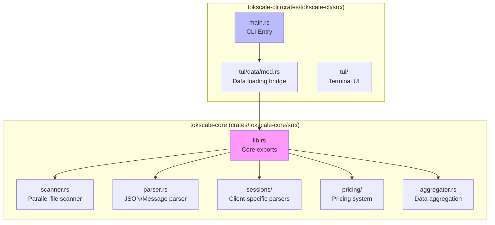
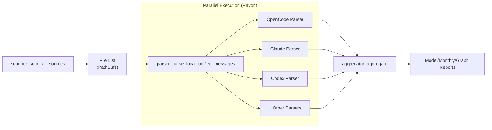

# 네이티브 Rust 코어

관련 소스 파일

다음 파일들은 이 위키 페이지를 생성하는 맥락으로 사용되었습니다.

- [Cargo.toml](Cargo.toml)
- [crates/tokscale-cli/src/commands/wrapped.rs](crates/tokscale-cli/src/commands/wrapped.rs)
- [crates/tokscale-cli/src/main.rs](crates/tokscale-cli/src/main.rs)
- [crates/tokscale-cli/src/tui/client_ui.rs](crates/tokscale-cli/src/tui/client_ui.rs)
- [crates/tokscale-cli/src/tui/data/mod.rs](crates/tokscale-cli/src/tui/data/mod.rs)
- [crates/tokscale-cli/src/tui/ui/widgets.rs](crates/tokscale-cli/src/tui/ui/widgets.rs)
- [crates/tokscale-core/src/aggregator.rs](crates/tokscale-core/src/aggregator.rs)
- [crates/tokscale-core/src/clients.rs](crates/tokscale-core/src/clients.rs)
- [crates/tokscale-core/src/lib.rs](crates/tokscale-core/src/lib.rs)
- [crates/tokscale-core/src/scanner.rs](crates/tokscale-core/src/scanner.rs)
- [crates/tokscale-core/src/sessions/mod.rs](crates/tokscale-core/src/sessions/mod.rs)
- [packages/cli-darwin-arm64/package.json](packages/cli-darwin-arm64/package.json)
- [packages/cli-darwin-x64/package.json](packages/cli-darwin-x64/package.json)
- [packages/cli-linux-arm64-gnu/package.json](packages/cli-linux-arm64-gnu/package.json)
- [packages/cli-linux-arm64-musl/package.json](packages/cli-linux-arm64-musl/package.json)
- [packages/cli-linux-x64-gnu/package.json](packages/cli-linux-x64-gnu/package.json)
- [packages/cli-linux-x64-musl/package.json](packages/cli-linux-x64-musl/package.json)
- [packages/cli-win32-arm64-msvc/package.json](packages/cli-win32-arm64-msvc/package.json)
- [packages/cli-win32-x64-msvc/package.json](packages/cli-win32-x64-msvc/package.json)

네이티브 Rust 코어(`tokscale-core`)는 Rust로 작성된 고성능 네이티브 모듈로, **세션 파싱과 데이터 집계의 계산 기반을 제공**합니다. 병렬 파일 스캔, SIMD 가속 JSON 파싱, 효율적인 메모리 관리를 통해 **순수 TypeScript 구현보다 큰 성능 향상을 제공**합니다. 이 페이지는 코어의 아키텍처와 CLI 계층과의 통합을 문서화합니다.

특정 세션 파서에 대한 자세한 내용은 [Session Parsing and Data Sources](#3.4.2)를 참조하세요. 가격 계산 알고리즘은 [Pricing System](#3.4.3)을 참조하세요.

---

## 개요

Rust 코어는 tokscale의 모든 성능 핵심 작업을 처리합니다. AI 코딩 어시스턴트 세션 파일을 찾기 위해 로컬 파일 시스템을 스캔하고, `rayon`을 사용해 JSON/SQLite 데이터를 병렬로 파싱하며, 가격 계산을 적용하고, 결과를 구조화된 보고서로 집계합니다.

이 모듈은 8개 플랫폼 대상(macOS x64/ARM64, Linux GNU/MUSL x64/ARM64, Windows x64/ARM64)을 위한 플랫폼별 바이너리 패키지 세트로 배포됩니다.

**출처:** [crates/tokscale-core/src/lib.rs:1-25](), [packages/cli-linux-arm64-gnu/package.json:1-15]()

---

## 모듈 구조

**다이어그램: Rust 코어 모듈 구성과 CLI 통합**

Rust 소스 코드는 데이터 파이프라인의 서로 다른 측면을 처리하는 모듈로 구성됩니다. `tokscale-core` crate는 사용자 인터페이스를 제공하는 `tokscale-cli` crate에서 라이브러리로 사용됩니다.

**출처:** [crates/tokscale-core/src/lib.rs:3-13](), [crates/tokscale-cli/src/main.rs:1-18]()

---

## 데이터 로딩과 통합

CLI의 `DataLoader`는 사용자 인터페이스와 코어 처리 로직 사이의 브리지 역할을 합니다. `LocalParseOptions`를 구성하고 코어 함수를 호출하여 사용량 데이터를 가져옵니다.

### 핵심 데이터 엔티티

코어는 토큰 사용량을 표현하기 위한 여러 핵심 구조를 정의합니다.

| Struct | 목적 |
|--------|---------|
| `TokenBreakdown` | input, output, cache(read/write), reasoning tokens를 추적합니다 [crates/tokscale-core/src/lib.rs:137-144]() |
| `ParsedMessage` | 단일 AI 상호작용의 정규화된 레코드입니다 [crates/tokscale-core/src/lib.rs:153-169]() |
| `ParsedMessages` | 메타데이터와 처리 시간을 포함한 파싱된 메시지 컬렉션입니다 [crates/tokscale-core/src/lib.rs:171-175]() |
| `ClientContribution` | 특정 client/model/provider triplet의 집계된 사용량 데이터입니다 [crates/tokscale-core/src/lib.rs:225-232]() |

**출처:** [crates/tokscale-core/src/lib.rs:137-232](), [crates/tokscale-cli/src/tui/data/mod.rs:151-156]()

---

## 처리 파이프라인

코어는 원시 세션 파일을 실행 가능한 보고서로 변환하는 고성능 파이프라인을 구현합니다.

**다이어그램: 고성능 데이터 처리 파이프라인**

### 1. 병렬 스캔(`scanner.rs`)
스캐너는 병렬 디렉터리 순회를 수행하기 위해 `walkdir`와 `rayon`을 결합해 사용합니다. 알려진 경로 패턴과 `TOKSCALE_EXTRA_DIRS` 같은 환경 변수를 기반으로 25개 이상의 지원 클라이언트에 대한 세션 파일을 식별합니다.

**출처:** [crates/tokscale-core/src/scanner.rs:1-13](), [crates/tokscale-core/src/scanner.rs:168-208]()

### 2. 정규화된 파싱(`parser.rs` & `sessions/`)
원시 파일(JSON, JSONL, SQLite, CSV)은 `UnifiedMessage` 형식으로 파싱됩니다. 코어는 다음과 같은 복잡한 로직을 처리합니다.
- **중복 제거:** 여러 세션 파일에 걸친 중복 메시지를 제거합니다.
- **정규화:** `normalize_model_for_grouping`을 사용해 모델 ID와 provider 이름을 표준화합니다.
- **필터링:** 날짜 범위(`since`, `until`)와 클라이언트 필터를 적용합니다.

**출처:** [crates/tokscale-core/src/lib.rs:52-86](), [crates/tokscale-core/src/lib.rs:205-215]()

### 3. 집계와 최종화(`aggregator.rs`)
집계기는 요청된 `GroupBy` 전략(Model, Client-Model, Client-Provider-Model 또는 Workspace-Model)에 따라 메시지를 그룹화합니다. 총 토큰, 추정 비용, 메시지 수를 계산합니다.

**출처:** [crates/tokscale-core/src/lib.rs:100-106](), [crates/tokscale-core/src/lib.rs:108-135]()

---

## 하위 페이지

네이티브 Rust 코어의 특정 하위 시스템에 대한 깊은 기술적 세부 사항은 다음 페이지를 참조하세요.

- [Core Architecture and NAPI Integration](#3.4.1) — Rust 워크스페이스 구조, crate 구성, 주요 의존성(rayon, tokio, simd-json), 플랫폼별 빌드 모델을 자세히 설명합니다.
- [Session Parsing and Data Sources](#3.4.2) — OpenCode, Claude Code, Codex, Gemini, Cursor 등을 포함한 모든 지원 클라이언트에서 코어가 세션을 파싱하는 방식을 문서화합니다.
- [Pricing System](#3.4.3) — 다단계 해석 전략, 별칭 처리, provider 순위 지정을 포함한 가격 조회 알고리즘을 설명합니다.
- [Report Generation and Aggregation](#3.4.4) — 모델 보고서, 월별 보고서, 그래프 데이터, 핑거프린팅이 포함된 메시지 캐시를 생성하는 최종화 함수를 자세히 설명합니다.

---

## 성능 최적화

- **Rayon:** 병렬 파일 I/O와 CPU-bound 파싱 작업에 광범위하게 사용됩니다 [crates/tokscale-core/src/lib.rs:20]().
- **BTreeMap/HashMap:** 집계 중 사용량 데이터를 효율적으로 그룹화하고 정렬하는 데 사용됩니다 [crates/tokscale-cli/src/tui/data/mod.rs:1]().
- **Zero-Copy Parsing:** 가능한 경우 코어는 메모리 할당을 최소화하기 위해 효율적인 파싱 기법을 활용합니다.

**출처:** [crates/tokscale-core/src/lib.rs:20-24](), [crates/tokscale-cli/src/tui/data/mod.rs:1-12]()
