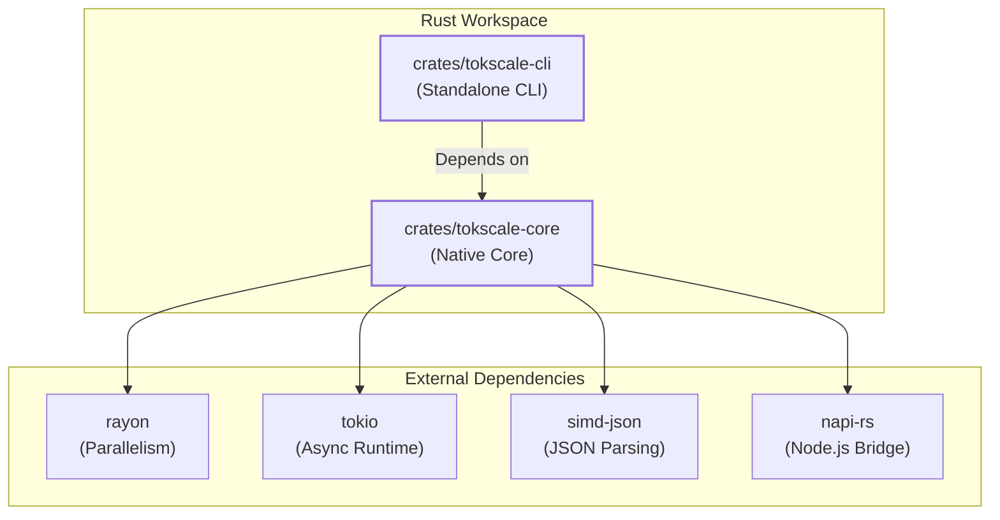
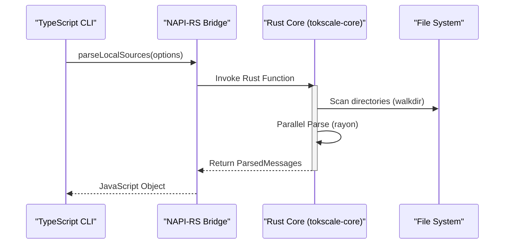

# 코어 아키텍처와 NAPI 통합

관련 소스 파일

다음 파일들은 이 위키 페이지를 생성하는 맥락으로 사용되었습니다.

- [.github/assets/client-codebuff.png](.github/assets/client-codebuff.png)
- [Cargo.lock](Cargo.lock)
- [Cargo.toml](Cargo.toml)
- [crates/tokscale-cli/Cargo.toml](crates/tokscale-cli/Cargo.toml)
- [crates/tokscale-cli/src/auth.rs](crates/tokscale-cli/src/auth.rs)
- [crates/tokscale-cli/src/cursor.rs](crates/tokscale-cli/src/cursor.rs)
- [crates/tokscale-core/Cargo.toml](crates/tokscale-core/Cargo.toml)
- [crates/tokscale-core/src/fs_atomic.rs](crates/tokscale-core/src/fs_atomic.rs)
- [packages/cli-darwin-arm64/package.json](packages/cli-darwin-arm64/package.json)
- [packages/cli-darwin-x64/package.json](packages/cli-darwin-x64/package.json)
- [packages/cli-linux-arm64-gnu/package.json](packages/cli-linux-arm64-gnu/package.json)
- [packages/cli-linux-arm64-musl/package.json](packages/cli-linux-arm64-musl/package.json)
- [packages/cli-linux-x64-gnu/package.json](packages/cli-linux-x64-gnu/package.json)
- [packages/cli-linux-x64-musl/package.json](packages/cli-linux-x64-musl/package.json)
- [packages/cli-win32-arm64-msvc/package.json](packages/cli-win32-arm64-msvc/package.json)
- [packages/cli-win32-x64-msvc/package.json](packages/cli-win32-x64-msvc/package.json)

## 목적과 범위

이 문서는 네이티브 Rust 모듈의 코어 아키텍처와 NAPI-RS를 통한 TypeScript CLI 통합을 자세히 설명합니다. Rust 워크스페이스 구조, crate 구성, 고성능 Rust 코어와 TypeScript CLI를 연결하는 실행 모델을 다룹니다.

네이티브 코어는 세션 파싱, 가격 조회, 데이터 집계의 무거운 작업을 제공하며, 병렬성을 위한 `rayon`, 비동기 I/O를 위한 `tokio`, 고속 데이터 처리를 위한 `simd-json` 같은 라이브러리를 활용합니다.

---

## 워크스페이스 구조와 Crate 구성

Tokscale은 시스템의 서로 다른 측면을 처리하는 두 개의 주요 crate를 갖춘 Rust workspace로 구성되어 있습니다.

### 주요 Crate 책임

| Crate | 역할 | 주요 의존성 |
|-------|------|------------------|
| `tokscale-core` | 파싱과 가격 계산을 위한 엔진입니다. NAPI-RS를 사용해 Node.js 네이티브 addon으로 컴파일됩니다. | `napi`, `simd-json`, `rayon`, `reqwest` |
| `tokscale-cli` | TUI와 Cursor 동기화를 포함한 CLI 기능의 독립 실행형 바이너리 구현입니다. | `ratatui`, `clap`, `tokio`, `rusqlite` |

**출처:** [Cargo.toml:1-6](), [Cargo.toml:15-17]()

---

## 의존성 아키텍처

Tokscale은 대용량 세션 파일을 빠르게 처리하기 위해 특정 고성능 Rust 라이브러리를 활용합니다.

### `rayon`을 통한 병렬성
수천 개의 로컬 세션 파일 파싱 같은 CPU-bound 작업에 사용됩니다. 사용 가능한 모든 CPU 코어에 작업을 자동으로 분배하여 데이터 병렬성을 가능하게 합니다.
- **사용 위치**: 세션 파싱과 로컬 파일 스캔.

### `tokio`를 통한 비동기 런타임
주로 가격 API(LiteLLM, OpenRouter)와 Tokscale 백엔드로의 네트워크 요청 같은 I/O-bound 작업에 사용됩니다.
- **사용 위치**: `PricingService`, `auth.rs` [crates/tokscale-cli/src/auth.rs:219-248](), Cursor 동기화 [crates/tokscale-cli/src/cursor.rs:10-27]().

### `simd-json`을 통한 JSON 처리
고속 JSON 파싱에 사용됩니다. 많은 AI 클라이언트(OpenCode나 Claude 등)는 세션을 대용량 JSON 파일에 저장합니다. `simd-json`는 SIMD 명령어를 사용하여 표준 `serde_json`보다 훨씬 빠르게 이를 파싱합니다.
- **사용 위치**: 코어 파싱 로직.

**출처:** [Cargo.toml:19-23](), [Cargo.toml:44]()

---

## NAPI-RS 브리지와 바이너리 로딩

네이티브 코어는 `@tokscale/core`로 패키징됩니다. 여기에는 플랫폼별 바이너리 해석을 처리하는 자동 생성 `index.js` 로더가 포함됩니다.

### 플랫폼 대상
시스템은 CLI가 서로 다른 환경에서 작동하도록 여러 아키텍처용 네이티브 바이너리를 빌드합니다.
- **macOS**: `x64`, `arm64` [packages/cli-darwin-x64/package.json:7-12](), [packages/cli-darwin-arm64/package.json:7-12]()
- **Linux**: `gnu`와 `musl`을 모두 지원하는 `x64`, `arm64` [packages/cli-linux-x64-gnu/package.json:7-15](), [packages/cli-linux-arm64-musl/package.json:7-15]()
- **Windows**: `x64`, `arm64` [packages/cli-win32-x64-msvc/package.json:7-12](), [packages/cli-win32-arm64-msvc/package.json:7-12]()

### 실행 모델: TypeScript에서 Rust로
CLI는 하위 프로세스 모델 또는 직접 NAPI 호출을 통해 네이티브 코어와 상호작용합니다.

**출처:** [Cargo.toml:32](), [Cargo.toml:88-93]()

---

## 코어 시스템 엔티티

다음 표는 자연어 개념을 Rust 코어와 CLI 내부의 특정 코드 엔티티에 연결합니다.

| 개념 | 코드 엔티티 | 파일 |
|---------|-------------|------|
| **네이티브 진입점** | `#[napi]` functions | `crates/tokscale-core/src/lib.rs` |
| **Cursor 동기화** | `SyncCursorResult`, `CURSOR_HTTP_TIMEOUT` | [crates/tokscale-cli/src/cursor.rs:14-89]() |
| **인증** | `ApiTokenAuth`, `login()` | [crates/tokscale-cli/src/auth.rs:31-219]() |
| **원자적 FS** | `atomic_write_file` | [crates/tokscale-cli/src/cursor.rs:161-218]() |
| **가격 계산 엔진** | `PricingService` | `crates/tokscale-core/src/pricing.rs` |

---

## 성능 최적화

### 릴리스 프로파일
Rust 코어는 네이티브 실행 오버헤드를 최소화하기 위해 공격적인 최적화로 컴파일됩니다.
- **LTO(Link Time Optimization)**: crate 경계를 넘어 최적화하기 위해 활성화됩니다 [Cargo.toml:89]().
- **Codegen Units**: 최적화 가능성을 극대화하기 위해 1로 설정됩니다 [Cargo.toml:91]().
- **Strip**: 배포용 바이너리 크기를 줄이기 위해 디버그 심볼을 제거합니다 [Cargo.toml:92]().

### 원자적 파일 작업
동기화 중(특히 Cursor 데이터) 데이터 손상을 방지하기 위해 시스템은 원자적 쓰기 패턴을 사용합니다.
1. 임시 파일에 씁니다 [crates/tokscale-cli/src/cursor.rs:176-195]().
2. 대상 파일을 원자적으로 덮어쓰기 위해 `fs::rename`을 사용합니다 [crates/tokscale-cli/src/cursor.rs:197-216]().

**출처:** [Cargo.toml:88-93](), [crates/tokscale-cli/src/cursor.rs:161-218]()
