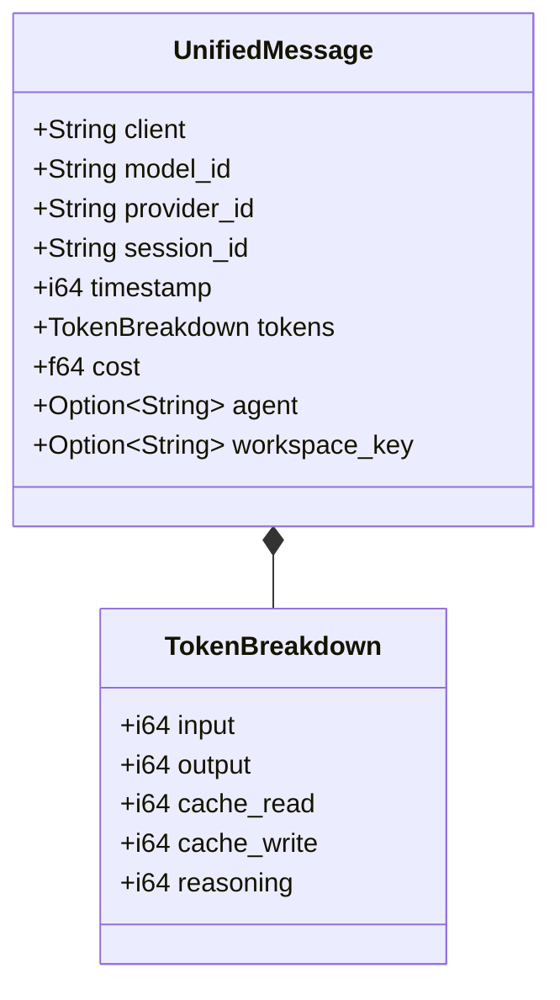
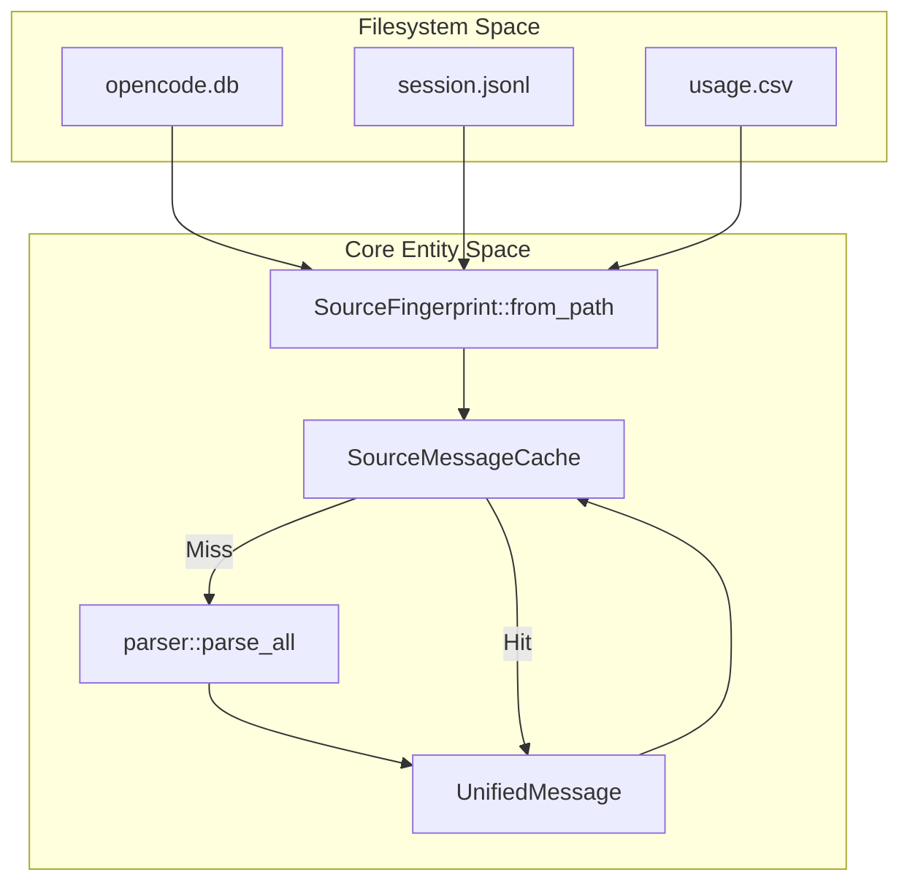

# 세션 파싱과 데이터 소스

관련 소스 파일

다음 파일들은 이 위키 페이지를 생성하는 맥락으로 사용되었습니다.

- [AGENTS.md](AGENTS.md)
- [crates/tokscale-cli/src/tui/ui/hourly_profile.rs](crates/tokscale-cli/src/tui/ui/hourly_profile.rs)
- [crates/tokscale-cli/tests/cli_tests.rs](crates/tokscale-cli/tests/cli_tests.rs)
- [crates/tokscale-core/src/message_cache.rs](crates/tokscale-core/src/message_cache.rs)
- [crates/tokscale-core/src/parser.rs](crates/tokscale-core/src/parser.rs)
- [crates/tokscale-core/src/sessions/amp.rs](crates/tokscale-core/src/sessions/amp.rs)
- [crates/tokscale-core/src/sessions/claudecode.rs](crates/tokscale-core/src/sessions/claudecode.rs)
- [crates/tokscale-core/src/sessions/codex.rs](crates/tokscale-core/src/sessions/codex.rs)
- [crates/tokscale-core/src/sessions/cursor.rs](crates/tokscale-core/src/sessions/cursor.rs)
- [crates/tokscale-core/src/sessions/droid.rs](crates/tokscale-core/src/sessions/droid.rs)
- [crates/tokscale-core/src/sessions/gemini.rs](crates/tokscale-core/src/sessions/gemini.rs)
- [crates/tokscale-core/src/sessions/goose.rs](crates/tokscale-core/src/sessions/goose.rs)
- [crates/tokscale-core/src/sessions/kilo.rs](crates/tokscale-core/src/sessions/kilo.rs)
- [crates/tokscale-core/src/sessions/kilocode.rs](crates/tokscale-core/src/sessions/kilocode.rs)
- [crates/tokscale-core/src/sessions/mux.rs](crates/tokscale-core/src/sessions/mux.rs)
- [crates/tokscale-core/src/sessions/openclaw.rs](crates/tokscale-core/src/sessions/openclaw.rs)
- [crates/tokscale-core/src/sessions/opencode.rs](crates/tokscale-core/src/sessions/opencode.rs)
- [crates/tokscale-core/src/sessions/qwen.rs](crates/tokscale-core/src/sessions/qwen.rs)
- [crates/tokscale-core/src/sessions/roocode.rs](crates/tokscale-core/src/sessions/roocode.rs)
- [crates/tokscale-core/src/sessions/synthetic.rs](crates/tokscale-core/src/sessions/synthetic.rs)
- [crates/tokscale-core/src/sessions/zed.rs](crates/tokscale-core/src/sessions/zed.rs)

## 목적과 범위

이 페이지는 네이티브 Rust 코어가 25개 이상의 지원 AI 코딩 어시스턴트 클라이언트에서 세션 데이터를 파싱하는 방식을 문서화합니다. 통합 메시지 형식, 다양한 데이터 소스(JSONL 스트림, SQLite 데이터베이스, CSV 내보내기)에 대한 구체적인 구현 로직, 고성능 병렬 처리 아키텍처를 자세히 설명합니다.

파싱된 메시지의 비용을 계산하는 가격 시스템에 대한 정보는 **3.4.3 Pricing System**을 참조하세요. 집계에 대한 자세한 내용은 **3.4.4 Report Generation and Aggregation**을 참조하세요.

## 통합 메시지 형식

서로 다른 소스의 모든 세션 데이터는 공통 `UnifiedMessage` 구조로 정규화됩니다. 이를 통해 소스가 로컬 SQLite DB였든 클라우드 동기화 CSV였든 관계없이 일관된 집계와 비용 계산이 가능합니다.

### 핵심 데이터 구조

파서는 모든 원시 항목을 Rust 코어 내부의 `UnifiedMessage` 형식으로 변환합니다.

| 필드 | 타입 | 설명 |
|-------|------|-------------|
| `client` | String | 플랫폼 식별자(예: `opencode`, `claudecode`, `cursor`, `gemini`, `zed`) |
| `model_id` | String | 모델 이름(예: `claude-3-7-sonnet-20250219`, `gpt-4o`) |
| `provider_id` | String | Provider 이름(예: `anthropic`, `openai`, `google`, `synthetic`) |
| `session_id` | String | 고유 대화 식별자 |
| `timestamp` | i64 | 밀리초 단위 Unix timestamp |
| `tokens` | TokenBreakdown | input, output, cache_read, cache_write, reasoning tokens를 포함하는 struct |
| `cost` | f64 | 메시지의 계산된 또는 보고된 비용 |
| `agent` | Option<String> | 특정 agent/subagent 이름(예: `architect`, `coder`) |
| `workspace_key` | Option<String> | 프로젝트 디렉터리에 대한 정규화된 경로 |

**출처:** [crates/tokscale-core/src/parser.rs:1-50](), [crates/tokscale-core/src/sessions/opencode.rs:161-180]()

### Token Breakdown 엔티티

`TokenBreakdown` struct는 사용량의 상세 보기를 제공하며, 특히 prompt caching과 reasoning tokens 같은 최신 기능을 추적합니다.

**출처:** [crates/tokscale-core/src/parser.rs:10-30]()

## 데이터 소스 개요

Tokscale은 고유한 저장 패턴을 가진 다양한 클라이언트를 지원합니다. 코어는 이를 세 가지 주요 파싱 전략으로 분류합니다.

| 전략 | 클라이언트 | 구현 세부 사항 |
|----------|---------|-----------------------|
| **JSONL Streams** | Claude Code, Codex, Zed, Goose, Qwen | 이벤트 로그를 줄 단위로 파싱합니다. |
| **SQLite DBs** | OpenCode, Kilo, Octofriend, Roo Code | 로컬 데이터베이스에 관계형 쿼리를 실행합니다. |
| **File Trees** | Gemini, Amp, Droid, OpenClaw | 세션/thread JSON 파일을 재귀적으로 스캔합니다. |
| **CSV Exports** | Cursor | 여러 버전의 CSV 사용량 보고서를 파싱합니다. |

**출처:** [crates/tokscale-core/src/parser.rs:100-250](), [crates/tokscale-core/src/sessions/cursor.rs:1-11]()

## 주요 파서 구현

### Claude Code(JSONL)
Claude Code는 세션을 `~/.claude/projects/`에 저장합니다. 파서(`claudecode.rs`)는 복잡한 subagent 관계를 처리합니다. agent 이름에 대해 세 단계 해석 전략을 사용합니다.
1. 형제 `.meta.json` sidecar 파일을 확인합니다.
2. subagent를 생성한 `tool_use` 이벤트를 찾기 위해 부모 세션을 스캔합니다.
3. 일반 `claude-code-subagent` 레이블로 폴백합니다.

**출처:** [crates/tokscale-core/src/sessions/claudecode.rs:1-111]()

### OpenCode 및 Kilo(SQLite)
OpenCode(1.2+)와 Kilo는 `~/.local/share/`에 위치한 SQLite 데이터베이스를 사용합니다. `parse_opencode_sqlite` 함수는 assistant 메시지를 추출하기 위해 쿼리를 실행합니다. SQLite DB와 레거시 JSON 파일 사이의 메시지를 중복 제거하기 위한 정교한 핑거프린팅 시스템을 포함합니다.

**출처:** [crates/tokscale-core/src/sessions/opencode.rs:182-230](), [crates/tokscale-core/src/sessions/kilo.rs:53-155]()

### Codex(상태 기반 JSONL)
Codex 파싱은 상태 기반입니다. Codex는 이벤트 스트림에 누적 토큰 합계 또는 델타를 기록하기 때문에, `CodexParseState`는 각 이벤트의 실제 증가분을 계산하기 위해 `previous_totals`를 추적합니다. 또한 snapshot이 순서와 다르게 도착하는 "stale regressions"를 처리하는 로직도 포함합니다.

**출처:** [crates/tokscale-core/src/sessions/codex.rs:66-163]()

### Cursor(CSV)
Cursor 데이터는 `~/.config/tokscale/cursor-cache/`의 캐시된 CSV 파일에서 파싱됩니다. 파서는 세 가지 고유한 CSV 버전(v1, v2, v3)을 처리하며, "Kind" 또는 "Cloud Agent ID" 열 같은 헤더 필드 존재 여부로 버전을 식별합니다.

**출처:** [crates/tokscale-core/src/sessions/cursor.rs:72-196]()

## 증분 파싱과 캐싱

수천 개의 파일에서도 높은 성능을 유지하기 위해 Tokscale은 `SourceMessageCache`를 사용합니다.

### 핑거프린팅
모든 소스 파일은 다음을 사용해 핑거프린팅됩니다.
- 파일 크기와 수정 시간(나노초).
- 샘플 지점(시작, 중간, 끝)의 콘텐츠 해시.
- Sidecar 파일 존재 여부(예: Claude Code의 `.meta.json` 또는 SQLite의 `-wal`).

**출처:** [crates/tokscale-core/src/message_cache.rs:104-166]()

### 데이터 흐름 파이프라인

**출처:** [crates/tokscale-core/src/message_cache.rs:240-300](), [crates/tokscale-core/src/parser.rs:300-350]()

## 병렬 실행 모델

코어는 사용 가능한 모든 CPU 코어에 걸쳐 파싱을 병렬화하기 위해 `rayon` crate를 활용합니다.

1. **발견**: 스캐너가 활성화된 소스에 대한 모든 관련 경로를 식별합니다.
2. **분배**: 경로가 Rayon thread pool로 분배됩니다.
3. **SIMD 파싱**: `opencode.rs` 같은 파서는 JSON payload의 고속 역직렬화를 위해 `simd-json`를 사용합니다.
4. **집계**: 결과는 단일 `UnifiedMessage` 객체 vector로 수집됩니다.

**출처:** [crates/tokscale-core/src/parser.rs:350-400](), [crates/tokscale-core/src/sessions/opencode.rs:132-140]()

## Synthetic.new 감지
Tokscale은 `synthetic.new` gateway를 통해 라우팅된 메시지를 감지하고 정규화하기 위한 특수 로직을 포함합니다. 모델 ID의 `hf:` 접두사 또는 `glhf`, `octofriend` 같은 특정 provider ID를 확인하여 이를 식별합니다. 그런 다음 [Pricing System](3.4.3)이 기반 모델을 올바르게 식별할 수 있도록 이 접두사를 제거합니다(예: `hf:deepseek-ai/DeepSeek-V3`를 `deepseek-v3`로 변환).

**출처:** [crates/tokscale-core/src/sessions/synthetic.rs:15-96]()

---

**출처:**
- `crates/tokscale-core/src/sessions/claudecode.rs`
- `crates/tokscale-core/src/sessions/codex.rs`
- `crates/tokscale-core/src/sessions/opencode.rs`
- `crates/tokscale-core/src/sessions/cursor.rs`
- `crates/tokscale-core/src/sessions/gemini.rs`
- `crates/tokscale-core/src/sessions/kilo.rs`
- `crates/tokscale-core/src/sessions/synthetic.rs`
- `crates/tokscale-core/src/message_cache.rs`
- `crates/tokscale-core/src/parser.rs`
