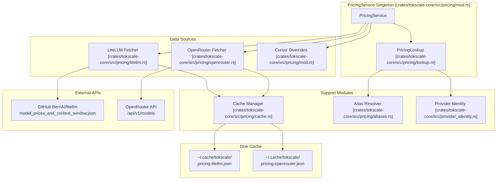
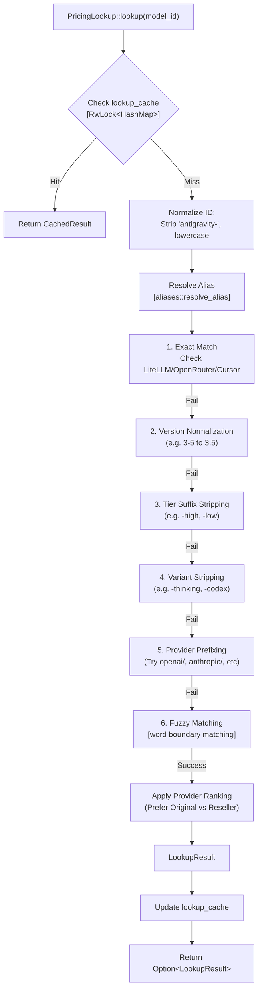
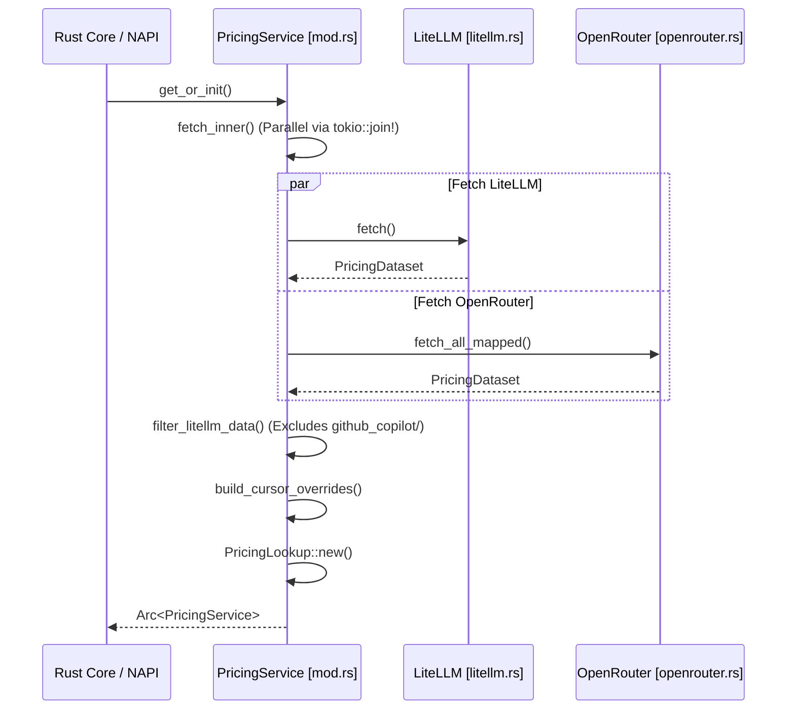

# 가격 시스템

<details>
<summary>관련 소스 파일</summary>

다음 파일들은 이 위키 페이지를 생성하는 맥락으로 사용되었습니다.

- [crates/tokscale-cli/src/tui/cache.rs](crates/tokscale-cli/src/tui/cache.rs)
- [crates/tokscale-cli/src/tui/settings.rs](crates/tokscale-cli/src/tui/settings.rs)
- [crates/tokscale-core/src/pricing/aliases.rs](crates/tokscale-core/src/pricing/aliases.rs)
- [crates/tokscale-core/src/pricing/cache.rs](crates/tokscale-core/src/pricing/cache.rs)
- [crates/tokscale-core/src/pricing/litellm.rs](crates/tokscale-core/src/pricing/litellm.rs)
- [crates/tokscale-core/src/pricing/lookup.rs](crates/tokscale-core/src/pricing/lookup.rs)
- [crates/tokscale-core/src/pricing/mod.rs](crates/tokscale-core/src/pricing/mod.rs)
- [crates/tokscale-core/src/pricing/openrouter.rs](crates/tokscale-core/src/pricing/openrouter.rs)
- [crates/tokscale-core/src/provider_identity.rs](crates/tokscale-core/src/provider_identity.rs)
- [crates/tokscale-core/src/sessions/antigravity.rs](crates/tokscale-core/src/sessions/antigravity.rs)

</details>


가격 시스템은 AI 모델 이름을 해당 비용 구조로 해석하고 토큰 사용 비용을 계산하는 역할을 합니다. 이 시스템은 **세 가지 가격 소스(LiteLLM, OpenRouter, 내부 Cursor override)를 질의**하고, 모델 이름 변형을 처리하며, 별칭을 해석하고, 리셀러가 아닌 원 모델 제작자의 정확한 가격을 보장하기 위해 provider 선호 규칙을 적용하는 정교한 다단계 조회 알고리즘을 구현합니다. 이 시스템은 Rust 코어 내부의 singleton 서비스로 동작하며 성능을 위한 디스크 캐싱을 포함합니다.

## 아키텍처 개요

가격 시스템은 `crates/tokscale-core/src/pricing/` 아래에 구성된 여러 핵심 모듈로 이루어져 있습니다.



**출처:** [crates/tokscale-core/src/pricing/mod.rs:1-40](), [crates/tokscale-core/src/pricing/lookup.rs:81-166](), [crates/tokscale-core/src/pricing/litellm.rs:1-115](), [crates/tokscale-core/src/pricing/openrouter.rs:1-177](), [crates/tokscale-core/src/pricing/cache.rs:1-117]()

## 데이터 소스와 ModelPricing 구조

시스템은 서로 다른 특성과 fallback 동작을 가진 **세 가지 주요 소스를 질의**합니다.

| 소스 | 전략 | 모델 |
|--------|----------|--------|
| **LiteLLM** | GitHub에서 전체 데이터셋 가져오기 | 모든 provider의 1000개 이상 모델 |
| **OpenRouter** | author endpoint 해석을 포함한 API 가져오기 | 알려진 provider의 author별 가격 |
| **Cursor** | 정적 내부 override | 특정 Cursor 모델(예: `composer-2`, `gpt-5.3`) |

### ModelPricing 구조

모든 소스는 높은 context window를 위한 tiered pricing을 지원하는 통합 `ModelPricing` 구조를 생성합니다.

```rust
pub struct ModelPricing {
    pub input_cost_per_token: Option<f64>,
    pub input_cost_per_token_above_128k_tokens: Option<f64>,
    pub input_cost_per_token_above_200k_tokens: Option<f64>,
    // ... additional tiers for 256k and 272k
    pub output_cost_per_token: Option<f64>,
    pub cache_creation_input_token_cost: Option<f64>,
    pub cache_read_input_token_cost: Option<f64>,
}
```

**출처:** [crates/tokscale-core/src/pricing/litellm.rs:11-28](), [crates/tokscale-core/src/pricing/mod.rs:62-99]()

## 가격 조회 알고리즘

`PricingLookup` 구조는 정규화와 fallback 메커니즘을 갖춘 정교한 해석 전략을 구현합니다. 구체적인 provider 매칭이 일반 매칭이나 리셀러 매칭보다 우선되도록 계층형 접근 방식을 사용합니다.

### 조회 흐름



**출처:** [crates/tokscale-core/src/pricing/lookup.rs:168-213](), [crates/tokscale-core/src/pricing/lookup.rs:215-286](), [crates/tokscale-core/src/pricing/aliases.rs:4-41]()

### Provider 선호와 순위 지정

시스템은 여러 매칭이 발견될 때 결과 순위를 지정하기 위해 `ORIGINAL_PROVIDER_PREFIXES`와 `RESELLER_PROVIDER_PREFIXES` 목록을 유지합니다.

- **원 Provider:** `x-ai/`, `anthropic/`, `openai/`, `google/`, `meta-llama/`, `deepseek/`, `mistralai/`, `z-ai/`, `qwen/`, `cohere/`, `perplexity/`, `moonshotai/`.
- **리셀러:** `azure/`, `bedrock/`, `vertex_ai/`, `together/`, `fireworks_ai/`, `groq/`, `openrouter/`.

순위 지정 로직은 모델이 리셀러와 원 제작자 양쪽에서 제공되는 경우, **원 제작자의 가격(대개 더 정확하거나 캐싱 할인이 포함됨)이 사용되도록 보장**합니다.

**출처:** [crates/tokscale-core/src/pricing/lookup.rs:19-45](), [crates/tokscale-core/src/pricing/lookup.rs:261-285]()

## 캐싱 전략

시스템은 시작 속도와 데이터 신선도의 균형을 맞추기 위해 두 가지 고유한 캐싱 계층을 사용합니다.

### 1. 영구 디스크 캐시
`crates/tokscale-core/src/pricing/cache.rs`가 관리하는 이 계층은 LiteLLM과 OpenRouter의 원시 데이터셋을 저장합니다.
- **TTL:** 1시간(`CACHE_TTL_SECS = 3600`).
- **원자적 저장:** 프로세스 crash 중 손상을 방지하기 위해 임시 파일 패턴(`.tmp` + rename)을 사용합니다.
- **레거시 Fallback:** 업그레이드 중 호환성을 위해 레거시 디렉터리 경로(예: `~/.cache/tokscale/`)를 확인합니다.

**출처:** [crates/tokscale-core/src/pricing/cache.rs:6-14](), [crates/tokscale-core/src/pricing/cache.rs:62-103]()

### 2. 인메모리 조회 캐시
`PricingLookup` struct는 `RwLock`으로 보호되는 `lookup_cache`를 포함합니다.
- **목적:** 복잡한 6단계 해석 알고리즘의 결과를 memoize합니다.
- **Eviction Policy:** 캐시가 `MAX_LOOKUP_CACHE_ENTRIES`(512)에 도달하면 "thundering-herd" 캐시 miss 폭주를 피하기 위해 항목의 약 25%를 제거합니다.

**출처:** [crates/tokscale-core/src/pricing/lookup.rs:49-53](), [crates/tokscale-core/src/pricing/lookup.rs:192-213]()

## 비용 계산

비용 계산은 표준 토큰, prompt caching, reasoning tokens를 처리합니다.

### 로직과 Tiered Pricing
`calculate_cost_with_provider` 함수는 context window 기반 tiered pricing을 고려합니다.
1. **Input Cost:** 총 input tokens를 기준으로 적용 가능한 가장 높은 tier(128k, 200k, 256k, 272k)를 적용합니다.
2. **Output/Reasoning:** Reasoning tokens는 output tokens에 더해지고 output rate로 가격이 책정됩니다.
3. **Caching:** `cache_read_input_token_cost`와 `cache_creation_input_token_cost`를 구체적으로 확인합니다.

```rust
// Calculation logic from lookup.rs
let input_cost = match input_tokens {
    t if t >= TIERED_PRICING_THRESHOLD_272K_TOKENS => pricing.input_cost_per_token_above_272k_tokens,
    t if t >= TIERED_PRICING_THRESHOLD_256K_TOKENS => pricing.input_cost_per_token_above_256k_tokens,
    // ... continues through tiers
}.or(pricing.input_cost_per_token).unwrap_or(0.0) * input_tokens as f64;
```

**출처:** [crates/tokscale-core/src/pricing/lookup.rs:509-565](), [crates/tokscale-core/src/pricing/mod.rs:158-185]()

## 서비스 초기화

`PricingService`는 `tokio::sync::OnceCell`을 통해 관리되는 singleton입니다.

### 초기화 흐름



**출처:** [crates/tokscale-core/src/pricing/mod.rs:102-138](), [crates/tokscale-core/src/pricing/mod.rs:46-56]()
