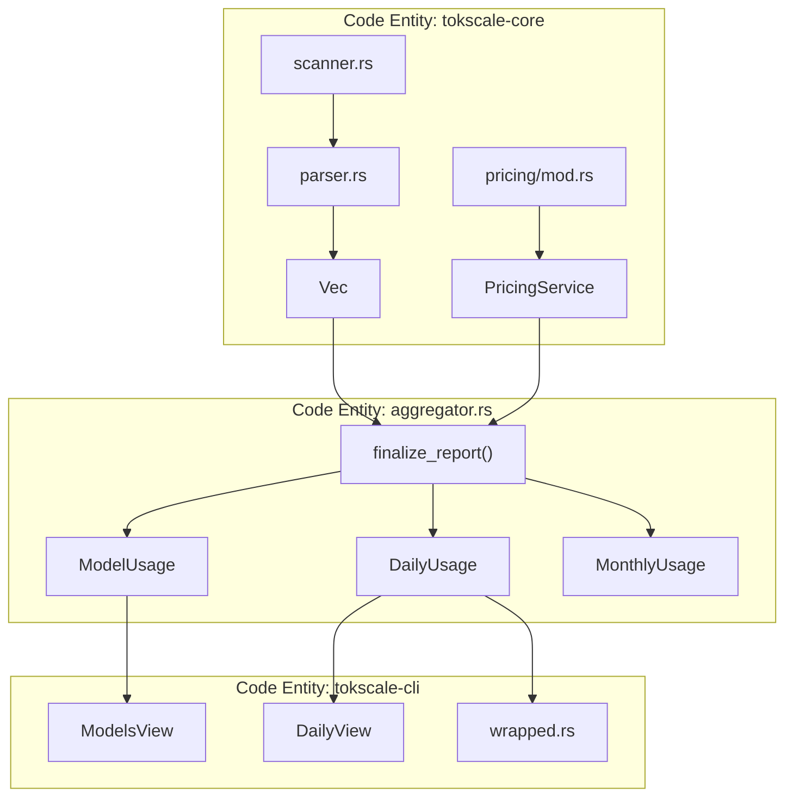
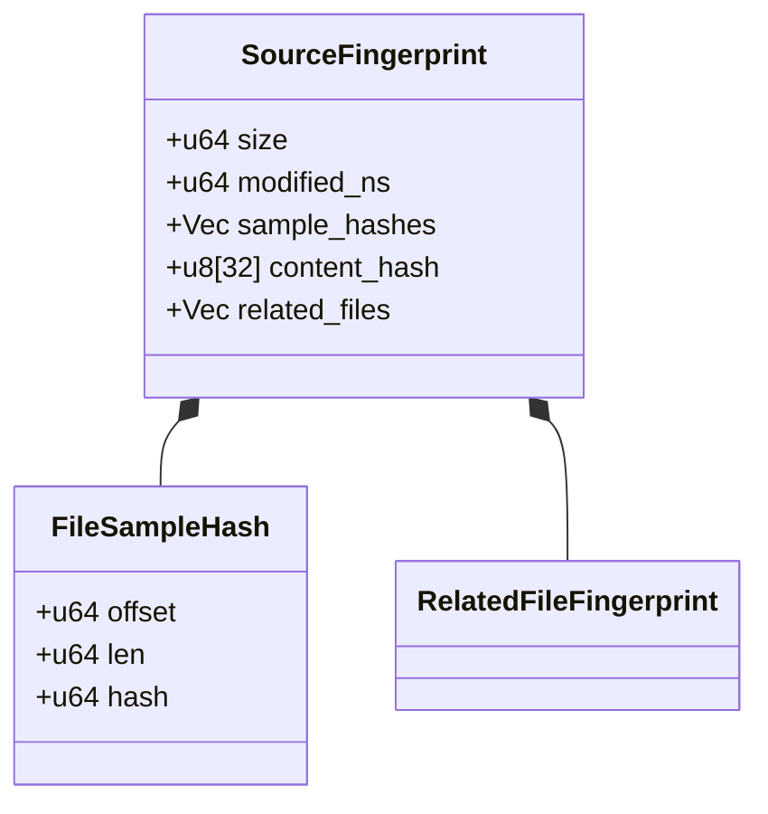

# 보고서 생성과 집계

관련 소스 파일

다음 파일들은 이 위키 페이지를 생성하는 맥락으로 사용되었습니다.

- [AGENTS.md](AGENTS.md)
- [crates/tokscale-cli/src/commands/wrapped.rs](crates/tokscale-cli/src/commands/wrapped.rs)
- [crates/tokscale-cli/src/main.rs](crates/tokscale-cli/src/main.rs)
- [crates/tokscale-cli/src/tui/client_ui.rs](crates/tokscale-cli/src/tui/client_ui.rs)
- [crates/tokscale-cli/src/tui/data/mod.rs](crates/tokscale-cli/src/tui/data/mod.rs)
- [crates/tokscale-cli/src/tui/ui/widgets.rs](crates/tokscale-cli/src/tui/ui/widgets.rs)
- [crates/tokscale-cli/tests/cli_tests.rs](crates/tokscale-cli/tests/cli_tests.rs)
- [crates/tokscale-core/src/aggregator.rs](crates/tokscale-core/src/aggregator.rs)
- [crates/tokscale-core/src/clients.rs](crates/tokscale-core/src/clients.rs)
- [crates/tokscale-core/src/lib.rs](crates/tokscale-core/src/lib.rs)
- [crates/tokscale-core/src/message_cache.rs](crates/tokscale-core/src/message_cache.rs)
- [crates/tokscale-core/src/scanner.rs](crates/tokscale-core/src/scanner.rs)
- [crates/tokscale-core/src/sessions/codex.rs](crates/tokscale-core/src/sessions/codex.rs)
- [crates/tokscale-core/src/sessions/gemini.rs](crates/tokscale-core/src/sessions/gemini.rs)
- [crates/tokscale-core/src/sessions/mod.rs](crates/tokscale-core/src/sessions/mod.rs)
- [crates/tokscale-core/src/sessions/opencode.rs](crates/tokscale-core/src/sessions/opencode.rs)

이 페이지는 Native Rust Core(3.4) 내부의 보고서 생성 및 집계 하위 시스템을 문서화합니다. 세션 파일이 파싱되고([Session Parsing and Data Sources](#3.4.2) 참조) 가격 데이터가 해석된 뒤([Pricing System](#3.4.3) 참조), 최종화 함수는 이 데이터를 비용 계산과 시각화 지표를 포함한 구조화된 보고서로 집계합니다.

---

## 개요

보고서 생성 시스템은 처리 파이프라인의 마지막 단계로 동작합니다. `UnifiedMessage` 객체(가격이 없는 토큰 수)를 받아 `PricingService`와 결합하여 세 가지 주요 출력을 생성합니다.

1.  **모델 보고서**: 모델과 클라이언트별로 집계되어 토큰 사용량과 비용을 보여줍니다.
2.  **월별 보고서**: 달력 월별로 집계됩니다.
3.  **그래프 데이터**: 2D/3D 시각화를 위해 형식화된 일별 기여도 강도와 streak입니다.

**출처:** [crates/tokscale-core/src/lib.rs:137-232](), [crates/tokscale-cli/src/tui/data/mod.rs:137-150]()

---

## 데이터 집계 아키텍처

시스템은 CLI 또는 TUI가 기반 세션 데이터의 특정 보기를 요청하는 2단계 파이프라인을 사용합니다.

**출처:** [crates/tokscale-core/src/lib.rs:3-12](), [crates/tokscale-cli/src/tui/data/mod.rs:151-230]()

---

## 집계 전략

코어는 `GroupBy` enum에 정의된 여러 그룹화 전략을 지원합니다. 이는 보고서의 세분성과 TUI에서 모델이 표시되는 방식을 결정합니다.

| 전략 | 키 구성 | 사용 사례 |
| :--- | :--- | :--- |
| `Model` | `model_id` | 모든 도구 전반의 전역 모델 사용량입니다. |
| `ClientModel` | `client:model_id` | 도구별 사용량입니다(예: Cursor vs. Claude Code). |
| `ClientProviderModel` | `client:provider:model_id` | 직접 API와 OpenRouter를 구분합니다. |
| `WorkspaceModel` | `workspace:model_id` | 프로젝트별 비용 추적입니다. |

**출처:** [crates/tokscale-core/src/lib.rs:99-135](), [crates/tokscale-cli/src/tui/data/mod.rs:189-214]()

---

## 주요 집계 함수

### 1. 모델 사용량 집계
`ModelUsage` struct는 특정 model/client 쌍의 집계 통계를 추적합니다. 여기에는 토큰을 input, output, cache read, cache write, reasoning으로 분류하는 `TokenBreakdown`이 포함됩니다.

**구현 세부 사항:**
- **모델 정규화**: `normalize_model_for_grouping` 함수는 일관된 집계를 보장하기 위해 reasoning-effort 접미사(예: `(high)`)와 날짜 기반 버전(예: `-20241022`)을 제거합니다.
- **비용 계산**: 비용은 `PricingService`를 사용해 집계 전에 메시지 수준에서 적용됩니다.

**출처:** [crates/tokscale-core/src/lib.rs:52-86](), [crates/tokscale-cli/src/tui/data/mod.rs:48-58]()

### 2. 일별 및 시간별 합계
TUI의 "Daily" 및 "Hourly" 보기에서는 데이터가 timestamp별 버킷으로 나뉩니다.
- **Daily**: 키로 `NaiveDate`를 사용합니다. 해당 날짜의 비용에 어떤 모델이 기여했는지 볼 수 있도록 `source_breakdown`(`DailySourceInfo`의 map)을 추적합니다.
- **Hourly**: 시간 단위로 잘린 `NaiveDateTime`을 사용합니다. `turn_count`(사용자 상호작용 turn)와 `message_count`(원시 API 호출)를 추적합니다.

**출처:** [crates/tokscale-cli/src/tui/data/mod.rs:94-121]()

### 3. 기여도 그래프와 강도
`GraphData` 구조는 "GitHub 스타일" 기여도 그리드에 필요한 데이터를 생성합니다.

**강도 로직:**
강도는 사용자의 과거 최고치 대비 일별 비용을 기준으로 0.0에서 1.0 사이의 스케일로 계산됩니다.
- **Level 0**: 활동 없음.
- **Level 1-4**: 세션 기록에서 기록된 최대 일별 비용의 사분위 구간입니다.

**출처:** [crates/tokscale-cli/src/tui/data/mod.rs:123-134](), [crates/tokscale-cli/src/commands/wrapped.rs:36-40]()

---

## 메시지 캐시와 핑거프린팅

수천 개의 세션 파일에서 높은 성능을 유지하기 위해 `tokscale-core`는 `message_cache.rs`에 정교한 캐싱 계층을 구현합니다.

### 핑거프린팅 전략
파일을 파싱하기 전에 시스템은 `SourceFingerprint`를 생성합니다. 파일은 fingerprint가 변경된 경우에만 다시 파싱됩니다.

**구현 세부 사항:**
- **샘플링**: 전체 파일을 해싱하는 대신(대용량 SQLite DB에서는 느림), 파일의 서로 다른 5개 지점에서 4KB 샘플을 가져옵니다.
- **Sidecar 인식**: Claude Code의 경우 `.meta.json` 파일을 추적합니다. SQLite(OpenCode)의 경우 `-wal`(Write-Ahead Log) 파일을 추적합니다. WAL이 변경되면 데이터베이스는 dirty로 간주되어 다시 스캔됩니다.

**출처:** [crates/tokscale-core/src/message_cache.rs:96-143](), [crates/tokscale-core/src/message_cache.rs:17-19]()

---

## Wrapped 보고서 생성

`wrapped.rs` 모듈은 연말 "Wrapped" 요약을 처리합니다. PNG로 시각적 렌더링하기 위해 데이터를 구체적으로 집계합니다.

**Wrapped의 데이터 흐름:**
1.  **로드**: `year`로 필터링된 `LocalParseOptions`를 사용하는 `load_wrapped_data`를 호출합니다.
2.  **필터**: `normalize_agent_name`을 사용해 "Agents"(예: Sisyphus, Planner)를 구체적으로 찾습니다.
3.  **순위 지정**: `top_models`와 `top_clients`를 비용 기준으로 정렬합니다.
4.  **Streak**: 정렬된 `DailyUsage` 키를 순회하여 `longest_streak`를 계산합니다.

**출처:** [crates/tokscale-cli/src/commands/wrapped.rs:54-85](), [crates/tokscale-cli/src/commands/wrapped.rs:160-215](), [crates/tokscale-core/src/sessions/mod.rs:58-95]()

---

## 코드 엔티티 기술 요약

| 코드 엔티티 | 파일 경로 | 역할 |
| :--- | :--- | :--- |
| `TokenBreakdown` | `crates/tokscale-core/src/lib.rs` | input/output/cache/reasoning tokens를 위한 기본 struct입니다. |
| `SourceFingerprint` | `crates/tokscale-core/src/message_cache.rs` | 파일 크기/mtime/샘플을 기준으로 캐시를 무효화하는 로직입니다. |
| `DataLoader` | `crates/tokscale-cli/src/tui/data/mod.rs` | Rust 코어를 호출하고 UI용으로 결과를 변환하는 상위 수준 오케스트레이터입니다. |
| `normalize_model_for_grouping` | `crates/tokscale-core/src/lib.rs` | 모델 변형을 병합하기 위한 문자열 조작입니다(예: `gpt-4o-2024-05-13` -> `gpt-4o`). |
| `CodexParseState` | `crates/tokscale-core/src/sessions/codex.rs` | 상태 기반 세션 파일을 처리하기 위해 누적 토큰 델타를 추적합니다. |

**출처:** [crates/tokscale-core/src/lib.rs:52-86](), [crates/tokscale-core/src/lib.rs:138-144](), [crates/tokscale-core/src/message_cache.rs:104-110](), [crates/tokscale-core/src/sessions/codex.rs:153-163]()
