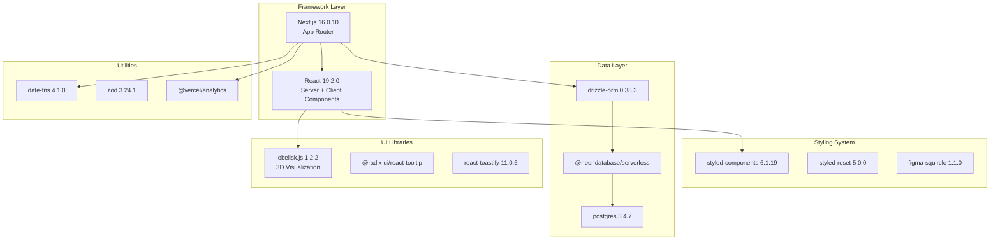
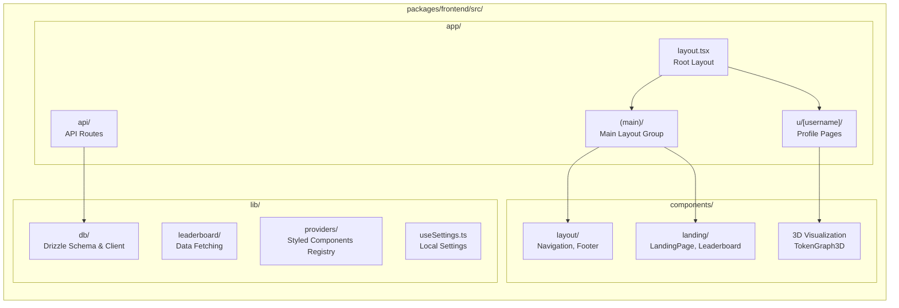

# 프런트엔드 웹 애플리케이션

관련 소스 파일

다음 파일들은 이 위키 페이지를 생성하는 맥락으로 사용되었습니다.

- [bun.lock](bun.lock)
- [packages/frontend/package.json](packages/frontend/package.json)
- [packages/frontend/src/app/(main)/page.tsx](packages/frontend/src/app/(main)/page.tsx)
- [packages/frontend/src/app/layout.tsx](packages/frontend/src/app/layout.tsx)
- [packages/frontend/src/components/BlackholeHero.tsx](packages/frontend/src/components/BlackholeHero.tsx)
- [packages/frontend/src/components/Switch.tsx](packages/frontend/src/components/Switch.tsx)
- [packages/frontend/src/components/layout/Navigation.tsx](packages/frontend/src/components/layout/Navigation.tsx)
- [packages/frontend/src/lib/db/index.ts](packages/frontend/src/lib/db/index.ts)
- [packages/frontend/src/lib/providers/Providers.tsx](packages/frontend/src/lib/providers/Providers.tsx)
- [packages/frontend/src/lib/providers/index.ts](packages/frontend/src/lib/providers/index.ts)
- [packages/frontend/src/lib/useSettings.ts](packages/frontend/src/lib/useSettings.ts)

프런트엔드 웹 애플리케이션은 [tokscale.ai](https://tokscale.ai)에 호스팅되는 Next.js 기반 웹 플랫폼으로, AI 토큰 사용량 데이터를 보고 비교하기 위한 소셜 기능을 제공합니다. 공**개 리더보드 시스템, 기여도 시각화를 포함한 사용자 프로필 페이지, GitHub OAuth 인증을 구현**합니다. CLI 도구에 대한 정보는 [CLI Tool](#3)을 참조하세요. 백엔드 API 구현 세부 사항은 [API Routes](#5)를 참조하세요.

## 애플리케이션 스택과 기술

프런트엔드는 App Router 아키텍처를 사용하는 Next.js 16.0.10, React 19.2.0, TypeScript로 만들어졌습니다. 초기 페이지 로드에는 Server Components를 활용하고, 성능 최적화를 위해 Incremental Static Regeneration(ISR)을 사용합니다.

**출처:** [packages/frontend/package.json:15-33](), [packages/frontend/src/app/layout.tsx:1-5]()

## 프로젝트 구조

프런트엔드 패키지는 서버 로직, 클라이언트 구성 요소, 공유 라이브러리를 명확히 분리하는 Next.js App Router 규약을 따릅니다.

**출처:** [packages/frontend/src/app/layout.tsx:62-75](), [packages/frontend/src/app/(main)/page.tsx:1-45]()

## 애플리케이션 구조

애플리케이션은 데이터 가져오기에 Next.js Server Components를 사용하고 UI 렌더링에 `styled-components`를 사용합니다. 서버리스 환경에 최적화된 데이터베이스 연결을 위해 singleton 패턴을 사용합니다. 자세한 내용은 [Application Structure](#4.1)를 참조하세요.

[packages/frontend/src/lib/db/index.ts:21-51]()는 서버리스에 최적화된 connection pool을 구현합니다.
- `max: 1`: 함수 인스턴스당 연결 수를 제한합니다.
- `prepare: false`: 서버리스에서 상태 문제를 피하기 위해 prepared statements를 비활성화합니다.

**출처:** [packages/frontend/src/lib/db/index.ts:21-51](), [packages/frontend/src/lib/providers/Providers.tsx:9-53]()

## 리더보드 페이지

리더보드는 Tokscale의 중심 소셜 기능으로, 사용자가 서로 다른 기간(All-time, Month, Week)의 토큰 사용량과 비용을 비교할 수 있게 합니다. 자세한 내용은 [Leaderboard Page](#4.2)를 참조하세요.

`HomePage`는 `getLeaderboardData`를 사용해 비용과 토큰 기준 상위 사용자를 병렬로 가져옵니다 [packages/frontend/src/app/(main)/page.tsx:28-33]().

**출처:** [packages/frontend/src/app/(main)/page.tsx:6-33]()

## 사용자 프로필 페이지

사용자 프로필은 개인의 AI 사용량을 깊이 있게 보여주며, 기여도 그래프와 모델별 내역을 제공합니다. 자세한 내용은 [User Profile Pages](#4.3)를 참조하세요.

프로필에는 다음이 포함됩니다.
- **기여도 그래프**: 활동의 아이소메트릭 3D 시각화입니다.
- **모델 사용량**: 사용자가 가장 많이 상호작용하는 LLM에 대한 통계입니다.
- **Embed Dialog**: 사용자가 SVG 카드나 배지를 통해 자신의 통계를 공유할 수 있게 하는 도구입니다.

## 탐색과 레이아웃

`Navigation` 구성 요소 [packages/frontend/src/components/layout/Navigation.tsx:28-61]()는 glassmorphism 효과와 반응형 모바일 메뉴를 갖춘 지속적인 header를 제공합니다. 사용자 인증 상태를 처리하며, `SignInButton` [packages/frontend/src/components/layout/Navigation.tsx:173-196]() 또는 dropdown menu가 있는 `ProfileButton`을 표시합니다. 자세한 내용은 [Navigation and Layout](#4.4)를 참조하세요.

**출처:** [packages/frontend/src/components/layout/Navigation.tsx:28-61](), [packages/frontend/src/app/layout.tsx:62-75]()

## 3D 시각화 구성 요소

Tokscale은 `obelisk.js`를 사용한 토큰 사용량 데이터의 고유한 3D 시각화를 제공합니다. 여기에는 아이소메트릭 기여도 막대를 렌더링하는 `TokenGraph3D` 구성 요소가 포함됩니다. 자세한 내용은 [3D Visualization Components](#4.5)를 참조하세요.

**출처:** [packages/frontend/package.json:25](), [packages/frontend/src/lib/utils.ts:20-119]()

## 임베드 가능한 프로필 카드와 배지

시스템은 GitHub README나 개인 웹사이트에 통계를 임베드하기 위한 동적 SVG 엔드포인트를 제공합니다. 여기에는 2D/3D 프로필 카드와 shields.io 스타일 배지가 포함됩니다. 자세한 내용은 [Embeddable Profile Cards and Badges](#4.6)를 참조하세요.

## 로컬 설정 관리

선호 색상 팔레트와 리더보드 정렬 선호도 같은 클라이언트 측 설정은 `useSettings` hook [packages/frontend/src/lib/useSettings.ts:111-144]()을 통해 관리됩니다.

- **지속성**: 설정은 `localStorage`에 저장됩니다 [packages/frontend/src/lib/useSettings.ts:68-79]().
- **동기화**: 여러 구성 요소를 동기화 상태로 유지하기 위해 `useSyncExternalStore`를 사용합니다 [packages/frontend/src/lib/useSettings.ts:112-121]().
- **Cookie Sync**: 서버 측 일관성을 위해 리더보드 정렬 선호도를 cookies에 미러링합니다 [packages/frontend/src/lib/useSettings.ts:30-33]().

**출처:** [packages/frontend/src/lib/useSettings.ts:1-145]()
