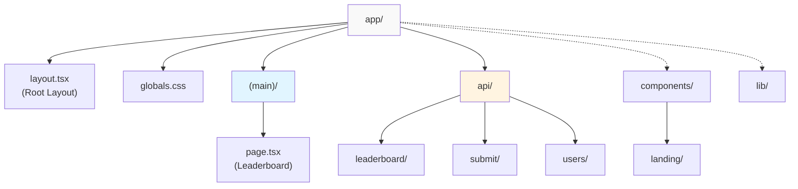
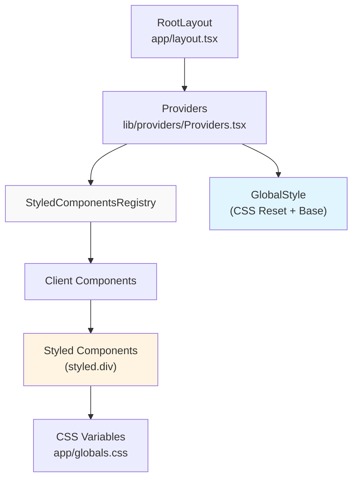
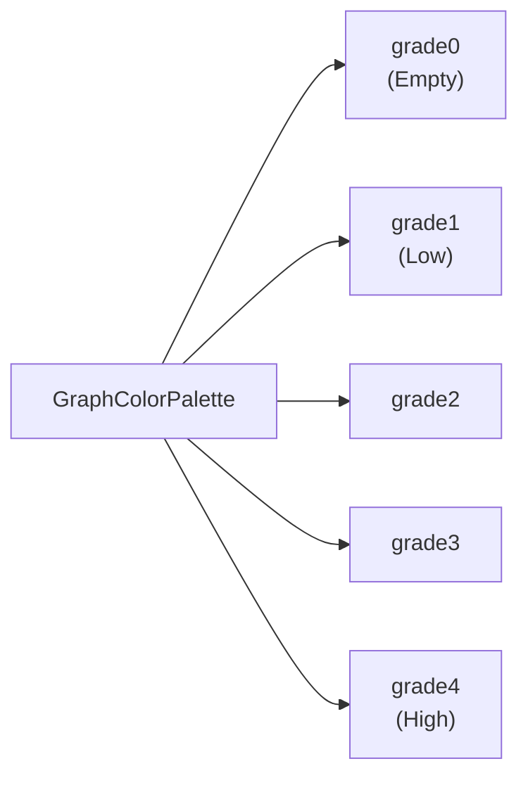

# 애플리케이션 구조

관련 소스 파일

다음 파일들은 이 위키 페이지를 생성하는 맥락으로 사용되었습니다.

- [bun.lock](bun.lock)
- [packages/frontend/next.config.ts](packages/frontend/next.config.ts)
- [packages/frontend/package.json](packages/frontend/package.json)
- [packages/frontend/postcss.config.mjs](packages/frontend/postcss.config.mjs)
- [packages/frontend/public/assets/landing/client-logos-grid.svg](packages/frontend/public/assets/landing/client-logos-grid.svg)
- [packages/frontend/src/app/globals.css](packages/frontend/src/app/globals.css)
- [packages/frontend/src/app/layout.tsx](packages/frontend/src/app/layout.tsx)
- [packages/frontend/src/components/DataInput.tsx](packages/frontend/src/components/DataInput.tsx)
- [packages/frontend/src/components/Skeleton.tsx](packages/frontend/src/components/Skeleton.tsx)
- [packages/frontend/src/components/landing/LandingPage.tsx](packages/frontend/src/components/landing/LandingPage.tsx)
- [packages/frontend/src/components/landing/sections/DescriptionSection.tsx](packages/frontend/src/components/landing/sections/DescriptionSection.tsx)
- [packages/frontend/src/components/landing/sections/FollowSection.tsx](packages/frontend/src/components/landing/sections/FollowSection.tsx)
- [packages/frontend/src/components/landing/sections/FooterSection.tsx](packages/frontend/src/components/landing/sections/FooterSection.tsx)
- [packages/frontend/src/components/landing/sections/HeroSection.tsx](packages/frontend/src/components/landing/sections/HeroSection.tsx)
- [packages/frontend/src/lib/providers/Providers.tsx](packages/frontend/src/lib/providers/Providers.tsx)
- [packages/frontend/src/lib/providers/index.ts](packages/frontend/src/lib/providers/index.ts)
- [packages/frontend/src/lib/themes.ts](packages/frontend/src/lib/themes.ts)

## 목적과 범위

이 문서는 Tokscale 웹 플랫폼의 프런트엔드 애플리케이션 구조를 설명하며, Next.js App Router 아키텍처, 구성 요소 구성, 스타일링 시스템, 렌더링 전략에 초점을 맞춥니다. 애플리케이션이 Server Components, Incremental Static Regeneration(ISR), `styled-components`를 활용해 성능 좋은 웹 경험을 만드는 방식을 다룹니다.

리더보드와 사용자 프로필 같은 특정 페이지에 대한 정보는 [Leaderboard Page](#4.2)와 [User Profile Pages](#4.3)를 참조하세요. API 엔드포인트 구현은 [API Routes](#5)를 참조하세요. 데이터베이스 스키마 세부 사항은 [Database Schema](#6)를 참조하세요.

## Next.js App Router 구조

프런트엔드는 App Router 패러다임의 Next.js 16.0.10을 사용하며, 파일 시스템 기반 라우팅 규약에 따라 [packages/frontend/src/app/]() 아래에 파일을 구성합니다.

**디렉터리 구조:**

**출처:** [packages/frontend/package.json:23](), [packages/frontend/src/app/layout.tsx:1-76](), [packages/frontend/src/app/globals.css:1-105]()

## 루트 레이아웃과 전역 설정

`RootLayout` [packages/frontend/src/app/layout.tsx:62-75]()은 모든 페이지의 진입점 역할을 하며, 전역 metadata, fonts, provider 주입을 관리합니다.

*   **Fonts**: UI 텍스트에는 `Figtree`, 코드/데이터에는 `JetBrains_Mono`를 사용하며 CSS variables로 구성됩니다 [packages/frontend/src/app/layout.tsx:10-20]().
*   **TopLoader**: 시각적 탐색 피드백을 위해 `nextjs-toploader`를 통합합니다 [packages/frontend/src/app/layout.tsx:66]().
*   **Providers**: children을 `Providers` 구성 요소로 감쌉니다 [packages/frontend/src/app/layout.tsx:67]().

**출처:** [packages/frontend/src/app/layout.tsx:10-75](), [packages/frontend/src/app/globals.css:46-62]()

## styled-components를 사용한 스타일링 시스템

애플리케이션은 전용 registry를 통해 적절한 Server Component 지원을 갖춘 CSS-in-JS 스타일링에 `styled-components` v6.1.19를 사용합니다.

**스타일링 아키텍처:**

`Providers` 구성 요소 [packages/frontend/src/lib/providers/Providers.tsx:55-62]()는 전역 스타일과 styled-components registry가 전체 트리에서 사용 가능하도록 보장합니다. 기본 스타일링은 [packages/frontend/src/app/globals.css]()에 정의되어 있으며, 테마를 위해 CSS custom properties(예: `--color-bg-default`, `--color-primary`)를 활용합니다 [packages/frontend/src/app/globals.css:1-44]().

**출처:** [packages/frontend/src/lib/providers/Providers.tsx:1-62](), [packages/frontend/src/app/globals.css:1-44](), [packages/frontend/package.json:31]()

## 랜딩 페이지 아키텍처

랜딩 페이지는 [packages/frontend/src/components/landing/sections/]() 아래의 모듈식 섹션으로 구성됩니다. `LandingPage` 구성 요소 [packages/frontend/src/components/landing/LandingPage.tsx:20-40]()는 이러한 섹션을 세로 흐름으로 조합합니다.

### 주요 섹션
| 섹션 | 구성 요소 | 목적 |
| :--- | :--- | :--- |
| **Hero** | `HeroSection` | "Kardashev Scale" 브랜딩과 GitHub star 수를 포함한 첫 화면 콘텐츠 [packages/frontend/src/components/landing/sections/HeroSection.tsx:11-153](). |
| **Description** | `DescriptionSection` | CLI 도구와 지원되는 AI 코딩 클라이언트에 대한 상위 수준 개요 [packages/frontend/src/components/landing/sections/DescriptionSection.tsx:6-38](). |
| **Worldwide** | `WorldwideSection` | 리더보드 미리보기(Top Users by Cost/Tokens)를 표시합니다 [packages/frontend/src/components/landing/LandingPage.tsx:30-33](). |
| **Follow** | `FollowSection` | 3D avatar와 프로젝트 브랜딩을 포함한 GitHub call-to-action [packages/frontend/src/components/landing/sections/FollowSection.tsx:6-53](). |

**출처:** [packages/frontend/src/components/landing/LandingPage.tsx:5-12](), [packages/frontend/src/components/landing/sections/HeroSection.tsx:33-50]()

## 대화형 및 상태 관리 구성 요소

브라우저 측 상호작용이 필요한 구성 요소는 `"use client"` 지시문을 사용합니다.

### 데이터 로딩과 Skeletons
비동기 데이터 상태를 자연스럽게 처리하기 위해 앱은 사용자 지정 skeleton 구성 요소를 사용합니다. `LeaderboardSkeleton`과 `ProfileSkeleton` [packages/frontend/src/components/Skeleton.tsx:93-242]()은 pulsing animation [packages/frontend/src/components/Skeleton.tsx:5-12]()을 사용해 각 페이지의 레이아웃을 복제합니다.

### 데이터 입력과 검증
`DataInput` 구성 요소 [packages/frontend/src/components/DataInput.tsx:219-253]()는 JSON 사용량 데이터를 붙여넣기 위한 클라이언트 측 인터페이스를 제공합니다. 여기에는 다음이 포함됩니다.
*   **검증**: JSON 구조를 확인하기 위해 `isValidContributionData`를 사용합니다 [packages/frontend/src/components/DataInput.tsx:235-238]().
*   **샘플 데이터**: 데모를 위해 샘플 데이터셋을 가져와 로드하는 기능입니다 [packages/frontend/src/components/DataInput.tsx:246-251]().

**출처:** [packages/frontend/src/components/Skeleton.tsx:1-253](), [packages/frontend/src/components/DataInput.tsx:1-253]()

## 시각적 테마와 팔레트

플랫폼은 [packages/frontend/src/lib/themes.ts]()에 정의된 기여도 그래프용 여러 색상 팔레트를 지원합니다.

**색상 팔레트 매핑:**

시스템에는 `green`, `halloween`, `teal`, `blue`, `monochrome` 같은 테마가 포함되어 있습니다 [packages/frontend/src/lib/themes.ts:23-96](). `getGradeColor` 함수 [packages/frontend/src/lib/themes.ts:106-109]()는 사용량 강도를 선택된 팔레트의 특정 색상에 매핑합니다.

**출처:** [packages/frontend/src/lib/themes.ts:1-110]()
