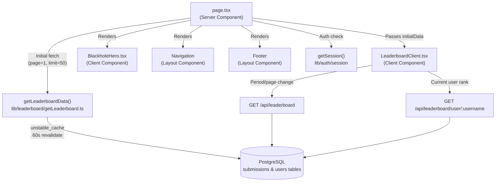
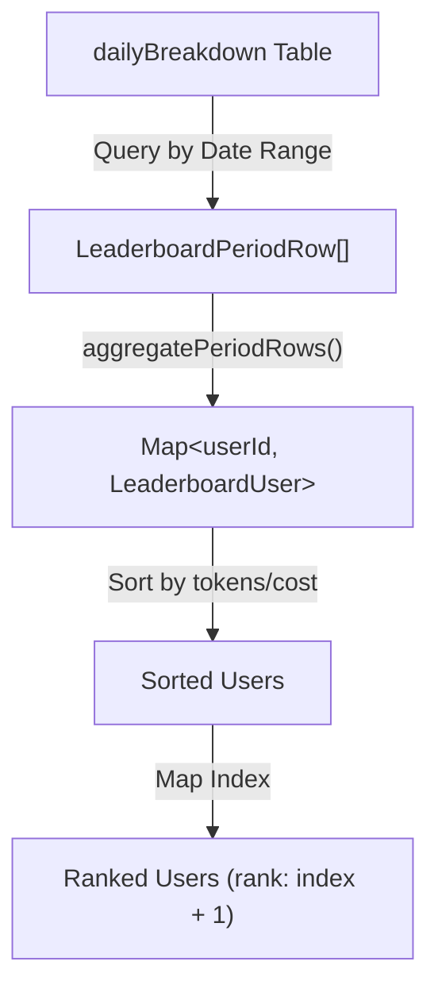
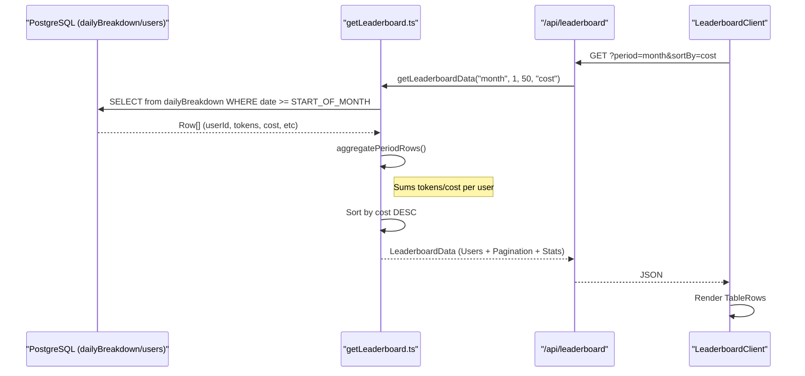

# 리더보드 페이지

관련 소스 파일

다음 파일들은 이 위키 페이지를 생성하는 맥락으로 사용되었습니다.

- [crates/tokscale-core/src/sessions/crush.rs](crates/tokscale-core/src/sessions/crush.rs)
- [packages/frontend/__tests__/api/leaderboard.test.ts](packages/frontend/__tests__/api/leaderboard.test.ts)
- [packages/frontend/__tests__/api/usersProfile.test.ts](packages/frontend/__tests__/api/usersProfile.test.ts)
- [packages/frontend/__tests__/lib/getLeaderboard.test.ts](packages/frontend/__tests__/lib/getLeaderboard.test.ts)
- [packages/frontend/__tests__/lib/getLeaderboardAllTime.test.ts](packages/frontend/__tests__/lib/getLeaderboardAllTime.test.ts)
- [packages/frontend/__tests__/lib/submissionFreshness.test.ts](packages/frontend/__tests__/lib/submissionFreshness.test.ts)
- [packages/frontend/src/app/(main)/leaderboard/LeaderboardClient.tsx](packages/frontend/src/app/(main)/leaderboard/LeaderboardClient.tsx)
- [packages/frontend/src/app/(main)/leaderboard/page.tsx](packages/frontend/src/app/(main)/leaderboard/page.tsx)
- [packages/frontend/src/app/api/leaderboard/route.ts](packages/frontend/src/app/api/leaderboard/route.ts)
- [packages/frontend/src/app/api/leaderboard/user/[username]/route.ts](packages/frontend/src/app/api/leaderboard/user/[username]/route.ts)
- [packages/frontend/src/components/landing/hooks/useSquircleClip.ts](packages/frontend/src/components/landing/hooks/useSquircleClip.ts)
- [packages/frontend/src/components/landing/sections/QuickstartSection.tsx](packages/frontend/src/components/landing/sections/QuickstartSection.tsx)
- [packages/frontend/src/components/landing/sections/WorldwideSection.tsx](packages/frontend/src/components/landing/sections/WorldwideSection.tsx)
- [packages/frontend/src/components/ui/Icons.tsx](packages/frontend/src/components/ui/Icons.tsx)
- [packages/frontend/src/lib/leaderboard/getLeaderboard.ts](packages/frontend/src/lib/leaderboard/getLeaderboard.ts)
- [packages/frontend/src/lib/leaderboard/types.ts](packages/frontend/src/lib/leaderboard/types.ts)
- [packages/frontend/vercel.json](packages/frontend/vercel.json)

## 목적과 범위

리더보드 페이지는 tokscale.ai 웹 애플리케이션의 메인 랜딩 페이지로, 사용자의 AI 토큰 사용량을 기준으로 한 전 세계 순위를 표시합니다. 이 페이지를 통해 사용자는 기간 기반 필터링(All Time, This Month, This Week)으로 자신의 토큰 소비량을 다른 사용자와 비교하고, 집계 통계를 보며, 인증된 경우 개인 순위를 확인할 수 있습니다. 또한 간소화된 "Worldwide" 리더보드가 랜딩 페이지에 표시되어 즉각적인 사회적 증거와 커뮤니티 규모를 제공합니다.

출처: [packages/frontend/src/app/(main)/leaderboard/page.tsx:39-61](), [packages/frontend/src/components/landing/sections/WorldwideSection.tsx:31-189]()

## 페이지 아키텍처

리더보드 페이지는 하이브리드 Server Component + Client Component 아키텍처로 Next.js App Router 규약을 따릅니다. 이 페이지는 성능과 데이터 신선도의 균형을 맞추기 위해 Incremental Static Regeneration(ISR)을 활용합니다.

**구성 요소 계층:**

| 구성 요소 | 유형 | 책임 |
|-----------|------|---------------|
| `page.tsx` | Server Component | 초기 데이터 가져오기, SEO, ISR 구성 |
| `LeaderboardClient` | Client Component | 대화형 필터링, 페이지네이션, 사용자 동작 |
| `BlackholeHero` | Client Component | 시각적 브랜딩, CLI 명령 복사 |
| `Navigation` | Layout Component | 전역 탐색 header |
| `Footer` | Layout Component | 링크가 포함된 사이트 footer |

출처: [packages/frontend/src/app/(main)/leaderboard/page.tsx:39-101](), [packages/frontend/src/app/(main)/leaderboard/LeaderboardClient.tsx:1-400]()

## 순위와 기간 시스템

순위 시스템은 사용자 제출 데이터를 기반으로 동적으로 계산됩니다. 핵심 로직은 `getLeaderboard.ts`에 있으며, 전체 기간과 기간 한정 쿼리를 모두 처리합니다.

### 기간 계산
기간은 [packages/frontend/src/lib/leaderboard/getLeaderboard.ts:65-91]()에서 특정 UTC 날짜 범위로 매핑됩니다.
- **Week**: 오늘을 포함한 최근 7일입니다.
- **Month**: 현재 UTC 월의 첫날부터 오늘까지입니다.
- **All**: 날짜 범위 제한이 없습니다.

### 데이터 집계
기간 기반 리더보드의 경우 시스템은 `dailyBreakdown` 테이블을 질의하고 [packages/frontend/src/lib/leaderboard/getLeaderboard.ts:117-160]()에서 메모리 내에서 `userId`별로 행을 집계합니다. 이 집계는 사용자가 여러 제출 소스를 가진 경우에도 토큰과 비용이 순위에 맞게 올바르게 합산되도록 보장합니다.

출처: [packages/frontend/src/lib/leaderboard/getLeaderboard.ts:65-91](), [packages/frontend/src/lib/leaderboard/getLeaderboard.ts:117-160]()

## Worldwide 랜딩 섹션

랜딩 페이지에는 미니 리더보드 역할을 하는 "Worldwide" 섹션(`WorldwideSection.tsx`)이 포함되어 있습니다. 고성능 시각적 표시와 탭 기반 순위를 제공합니다.

**주요 기능:**
- **탭 보기**: [packages/frontend/src/components/landing/sections/WorldwideSection.tsx:137-150]()에서 "Tokens"와 "Cost" 순위 사이를 전환합니다.
- **시각 자산**: [packages/frontend/src/components/landing/sections/WorldwideSection.tsx:101-113]()에서 투명 trophy video와 동적 blue-to-dark gradient가 있는 squircle-clipped container를 포함합니다.
- **Compact Formatting**: [packages/frontend/src/components/landing/sections/WorldwideSection.tsx:16-30]()에서 `formatCompactNumber`와 `formatCompactCurrency`를 사용해 랜딩 페이지 widget에 적합한 큰 값(예: "1.2M", "$1.5K")을 표시합니다.

출처: [packages/frontend/src/components/landing/sections/WorldwideSection.tsx:16-189]()

## 리더보드 API 구현

프런트엔드는 리더보드 상태를 유지하기 위해 두 가지 주요 API route와 상호작용합니다.

### 전역 리더보드(`/api/leaderboard`)
[packages/frontend/src/app/api/leaderboard/route.ts:16-45]()의 `GET` handler는 `period`, `sortBy`, `page`, `limit`에 대한 query parameters를 처리합니다. 안전 제한(페이지당 최대 100명)을 적용하고 search query를 trim한 뒤 `getLeaderboardData`를 호출합니다.

### 사용자 순위(`/api/leaderboard/user/[username]`)
특정 사용자의 전체 데이터셋 대비 위치를 가져오는 데 사용됩니다. 질의하기 전에 [packages/frontend/src/app/api/leaderboard/user/[username]/route.ts:18-23]()에서 GitHub username 형식을 검증합니다. 이를 통해 사용자가 결과 첫 페이지에 없더라도 UI가 "Your Rank"를 표시할 수 있습니다.

출처: [packages/frontend/src/app/api/leaderboard/route.ts:16-45](), [packages/frontend/src/app/api/leaderboard/user/[username]/route.ts:11-50]()

## 리더보드 클라이언트 UI

`LeaderboardClient` 구성 요소는 페이지의 상태ful한 중심입니다. 검색, 정렬, 페이지네이션을 관리합니다.

### 정렬과 지속성
리더보드는 `tokens` 또는 `cost` 기준 정렬을 지원합니다. 사용자 선호도는 cookie(`SORT_BY_COOKIE_NAME`)를 통해 유지되며, [packages/frontend/src/app/(main)/leaderboard/page.tsx:65-66]()에서 SSR 중 읽고 클라이언트에서 업데이트합니다.

### 현재 사용자 강조 표시
로그인한 사용자가 현재 결과 페이지에 나타나면 [packages/frontend/src/app/(main)/leaderboard/LeaderboardClient.tsx:198-206]()에서 `data-current-user="true"` data attribute를 사용해 해당 행을 강조 표시하며, blue inset box-shadow와 은은한 background tint를 적용합니다.

### 제출 신선도
리더보드는 각 사용자에 대한 "freshness" metadata를 표시하여, 얼마나 최근에 데이터를 제출했는지와 어떤 CLI 버전을 사용하는지 나타냅니다. 이는 [packages/frontend/src/lib/leaderboard/getLeaderboard.ts:131-135]()의 `buildSubmissionFreshness`를 사용해 만들어지며, [packages/frontend/__tests__/api/leaderboard.test.ts:69-74]()에서 API를 통해 전달됩니다.

출처: [packages/frontend/src/app/(main)/leaderboard/LeaderboardClient.tsx:198-206](), [packages/frontend/src/app/(main)/leaderboard/page.tsx:65-66](), [packages/frontend/src/lib/leaderboard/getLeaderboard.ts:131-135]()

## 데이터 흐름 다이어그램

다음 다이어그램은 데이터베이스에서 리더보드 UI 구성 요소까지의 데이터 흐름을 보여줍니다.

출처: [packages/frontend/src/lib/leaderboard/getLeaderboard.ts:236-270](), [packages/frontend/src/app/api/leaderboard/route.ts:16-45]()
