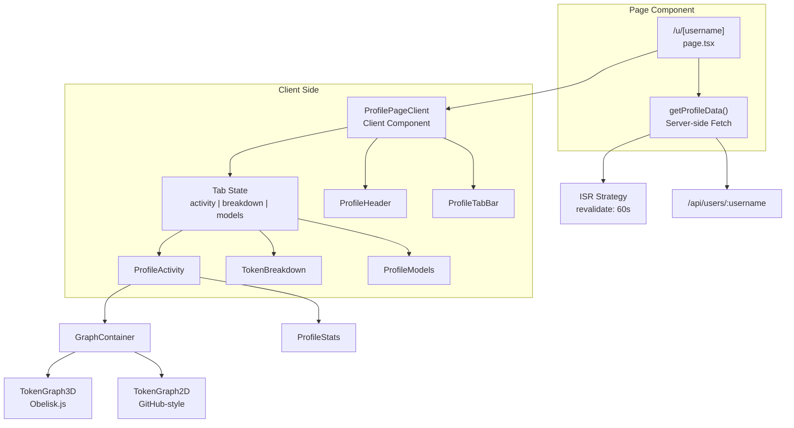
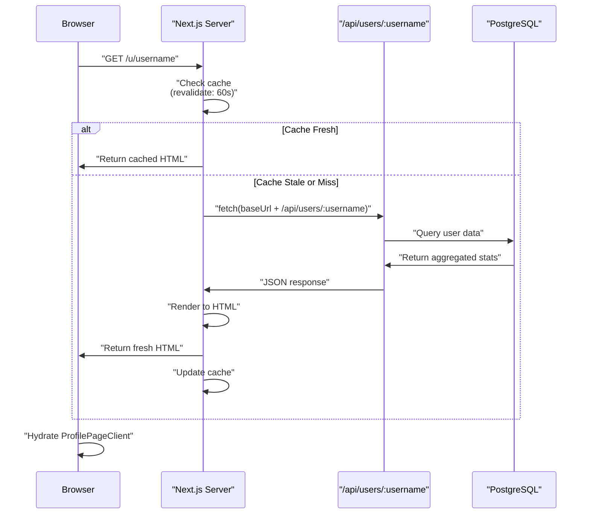
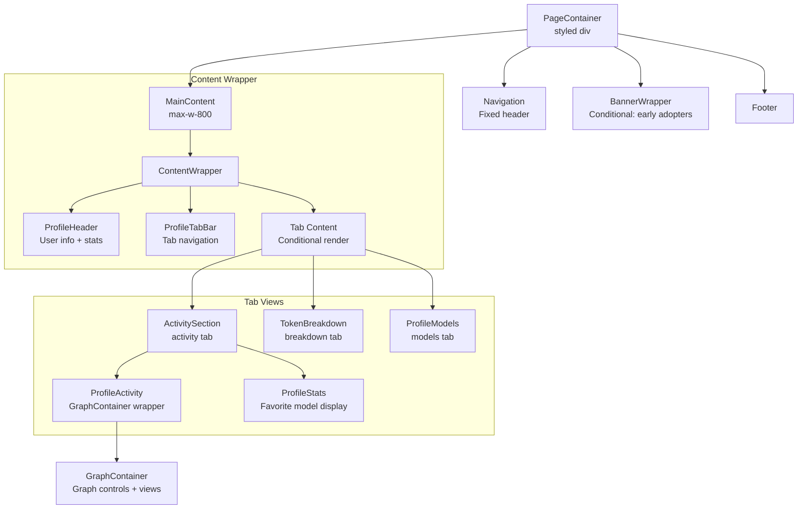
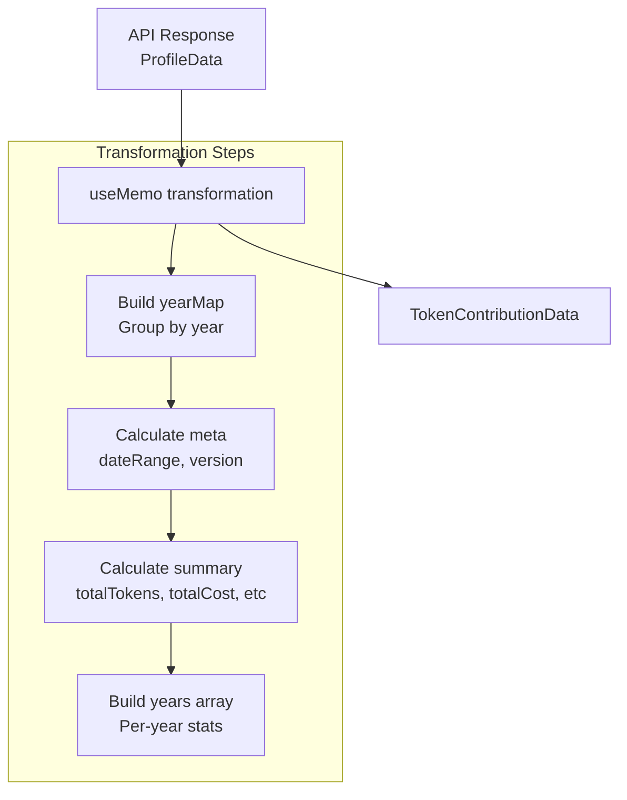
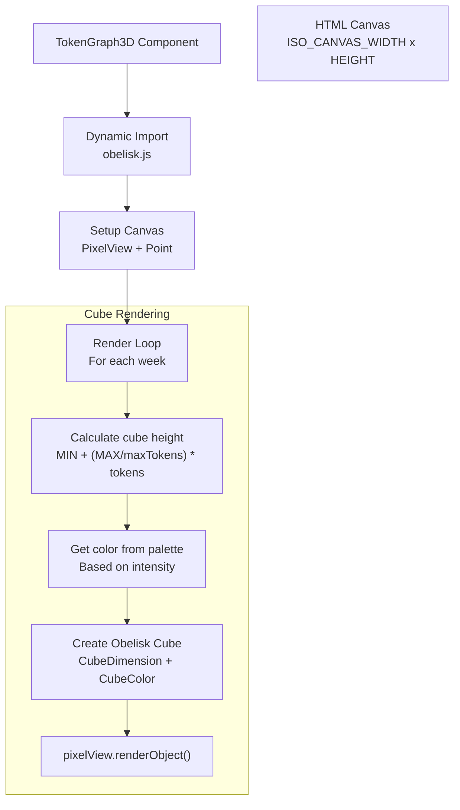
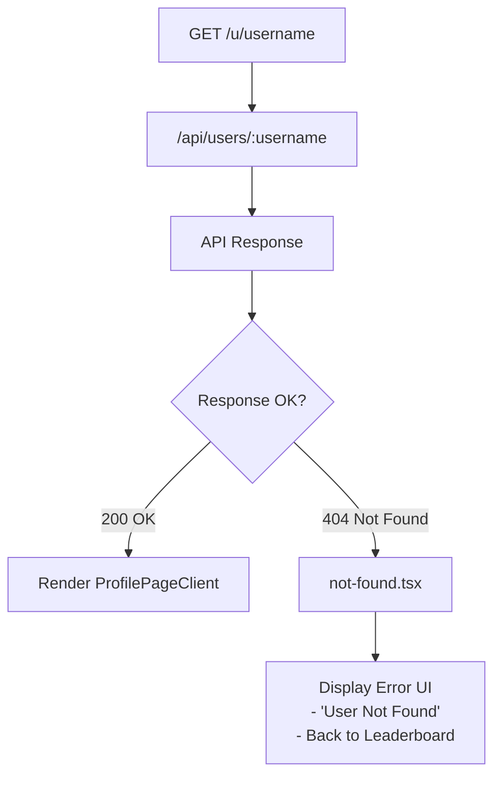

# 사용자 프로필 페이지

<details>
<summary>관련 소스 파일</summary>

다음 파일들은 이 위키 페이지를 생성하는 맥락으로 사용되었습니다.

- [packages/frontend/public/og-image.png](packages/frontend/public/og-image.png)
- [packages/frontend/src/app/u/[username]/ProfilePageClient.tsx](packages/frontend/src/app/u/[username]/ProfilePageClient.tsx)
- [packages/frontend/src/app/u/[username]/not-found.tsx](packages/frontend/src/app/u/[username]/not-found.tsx)
- [packages/frontend/src/app/u/[username]/page.tsx](packages/frontend/src/app/u/[username]/page.tsx)
- [packages/frontend/src/components/BreakdownPanel.tsx](packages/frontend/src/components/BreakdownPanel.tsx)
- [packages/frontend/src/components/GraphContainer.tsx](packages/frontend/src/components/GraphContainer.tsx)
- [packages/frontend/src/components/GraphControls.tsx](packages/frontend/src/components/GraphControls.tsx)
- [packages/frontend/src/components/StatsPanel.tsx](packages/frontend/src/components/StatsPanel.tsx)
- [packages/frontend/src/components/TokenGraph2D.tsx](packages/frontend/src/components/TokenGraph2D.tsx)
- [packages/frontend/src/components/TokenGraph3D.tsx](packages/frontend/src/components/TokenGraph3D.tsx)
- [packages/frontend/src/components/Tooltip.tsx](packages/frontend/src/components/Tooltip.tsx)
- [packages/frontend/src/components/profile/index.tsx](packages/frontend/src/components/profile/index.tsx)
- [packages/frontend/src/lib/utils.ts](packages/frontend/src/lib/utils.ts)

</details>


사용자 프로필 페이지는 Tokscale 플랫폼에 데이터를 제출한 개별 사용자의 종합적인 토큰 사용량 통계, 기여도 그래프, 활동 내역을 표시합니다. 이 페이지는 `/u/[username]`에서 공개적으로 접근할 수 있으며, 시간에 따른 AI 코딩 어시스턴트 사용량의 대화형 시각화를 제공합니다.

프로필 데이터를 제공하는 API 엔드포인트에 대한 정보는 [User Profile API](#5.3)를 참조하세요. 모든 사용자를 나열하는 리더보드 시스템에 대한 자세한 내용은 [Leaderboard Page](#4.2)를 참조하세요.

## 페이지 아키텍처

사용자 프로필 페이지는 초기 렌더링에는 Server Components를, 상호작용에는 Client Components를 사용하는 Next.js App Router로 구현됩니다. 페이지는 성능을 위해 Incremental Static Regeneration(ISR)을 사용하는 하이브리드 렌더링 전략을 따릅니다.

### Route와 구성 요소 구조



**출처:** [packages/frontend/src/app/u/[username]/page.tsx:1-67](), [packages/frontend/src/app/u/[username]/ProfilePageClient.tsx:1-212]()

페이지는 다음 렌더링 흐름을 따릅니다.
1. [packages/frontend/src/app/u/[username]/page.tsx:53-66]()의 Next.js Server Component가 초기 요청을 처리합니다.
2. [packages/frontend/src/app/u/[username]/page.tsx:7-23]()의 `getProfileData()` 함수가 60초 revalidation으로 사용자 데이터를 가져옵니다.
3. [packages/frontend/src/app/u/[username]/page.tsx:65]()에서 데이터가 클라이언트 측 렌더링과 상호작용을 위해 `ProfilePageClient`로 전달됩니다.

## 데이터 가져오기 전략

### ISR을 사용한 서버 측 Fetch

이 페이지는 60초 revalidation 기간으로 Incremental Static Regeneration을 구현합니다.



**출처:** [packages/frontend/src/app/u/[username]/page.tsx:5-23]()

[packages/frontend/src/app/u/[username]/page.tsx:5]()의 `revalidate` export가 ISR 동작을 구성합니다. `getProfileData()` 함수는 환경 변수에서 base URL을 구성하여 로컬 개발과 Vercel 배포를 모두 지원합니다 [packages/frontend/src/app/u/[username]/page.tsx:10-12]().

### 프로필 데이터 구조

API는 클라이언트 구성 요소가 소비하는 구조화된 `ProfileData` 객체를 반환합니다.

| 필드 | 타입 | 설명 |
|-------|------|-------------|
| `user` | Object | 기본 사용자 정보(id, username, displayName, avatarUrl, rank) |
| `stats` | Object | 집계된 토큰 통계(totalTokens, totalCost, activeDays) |
| `dateRange` | Object | 첫 제출 날짜와 마지막 제출 날짜 |
| `updatedAt` | string | 마지막 제출 timestamp |
| `clients` | string[] | 사용된 AI 어시스턴트 클라이언트 배열 |
| `models` | string[] | 사용된 LLM 모델 배열 |
| `modelUsage` | ModelUsage[] | 모델별 비용과 토큰 내역 |
| `contributions` | DailyContribution[] | 그래프용 일별 활동 데이터 |

**출처:** [packages/frontend/src/app/u/[username]/ProfilePageClient.tsx:22-50]()

## 구성 요소 계층

### ProfilePageClient 구조

`ProfilePageClient` 구성 요소는 사용자 프로필의 전체 레이아웃과 탭 상태를 관리합니다.



**출처:** [packages/frontend/src/app/u/[username]/ProfilePageClient.tsx:142-211]()

[packages/frontend/src/app/u/[username]/ProfilePageClient.tsx:57]()의 `ProfilePageClient` 구성 요소는 다음을 관리합니다.
- React `useState` hook을 사용한 탭 상태 [packages/frontend/src/app/u/[username]/ProfilePageClient.tsx:58]().
- `useMemo`를 사용한 API 형식에서 그래프 형식으로의 데이터 변환 [packages/frontend/src/app/u/[username]/ProfilePageClient.tsx:61-119]().
- `activeTab`에 기반한 조건부 렌더링 [packages/frontend/src/app/u/[username]/ProfilePageClient.tsx:169-205]().

## Activity 탭

Activity 탭은 사용자의 기여도 그래프와 통계를 표시하며, 일별 토큰 사용량의 2D 및 3D 시각화를 모두 제공합니다.

### 그래프 데이터 변환

`graphData` memo는 원시 API 데이터를 `GraphContainer`가 요구하는 `TokenContributionData` 형식으로 변환합니다.



**출처:** [packages/frontend/src/app/u/[username]/ProfilePageClient.tsx:61-119]()

[packages/frontend/src/app/u/[username]/ProfilePageClient.tsx:69-86]()의 변환은 토큰 사용량을 연도별로 집계하기 위한 `yearMap`을 생성하여 다년간 시각화를 가능하게 합니다.

### 그래프 컨테이너와 컨트롤

[packages/frontend/src/components/GraphContainer.tsx:67]()의 `GraphContainer` 구성 요소는 보기 모드(2D vs 3D)와 필터링 로직을 관리합니다.

- **보기 전환**: 사용자는 `GraphControls`를 사용해 2D와 3D 보기 사이를 전환할 수 있습니다 [packages/frontend/src/components/GraphControls.tsx:276-300]().
- **필터링**: 연도별 필터링 [packages/frontend/src/components/GraphContainer.tsx:88-90]()과 클라이언트 소스별 필터링 [packages/frontend/src/components/GraphContainer.tsx:82-85]()을 지원합니다.
- **팔레트 관리**: 사용자는 서로 다른 색상 팔레트(예: "github", "gitlab", "tokscale")를 선택할 수 있습니다 [packages/frontend/src/components/GraphControls.tsx:58-81]().

**출처:** [packages/frontend/src/components/GraphContainer.tsx:67-183](), [packages/frontend/src/components/GraphControls.tsx:9-263]()

### 3D 아이소메트릭 시각화

`TokenGraph3D` 구성 요소는 `obelisk.js`를 사용해 아이소메트릭 cube 기반 기여도 그래프를 렌더링합니다.



**출처:** [packages/frontend/src/components/TokenGraph3D.tsx:135-225]()

#### 주요 렌더링 세부 사항

| 측면 | 구현 | 위치 |
|--------|----------------|----------|
| Canvas dimensions | `ISO_CANVAS_WIDTH = 900`, `ISO_CANVAS_HEIGHT = 450` | [packages/frontend/src/lib/constants.ts]() |
| Cube size | `CUBE_SIZE = 8` pixels | [packages/frontend/src/lib/constants.ts]() |
| Min/Max height | `MIN_CUBE_HEIGHT = 2`, `MAX_CUBE_HEIGHT = 20` | [packages/frontend/src/lib/constants.ts]() |
| Grid offset | `GH_OFFSET = 14` pixels | [packages/frontend/src/components/TokenGraph3D.tsx:191]() |
| Obelisk point | `Point(130, 90)` for 3D origin | [packages/frontend/src/components/TokenGraph3D.tsx:188]() |

**출처:** [packages/frontend/src/components/TokenGraph3D.tsx:179-224]()

### 대화형 기능

그래프는 hover와 click 상호작용을 지원합니다.

- **Tooltip**: 날짜 위에 hover하면 특정 토큰 내역(Input, Output, Cache Read/Write)이 포함된 `Tooltip` 구성 요소가 표시됩니다 [packages/frontend/src/components/Tooltip.tsx:128-194]().
- **Breakdown Panel**: 날짜를 클릭하면 `BreakdownPanel` [packages/frontend/src/components/BreakdownPanel.tsx:121-197]()이 열리며, 해당 날짜의 클라이언트별 및 모델별 비용을 보여줍니다.

**출처:** [packages/frontend/src/components/GraphContainer.tsx:123-130](), [packages/frontend/src/components/BreakdownPanel.tsx:1-197]()

## 통계와 내역

### StatsPanel 구성 요소

[packages/frontend/src/components/StatsPanel.tsx:143]()의 `StatsPanel`은 사용자의 성과에 대한 상위 수준 개요를 제공합니다.

| 통계 | 로직 |
|-----------|-------|
| Total Cost | 모든 contributions의 비용 합계 [packages/frontend/src/components/StatsPanel.tsx:154]() |
| Active Days | 토큰 사용량이 있는 날짜 수 [packages/frontend/src/components/StatsPanel.tsx:156]() |
| Current Streak | `calculateCurrentStreak`를 사용해 계산 [packages/frontend/src/lib/utils.ts:246]() |
| Best Day | `findBestDay`를 사용해 찾음 [packages/frontend/src/lib/utils.ts:225]() |

**출처:** [packages/frontend/src/components/StatsPanel.tsx:143-179](), [packages/frontend/src/lib/utils.ts:225-270]()

### Token Breakdown 탭

`TokenBreakdown` 구성 요소(`activeTab === "breakdown"`일 때 렌더링)는 Input, Output, Cache Read, Cache Write, Reasoning이라는 토큰 범주의 세부 보기를 표시합니다 [packages/frontend/src/app/u/[username]/ProfilePageClient.tsx:194]().

## Model Usage 탭

[packages/frontend/src/app/u/[username]/ProfilePageClient.tsx:203]()의 `ProfileModels` 구성 요소는 사용자가 활용한 모든 LLM 모델의 사용량 데이터를 표시합니다.

- **데이터 소스**: 모델별 비용과 토큰 수를 포함하는 `data.modelUsage`를 사용합니다 [packages/frontend/src/app/u/[username]/ProfilePageClient.tsx:48]().
- **Favorite Model**: favorite model은 `modelUsage` 배열에서 비용이 가장 높은 모델로 결정됩니다 [packages/frontend/src/app/u/[username]/ProfilePageClient.tsx:181]().

## 공유와 임베드

사용자는 다양한 프로필 버튼을 통해 자신의 통계를 공유할 수 있습니다.

- **Embed Dialog**: `ProfileEmbedDialog`([packages/frontend/src/components/profile/index.tsx:11]()에서 import됨)는 2D/3D 프로필 카드와 shields.io 스타일 배지를 임베드하기 위한 코드 snippet을 제공합니다.
- **Action Buttons**: 프로필 header에는 "Share", "Copy Link", "Embed" 버튼이 포함됩니다 [packages/frontend/src/components/profile/index.tsx:293-351]().

**출처:** [packages/frontend/src/components/profile/index.tsx:11-351]()

## 오류 처리

### Not Found 페이지

사용자가 존재하지 않거나 데이터를 제출하지 않은 경우 사용자 지정 not-found 페이지가 렌더링됩니다.



**출처:** [packages/frontend/src/app/u/[username]/page.tsx:55-59](), [packages/frontend/src/app/u/[username]/not-found.tsx:56-74]()

[packages/frontend/src/app/u/[username]/page.tsx:58]()의 Next.js `notFound()` 함수는 `not-found.tsx` 렌더링을 트리거하며, 이는 중앙 정렬된 오류 메시지와 리더보드로 돌아가는 링크를 표시합니다 [packages/frontend/src/app/u/[username]/not-found.tsx:61-69]().

### SEO와 Metadata

페이지는 소셜 공유를 위해 동적 metadata를 생성합니다.

```typescript
export async function generateMetadata({ params }): Promise<Metadata> {
  const { username } = await params;
  return {
    title: `@${username} - Token Usage | Tokscale`,
    description: `View ${username}'s AI token usage statistics...`,
    openGraph: { 
      type: 'profile',
      images: [{ url: 'https://tokscale.ai/og-image.png' }]
    }
  };
}
```

**출처:** [packages/frontend/src/app/u/[username]/page.tsx:25-51]()
