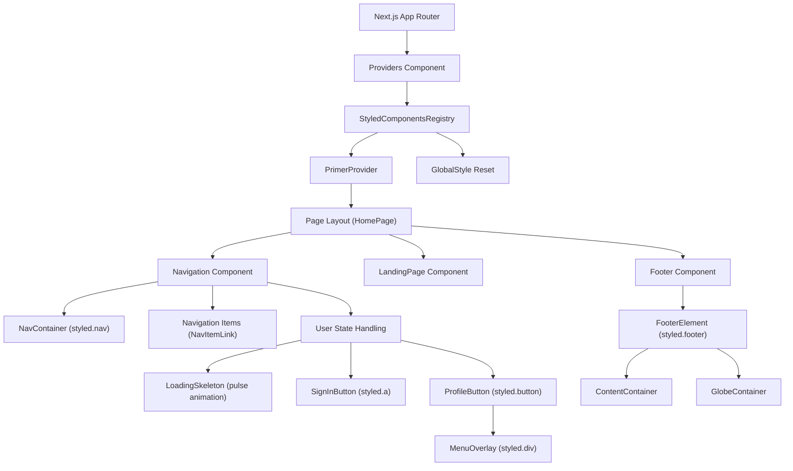
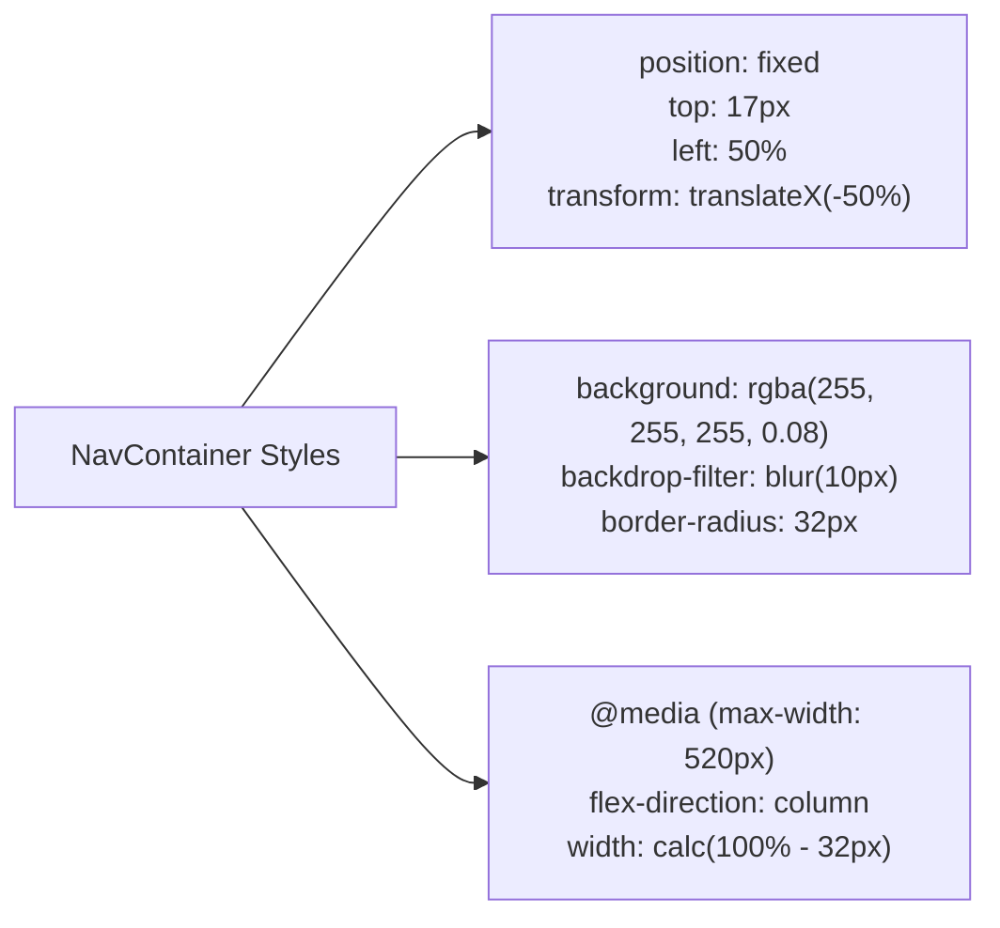
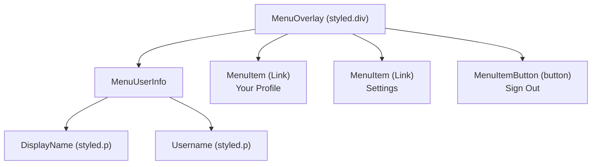
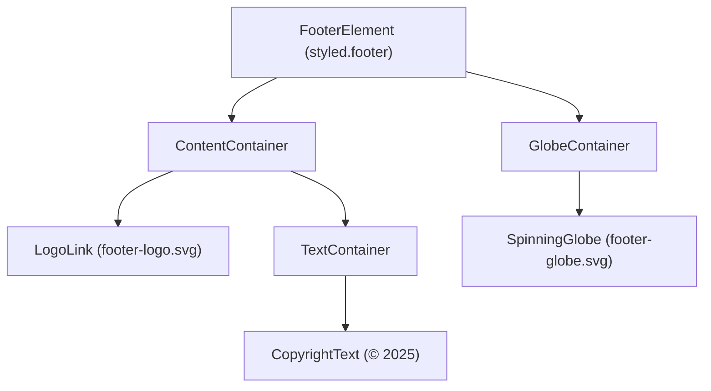

# 탐색과 레이아웃

관련 소스 파일

다음 파일들은 이 위키 페이지를 생성하는 맥락으로 사용되었습니다.

- [packages/frontend/public/assets/footer-globe.svg](packages/frontend/public/assets/footer-globe.svg)
- [packages/frontend/public/assets/footer-logo-icon.png](packages/frontend/public/assets/footer-logo-icon.png)
- [packages/frontend/public/assets/footer-logo.svg](packages/frontend/public/assets/footer-logo.svg)
- [packages/frontend/src/app/(main)/page.tsx](packages/frontend/src/app/(main)/page.tsx)
- [packages/frontend/src/components/BlackholeHero.tsx](packages/frontend/src/components/BlackholeHero.tsx)
- [packages/frontend/src/components/Switch.tsx](packages/frontend/src/components/Switch.tsx)
- [packages/frontend/src/components/layout/Footer.tsx](packages/frontend/src/components/layout/Footer.tsx)
- [packages/frontend/src/components/layout/Navigation.tsx](packages/frontend/src/components/layout/Navigation.tsx)
- [packages/frontend/src/lib/db/index.ts](packages/frontend/src/lib/db/index.ts)
- [packages/frontend/src/lib/useSettings.ts](packages/frontend/src/lib/useSettings.ts)

## 목적과 범위

이 페이지는 고정 header navigation bar, footer, 전역 layout provider 시스템을 포함해 tokscale 웹 프런트엔드의 지속적인 탐색 및 레이아웃 구성 요소를 문서화합니다. 이러한 구성 요소는 모든 페이지에 렌더링되며, 애플리케이션의 일관된 시각 구조와 스타일링 기반을 제공합니다. 리더보드나 사용자 프로필 같은 특정 페이지 레이아웃에 대한 정보는 [4.2]()와 [4.3]()을 참조하세요. Next.js 애플리케이션 구조와 라우팅에 대한 자세한 내용은 [4.1]()을 참조하세요.

## 레이아웃 구성 요소 계층

다음 다이어그램은 레이아웃 구성 요소가 어떻게 구조화되어 있고 애플리케이션의 어디에 나타나는지 보여줍니다.

**출처:** [packages/frontend/src/app/(main)/page.tsx:1-45](), [packages/frontend/src/components/layout/Navigation.tsx:1-356](), [packages/frontend/src/components/layout/Footer.tsx:1-254]()

## Navigation 구성 요소 아키텍처

navigation bar는 스크롤 중에도 계속 보이는 fixed-position header인 `Navigation` 구성 요소로 구현됩니다. 이 구성 요소는 사용자 인증 상태를 관리하고 그에 따라 UI를 조정합니다.

### 구성 요소 구조

| 요소 | 구성 요소/스타일 | 목적 |
|---------|----------------|---------|
| Container | `NavContainer` | blur backdrop이 있는 fixed-position wrapper [packages/frontend/src/components/layout/Navigation.tsx:28-61]() |
| Navigation Items | `NavItemLink` | 주요 섹션(Leaderboard, Profile)으로 연결되는 링크 [packages/frontend/src/components/layout/Navigation.tsx:115-152]() |
| User State | 조건부 렌더링 | loading skeleton, sign-in button 또는 profile menu를 표시 [packages/frontend/src/components/layout/Navigation.tsx:320-350]() |
| Profile Menu | `MenuOverlay` | 사용자 옵션이 포함된 사용자 지정 styled dropdown [packages/frontend/src/components/layout/Navigation.tsx:255-266]() |

### Fixed Positioning과 Styling

navigation은 `styled-components`를 사용하는 CSS-in-JS로 구현됩니다. `NavContainer`는 viewport의 상단 중앙에 위치하며, frosted glass 효과를 위해 backdrop filter를 사용합니다.

**출처:** [packages/frontend/src/components/layout/Navigation.tsx:28-61]()

### 인증 상태 관리

navigation 구성 요소는 사용자 session 상태를 가져오고 결과에 따라 다른 UI를 렌더링합니다. 가져오는 동안에는 pulse animation이 적용된 `LoadingSkeleton`을 사용합니다.

| 상태 | 렌더링되는 구성 요소 | 설명 |
|-------|-------------------|-------------|
| `isLoading === true` | `LoadingSkeleton` | `pulse` keyframes를 사용하는 pulsing skeleton [packages/frontend/src/components/layout/Navigation.tsx:154-161]() |
| `user === null` | `SignInButton` | 아이콘과 텍스트가 있는 GitHub OAuth 링크 [packages/frontend/src/components/layout/Navigation.tsx:173-196]() |
| `user !== null` | `ProfileButton` | 사용자 avatar를 렌더링하고 `MenuOverlay`를 토글 [packages/frontend/src/components/layout/Navigation.tsx:230-249]() |

**출처:** [packages/frontend/src/components/layout/Navigation.tsx:19-26](), [packages/frontend/src/components/layout/Navigation.tsx:320-350]()

### 사용자 메뉴 시스템

인증된 사용자 메뉴는 해당 사용자의 특정 프로필과 설정으로 연결되는 링크를 제공합니다.

**출처:** [packages/frontend/src/components/layout/Navigation.tsx:255-310]()

## 로컬 데이터 시각화 페이지

웹 플랫폼의 많은 부분은 소셜 리더보드에 초점을 맞추지만, 프런트엔드는 `BlackholeHero` 같은 CLI 기능을 반영하는 로컬 데이터 시각화 구성 요소도 지원합니다.

### Hero 구성 요소

`BlackholeHero`는 사용자가 CLI 도구를 실행하도록 유도하는 주요 랜딩 시각 요소 역할을 합니다.

| 코드 엔티티 | 역할 |
|-------------|------|
| `BlackholeHero` | 랜딩 hero 섹션의 메인 함수형 구성 요소 [packages/frontend/src/components/BlackholeHero.tsx:9]() |
| `CommandCard` | 복사 가능한 `bunx tokscale` 명령을 담는 container [packages/frontend/src/components/BlackholeHero.tsx:200-216]() |
| `handleCopy` | CLI 명령을 복사하기 위해 `navigator.clipboard`를 활용하는 함수 [packages/frontend/src/components/BlackholeHero.tsx:12-16]() |

**출처:** [packages/frontend/src/components/BlackholeHero.tsx:9-92]()

## Footer 구성 요소

`Footer` 구성 요소는 페이지 하단에 지속적인 링크와 시각적 브랜딩을 제공합니다.

### 구조와 애니메이션

footer는 60초 linear infinite rotation을 사용하는 `SpinningGlobe`를 제공합니다.

**출처:** [packages/frontend/src/components/layout/Footer.tsx:25-40](), [packages/frontend/src/components/layout/Footer.tsx:176-197](), [packages/frontend/src/components/layout/Footer.tsx:202-250]()

## 설정과 테마 관리

프런트엔드 레이아웃은 사용자 설정, 특히 색상 팔레트와 리더보드 정렬 선호도의 영향을 받습니다.

### useSettings Hook

`useSettings` hook은 상태를 `localStorage` 및 cookies와 동기화합니다.

- **상태 지속성**: `tokscale-settings` 키로 `localStorage`를 사용합니다 [packages/frontend/src/lib/useSettings.ts:24]().
- **Cookie Sync**: 서버 측 소비를 위해 `leaderboardSortBy` 선호도를 cookie에 동기화합니다 [packages/frontend/src/lib/useSettings.ts:30-33]().
- **Dark Mode**: 문서 root에 `dark` class를 강제로 적용합니다 [packages/frontend/src/lib/useSettings.ts:104-109]().

**출처:** [packages/frontend/src/lib/useSettings.ts:1-144]()

### Sort Toggle

`Switch` 구성 요소는 레이아웃 내부(주로 리더보드 섹션)에서 "Tokens" 또는 "Cost" 기준 정렬을 전환하는 데 사용됩니다.

- **구현**: `Track` 및 `Thumb` 구성 요소가 있는 styled toggle입니다 [packages/frontend/src/components/Switch.tsx:28-55]().
- **상호작용**: 일반적으로 `useSettings`의 `setLeaderboardSort`에 매핑되는 `onChange` callback을 트리거합니다 [packages/frontend/src/components/Switch.tsx:57-86]().

**출처:** [packages/frontend/src/components/Switch.tsx:1-86](), [packages/frontend/src/lib/useSettings.ts:132-135]()
