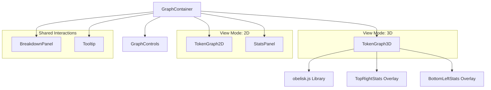
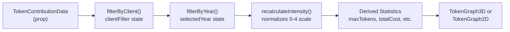
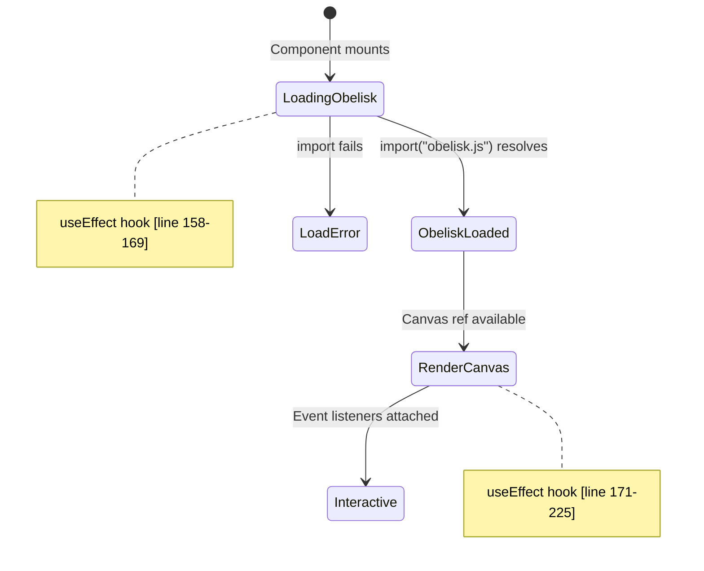
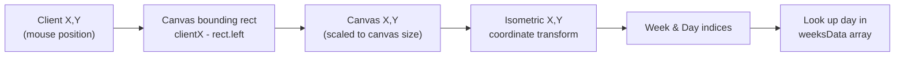

# 3D 시각화 구성 요소

<details>
<summary>관련 소스 파일</summary>

다음 파일들은 이 위키 페이지를 생성하는 맥락으로 사용되었습니다.

- [packages/frontend/__tests__/api/submit.test.ts](packages/frontend/__tests__/api/submit.test.ts)
- [packages/frontend/src/components/BreakdownPanel.tsx](packages/frontend/src/components/BreakdownPanel.tsx)
- [packages/frontend/src/components/GraphContainer.tsx](packages/frontend/src/components/GraphContainer.tsx)
- [packages/frontend/src/components/GraphControls.tsx](packages/frontend/src/components/GraphControls.tsx)
- [packages/frontend/src/components/SourceLogo.tsx](packages/frontend/src/components/SourceLogo.tsx)
- [packages/frontend/src/components/StatsPanel.tsx](packages/frontend/src/components/StatsPanel.tsx)
- [packages/frontend/src/components/TokenGraph2D.tsx](packages/frontend/src/components/TokenGraph2D.tsx)
- [packages/frontend/src/components/TokenGraph3D.tsx](packages/frontend/src/components/TokenGraph3D.tsx)
- [packages/frontend/src/components/Tooltip.tsx](packages/frontend/src/components/Tooltip.tsx)
- [packages/frontend/src/lib/constants.ts](packages/frontend/src/lib/constants.ts)
- [packages/frontend/src/lib/types.ts](packages/frontend/src/lib/types.ts)
- [packages/frontend/src/lib/utils.ts](packages/frontend/src/lib/utils.ts)
- [packages/frontend/src/lib/validation/submission.ts](packages/frontend/src/lib/validation/submission.ts)

</details>


## 목적과 범위

이 문서는 아이소메트릭 기여도 그래프를 렌더링하는 Tokscale 프런트엔드의 3D 시각화 구성 요소를 설명합니다. 주요 구성 요소는 Obelisk.js 라이브러리를 사용해 3차원 아이소메트릭 관점의 GitHub 스타일 기여도 그리드를 만드는 `TokenGraph3D`입니다. 이러한 구성 요소는 일별 토큰 사용량 데이터를 활동 강도에 따라 높이가 달라지는 색상 3D cube로 표시합니다.

이 시스템은 다중 소스 데이터(예: OpenCode, Cursor, Claude Code)를 처리하도록 설계되었으며, 사용자가 특정 클라이언트나 연도별로 필터링하면서도 3D 보기를 실시간으로 업데이트할 수 있게 합니다.

---

## 구성 요소 아키텍처

3D 시각화 시스템은 보기 모드, 필터링, 데이터 변환을 관리하는 오케스트레이터인 `GraphContainer`를 중심으로 하는 계층적 구성 요소 구조로 이루어져 있습니다.

### 구성 요소 계층



**출처:** [packages/frontend/src/components/GraphContainer.tsx:1-182](), [packages/frontend/src/components/TokenGraph3D.tsx:1-338]()

---

## GraphContainer 상태 관리

`GraphContainer` 구성 요소는 2D와 3D 시각화 모드 모두에 대한 전체 상태를 관리하며, 보기 전환, 필터링, 사용자 상호작용을 처리합니다.

### 상태 변수와 데이터 변환

| 상태 변수 | 타입 | 목적 |
|---------------|------|---------|
| `view` | `ViewMode` | `"2d"`와 `"3d"` 표시 모드 사이를 전환합니다 [packages/frontend/src/lib/types.ts:114]() |
| `selectedYear` | `string` | 특정 연도로 contributions를 필터링합니다 |
| `hoveredDay` | `DailyContribution \| null` | tooltip을 위해 현재 hover된 날짜를 추적합니다 |
| `tooltipPosition` | `TooltipPosition \| null` | tooltip 배치를 위한 마우스 좌표를 저장합니다 |
| `selectedDay` | `DailyContribution \| null` | breakdown panel을 위해 클릭된 날짜를 추적합니다 |
| `clientFilter` | `ClientType[]` | 클라이언트(OpenCode, Cursor 등)별로 contributions를 필터링합니다 |

### 데이터 처리 파이프라인



**출처:** [packages/frontend/src/components/GraphContainer.tsx:82-98](), [packages/frontend/src/lib/utils.ts:77-118]()

### 계산된 통계

container는 시각화 overlay를 구동하기 위해 memoized values를 사용해 여러 핵심 통계를 계산합니다.

- **maxTokens**: 높이 scaling을 위한 모든 날짜 중 최대 token count [packages/frontend/src/components/GraphContainer.tsx:92]()
- **totalCost**: 필터링된 집합의 모든 일별 비용 합계 [packages/frontend/src/components/GraphContainer.tsx:93]()
- **totalTokens**: 모든 일별 토큰 사용량 합계 [packages/frontend/src/components/GraphContainer.tsx:94]()
- **activeDays**: 0이 아닌 토큰 사용량이 있는 날짜 수 [packages/frontend/src/components/GraphContainer.tsx:95]()
- **bestDay**: 토큰 사용량이 가장 높은 날짜 [packages/frontend/src/components/GraphContainer.tsx:96]()
- **currentStreak**: 오늘까지 이어지는 연속 활동 날짜 수 [packages/frontend/src/components/GraphContainer.tsx:97]()
- **longestStreak**: 기록상 가장 긴 연속 날짜 sequence [packages/frontend/src/components/GraphContainer.tsx:98]()

**출처:** [packages/frontend/src/components/GraphContainer.tsx:92-98]()

---

## TokenGraph3D 구성 요소

`TokenGraph3D` 구성 요소는 Obelisk.js를 사용해 아이소메트릭 3D 기여도 그래프를 렌더링합니다. 라이브러리 동적 로딩, canvas 렌더링, 사용자 상호작용을 위한 좌표 변환을 관리합니다.

### 구성 요소 Props 인터페이스

이 구성 요소는 3D 그리드와 floating overlay를 모두 렌더링하기 위해 포괄적인 사용량 데이터와 streak 통계를 받습니다.

**출처:** [packages/frontend/src/components/TokenGraph3D.tsx:119-133]()

### 렌더링 상수

이 구성 요소는 일관된 아이소메트릭 크기 지정을 위해 여러 상수를 사용합니다.

| 상수 | 값 | 목적 |
|----------|-------|---------|
| `CUBE_SIZE` | 16 | 각 아이소메트릭 cube의 기본 크기 [packages/frontend/src/lib/constants.ts:14]() |
| `MAX_CUBE_HEIGHT` | 100 | 가장 높은 활동의 최대 높이 [packages/frontend/src/lib/constants.ts:15]() |
| `MIN_CUBE_HEIGHT` | 3 | 활동이 없을 때의 최소 높이 [packages/frontend/src/lib/constants.ts:16]() |
| `ISO_CANVAS_WIDTH` | 1000 | 픽셀 단위 canvas 너비 [packages/frontend/src/lib/constants.ts:19]() |
| `ISO_CANVAS_HEIGHT` | 600 | 픽셀 단위 canvas 높이 [packages/frontend/src/lib/constants.ts:20]() |

**출처:** [packages/frontend/src/lib/constants.ts:14-20]()

---

## Obelisk.js 통합

`TokenGraph3D` 구성 요소는 초기 payload에 무거운 WebGL 인접 라이브러리를 번들링하지 않도록 Obelisk.js를 동적으로 로드하여, 2D 그래프만 보는 사용자의 성능을 개선합니다.

### 동적 라이브러리 로딩



**출처:** [packages/frontend/src/components/TokenGraph3D.tsx:158-172]()

---

## Canvas 렌더링 알고리즘

Obelisk.js가 로드되면 구성 요소는 53주 × 7일을 나타내는 중첩 루프에서 3D cube를 렌더링합니다.

### Cube 높이 계산

각 cube의 높이는 해당 연도의 최대값 대비 토큰 사용량을 기준으로 계산됩니다 [packages/frontend/src/components/TokenGraph3D.tsx:205-208]().

```typescript
let cubeHeight = MIN_CUBE_HEIGHT;
if (day && maxTokens > 0) {
  cubeHeight = MIN_CUBE_HEIGHT + Math.floor((MAX_CUBE_HEIGHT / maxTokens) * day.totals.tokens);
}
```

### 색상 해석

색상은 intensity(0-4)를 기준으로 palette에서 해석되며, CSS 변수에 대한 fallback 처리가 포함됩니다 [packages/frontend/src/components/TokenGraph3D.tsx:210-215]().

1. `getGradeColor(palette, intensity)`를 사용해 palette에서 color hex를 가져옵니다.
2. 색상이 CSS 변수인지(`"var("`로 시작) 확인합니다.
3. 변수이면 `isDark`를 기준으로 theme-specific default color로 해석합니다.
4. `hexToNumber(resolvedColor)`를 사용해 hex color를 숫자 형식으로 변환합니다.

**출처:** [packages/frontend/src/components/TokenGraph3D.tsx:205-215]()

---

## 대화형 기능

`TokenGraph3D` 구성 요소는 2D 마우스 좌표를 아이소메트릭 그리드 위치로 변환하여 hover와 click 상호작용을 제공합니다.

### 마우스 좌표 변환

`getDayAtPosition` 함수는 화면 좌표를 그리드 index로 변환합니다 [packages/frontend/src/components/TokenGraph3D.tsx:227-250]().



변환 방정식은 `CUBE_SIZE`와 특정 offset을 사용해 diamond-shaped 아이소메트릭 그리드를 다시 2D 배열에 매핑합니다 [packages/frontend/src/components/TokenGraph3D.tsx:238-239]().

**출처:** [packages/frontend/src/components/TokenGraph3D.tsx:227-250]()

---

## Breakdown Panel

사용자가 2D 또는 3D 그래프에서 날짜를 클릭하면 `BreakdownPanel`이 나타나며, 클라이언트와 모델별 사용량의 상세 보기를 제공합니다.

### Breakdown의 데이터 구성

panel은 contributions를 클라이언트 유형별로 그룹화하고 비용순으로 정렬합니다 [packages/frontend/src/components/BreakdownPanel.tsx:124-125]().

- **Source Logos**: 중앙 mapping에서 가져오는 `SourceLogo` 구성 요소를 사용해 렌더링됩니다 [packages/frontend/src/components/SourceLogo.tsx:24-85]().
- **Client Grouping**: 같은 클라이언트 아래의 여러 모델(예: `codex` 아래의 `gpt-4o`와 `gpt-4-turbo`)이 함께 그룹화됩니다 [packages/frontend/src/components/BreakdownPanel.tsx:156-163]().
- **Recalculation**: 필터가 활성화된 경우 panel은 해당 날짜에 대한 필터링된 합계를 반영합니다 [packages/frontend/src/lib/utils.ts:120-155]().

**출처:** [packages/frontend/src/components/BreakdownPanel.tsx:121-197](), [packages/frontend/src/components/SourceLogo.tsx:24-85]()

---

## Graph Controls와 필터

`GraphControls` 구성 요소는 시각화를 조작하기 위한 사용자 인터페이스를 제공합니다.

### 컨트롤 기능

- **View Toggle**: 2D(Canvas API)와 3D(Obelisk.js) 사이를 전환합니다 [packages/frontend/src/components/GraphControls.tsx:276-302]().
- **Palette Selector**: "green", "halloween", "YlGnBu" 같은 사전 정의된 color scheme 중에서 선택할 수 있습니다 [packages/frontend/src/components/GraphControls.tsx:64-81]().
- **Client Filters**: 개별 소스(Cursor, Claude 등)를 토글하여 기여도 그래프에 대한 특정 영향을 분리합니다 [packages/frontend/src/components/GraphControls.tsx:159-185]().
- **Year Selector**: 특정 calendar year의 사용량을 표시하도록 데이터 범위를 변경합니다 [packages/frontend/src/components/GraphControls.tsx:93-109]().

**출처:** [packages/frontend/src/components/GraphControls.tsx:9-263]()
