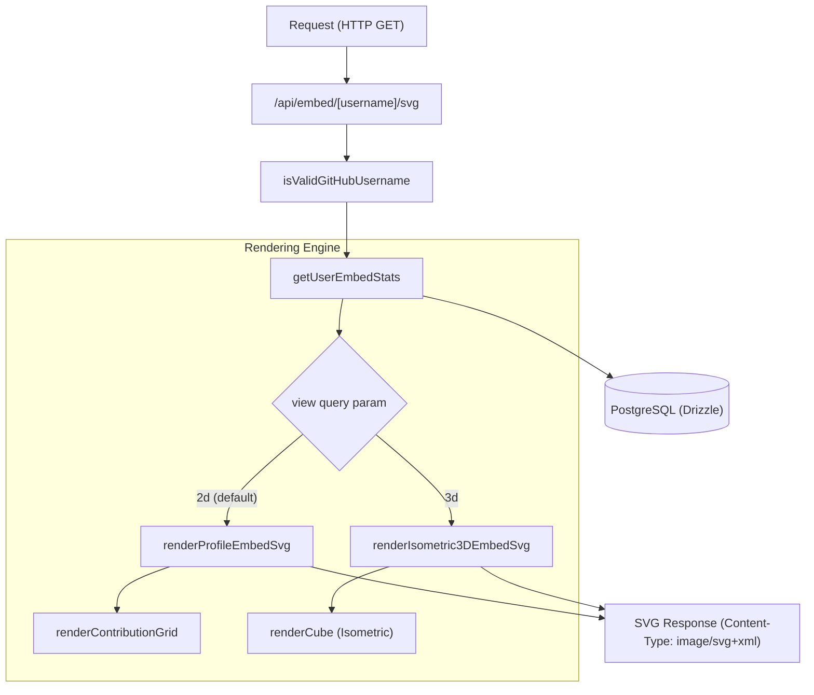

# 임베드 가능한 프로필 카드와 배지

관련 소스 파일

다음 파일들은 이 위키 페이지를 생성하는 맥락으로 사용되었습니다.

- [.github/assets/client-copilot.jpg](.github/assets/client-copilot.jpg)
- [crates/tokscale-core/src/sessions/copilot.rs](crates/tokscale-core/src/sessions/copilot.rs)
- [packages/frontend/__tests__/api/embedSvgRoute.test.ts](packages/frontend/__tests__/api/embedSvgRoute.test.ts)
- [packages/frontend/__tests__/lib/renderIsometric3DSvg.test.ts](packages/frontend/__tests__/lib/renderIsometric3DSvg.test.ts)
- [packages/frontend/__tests__/lib/renderProfileBadgeSvg.test.ts](packages/frontend/__tests__/lib/renderProfileBadgeSvg.test.ts)
- [packages/frontend/__tests__/lib/renderProfileEmbedSvg.test.ts](packages/frontend/__tests__/lib/renderProfileEmbedSvg.test.ts)
- [packages/frontend/__tests__/lib/username.test.ts](packages/frontend/__tests__/lib/username.test.ts)
- [packages/frontend/src/app/api/badge/[username]/svg/route.ts](packages/frontend/src/app/api/badge/[username]/svg/route.ts)
- [packages/frontend/src/app/api/embed/[username]/svg/route.ts](packages/frontend/src/app/api/embed/[username]/svg/route.ts)
- [packages/frontend/src/components/TabBar.tsx](packages/frontend/src/components/TabBar.tsx)
- [packages/frontend/src/components/profile/ProfileEmbedDialog.tsx](packages/frontend/src/components/profile/ProfileEmbedDialog.tsx)
- [packages/frontend/src/lib/embed/getUserEmbedStats.ts](packages/frontend/src/lib/embed/getUserEmbedStats.ts)
- [packages/frontend/src/lib/embed/renderIsometric3DSvg.ts](packages/frontend/src/lib/embed/renderIsometric3DSvg.ts)
- [packages/frontend/src/lib/embed/renderProfileBadgeSvg.ts](packages/frontend/src/lib/embed/renderProfileBadgeSvg.ts)
- [packages/frontend/src/lib/embed/renderProfileEmbedSvg.ts](packages/frontend/src/lib/embed/renderProfileEmbedSvg.ts)
- [packages/frontend/src/lib/format.ts](packages/frontend/src/lib/format.ts)
- [packages/frontend/src/lib/validation/username.ts](packages/frontend/src/lib/validation/username.ts)

**Tokscale embed 시스템은 사용자가 GitHub README나 개인 포트폴리오 같은 외부 플랫폼에 자신의 AI 토큰 사용량 통계를 표시할 수 있게** 합니다. 이 시스템은 특화된 API 엔드포인트를 통해 2D 프로필 카드, 3D 아이소메트릭 기여도 그래프, Shields.io 스타일 배지를 위한 고성능 SVG 생성을 제공합니다.

## 시스템 아키텍처와 데이터 흐름

embed 시스템은 Next.js 애플리케이션 내부의 서버 측 렌더링 파이프라인으로 동작합니다. PostgreSQL 데이터베이스에서 집계된 데이터를 가져와 최적화된 SVG 문자열로 변환합니다.

### Embed 생성 파이프라인

다음 다이어그램은 요청에서 최종 SVG 출력까지의 데이터 흐름을 보여줍니다.

**Embed 데이터 흐름 파이프라인**

**출처:**
- `packages/frontend/src/app/api/embed/[username]/svg/route.ts:55-150`
- `packages/frontend/src/lib/embed/getUserEmbedStats.ts:36-96`
- `packages/frontend/src/lib/embed/renderProfileEmbedSvg.ts:241-260`

---

## 프로필 카드(2D와 3D)

Tokscale은 프로필 카드에 두 가지 주요 시각 스타일을 지원합니다. 선택적 기여도 그리드가 있는 평면 2D 카드와 GitHub의 기여도 시각화에서 영감을 받은 3D 아이소메트릭 보기입니다.

### 2D 프로필 카드
2D 카드는 `renderProfileEmbedSvg`를 통해 렌더링됩니다 [packages/frontend/src/lib/embed/renderProfileEmbedSvg.ts:241-260](). 주요 기능은 다음과 같습니다.
- **동적 테마**: `THEMES` 상수에 정의된 `dark`와 `light` 팔레트를 지원합니다 [packages/frontend/src/lib/embed/renderProfileEmbedSvg.ts:48-113]().
- **Metric Cards**: `metricCard`를 사용해 Total Tokens, Total Cost, Rank를 표시합니다 [packages/frontend/src/lib/embed/renderProfileEmbedSvg.ts:167-192]().
- **자동 스케일링**: 토큰 수의 font size는 SVG container에서 overflow를 방지하기 위해 `fitValueFontSize`를 통해 자동으로 줄어듭니다 [packages/frontend/src/lib/embed/renderProfileEmbedSvg.ts:152-156]().
- **기여도 그리드**: `renderContributionGrid`로 렌더링되는 12개월 활동 heatmap입니다 [packages/frontend/src/lib/embed/renderProfileEmbedSvg.ts:200-239]().

### 3D 아이소메트릭 보기
3D 보기는 `renderIsometric3DEmbedSvg`로 생성됩니다 [packages/frontend/src/lib/embed/renderIsometric3DSvg.ts:251-300]().
- **Cube 렌더링**: `renderCube`를 사용해 `<rect>` elements와 CSS transforms(`skewY`, `skewX`, `scale`)로 아이소메트릭 형태를 만듭니다 [packages/frontend/src/lib/embed/renderIsometric3DSvg.ts:99-126]().
- **높이 스케일링**: Cube 높이는 token intensity를 기준으로 정규화되며, `MIN_HEIGHT`(2px)에서 `MAX_HEIGHT`(35px)까지 범위를 가집니다 [packages/frontend/src/lib/embed/renderIsometric3DSvg.ts:88-90]().
- **애니메이션**: SVG가 로드될 때 "drop-in" 진입 효과를 위해 SVG `<animateTransform>` 및 `<animate>` tags를 포함합니다 [packages/frontend/src/lib/embed/renderIsometric3DSvg.ts:118-124]().

**출처:**
- `packages/frontend/src/lib/embed/renderProfileEmbedSvg.ts:1-300`
- `packages/frontend/src/lib/embed/renderIsometric3DSvg.ts:1-300`

---

## Shields.io 스타일 배지

`/api/badge/[username]/svg` 엔드포인트는 특정 metric을 위한 compact하고 표준화된 배지를 제공합니다.

### 구현 세부 사항
배지 시스템은 `renderProfileBadgeSvg`를 사용합니다 [packages/frontend/src/lib/embed/renderProfileBadgeSvg.ts:158-185](). `Figtree` font를 사용하는 프로필 카드와 달리, 배지는 표준 Shields.io 미감을 맞추기 위해 `Verdana`를 사용합니다 [packages/frontend/src/lib/embed/renderProfileBadgeSvg.ts:20]().

- **텍스트 측정**: SVG는 서버에서 기본적으로 text width를 측정할 수 없으므로, 시스템은 필요한 SVG width를 계산하기 위해 사전 계산된 character widths 배열(`VERDANA_WIDTHS`)을 사용합니다 [packages/frontend/src/lib/embed/renderProfileBadgeSvg.ts:27-34]().
- **스타일**: `flat`(gradient가 있는 둥근 모서리)과 `flat-square`(날카로운 모서리, 선명한 edge)를 지원합니다 [packages/frontend/src/lib/embed/renderProfileBadgeSvg.ts:165-166]().
- **Metrics**: `metric` query parameter를 통해 `tokens`, `cost`, `rank` 사이를 전환할 수 있습니다 [packages/frontend/src/lib/embed/renderProfileBadgeSvg.ts:162-164]().

**출처:**
- `packages/frontend/src/lib/embed/renderProfileBadgeSvg.ts:4-156`

---

## API 엔드포인트와 구성

### `/api/embed/[username]/svg`
프로필 카드를 위한 메인 엔드포인트입니다.
- **Query Parameters:**
  - `view`: `2d`(기본값) 또는 `3d` [packages/frontend/src/app/api/embed/[username]/svg/route.ts:35-37]().
  - `theme`: `dark`(기본값) 또는 `light` [packages/frontend/src/app/api/embed/[username]/svg/route.ts:16-18]().
  - `compact`: 기여도 그래프를 제거하고 padding을 줄이려면 `1` 또는 `true` [packages/frontend/src/app/api/embed/[username]/svg/route.ts:20-23]().
  - `sort`: 순위 로직을 결정하는 `tokens`(기본값) 또는 `cost` [packages/frontend/src/app/api/embed/[username]/svg/route.ts:25-28]().

### 캐시 전략
API는 60초 revalidation 기간으로 Next.js `unstable_cache`를 활용합니다 [packages/frontend/src/lib/embed/getUserEmbedStats.ts:110-111](). Response headers에는 GitHub의 image proxy(Camo)에 대해 높은 가용성과 성능을 보장하기 위해 `s-maxage=60`과 `stale-while-revalidate=300`이 포함됩니다 [packages/frontend/src/app/api/embed/[username]/svg/route.ts:44]().

### 사용자 인터페이스: Embed Dialog
`ProfileEmbedDialog` 구성 요소는 사용자가 카드를 사용자 지정하고 Markdown/HTML snippet을 복사할 수 있는 GUI를 제공합니다 [packages/frontend/src/components/profile/ProfileEmbedDialog.tsx:21-75]().

**코드 엔티티 맵**
| 기능 | 코드 엔티티 | 파일 경로 |
| :--- | :--- | :--- |
| **데이터 가져오기** | `fetchUserEmbedStats` | `packages/frontend/src/lib/embed/getUserEmbedStats.ts` |
| **2D 렌더러** | `renderProfileEmbedSvg` | `packages/frontend/src/lib/embed/renderProfileEmbedSvg.ts` |
| **3D 렌더러** | `renderIsometric3DEmbedSvg` | `packages/frontend/src/lib/embed/renderIsometric3DSvg.ts` |
| **배지 렌더러** | `renderProfileBadgeSvg` | `packages/frontend/src/lib/embed/renderProfileBadgeSvg.ts` |
| **XML 안전성** | `escapeXml` | `packages/frontend/src/lib/format.ts` |

**출처:**
- `packages/frontend/src/app/api/embed/[username]/svg/route.ts:1-150`
- `packages/frontend/src/lib/embed/getUserEmbedStats.ts:98-113`
- `packages/frontend/src/components/profile/ProfileEmbedDialog.tsx:51-75`
