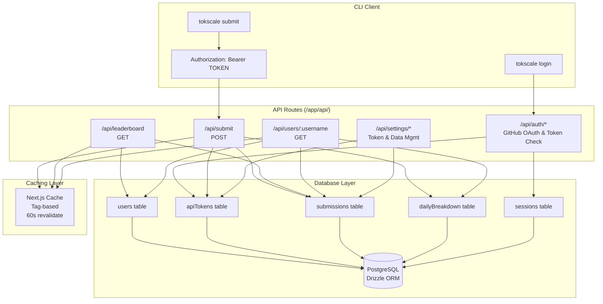

# API Routes

관련 소스 파일

다음 파일들은 이 위키 페이지를 생성하는 맥락으로 사용되었습니다.

- [packages/frontend/__tests__/api/authToken.test.ts](packages/frontend/__tests__/api/authToken.test.ts)
- [packages/frontend/__tests__/api/settingsTokensList.test.ts](packages/frontend/__tests__/api/settingsTokensList.test.ts)
- [packages/frontend/__tests__/api/submitAuth.test.ts](packages/frontend/__tests__/api/submitAuth.test.ts)
- [packages/frontend/__tests__/lib/bearerToken.test.ts](packages/frontend/__tests__/lib/bearerToken.test.ts)
- [packages/frontend/src/app/api/auth/token/route.ts](packages/frontend/src/app/api/auth/token/route.ts)
- [packages/frontend/src/app/api/settings/submitted-data/route.ts](packages/frontend/src/app/api/settings/submitted-data/route.ts)
- [packages/frontend/src/app/api/settings/tokens/route.ts](packages/frontend/src/app/api/settings/tokens/route.ts)
- [packages/frontend/src/app/api/submit/route.ts](packages/frontend/src/app/api/submit/route.ts)
- [packages/frontend/src/app/api/users/[username]/route.ts](packages/frontend/src/app/api/users/[username]/route.ts)
- [packages/frontend/src/lib/db/helpers.ts](packages/frontend/src/lib/db/helpers.ts)
- [packages/frontend/src/lib/db/migrations/0000_add_user_id_unique_constraint.sql](packages/frontend/src/lib/db/migrations/0000_add_user_id_unique_constraint.sql)
- [packages/frontend/src/lib/db/migrations/meta/0000_snapshot.json](packages/frontend/src/lib/db/migrations/meta/0000_snapshot.json)
- [packages/frontend/src/lib/db/migrations/meta/_journal.json](packages/frontend/src/lib/db/migrations/meta/_journal.json)
- [packages/frontend/src/lib/db/schema.ts](packages/frontend/src/lib/db/schema.ts)

## 목적과 범위

이 문서는 tokscale.ai의 Next.js 프런트엔드 애플리케이션이 노출하는 백엔드 API routes를 설명합니다. 이 엔드포인트들은 CLI의 데이터 제출을 처리하고, 리더보드 데이터를 제공하며, 사용자 프로필 정보를 제공하고, 사용자 설정을 관리합니다. API 계층은 CLI 도구와 PostgreSQL 데이터베이스 사이에 위치하며 인증, 검증, 데이터 집계 로직을 구현합니다.

이 API를 소비하는 프런트엔드 페이지에 대한 정보는 [Frontend Web Application](#4)을 참조하세요. 이 엔드포인트를 호출하는 CLI 명령에 대한 자세한 내용은 [Social Platform Commands](#3.2.2)를 참조하세요.

---

## API Route 아키텍처

Tokscale API는 여러 주요 엔드포인트 계열로 구성되며, 각 계열은 시스템 데이터 흐름에서 고유한 목적을 수행합니다.

**출처:** [packages/frontend/src/app/api/submit/route.ts:1-395](), [packages/frontend/src/app/api/users/[username]/route.ts:1-389](), [packages/frontend/src/lib/db/schema.ts:1-280](), [packages/frontend/src/app/api/settings/tokens/route.ts:1-82]()

---

## API 엔드포인트 요약

| 엔드포인트 | Method | 인증 | 목적 | 캐싱 |
|----------|--------|----------------|---------|---------|
| `/api/submit` | POST | Bearer Token | CLI에서 토큰 사용량 데이터 제출 | 캐시 무효화 |
| `/api/leaderboard` | GET | 없음 | 페이지네이션이 있는 순위 사용자 목록 | ISR 60초 |
| `/api/users/:username` | GET | 없음 | 전체 통계가 포함된 사용자 프로필 가져오기 | ISR 60초 |
| `/api/auth/token` | GET | Bearer Token | CLI 토큰 검증 및 metadata 반환 | 없음 |
| `/api/settings/tokens` | GET/POST | Session | 개인 API 토큰 관리 | 없음 |
| `/api/settings/submitted-data` | DELETE | Session/Token | 모든 사용자 제출 데이터 삭제 | 캐시 무효화 |

**출처:** [packages/frontend/src/app/api/submit/route.ts:51-63](), [packages/frontend/src/app/api/users/[username]/route.ts:17-23](), [packages/frontend/src/app/api/auth/token/route.ts:5-44](), [packages/frontend/src/app/api/settings/tokens/route.ts:21-82](), [packages/frontend/src/app/api/settings/submitted-data/route.ts:27-69]()

---

## Submit 엔드포인트

제출 로직, 검증, 소스 수준 merge transaction에 대한 자세한 내용은 [Submit Endpoint](#5.1)를 참조하세요.

### Route 정의
**Endpoint:** `POST /api/submit`
**File Location:** [packages/frontend/src/app/api/submit/route.ts:64-395]()

submit 엔드포인트는 기본 데이터 수집 지점입니다. CLI에서 토큰 사용량 데이터를 받고, 기존 데이터를 보존하면서 제출된 클라이언트만 업데이트하기 위해 **소스 수준 merge** 전략을 구현합니다.

### 인증 흐름
엔드포인트는 `getBearerToken()`을 사용해 `Authorization` header에서 Bearer token을 추출하고 `authenticatePersonalToken()`으로 검증합니다. 데이터베이스 transaction을 시작하기 전에 유효하지 않거나 만료된 토큰을 거부합니다.

**출처:** [packages/frontend/src/app/api/submit/route.ts:69-89](), [packages/frontend/src/lib/auth/bearerToken.ts:4-21]()

---

## Leaderboard API

기간 필터링, 페이지네이션, 순위 계산에 대한 자세한 정보는 [Leaderboard API](#5.2)를 참조하세요.

### Route 정의
**Endpoint:** `GET /api/leaderboard`

이 엔드포인트는 페이지네이션된 리더보드 데이터를 제공합니다. `users` 테이블과 join한 `submissions` 테이블의 `totalTokens`를 집계하여 사용자 순위를 계산하고 프로필 metadata를 포함합니다.

### 캐싱
리더보드는 60초 revalidation 기간의 Next.js Incremental Static Regeneration(ISR)을 사용합니다. 새 데이터가 성공적으로 제출될 때마다 `revalidateTag("leaderboard")`를 통해 강제로 revalidate됩니다.

**출처:** [packages/frontend/src/app/api/submit/route.ts:373-378](), [packages/frontend/src/app/api/users/[username]/route.ts:17]()

---

## User Profile API

병렬 쿼리 전략과 365일 데이터 집계에 대한 자세한 내용은 [User Profile API](#5.3)를 참조하세요.

### Route 정의
**Endpoint:** `GET /api/users/:username`
**File Location:** [packages/frontend/src/app/api/users/[username]/route.ts:23-389]()

이 엔드포인트는 사용자에 대한 종합 통계를 가져옵니다. `Promise.all()`을 사용해 집계 통계, 최신 제출 metadata, 사용자의 현재 리더보드 순위, 365일 일별 내역을 동시에 가져옵니다.

### 데이터 집계
일별 데이터는 `dailyBreakdown` 테이블에서 가져옵니다. 사용자가 여러 제출 레코드(예: 서로 다른 장치)를 가질 수 있으므로, API는 이 데이터를 메모리 내에서 집계하여 각 특정 날짜의 클라이언트 및 모델 내역을 merge합니다.

**출처:** [packages/frontend/src/app/api/users/[username]/route.ts:52-119](), [packages/frontend/src/app/api/users/[username]/route.ts:163-267]()

---

## 인증 흐름

GitHub OAuth, device flow, token 관리에 대한 자세한 내용은 [Authentication Flow](#5.4)를 참조하세요.

### 토큰 검증
**Endpoint:** `GET /api/auth/token`
**File Location:** [packages/frontend/src/app/api/auth/token/route.ts:5-44]()

이 엔드포인트는 CLI가 저장된 API token이 여전히 유효한지 확인하는 데 사용됩니다. 인증에 성공하면 사용자의 `username`, `displayName`, `avatarUrl`을 반환합니다.

**출처:** [packages/frontend/src/app/api/auth/token/route.ts:30-36]()

---

## Settings and Data Management API

API 토큰 관리와 사용자 데이터 삭제에 대한 자세한 내용은 [Settings and Data Management API](#5.5)를 참조하세요.

### 토큰 관리
**Endpoint:** `GET/POST /api/settings/tokens`
**File Location:** [packages/frontend/src/app/api/settings/tokens/route.ts:1-82]()

사용자는 자신의 활성 personal access tokens를 나열하거나 새 토큰을 발급할 수 있습니다. `POST` 요청은 토큰의 `name`을 받고 원시 토큰 문자열을 정확히 한 번 반환합니다.

**출처:** [packages/frontend/src/app/api/settings/tokens/route.ts:28-37](), [packages/frontend/src/app/api/settings/tokens/route.ts:57-74]()

### 데이터 삭제
**Endpoint:** `DELETE /api/settings/submitted-data`
**File Location:** [packages/frontend/src/app/api/settings/submitted-data/route.ts:27-69]()

이 엔드포인트를 통해 사용자는 토큰 사용량 기록을 삭제할 수 있습니다. 인증된 사용자의 `submissions` 테이블에 있는 모든 레코드를 삭제하며(`dailyBreakdown`으로 cascade), 사용자 프로필과 리더보드 항목에 대한 포괄적인 캐시 무효화를 트리거합니다.

**출처:** [packages/frontend/src/app/api/settings/submitted-data/route.ts:34-52]()
