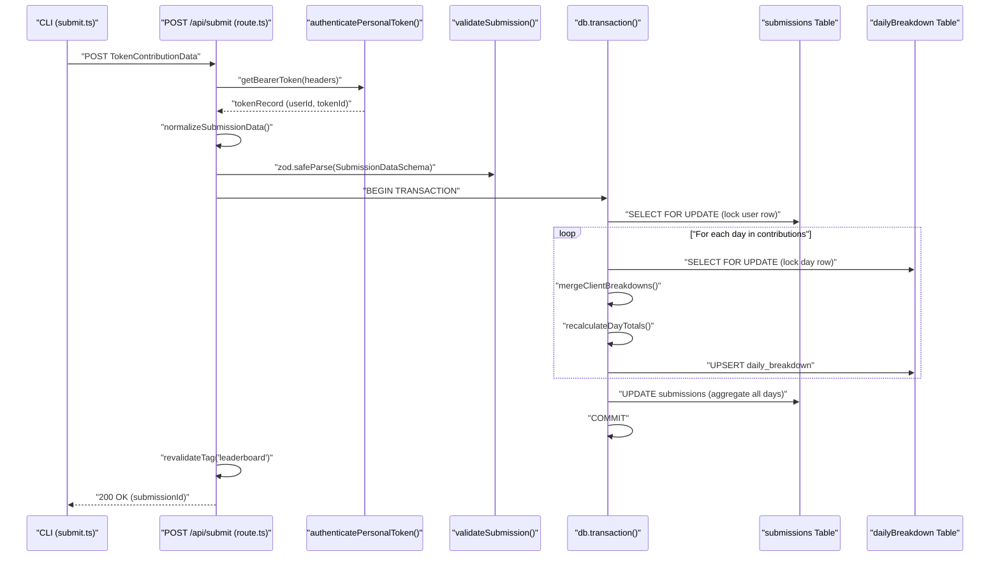
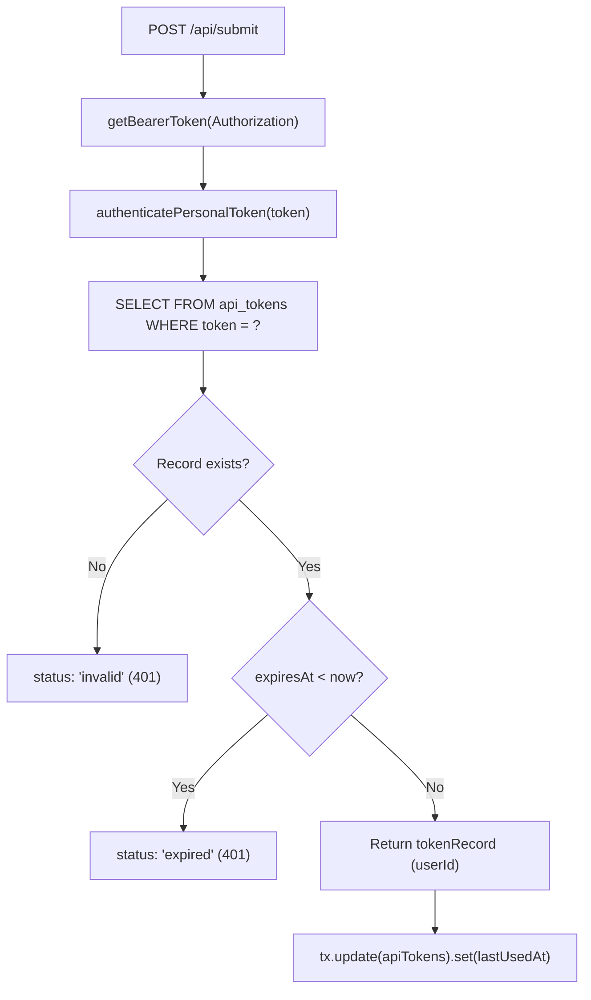

# Submit Endpoint

<details>
<summary>관련 소스 파일</summary>

다음 파일들은 이 위키 페이지를 생성하기 위한 컨텍스트로 사용되었습니다.

- [packages/frontend/__tests__/api/submit.test.ts](packages/frontend/__tests__/api/submit.test.ts)
- [packages/frontend/src/app/api/submit/route.ts](packages/frontend/src/app/api/submit/route.ts)
- [packages/frontend/src/app/api/users/[username]/route.ts](packages/frontend/src/app/api/users/[username]/route.ts)
- [packages/frontend/src/components/SourceLogo.tsx](packages/frontend/src/components/SourceLogo.tsx)
- [packages/frontend/src/lib/constants.ts](packages/frontend/src/lib/constants.ts)
- [packages/frontend/src/lib/db/helpers.ts](packages/frontend/src/lib/db/helpers.ts)
- [packages/frontend/src/lib/db/migrations/0000_add_user_id_unique_constraint.sql](packages/frontend/src/lib/db/migrations/0000_add_user_id_unique_constraint.sql)
- [packages/frontend/src/lib/db/migrations/meta/0000_snapshot.json](packages/frontend/src/lib/db/migrations/meta/0000_snapshot.json)
- [packages/frontend/src/lib/db/migrations/meta/_journal.json](packages/frontend/src/lib/db/migrations/meta/_journal.json)
- [packages/frontend/src/lib/db/schema.ts](packages/frontend/src/lib/db/schema.ts)
- [packages/frontend/src/lib/types.ts](packages/frontend/src/lib/types.ts)
- [packages/frontend/src/lib/validation/submission.ts](packages/frontend/src/lib/validation/submission.ts)

</details>


Submit Endpoint(`POST /api/submit`)는 CLI에서 tokscale.ai 플랫폼으로 토큰 사용량 데이터를 업로드하기 위한 기본 API입니다. 이 엔드포인트는 인증된 데이터 수집을 수행하며, 지능적인 소스 수준 병합을 통해 서로 다른 AI 코딩 소스(OpenCode, Claude, Cursor 등)의 데이터를 다른 소스에서 이전에 제출한 데이터 손실 없이 점진적으로 업데이트할 수 있게 합니다.

인증 세부 정보는 [Authentication Flow](#5.4)를 참조하세요. 제출된 데이터가 표시되는 방식은 [Leaderboard API](#5.2)와 [User Profile API](#5.3)를 참조하세요.

## API 계약

이 엔드포인트는 클라이언트별 메트릭이 포함된 일별 세부 내역 구조의 토큰 기여 데이터를 받고, 업데이트된 총계와 함께 제출 메타데이터를 반환합니다.

### 요청 형식

**엔드포인트:** `POST /api/submit`

**헤더:**
| 헤더 | 값 | 필수 |
|--------|-------|----------|
| `Authorization` | `Bearer <api_token>` | 예 |
| `Content-Type` | `application/json` | 예 |

**본문 구조(SubmissionData):**
요청 본문은 [packages/frontend/src/lib/validation/submission.ts:159-164]()의 `SubmissionDataSchema`를 기준으로 검증됩니다.

```typescript
{
  "meta": {
    "version": string,           // CLI version (e.g., "1.0.24")
    "dateRange": {
      "start": string,           // ISO date (e.g., "2024-01-01")
      "end": string              // ISO date
    }
  },
  "summary": {
    "totalTokens": number,
    "totalCost": number,
    "activeDays": number,
    "clients": string[],         // e.g., ["opencode", "cursor"]
    "models": string[]           // e.g., ["claude-3-5-sonnet-20241022"]
  },
  "contributions": [
    {
      "date": string,            // ISO date
      "clients": [
        {
          "client": string,      // Client name (e.g. "cursor", "claude")
          "modelId": string,     // Model identifier
          "tokens": {
            "input": number,
            "output": number,
            "cacheRead": number,
            "cacheWrite": number,
            "reasoning": number
          },
          "cost": number,
          "messages": number
        }
      ]
    }
  ]
}
```

**출처:** [packages/frontend/src/app/api/submit/route.ts:51-63](), [packages/frontend/src/lib/validation/submission.ts:159-164](), [packages/frontend/src/lib/types.ts:87-92]()

## 엔드투엔드 제출 흐름

다음 다이어그램은 CLI 호출부터 데이터베이스 저장까지의 전체 흐름을 보여주며, CLI 엔티티에서 API 라우트 로직으로 전환되는 지점을 강조합니다.



**출처:** [packages/frontend/src/app/api/submit/route.ts:64-395](), [packages/frontend/src/lib/db/helpers.ts:72-88]()

## 인증

인증은 device flow 로그인 과정에서 발급된 API 토큰을 사용해 수행됩니다. 이 엔드포인트는 [packages/frontend/src/lib/auth/personalTokens.ts]()의 `authenticatePersonalToken`을 통해 토큰 존재 여부와 만료 여부를 모두 검증합니다.

### 토큰 검증 로직



**출처:** [packages/frontend/src/app/api/submit/route.ts:69-90](), [packages/frontend/src/app/api/submit/route.ts:142-145]()

## 데이터 검증 및 정규화

이 엔드포인트는 Zod 검증 전에 하위 호환성과 데이터 무결성을 보장하기 위해 정규화를 수행합니다.

### 정규화 로직
1. **모델 ID 기본값:** `modelId`가 누락되었거나 비어 있으면 `normalizeSubmissionData`에서 `"unknown"`으로 설정됩니다 [packages/frontend/src/app/api/submit/route.ts:22-48]().
2. **레거시 키 매핑:** `sources` 키를 사용하는 이전 CLI 버전은 `normalizeLegacySources`에서 새로운 `clients` 키로 매핑됩니다 [packages/frontend/src/lib/validation/submission.ts:113-157]().
3. **클라이언트 별칭:** 일관성을 유지하기 위해 `kilocode` 클라이언트는 자동으로 `kilo` 별칭으로 처리됩니다 [packages/frontend/src/lib/validation/submission.ts:96-105]().

### 수학적 일관성
[packages/frontend/src/lib/validation/submission.ts:182-240]()의 `validateSubmission` 함수는 다음을 확인합니다.
- **미래 날짜 금지:** 시간대 차이를 고려해 현재보다 2일을 초과해 미래인 날짜가 포함된 제출을 거부합니다 [packages/frontend/src/lib/validation/submission.ts:210-222]().
- **총합:** `input + output + cacheRead + cacheWrite + reasoning`이 제공된 `totals.tokens`와 일치하는지 검증합니다 [packages/frontend/src/lib/validation/submission.ts:227-234]().

**출처:** [packages/frontend/src/app/api/submit/route.ts:22-48](), [packages/frontend/src/lib/validation/submission.ts:113-157](), [packages/frontend/src/lib/validation/submission.ts:182-240]()

## 소스 수준 병합 알고리즘

이 엔드포인트는 **클라이언트 수준 병합** 전략을 구현합니다. 전체 덮어쓰기와 달리, 현재 제출에 포함되지 않은 클라이언트의 데이터를 보존합니다.

### 구현
병합 로직은 `mergeClientBreakdowns`에 정의되어 있습니다 [packages/frontend/src/lib/db/helpers.ts:72-88]().

```typescript
export function mergeClientBreakdowns(
  existing: Record<string, ClientBreakdownData> | null | undefined,
  incoming: Record<string, ClientBreakdownData>,
  incomingClients: Set<string>
): Record<string, ClientBreakdownData> {
  const merged: Record<string, ClientBreakdownData> = { ...(existing || {}) };

  for (const clientName of incomingClients) {
    if (incoming[clientName]) {
      merged[clientName] = { ...incoming[clientName] };
    } else {
      delete merged[clientName];
    }
  }

  return merged;
}
```

### 로직 요약
| 상태 | 동작 |
|-------|----------|
| **제출에 포함된 클라이언트** | DB에서 해당 특정 클라이언트의 기존 데이터를 덮어씁니다. |
| **제출에 포함되지 않은 클라이언트** | 보존됩니다. 다른 클라이언트의 기존 데이터는 그대로 유지됩니다. |
| **제출에 포함되었지만 비어 있는 클라이언트** | 레코드에서 삭제됩니다(데이터 수정/삭제 허용). |

**출처:** [packages/frontend/src/lib/db/helpers.ts:72-88](), [packages/frontend/src/app/api/submit/route.ts:54-58]()

## 데이터베이스 트랜잭션 및 잠금

동시 제출 중 발생할 수 있는 경쟁 상태를 방지하기 위해, 이 엔드포인트는 PostgreSQL `FOR UPDATE`를 통한 행 수준 잠금을 사용합니다.

### 트랜잭션 단계
1. **제출 잠금:** `FOR UPDATE`로 사용자의 제출 레코드를 선택합니다 [packages/frontend/src/app/api/submit/route.ts:150-155]().
2. **일별 데이터 잠금:** 해당 제출에 대한 기존 `daily_breakdown` 행을 모두 `FOR UPDATE`로 선택합니다 [packages/frontend/src/app/api/submit/route.ts:190-199]().
3. **인메모리 병합:** 들어온 기여 데이터를 순회하면서 `existingDaysMap`과 병합합니다 [packages/frontend/src/app/api/submit/route.ts:213-280]().
4. **일괄 쓰기:** `daily_breakdown` 테이블에 `UPSERT`를 수행합니다 [packages/frontend/src/app/api/submit/route.ts:282-284]().
5. **집계 총계:** 모든 날짜에 걸쳐 모든 토큰과 비용을 합산하기 위해 `daily_breakdown` 테이블을 쿼리하고, 상위 `submissions` 레코드를 업데이트합니다 [packages/frontend/src/app/api/submit/route.ts:286-311]().

### 관련 데이터베이스 엔티티
| 코드 엔티티 | DB 테이블 | 목적 |
|-------------|----------|---------|
| `submissions` | `submissions` | 사용자 수준의 집계 총계, 비용, 날짜 범위를 저장합니다 [packages/frontend/src/lib/db/schema.ts:148-190](). |
| `dailyBreakdown` | `daily_breakdown` | 일별 `source_breakdown`과 `model_breakdown`의 JSONB 세부 내역을 저장합니다 [packages/frontend/src/lib/db/schema.ts:213-241](). |
| `apiTokens` | `api_tokens` | 인증을 검증하고 `last_used_at`을 업데이트합니다 [packages/frontend/src/lib/db/schema.ts:93-113](). |

**출처:** [packages/frontend/src/app/api/submit/route.ts:141-371](), [packages/frontend/src/lib/db/schema.ts:148-241]()
