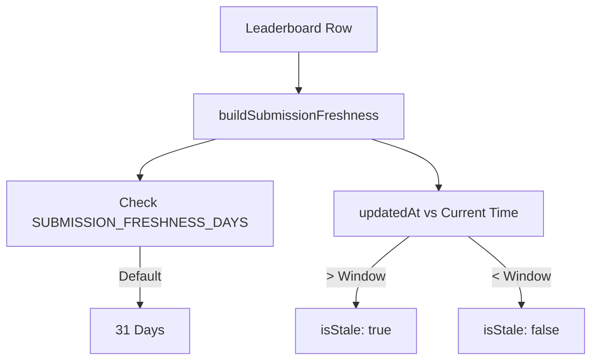

# 리더보드 API

<details>
<summary>관련 소스 파일</summary>

다음 파일들은 이 위키 페이지를 생성하기 위한 컨텍스트로 사용되었습니다.

- [crates/tokscale-core/src/sessions/crush.rs](crates/tokscale-core/src/sessions/crush.rs)
- [packages/frontend/__tests__/api/leaderboard.test.ts](packages/frontend/__tests__/api/leaderboard.test.ts)
- [packages/frontend/__tests__/api/usersProfile.test.ts](packages/frontend/__tests__/api/usersProfile.test.ts)
- [packages/frontend/__tests__/lib/getLeaderboard.test.ts](packages/frontend/__tests__/lib/getLeaderboard.test.ts)
- [packages/frontend/__tests__/lib/getLeaderboardAllTime.test.ts](packages/frontend/__tests__/lib/getLeaderboardAllTime.test.ts)
- [packages/frontend/__tests__/lib/submissionFreshness.test.ts](packages/frontend/__tests__/lib/submissionFreshness.test.ts)
- [packages/frontend/src/app/api/leaderboard/route.ts](packages/frontend/src/app/api/leaderboard/route.ts)
- [packages/frontend/src/app/api/leaderboard/user/[username]/route.ts](packages/frontend/src/app/api/leaderboard/user/[username]/route.ts)
- [packages/frontend/src/lib/leaderboard/getLeaderboard.ts](packages/frontend/src/lib/leaderboard/getLeaderboard.ts)
- [packages/frontend/src/lib/leaderboard/types.ts](packages/frontend/src/lib/leaderboard/types.ts)
- [packages/frontend/vercel.json](packages/frontend/vercel.json)

</details>


Leaderboard API는 순위가 매겨진 사용자 토큰 사용량 통계를 조회하기 위한 공개 엔드포인트를 제공합니다. 시간 기간(전체, 월간, 주간), 페이지네이션, 정렬(토큰 또는 비용 기준), 개별 사용자 순위 조회 필터링을 지원합니다. 이 엔드포인트는 [tokscale.ai](https://tokscale.ai)의 공개 리더보드 페이지를 구동합니다.

## API 엔드포인트

Leaderboard API는 두 가지 주요 엔드포인트를 노출합니다.

| 엔드포인트 | 메서드 | 목적 | 캐싱 |
|----------|--------|---------|---------|
| `/api/leaderboard` | GET | 페이지네이션과 검색이 포함된 순위 목록 | 60초 ISR |
| `/api/leaderboard/user/[username]` | GET | 개별 사용자 순위 조회 | 60초 ISR |

### GET /api/leaderboard

메인 리더보드 엔드포인트는 전역 통계와 함께 페이지네이션된 순위를 반환합니다.

**쿼리 매개변수:**

| 매개변수 | 타입 | 기본값 | 검증 | 설명 |
|-----------|------|---------|------------|-------------|
| `period` | string | `"all"` | `["all", "month", "week"]` | 시간 기간 필터 |
| `sortBy` | string | `"tokens"`| `["tokens", "cost"]` | 기본 정렬 메트릭 |
| `page` | number | `1` | `>= 1` | 페이지 번호(1부터 시작) |
| `limit` | number | `50` | `1-100` | 페이지당 결과 수 |
| `search` | string | `""` | - | 대소문자를 구분하지 않는 username 필터 |

**구현:** [packages/frontend/src/app/api/leaderboard/route.ts:16-45]()

```typescript
// Request validation and parameter parsing
const periodParam = searchParams.get("period") || "all";
const period: Period = VALID_PERIODS.includes(periodParam as Period)
  ? (periodParam as Period)
  : "all";

const sortByParam = searchParams.get("sortBy") || "tokens";
const sortBy: SortBy = VALID_SORT_BY.includes(sortByParam as SortBy)
  ? (sortByParam as SortBy)
  : "tokens";

const page = Math.max(1, parseIntSafe(searchParams.get("page"), 1));
const limit = Math.min(100, Math.max(1, parseIntSafe(searchParams.get("limit"), 50)));
const search = (searchParams.get("search") || "").trim();

const data = await getLeaderboardData(period, page, limit, sortBy, search);
```

**출처:** [packages/frontend/src/app/api/leaderboard/route.ts:1-46]()

### GET /api/leaderboard/user/[username]

지정된 기간에 대한 특정 사용자의 순위와 통계를 가져옵니다.

**경로 매개변수:**

| 매개변수 | 검증 | 설명 |
|-----------|------------|-------------|
| `username` | GitHub 형식 | 조회할 GitHub username |

**구현:** [packages/frontend/src/app/api/leaderboard/user/[username]/route.ts:11-50]()

**출처:** [packages/frontend/src/app/api/leaderboard/user/[username]/route.ts:1-51]()

## 응답 형식

### 리더보드 응답

응답에는 순위가 매겨진 사용자 목록, 페이지네이션 메타데이터, 요청된 기간의 집계 통계가 포함됩니다.

```typescript
interface LeaderboardData {
  users: LeaderboardUser[];
  pagination: {
    page: number;
    limit: number;
    totalUsers: number;
    totalPages: number;
    hasNext: boolean;
    hasPrev: boolean;
  };
  stats: {
    totalTokens: number;
    totalCost: number;
    totalSubmissions: number | null;
    uniqueUsers: number;
  };
  period: Period;
  sortBy: SortBy;
}
```

**타입 정의:** [packages/frontend/src/lib/leaderboard/types.ts:1-38]()

### LeaderboardUser 객체

사용자 식별 정보, 사용량 총계, "freshness" 메타데이터를 포함합니다.

```typescript
interface LeaderboardUser {
  rank: number;
  userId: string;
  username: string;
  displayName: string | null;
  avatarUrl: string | null;
  totalTokens: number;
  totalCost: number;
  submissionCount: number | null;
  lastSubmission: string;
  submissionFreshness: SubmissionFreshness | null;
}
```

**출처:** [packages/frontend/src/lib/leaderboard/types.ts:6-17](), [packages/frontend/src/lib/leaderboard/getLeaderboard.ts:11-13]()

## 요청 흐름 아키텍처

```mermaid
sequenceDiagram
    participant Browser
    participant RouteHandler["/api/leaderboard<br/>route.ts"]
    participant GetLeaderboard["getLeaderboardData()<br/>getLeaderboard.ts"]
    participant DB["Neon PostgreSQL"]
    
    Browser->>RouteHandler: GET /api/leaderboard?period=month&sortBy=cost
    RouteHandler->>RouteHandler: Parse & Validate Query Params
    RouteHandler->>GetLeaderboard: getLeaderboardData(period, page, limit, sortBy, search)
    
    alt period == "all"
        GetLeaderboard->>DB: Query All-Time Submissions (Aggregated)
    else period == "month" | "week"
        GetLeaderboard->>DB: Query dailyBreakdown (Filtered by Date)
    end
    
    DB-->>GetLeaderboard: Raw Rows
    
    alt period != "all"
        GetLeaderboard->>GetLeaderboard: aggregatePeriodRows()
    end
    
    GetLeaderboard->>GetLeaderboard: Calculate Ranks & Paginate
    GetLeaderboard-->>RouteHandler: LeaderboardData
    RouteHandler-->>Browser: JSON Response (revalidate: 60s)
```

**출처:** [packages/frontend/src/app/api/leaderboard/route.ts:16-45](), [packages/frontend/src/lib/leaderboard/getLeaderboard.ts:236-285]()

## 데이터 조회 로직

### 전체 기간 리더보드

`"all"` 기간의 경우, 시스템은 `submissions` 테이블을 직접 쿼리합니다. 각 사용자에 대해 가장 최근 제출의 `cli_version`과 `schema_version`을 가져오기 위해 스칼라 서브쿼리를 사용하며, 이를 통해 데이터 "freshness"를 판단합니다.

```typescript
// Subquery for freshness metadata
const latestCliVersion = db
  .select({ cli_version: submissions.cliVersion })
  .from(submissions.as("s2"))
  .where(eq(sql`s2.user_id`, users.id))
  .orderBy(desc(sql`s2.updated_at`))
  .limit(1);
```

**구현:** [packages/frontend/src/lib/leaderboard/getLeaderboard.ts:311-340]()

### 기간 기반 리더보드(월간/주간)

`"month"` 또는 `"week"`의 경우, 시스템은 `dailyBreakdown` 테이블을 쿼리합니다. 한 사용자가 여러 일별 항목을 가질 수 있기 때문에, API는 `aggregatePeriodRows`를 사용해 메모리에서 수동 집계를 수행합니다.

1.  **날짜 범위 계산:** `getPeriodDateRange`가 UTC 시작/종료 문자열을 계산합니다 [packages/frontend/src/lib/leaderboard/getLeaderboard.ts:65-91]().
2.  **집계:** `aggregatePeriodRows`가 여러 일별 행을 사용자별 단일 `LeaderboardUser` 객체로 축약합니다 [packages/frontend/src/lib/leaderboard/getLeaderboard.ts:117-160]().
3.  **정렬:** `compareLeaderboardUsers`가 동점 처리(예: 토큰이 같으면 비용 기준 정렬, 둘 다 같으면 username 기준 정렬)를 처리합니다 [packages/frontend/src/lib/leaderboard/getLeaderboard.ts:93-115]().

**출처:** [packages/frontend/src/lib/leaderboard/getLeaderboard.ts:65-160](), [packages/frontend/src/lib/leaderboard/getLeaderboard.ts:236-285]()

## 제출 Freshness

API는 사용자의 데이터가 오래되었는지를 나타내기 위해 `submissionFreshness` 객체를 포함합니다.



**로직:** [packages/frontend/src/lib/submissionFreshness.ts:44-61]()
**API에서의 사용:** [packages/frontend/src/lib/leaderboard/getLeaderboard.ts:131-136]()

**출처:** [packages/frontend/src/lib/submissionFreshness.ts:1-61](), [packages/frontend/src/lib/leaderboard/getLeaderboard.ts:131-136]()

## 오류 처리

API는 적절한 HTTP 상태 코드와 함께 구조화된 오류 응답을 구현합니다.

| 오류 유형 | 상태 코드 | 응답 | 트리거 |
|------------|-------------|----------|---------|
| 유효하지 않은 Username | 400 | `{ error: "Invalid username format" }` | 잘못된 GitHub username [packages/frontend/src/app/api/leaderboard/user/[username]/route.ts:18-23]() |
| 사용자를 찾을 수 없음 | 404 | `{ error: "User not found or has no submissions" }` | username이 존재하지 않거나 토큰이 0개임 [packages/frontend/src/app/api/leaderboard/user/[username]/route.ts:38-40]() |
| 내부 오류 | 500 | `{ error: "Failed to fetch leaderboard" }` | 데이터베이스 또는 집계 실패 [packages/frontend/src/app/api/leaderboard/route.ts:39-44]() |

**출처:** [packages/frontend/src/app/api/leaderboard/route.ts:38-44](), [packages/frontend/src/app/api/leaderboard/user/[username]/route.ts:18-40]()
