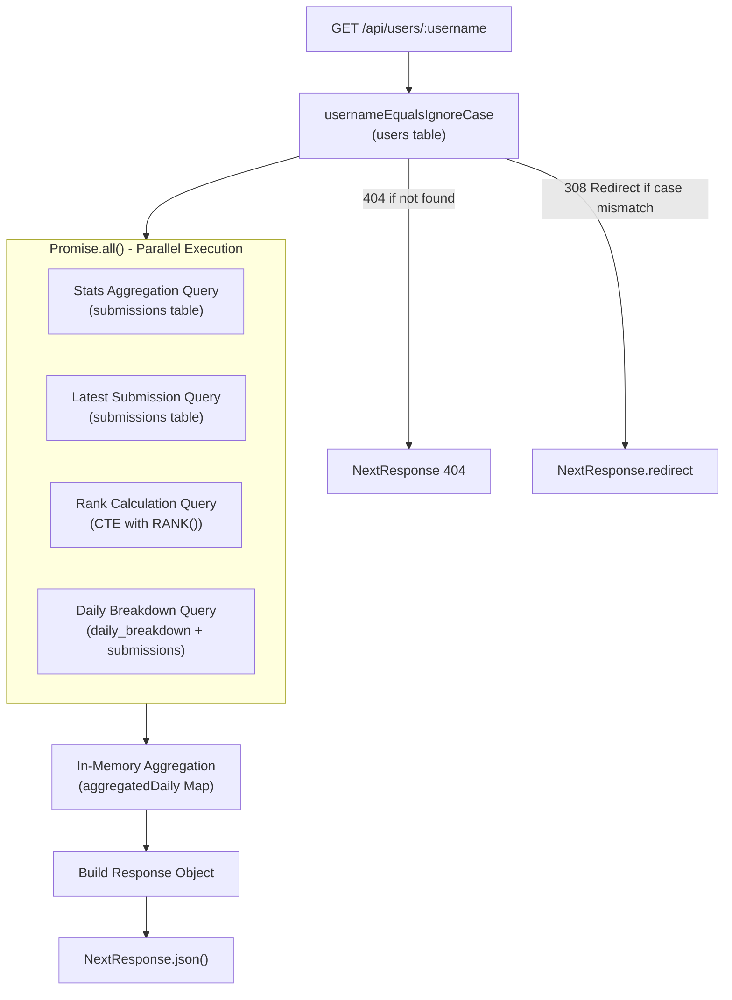
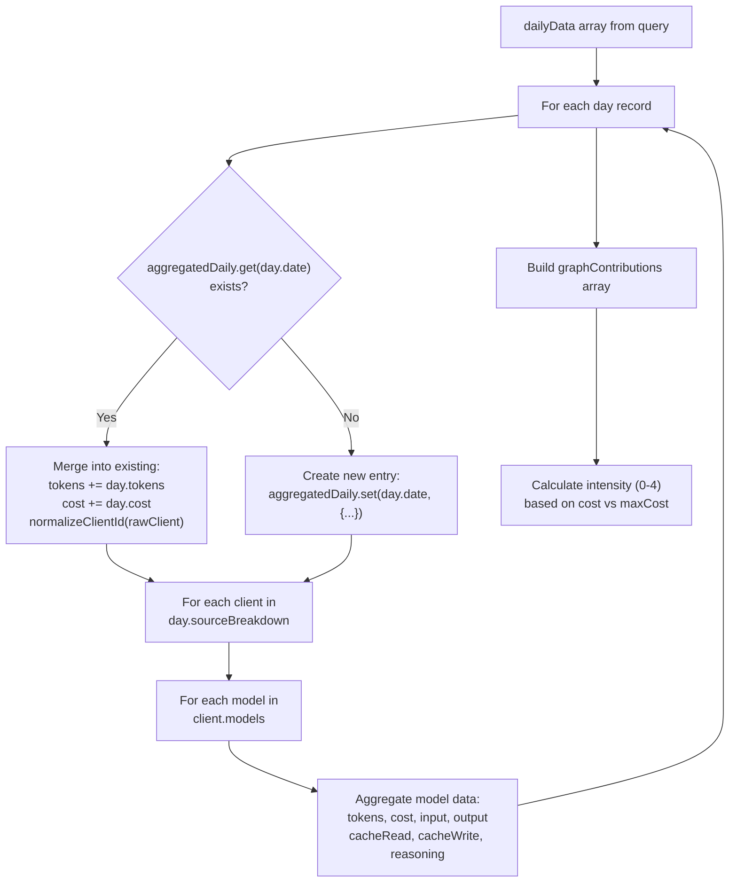
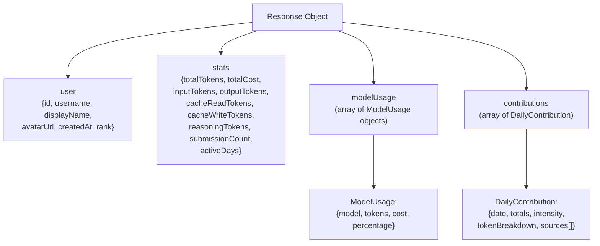

# 사용자 프로필 API

<details>
<summary>관련 소스 파일</summary>

다음 파일들은 이 위키 페이지를 생성하기 위한 컨텍스트로 사용되었습니다.

- [packages/frontend/src/app/api/submit/route.ts](packages/frontend/src/app/api/submit/route.ts)
- [packages/frontend/src/app/api/users/[username]/route.ts](packages/frontend/src/app/api/users/[username]/route.ts)
- [packages/frontend/src/lib/db/helpers.ts](packages/frontend/src/lib/db/helpers.ts)
- [packages/frontend/src/lib/db/migrations/0000_add_user_id_unique_constraint.sql](packages/frontend/src/lib/db/migrations/0000_add_user_id_unique_constraint.sql)
- [packages/frontend/src/lib/db/migrations/meta/0000_snapshot.json](packages/frontend/src/lib/db/migrations/meta/0000_snapshot.json)
- [packages/frontend/src/lib/db/migrations/meta/_journal.json](packages/frontend/src/lib/db/migrations/meta/_journal.json)
- [packages/frontend/src/lib/db/schema.ts](packages/frontend/src/lib/db/schema.ts)

</details>


## 목적과 범위

User Profile API는 개별 사용자의 포괄적인 토큰 사용량 통계, 기여 그래프, 활동 데이터를 가져오는 읽기 전용 HTTP 엔드포인트 `GET /api/users/:username`을 제공합니다. 이 엔드포인트는 `/u/:username`의 공개 사용자 프로필 페이지를 제공하며, `users`, `submissions`, `dailyBreakdown` 테이블의 데이터를 집계하여 사용자의 AI 토큰 소비 이력에 대한 완전한 보기를 생성합니다.

API는 레거시 클라이언트 정규화(예: `kilocode`를 `kilo`로 매핑)를 처리하고, 높은 성능을 보장하기 위해 병렬 쿼리 전략을 구현합니다.

**출처:** [packages/frontend/src/app/api/users/[username]/route.ts:1-23](), [packages/frontend/src/app/api/users/[username]/route.ts:12-15]()

## 엔드포인트 명세

| 속성 | 값 |
|----------|-------|
| **메서드** | `GET` |
| **경로** | `/api/users/:username` |
| **인증** | 없음(공개 엔드포인트) |
| **ISR 재검증** | 60초 |
| **캐시 전략** | `revalidate = 60`을 사용하는 ISR |

이 엔드포인트는 [packages/frontend/src/app/api/users/[username]/route.ts:23-389]()에 정의되어 있으며, Next.js App Router에서 동적 `username` 매개변수를 받는 비동기 `GET` 함수를 내보냅니다.

**출처:** [packages/frontend/src/app/api/users/[username]/route.ts:17-23]()

## 요청 흐름 및 쿼리 아키텍처

API는 `Promise.all`을 사용하는 병렬 쿼리 전략으로 네 가지 서로 다른 데이터셋을 동시에 가져와, 데이터베이스 왕복 횟수와 전체 응답 시간을 최소화합니다.

### 병렬 쿼리 실행 다이어그램



**출처:** [packages/frontend/src/app/api/users/[username]/route.ts:28-119]()

### 쿼리 1: 사용자 조회

초기 쿼리는 사용자를 찾기 위해 `usernameEqualsIgnoreCase`를 사용합니다. 일치 항목을 찾았지만 대소문자가 기본 username과 일치하지 않으면 표준 URL로 308 리디렉션을 수행합니다.

[packages/frontend/src/app/api/users/[username]/route.ts:28-47]()

```typescript
const matchingUsers = await db
  .select({ ... })
  .from(users)
  .where(usernameEqualsIgnoreCase(username))
  .limit(USERNAME_LOOKUP_LIMIT);
const user = getSingleUsernameMatch(matchingUsers, username);
```

**출처:** [packages/frontend/src/app/api/users/[username]/route.ts:28-47]()

### 쿼리 2: 통계 집계

사용자의 모든 제출에 걸친 전체 기간 통계를 집계합니다. `totalTokens`, `totalCost`(DECIMAL로 캐스팅), 그리고 `reasoningTokens`, `cacheReadTokens` 같은 특정 토큰 유형을 계산합니다.

[packages/frontend/src/app/api/users/[username]/route.ts:53-67]()

**출처:** [packages/frontend/src/app/api/users/[username]/route.ts:53-67]()

### 쿼리 3: 순위 계산

윈도우 함수를 사용하는 Common Table Expression(CTE)으로 사용자의 전역 순위를 계산합니다. `user_totals` CTE는 `user_id`별 토큰을 합산하고, `ranked` CTE는 `RANK() OVER (ORDER BY total_tokens DESC)`를 적용합니다.

[packages/frontend/src/app/api/users/[username]/route.ts:82-97]()

**출처:** [packages/frontend/src/app/api/users/[username]/route.ts:82-97]()

### 쿼리 4: 일별 세부 내역 데이터

`daily_breakdown`을 `submissions`와 조인하여 지난 365일 동안의 세분화된 일별 활동을 가져옵니다.

[packages/frontend/src/app/api/users/[username]/route.ts:99-118]()

**출처:** [packages/frontend/src/app/api/users/[username]/route.ts:99-118]()

## 데이터 집계 로직

병렬 쿼리가 완료되면, 엔드포인트는 여러 일별 레코드를 날짜별 단일 통합 보기로 결합하기 위해 인메모리 집계를 수행합니다.

### 집계 알고리즘 다이어그램



**출처:** [packages/frontend/src/app/api/users/[username]/route.ts:163-267]()

### 클라이언트 및 모델 세부 내역 병합

중첩 집계 구조는 다음을 처리합니다.

1.  **클라이언트 수준 집계**: 모든 날짜에 걸쳐 각 클라이언트(예: "cursor", "claude-code")의 데이터를 결합합니다.
2.  **레거시 별칭 처리**: `normalizeClientId`를 사용해 `kilocode` 같은 레거시 ID를 `kilo`로 매핑합니다.
3.  **모델 수준 집계**: 각 클라이언트 내에서 모델별 메트릭을 집계합니다.
4.  **토큰 유형 추적**: `input`, `output`, `cacheRead`, `cacheWrite`, `reasoning` 토큰을 별도로 추적합니다.

**출처:** [packages/frontend/src/app/api/users/[username]/route.ts:12-15](), [packages/frontend/src/app/api/users/[username]/route.ts:176-238]()

## 기여 그래프 계산

이 엔드포인트는 일별 비용 분포를 기반으로 강도 수준(0-4)을 가진 GitHub 스타일의 기여 그래프 데이터를 생성합니다.

[packages/frontend/src/app/api/users/[username]/route.ts:269-286]()

| 강도 | 비용 범위 | 시각적 표현 |
| :--- | :--- | :--- |
| 0 | `cost === 0` | 비어 있음/활동 없음 |
| 1 | `0 < cost ≤ maxCost * 0.25` | 옅음 |
| 2 | `maxCost * 0.25 < cost ≤ maxCost * 0.5` | 중간 |
| 3 | `maxCost * 0.5 < cost ≤ maxCost * 0.75` | 진함 |
| 4 | `cost > maxCost * 0.75` | 가장 진함 |

**출처:** [packages/frontend/src/app/api/users/[username]/route.ts:269-286]()

## 응답 스키마

이 엔드포인트는 사용자 정보, 집계 통계, 일별 기여 목록이 포함된 JSON 응답을 반환합니다.

### 응답 객체 다이어그램



**출처:** [packages/frontend/src/app/api/users/[username]/route.ts:352-381]()

## 성능 고려 사항

### 데이터베이스 쿼리 최적화

*   **병렬 쿼리**: `Promise.all()`을 사용해 네 개의 독립적인 쿼리를 동시에 실행하여 전체 지연 시간을 줄입니다. [packages/frontend/src/app/api/users/[username]/route.ts:52-119]()
*   **대소문자 구분 없는 인덱싱**: `USERS_USERNAME_LOWER_UNIQUE_INDEX`를 활용하는 `usernameEqualsIgnoreCase`를 사용합니다. [packages/frontend/src/lib/db/schema.ts:45-47](), [packages/frontend/src/app/api/users/[username]/route.ts:37]()
*   **조인 최적화**: `daily_breakdown`과 `submissions` 간의 조인은 `submissions`의 `userId` 인덱스로 제한됩니다. [packages/frontend/src/app/api/users/[username]/route.ts:111-114]()

### ISR 캐싱

이 엔드포인트는 60초의 재검증 기간을 가진 Next.js Incremental Static Regeneration을 사용합니다.

**출처:** [packages/frontend/src/app/api/users/[username]/route.ts:17]()

## 타입 정의

API는 일별 및 모델 데이터를 처리하기 위해 내부 타입을 사용합니다.

*   `ModelData`: `tokens`, `cost`, `input`, `output`, `cacheRead`, `cacheWrite`, `reasoning`, `messages`를 추적합니다. [packages/frontend/src/app/api/users/[username]/route.ts:125-134]()
*   `ClientBreakdown`: 중첩된 `models` 레코드와 함께 모델 메트릭을 확장합니다. [packages/frontend/src/app/api/users/[username]/route.ts:136-147]()

**출처:** [packages/frontend/src/app/api/users/[username]/route.ts:125-147]()
