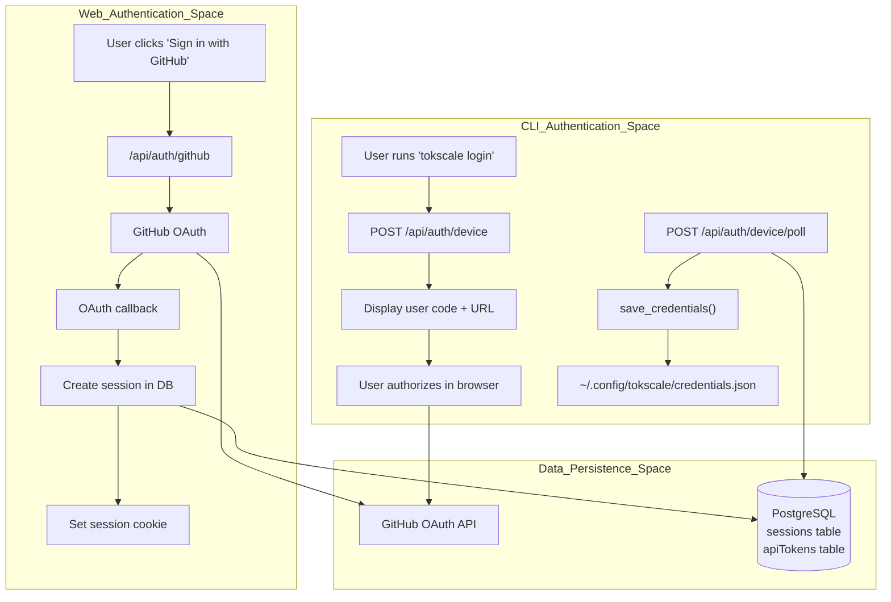
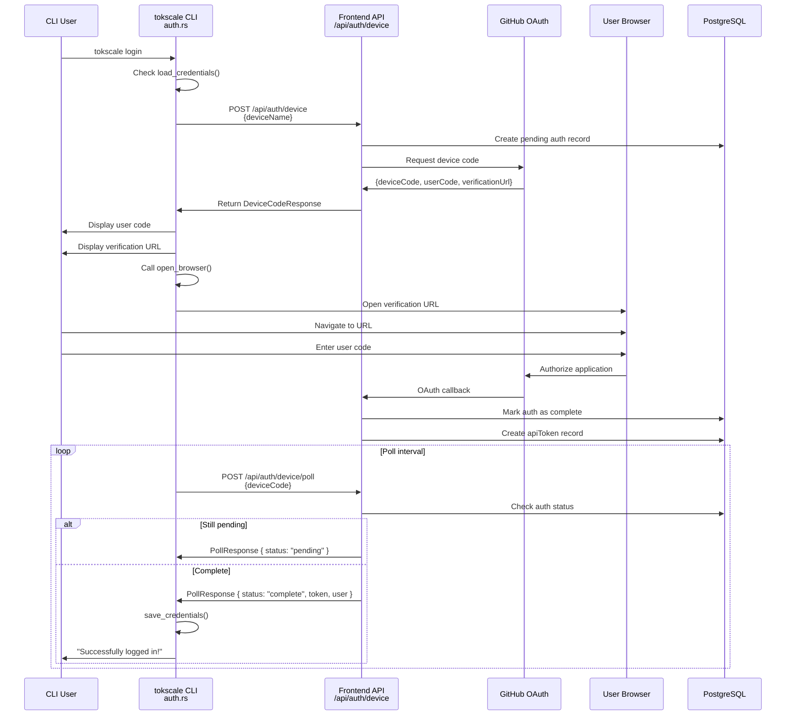
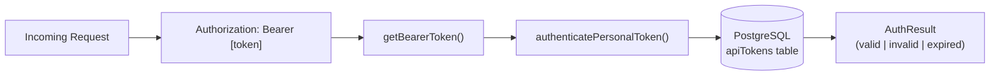

# 인증 흐름

<details>
<summary>관련 소스 파일</summary>

다음 파일들은 이 위키 페이지를 생성하기 위한 컨텍스트로 사용되었습니다.

- [Cargo.lock](Cargo.lock)
- [crates/tokscale-cli/Cargo.toml](crates/tokscale-cli/Cargo.toml)
- [crates/tokscale-cli/src/auth.rs](crates/tokscale-cli/src/auth.rs)
- [crates/tokscale-cli/src/cursor.rs](crates/tokscale-cli/src/cursor.rs)
- [crates/tokscale-core/Cargo.toml](crates/tokscale-core/Cargo.toml)
- [packages/frontend/__tests__/api/authToken.test.ts](packages/frontend/__tests__/api/authToken.test.ts)
- [packages/frontend/__tests__/api/devicePoll.test.ts](packages/frontend/__tests__/api/devicePoll.test.ts)
- [packages/frontend/__tests__/api/settingsTokensDelete.test.ts](packages/frontend/__tests__/api/settingsTokensDelete.test.ts)
- [packages/frontend/__tests__/api/settingsTokensList.test.ts](packages/frontend/__tests__/api/settingsTokensList.test.ts)
- [packages/frontend/__tests__/api/submitAuth.test.ts](packages/frontend/__tests__/api/submitAuth.test.ts)
- [packages/frontend/__tests__/lib/bearerToken.test.ts](packages/frontend/__tests__/lib/bearerToken.test.ts)
- [packages/frontend/__tests__/lib/personalTokens.test.ts](packages/frontend/__tests__/lib/personalTokens.test.ts)
- [packages/frontend/src/app/api/auth/device/poll/route.ts](packages/frontend/src/app/api/auth/device/poll/route.ts)
- [packages/frontend/src/app/api/auth/token/route.ts](packages/frontend/src/app/api/auth/token/route.ts)
- [packages/frontend/src/app/api/settings/submitted-data/route.ts](packages/frontend/src/app/api/settings/submitted-data/route.ts)
- [packages/frontend/src/app/api/settings/tokens/[tokenId]/route.ts](packages/frontend/src/app/api/settings/tokens/[tokenId]/route.ts)
- [packages/frontend/src/app/api/settings/tokens/route.ts](packages/frontend/src/app/api/settings/tokens/route.ts)
- [packages/frontend/src/lib/auth/personalTokens.ts](packages/frontend/src/lib/auth/personalTokens.ts)
- [packages/frontend/src/lib/auth/session.ts](packages/frontend/src/lib/auth/session.ts)

</details>


이 문서는 Tokscale의 CLI와 웹 프론트엔드 전반에서 사용되는 인증 시스템을 설명합니다. GitHub OAuth 통합, CLI 사용자를 위한 Device Authorization Grant 흐름, 웹 애플리케이션의 세션 관리, 개인 API 토큰 처리를 다룹니다.

## 개요

Tokscale은 CLI 도구를 위한 **device flow**와 프론트엔드 애플리케이션을 위한 **웹 기반 OAuth flow**라는 두 가지 병렬 인증 흐름을 구현합니다. 두 흐름은 결국 데이터베이스의 사용자 레코드로 매핑되어, 데이터 제출과 프로필 관리 같은 인증된 작업을 가능하게 합니다.



**출처:** [crates/tokscale-cli/src/auth.rs:219-335](), [packages/frontend/src/app/api/auth/token/route.ts:5-44]()

## Device Flow 인증(CLI)

CLI는 OAuth 2.0 Device Authorization Grant 흐름을 사용하여, CLI가 완료 여부를 폴링하는 동안 사용자가 별도의 장치(브라우저)에서 인증할 수 있게 합니다. 이는 주로 Rust CLI의 `login` 함수에서 처리됩니다.

### Device Flow 시퀀스



**출처:** [crates/tokscale-cli/src/auth.rs:219-335](), [crates/tokscale-cli/src/auth.rs:38-59]()

### 주요 함수와 구조체

| 엔티티 | 위치 | 목적 |
|----------|----------|---------|
| `login()` | [crates/tokscale-cli/src/auth.rs:219-335]() | 전체 device flow와 폴링 루프를 조율합니다. |
| `DeviceCodeResponse` | [crates/tokscale-cli/src/auth.rs:38-49]() | 초기 device authorization 응답을 위한 구조체입니다. |
| `PollResponse` | [crates/tokscale-cli/src/auth.rs:52-58]() | 폴링 상태 업데이트를 위한 구조체입니다. |
| `open_browser()` | [crates/tokscale-cli/src/auth.rs:189-217]() | 기본 브라우저에서 URL을 열기 위한 크로스 플랫폼 유틸리티입니다. |
| `get_device_name()` | [crates/tokscale-cli/src/auth.rs:166-172]() | 식별을 위해 "CLI on [hostname]" 같은 문자열을 생성합니다. |

**출처:** [crates/tokscale-cli/src/auth.rs:38-335]()

## 자격 증명 저장

CLI는 재인증을 피하기 위해 인증된 세션 데이터를 로컬에 저장합니다. 이 데이터는 `~/.config/tokscale/credentials.json`의 JSON 파일에 저장됩니다.

### 자격 증명 데이터 구조

`Credentials` 구조체는 제한된 파일 권한(Unix 시스템에서는 `0o600`)으로 디스크에 직렬화됩니다.

```rust
pub struct Credentials {
    pub token: String,
    pub username: String,
    pub avatar_url: Option<String>,
    pub created_at: String,
}
```

**출처:** [crates/tokscale-cli/src/auth.rs:15-22](), [crates/tokscale-cli/src/auth.rs:90-114]()

### 자격 증명 관리 함수

| 함수 | 위치 | 목적 |
|----------|----------|---------|
| `save_credentials()` | [crates/tokscale-cli/src/auth.rs:90-114]() | 안전한 권한으로 자격 증명을 디스크에 영속화합니다. |
| `load_credentials()` | [crates/tokscale-cli/src/auth.rs:116-124]() | 로컬 config 경로에서 자격 증명을 읽습니다. |
| `resolve_api_token()` | [crates/tokscale-cli/src/auth.rs:136-150]() | 환경(`TOKSCALE_API_TOKEN`) 또는 저장된 파일에서 토큰을 해석합니다. |
| `clear_credentials()` | [crates/tokscale-cli/src/auth.rs:152-160]() | 로컬 자격 증명 파일을 삭제합니다(로그아웃). |

**출처:** [crates/tokscale-cli/src/auth.rs:90-160]()

## API 토큰 처리

Tokscale은 헤드리스 환경(CI/CD 등)과 CLI 인증을 위해 Personal Access Token(API Token)을 지원합니다.

### 토큰 검증 흐름

백엔드는 `authenticatePersonalToken` 라이브러리 함수를 사용해 토큰을 검증하며, 이 함수는 데이터베이스에서 유효성과 만료 여부를 확인합니다.



**출처:** [packages/frontend/src/app/api/auth/token/route.ts:7-28](), [packages/frontend/src/lib/auth/bearerToken.ts:1-21]()

### 토큰 관리 API

사용자는 웹 인터페이스를 통해 토큰을 관리할 수 있으며, 이 인터페이스는 다음 API 라우트와 상호작용합니다.

- **토큰 목록**: `GET /api/settings/tokens` - 모든 사용자 토큰의 메타데이터(이름, 생성일)를 나열합니다. [packages/frontend/src/app/api/settings/tokens/route.ts:21-45]()
- **토큰 생성**: `POST /api/settings/tokens` - 새로운 원시 토큰을 발급합니다. 비밀 값이 표시되는 유일한 시점입니다. [packages/frontend/src/app/api/settings/tokens/route.ts:47-82]()
- **토큰 삭제**: `DELETE /api/settings/tokens/[tokenId]` - 특정 토큰을 폐기합니다.

### 보안 구현

- **Bearer 스키마**: 시스템은 "Bearer"를 대소문자 구분 없이 허용합니다. [packages/frontend/src/lib/auth/bearerToken.ts:12-16]()
- **원자적 쓰기**: CLI에서는 민감한 파일이 손상되지 않도록 atomic rename 패턴으로 작성됩니다. [crates/tokscale-cli/src/cursor.rs:161-218]()
- **환경 변수 재정의**: 환경 변수 `TOKSCALE_API_TOKEN`은 항상 저장된 자격 증명보다 우선합니다. [crates/tokscale-cli/src/auth.rs:137-143]()

**출처:** [packages/frontend/src/app/api/auth/token/route.ts:1-44](), [crates/tokscale-cli/src/auth.rs:136-150]()

## Cursor IDE 인증

표준 Tokscale 인증 외에도, CLI는 사용량 데이터를 동기화하기 위해 Cursor.com 인증을 관리합니다.

- **저장소**: 자격 증명은 `~/.config/tokscale/cursor-credentials.json`에 저장됩니다. [crates/tokscale-cli/src/cursor.rs:33-35]()
- **메커니즘**: Cursor의 내부 사용량 엔드포인트 요청을 인증하기 위해 `WorkosCursorSessionToken` 쿠키를 사용합니다. [crates/tokscale-cli/src/cursor.rs:130-151]()
- **캐시**: API 호출을 줄이기 위해 사용량 데이터가 `~/.config/tokscale/cursor-cache`에 로컬 캐시됩니다. [crates/tokscale-cli/src/cursor.rs:41-43]()

**출처:** [crates/tokscale-cli/src/cursor.rs:33-151]()
