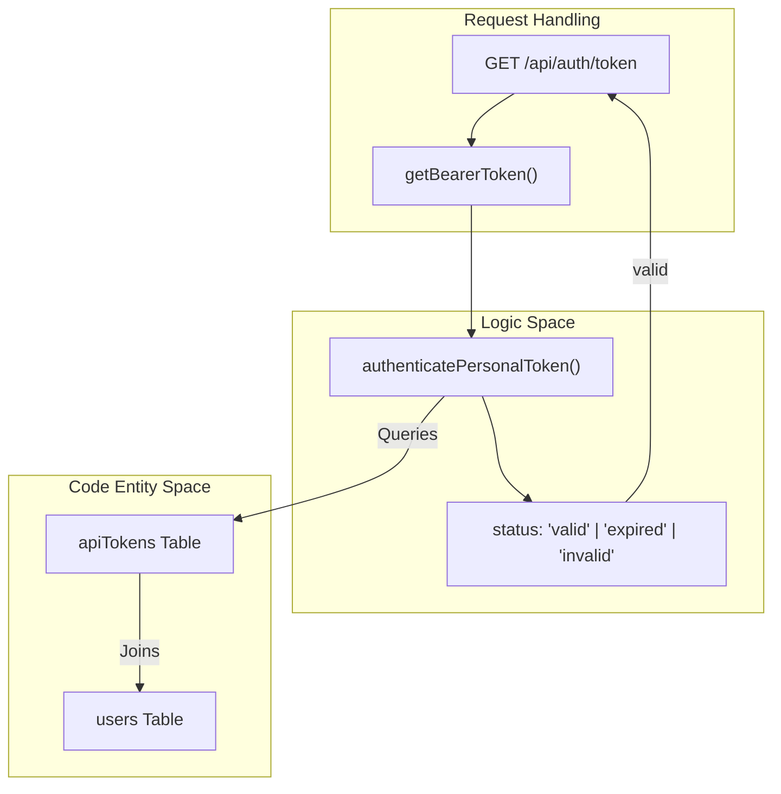
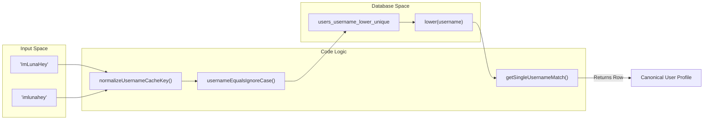

# 설정 및 데이터 관리 API

관련 소스 파일

다음 파일들은 이 위키 페이지를 생성하기 위한 컨텍스트로 사용되었습니다.

- [packages/frontend/__tests__/api/authToken.test.ts](packages/frontend/__tests__/api/authToken.test.ts)
- [packages/frontend/__tests__/api/settingsSubmittedDataDelete.test.ts](packages/frontend/__tests__/api/settingsSubmittedDataDelete.test.ts)
- [packages/frontend/__tests__/api/settingsTokensList.test.ts](packages/frontend/__tests__/api/settingsTokensList.test.ts)
- [packages/frontend/__tests__/api/submitAuth.test.ts](packages/frontend/__tests__/api/submitAuth.test.ts)
- [packages/frontend/__tests__/lib/bearerToken.test.ts](packages/frontend/__tests__/lib/bearerToken.test.ts)
- [packages/frontend/__tests__/lib/getUserEmbedStats.test.ts](packages/frontend/__tests__/lib/getUserEmbedStats.test.ts)
- [packages/frontend/__tests__/lib/usernameLookup.test.ts](packages/frontend/__tests__/lib/usernameLookup.test.ts)
- [packages/frontend/src/app/api/auth/token/route.ts](packages/frontend/src/app/api/auth/token/route.ts)
- [packages/frontend/src/app/api/settings/submitted-data/route.ts](packages/frontend/src/app/api/settings/submitted-data/route.ts)
- [packages/frontend/src/app/api/settings/tokens/route.ts](packages/frontend/src/app/api/settings/tokens/route.ts)

Settings and Data Management API는 사용자가 개인 액세스 토큰을 관리하고, API를 통해 본인 신원을 확인하며, Tokscale에서 자신의 데이터 범위를 제어할 수 있는 엔드포인트를 제공합니다. 이러한 엔드포인트는 주로 Tokscale CLI와 웹 기반 사용자 설정 대시보드에서 사용됩니다.

## API 토큰 관리

Tokscale은 CLI 제출과 기타 프로그래밍 방식의 상호작용을 승인하기 위해 Personal Access Token(PAT)을 사용합니다. 이러한 토큰은 `/api/settings/tokens` 엔드포인트를 통해 관리됩니다.

### 토큰 목록 조회
`GET /api/settings/tokens` 엔드포인트는 인증된 사용자의 모든 활성 토큰을 가져옵니다. 보안을 보호하기 위해 응답에는 메타데이터가 포함되지만 실제 원시 토큰 문자열과 `userId` 같은 민감한 필드는 제외됩니다.

**데이터 흐름:**
1. 요청은 사용자의 웹 세션을 검증하기 위해 `getSession()`을 호출합니다 [[packages/frontend/src/app/api/settings/tokens/route.ts:23-26]]().
2. 데이터베이스에서 레코드를 가져오기 위해 `listPersonalTokens(session.id)`를 호출합니다 [[packages/frontend/src/app/api/settings/tokens/route.ts:28-28]]().
3. 결과는 `id`, `name`, `createdAt`, `lastUsedAt`을 포함하는 공개 스키마로 매핑됩니다 [[packages/frontend/src/app/api/settings/tokens/route.ts:31-36]]().

### 토큰 생성
`POST /api/settings/tokens` 엔드포인트는 사용자가 새로운 PAT를 생성할 수 있게 합니다.

**구현 세부 사항:**
- **토큰 이름 지정:** 이름이 제공되지 않으면 기본값은 `"CI token"`입니다 [[packages/frontend/src/app/api/settings/tokens/route.ts:5-10]](). 이름은 공백이 제거되고 100자로 제한됩니다 [[packages/frontend/src/app/api/settings/tokens/route.ts:6-18]]().
- **고유성:** UI에서 혼동을 방지하기 위해 `ensureUniqueName: true`와 함께 `issuePersonalToken` 함수가 호출됩니다 [[packages/frontend/src/app/api/settings/tokens/route.ts:60-60]]().
- **단일 노출:** 원시 토큰 문자열은 `201 Created` 응답에서 단 한 번만 반환됩니다 [[packages/frontend/src/app/api/settings/tokens/route.ts:63-74]]().

### 토큰 인증 흐름
`/api/auth/token` 엔드포인트는 CLI가 로컬에 저장된 토큰이 여전히 유효한지 확인하고 연결된 사용자 프로필을 가져올 수 있게 합니다.

**로직 경로:**
1. `getBearerToken`을 사용해 `Authorization: Bearer <token>` 헤더에서 토큰을 추출합니다 [[packages/frontend/src/app/api/auth/token/route.ts:7-13]]().
2. `authenticatePersonalToken(token, { touchLastUsedAt: false })`를 호출합니다 [[packages/frontend/src/app/api/auth/token/route.ts:15-17]]().
3. 토큰이 `"invalid"` 또는 `"expired"`이면 401 오류를 반환합니다 [[packages/frontend/src/app/api/auth/token/route.ts:19-28]]().
4. 유효하면 `username`, `displayName`, `avatarUrl`을 반환합니다 [[packages/frontend/src/app/api/auth/token/route.ts:30-36]]().

### 토큰 엔티티 매핑
다음 다이어그램은 API 로직을 기반 데이터 엔티티와 헬퍼 함수에 매핑합니다.

**다이어그램: 토큰 인증 엔티티 맵**

출처: [[packages/frontend/src/app/api/auth/token/route.ts:5-44]](), [[packages/frontend/src/lib/auth/bearerToken.ts:1-21]]()

## 데이터 관리 및 삭제

사용자는 제출한 토큰 사용량 데이터를 삭제할 권리가 있습니다. 이는 `/api/settings/submitted-data` 엔드포인트에서 처리됩니다.

### 사용자 데이터 삭제
`DELETE /api/settings/submitted-data` 엔드포인트는 사용자와 연결된 모든 사용량 레코드의 연쇄 정리를 수행합니다.

**구현 로직:**
1. **해석:** 사용자는 Bearer 토큰 또는 세션 쿠키를 통해 해석됩니다 [[packages/frontend/src/app/api/settings/submitted-data/route.ts:10-25]]().
2. **데이터베이스 실행:** `userId`가 일치하는 `submissions` 테이블에서 `DELETE` 작업을 수행합니다 [[packages/frontend/src/app/api/settings/submitted-data/route.ts:34-37]]().
3. **캐시 무효화:** 이것이 가장 중요한 단계입니다. 리더보드와 프로필 페이지가 삭제를 반영하도록, 시스템은 여러 Next.js 태그와 경로를 무효화합니다 [[packages/frontend/src/app/api/settings/submitted-data/route.ts:42-52]]().

**캐시 무효화 대상:**
| 대상 유형 | 키 / 경로 |
| :--- | :--- |
| 전역 태그 | `leaderboard`, `max`, `user-rank` |
| 사용자별 태그 | `user:<username>`, `user-rank:<username>`, `embed-user:<username>` |
| 정적 경로 | `/leaderboard`, `/profile`, `/u/<username>` |

출처: [[packages/frontend/src/app/api/settings/submitted-data/route.ts:27-69]](), [[packages/frontend/__tests__/api/settingsSubmittedDataDelete.test.ts:136-180]]()

## Username 해석 및 정규화

username은 URL(예: `/u/ImLunaHey`)에서 사용되므로, API는 충돌을 방지하기 위해 대소문자를 구분하지 않는 조회를 안전하게 처리해야 합니다.

**정규화 전략:**
- **Case Folding:** 모든 캐시 키는 username을 소문자로 변환하는 `normalizeUsernameCacheKey`를 사용해 정규화됩니다 [[packages/frontend/src/lib/db/usernameLookup.ts:68-70]]().
- **함수형 인덱스:** 데이터베이스는 저장 계층에서 고유성을 강제하기 위해 `lower("username")`에 대한 고유 함수형 인덱스를 활용합니다 [[packages/frontend/__tests__/lib/usernameLookup.test.ts:91-100]]().
- **모호성 확인:** 사용자를 조회할 때 시스템은 최대 2개의 행을 가져옵니다. 대소문자를 구분하지 않은 상태에서 1개보다 많은 행이 일치하면 `AmbiguousUsernameError`를 던집니다 [[packages/frontend/__tests__/lib/getUserEmbedStats.test.ts:113-118]]().

**다이어그램: Username 해석 파이프라인**

출처: [[packages/frontend/__tests__/lib/usernameLookup.test.ts:38-89]](), [[packages/frontend/__tests__/lib/getUserEmbedStats.test.ts:160-184]]()

## 엔드포인트 요약

| 메서드 | 엔드포인트 | 설명 | 인증 필요 |
| :--- | :--- | :--- | :--- |
| `GET` | `/api/auth/token` | PAT를 검증하고 사용자 정보를 반환합니다 | Bearer Token |
| `GET` | `/api/settings/tokens` | 모든 사용자 토큰의 메타데이터를 나열합니다 | Web Session |
| `POST` | `/api/settings/tokens` | 새로운 PAT를 생성합니다 | Web Session |
| `DELETE` | `/api/settings/submitted-data` | 모든 사용자 제출 데이터를 삭제합니다 | Session 또는 Token |

출처: [[packages/frontend/src/app/api/settings/tokens/route.ts:1-82]](), [[packages/frontend/src/app/api/auth/token/route.ts:1-44]](), [[packages/frontend/src/app/api/settings/submitted-data/route.ts:1-70]]()
