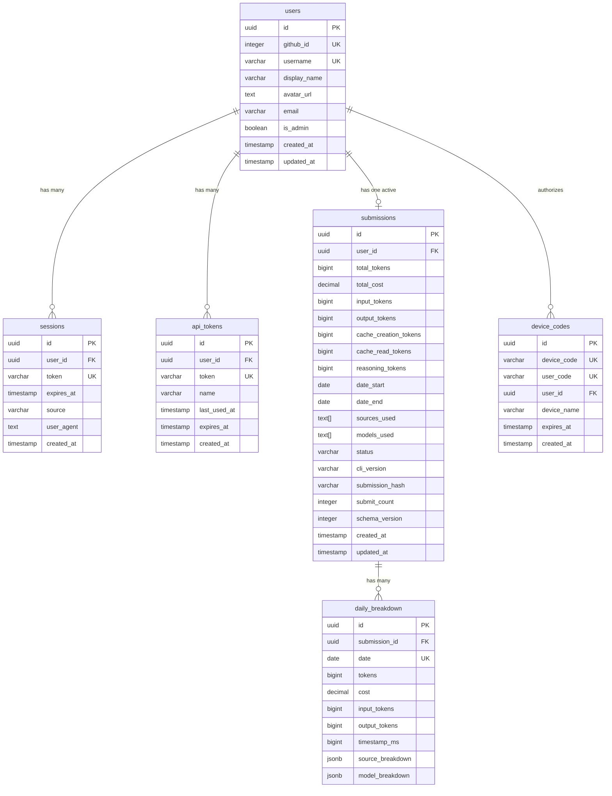

# 데이터베이스 스키마

관련 소스 파일

다음 파일들은 이 위키 페이지를 생성하기 위한 컨텍스트로 사용되었습니다.

- [packages/frontend/src/app/api/submit/route.ts](packages/frontend/src/app/api/submit/route.ts)
- [packages/frontend/src/app/api/users/[username]/route.ts](packages/frontend/src/app/api/users/[username]/route.ts)
- [packages/frontend/src/lib/db/helpers.ts](packages/frontend/src/lib/db/helpers.ts)
- [packages/frontend/src/lib/db/migrations/0000_add_user_id_unique_constraint.sql](packages/frontend/src/lib/db/migrations/0000_add_user_id_unique_constraint.sql)
- [packages/frontend/src/lib/db/migrations/meta/0000_snapshot.json](packages/frontend/src/lib/db/migrations/meta/0000_snapshot.json)
- [packages/frontend/src/lib/db/migrations/meta/_journal.json](packages/frontend/src/lib/db/migrations/meta/_journal.json)
- [packages/frontend/src/lib/db/schema.ts](packages/frontend/src/lib/db/schema.ts)

이 문서는 Tokscale 웹 플랫폼에서 사용하는 PostgreSQL 데이터베이스 스키마를 설명합니다. 이 스키마는 사용자 인증 데이터, 제출 레코드, 일별 토큰 사용량 세부 내역을 저장합니다. API를 통해 데이터가 이 데이터베이스를 채우는 흐름에 대한 정보는 [API Routes](#5)를 참조하세요. 프론트엔드가 이 스키마를 쿼리하는 방식에 대한 자세한 내용은 [Frontend Web Application](#4)을 참조하세요.

데이터베이스는 Drizzle ORM을 사용하며 Neon Serverless PostgreSQL에서 호스팅됩니다. 스키마는 각 사용자가 최대 하나의 활성 제출 레코드를 가지며, 이 레코드가 클라이언트 수준(소스 수준) 병합을 통해 업데이트되는 일대일 활성 제출 모델을 구현합니다.

## 스키마 개요

데이터베이스는 인증 테이블(`users`, `sessions`, `apiTokens`, `deviceCodes`)과 제출 테이블(`submissions`, `dailyBreakdown`)이라는 두 기능 그룹으로 구성된 여섯 개의 주요 테이블로 이루어져 있습니다.

### 엔티티 관계 다이어그램

**출처:**
- [packages/frontend/src/lib/db/schema.ts:26-280]()

## 핵심 테이블

### Users 테이블

`users` 테이블은 GitHub로 인증된 사용자 계정을 저장합니다. 각 사용자는 고유한 GitHub ID와 username으로 식별됩니다.

| 열 | 타입 | 제약 조건 | 설명 |
|--------|------|-------------|-------------|
| `id` | `uuid` | PK, 자동 생성 | 내부 사용자 식별자 |
| `githubId` | `integer` | NOT NULL, UNIQUE | GitHub OAuth 사용자 ID |
| `username` | `varchar(39)` | NOT NULL, UNIQUE | GitHub username |
| `displayName` | `varchar(255)` | nullable | 사용자의 표시 이름 |
| `avatarUrl` | `text` | nullable | GitHub 아바타 URL |
| `isAdmin` | `boolean` | NOT NULL, default `false` | 관리자 권한 플래그 |
| `createdAt` | `timestamp` | NOT NULL, default now | 계정 생성 타임스탬프 |

**인덱스:**
- `username`에 대한 `idx_users_username` [packages/frontend/src/lib/db/schema.ts:44-44]()
- `USERS_USERNAME_LOWER_UNIQUE_INDEX`(대소문자를 구분하지 않는 고유 username) [packages/frontend/src/lib/db/schema.ts:45-47]()

**출처:**
- [packages/frontend/src/lib/db/schema.ts:26-50]()

### Sessions 테이블

`sessions` 테이블은 웹과 CLI 인증 모두에 대한 활성 사용자 세션을 추적합니다.

| 열 | 타입 | 제약 조건 | 설명 |
|--------|------|-------------|-------------|
| `userId` | `uuid` | FK to `users.id` | 세션 소유자 |
| `token` | `varchar(64)` | NOT NULL, UNIQUE | 세션 토큰 |
| `source` | `varchar(10)` | default `'web'` | 세션 출처(web/cli) |

**출처:**
- [packages/frontend/src/lib/db/schema.ts:61-81]()

### API Tokens 테이블

`apiTokens` 테이블은 CLI가 데이터 제출에 사용하는 토큰을 저장합니다.

| 열 | 타입 | 제약 조건 | 설명 |
|--------|------|-------------|-------------|
| `token` | `varchar(64)` | NOT NULL, UNIQUE | `Authorization: Bearer`에 사용되는 API 토큰 |
| `lastUsedAt`| `timestamp` | nullable | 모든 `/api/submit` 호출마다 업데이트됨 |

**출처:**
- [packages/frontend/src/lib/db/schema.ts:93-113]()
- [packages/frontend/src/app/api/submit/route.ts:142-145]()

## 제출 테이블

관계와 병합 전략에 대한 자세한 내용은 [Data Models and Relationships](#6.1)를 참조하세요.

### Submissions 테이블

`submissions` 테이블은 사용자별 집계 토큰 사용량 데이터를 저장합니다. 고유 제약 조건 `submissions_user_id_unique`를 통해 사용자와 제출 사이의 **일대일 관계**를 강제합니다 [packages/frontend/src/lib/db/schema.ts:198-198]().

```mermaid
graph TB
    subgraph "One-to-One Submission Model"
        User["users table"]
        Sub["submissions table<br/>(max 1 row per user)"]
        Daily["daily_breakdown table<br/>(many rows)"]
        
        User -->|"userId FK<br/>UNIQUE constraint"| Sub
        Sub -->|"submissionId FK"| Daily
    end
    
    subgraph "Update Flow"
        API["POST /api/submit"]
        Lock["SELECT ... FOR UPDATE<br/>Row-level lock"]
        Merge["mergeClientBreakdowns()<br/>Source-level merge"]
        Recalc["recalculateDayTotals()"]
        Update["UPDATE submissions"]
        
        API --> Lock
        Lock --> Merge
        Merge --> Recalc
        Recalc --> Update
    end
```

#### 토큰 카운터 열
| 열 | 타입 | 설명 |
|--------|------|-------------|
| `totalTokens` | `bigint` | 모든 토큰 유형의 합계 |
| `totalCost` | `decimal(12,4)` | 총 USD 비용 |
| `reasoningTokens` | `bigint` | 확장 사고 모델용 토큰 [packages/frontend/src/lib/db/schema.ts:166-168]() |
| `schemaVersion` | `integer` | CLI 데이터 형식 버전 관리(0=legacy, 1=timestamp-aware) [packages/frontend/src/lib/db/schema.ts:182-182]() |

**출처:**
- [packages/frontend/src/lib/db/schema.ts:148-190]()

### Daily Breakdown 테이블

`daily_breakdown` 테이블은 소스 및 모델 세부 내역과 함께 일별 토큰 사용량을 저장합니다.

| 열 | 타입 | 설명 |
|--------|------|-------------|
| `date` | `date` | 활동 날짜(YYYY-MM-DD) |
| `timestampMs` | `bigint` | 해당 날짜의 가장 이른 세션에 대한 Unix timestamp [packages/frontend/src/lib/db/schema.ts:219-219]() |
| `sourceBreakdown` | `jsonb` | 상세 클라이언트 수준 데이터 [packages/frontend/src/lib/db/schema.ts:221-221]() |
| `modelBreakdown` | `jsonb` | 모델 ID → 토큰 수 맵 [packages/frontend/src/lib/db/schema.ts:222-222]() |

#### Source Breakdown JSONB 구조
`sourceBreakdown` 열은 클라이언트 이름을 상세 토큰 및 비용 데이터에 매핑하는 중첩 JSON 구조를 저장하며, 클라이언트별 모델 세부 내역도 포함합니다 [packages/frontend/src/lib/db/helpers.ts:16-28]().

**출처:**
- [packages/frontend/src/lib/db/schema.ts:203-256]()
- [packages/frontend/src/lib/db/helpers.ts:5-38]()

## 쿼리 패턴 및 최적화

인덱싱과 동시성에 대한 자세한 내용은 [Query Patterns and Optimization](#6.2)을 참조하세요.

### 클라이언트 수준 병합 알고리즘
사용자가 `tokscale submit`을 실행하면 API는 `mergeClientBreakdowns()`를 사용해 **클라이언트 수준 병합**을 수행합니다 [packages/frontend/src/lib/db/helpers.ts:72-88](). 이는 현재 제출에 포함된 클라이언트만 업데이트하고, 페이로드에 포함되지 않은 클라이언트의 데이터는 보존합니다.

### 동시성 제어
제출 엔드포인트는 동일 사용자에 대한 동시 제출 중 발생할 수 있는 경쟁 상태를 방지하기 위해 `FOR UPDATE` 행 수준 잠금을 사용합니다 [packages/frontend/src/app/api/submit/route.ts:154-154]() [packages/frontend/src/app/api/submit/route.ts:199-199]().

### 성능
`GET /api/users/[username]` 엔드포인트는 `Promise.all`을 사용해 사용자 통계, 최신 제출, 리더보드 순위, 일별 세부 내역을 병렬로 가져옵니다 [packages/frontend/src/app/api/users/[username]/route.ts:52-119]().

**출처:**
- [packages/frontend/src/app/api/submit/route.ts:141-355]()
- [packages/frontend/src/app/api/users/[username]/route.ts:52-119]()
- [packages/frontend/src/lib/db/migrations/meta/_journal.json:1-48]()
