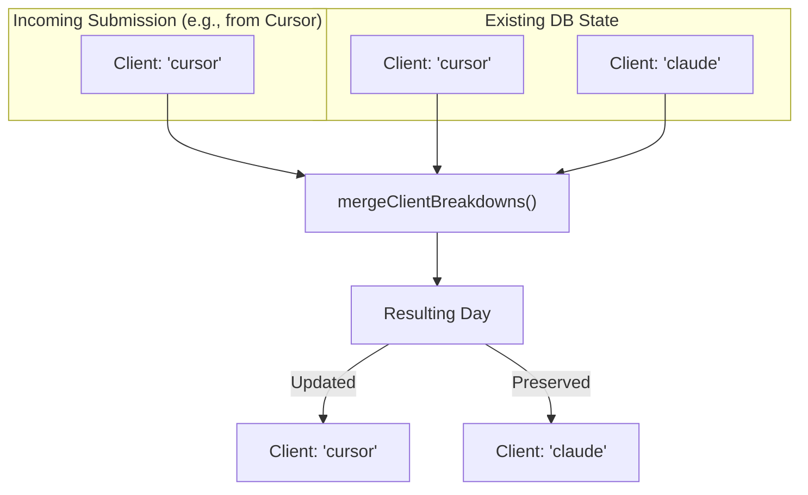

# 데이터 모델과 관계

<details>
<summary>관련 소스 파일</summary>

다음 파일들은 이 위키 페이지를 생성하기 위한 컨텍스트로 사용되었습니다.

- [packages/frontend/__tests__/api/submit.test.ts](packages/frontend/__tests__/api/submit.test.ts)
- [packages/frontend/src/app/api/submit/route.ts](packages/frontend/src/app/api/submit/route.ts)
- [packages/frontend/src/app/api/users/[username]/route.ts](packages/frontend/src/app/api/users/[username]/route.ts)
- [packages/frontend/src/components/SourceLogo.tsx](packages/frontend/src/components/SourceLogo.tsx)
- [packages/frontend/src/lib/constants.ts](packages/frontend/src/lib/constants.ts)
- [packages/frontend/src/lib/db/helpers.ts](packages/frontend/src/lib/db/helpers.ts)
- [packages/frontend/src/lib/db/migrations/0000_add_user_id_unique_constraint.sql](packages/frontend/src/lib/db/migrations/0000_add_user_id_unique_constraint.sql)
- [packages/frontend/src/lib/db/migrations/meta/0000_snapshot.json](packages/frontend/src/lib/db/migrations/meta/0000_snapshot.json)
- [packages/frontend/src/lib/db/migrations/meta/_journal.json](packages/frontend/src/lib/db/migrations/meta/_journal.json)
- [packages/frontend/src/lib/db/schema.ts](packages/frontend/src/lib/db/schema.ts)
- [packages/frontend/src/lib/types.ts](packages/frontend/src/lib/types.ts)
- [packages/frontend/src/lib/validation/submission.ts](packages/frontend/src/lib/validation/submission.ts)

</details>


## 목적과 범위

이 문서는 Tokscale 웹 플랫폼에서 사용하는 PostgreSQL 데이터베이스 스키마를 설명하며, 테이블 정의, 관계, 제약 조건, 그리고 점진적인 제출 업데이트를 가능하게 하는 특수 데이터 모델 패턴을 포함합니다. 이 스키마는 사용자 인증, API 토큰 관리, 일별 단위의 토큰 사용량 통계 저장을 지원합니다.

Tokscale은 여러 클라이언트 장치와 CLI 버전 전반에서 토큰 사용량 데이터의 일관성을 유지하기 위해 특수한 **one-to-one-active** 제출 모델과 **소스 수준 병합** 전략을 구현합니다.

---

## 핵심 테이블과 관계

데이터베이스는 사용자 신원과 토큰 사용량 데이터를 중심으로 구성된 여섯 개의 주요 테이블로 이루어져 있습니다. 스키마는 사용자와 사용자의 토큰 사용량 요약 사이의 엄격한 관계를 강제합니다.

### 엔티티 관계 다이어그램

```mermaid
erDiagram
    "users" ||--o{ "sessions" : "has"
    "users" ||--o{ "api_tokens" : "has"
    "users" ||--o{ "device_codes" : "requests"
    "users" ||--|| "submissions" : "has_one_active"
    "submissions" ||--o{ "daily_breakdown" : "contains"
    
    "users" {
        uuid id PK
        integer github_id UK
        varchar username UK
        varchar display_name
        text avatar_url
        varchar email
        boolean is_admin
        timestamp created_at
        timestamp updated_at
    }
    
    "sessions" {
        uuid id PK
        uuid user_id FK
        varchar token UK
        timestamp expires_at
        varchar source
        text user_agent
        timestamp created_at
    }
    
    "api_tokens" {
        uuid id PK
        uuid user_id FK
        varchar token UK
        varchar name
        timestamp last_used_at
        timestamp expires_at
        timestamp created_at
    }

    "device_codes" {
        uuid id PK
        varchar device_code UK
        varchar user_code UK
        uuid user_id FK
        varchar device_name
        timestamp expires_at
        timestamp created_at
    }
    
    "submissions" {
        uuid id PK
        uuid user_id FK_UK
        bigint total_tokens
        decimal total_cost
        bigint input_tokens
        bigint output_tokens
        bigint cache_creation_tokens
        bigint cache_read_tokens
        bigint reasoning_tokens
        date date_start
        date date_end
        text_array sources_used
        text_array models_used
        varchar status
        varchar cli_version
        varchar submission_hash
        integer submit_count
        integer schema_version
        timestamp created_at
        timestamp updated_at
    }
    
    "daily_breakdown" {
        uuid id PK
        uuid submission_id FK
        date date UK
        bigint tokens
        decimal cost
        bigint input_tokens
        bigint output_tokens
        jsonb source_breakdown
        jsonb model_breakdown
        bigint timestamp_ms
    }
```

**출처:** [packages/frontend/src/lib/db/schema.ts:26-263](), [packages/frontend/src/lib/db/migrations/0000_add_user_id_unique_constraint.sql:1-107]()

---

## 사용자 및 인증 테이블

### users 테이블
`users` 테이블은 GitHub OAuth에서 얻은 사용자 신원 정보를 저장합니다. 

**인덱스 및 제약 조건:**
- `username`에 대한 `idx_users_username` [packages/frontend/src/lib/db/schema.ts:44]().
- `USERS_USERNAME_LOWER_UNIQUE_INDEX`는 대소문자를 구분하지 않는 고유 조회를 제공합니다 [packages/frontend/src/lib/db/schema.ts:45-47]().
- `githubId`에 대한 `idx_users_github_id` [packages/frontend/src/lib/db/schema.ts:48]().

### apiTokens 테이블
CLI(`tokscale submit`)가 사용하는 장기 API 토큰을 저장합니다.
- **고유 제약 조건:** `(userId, name)`에 대한 `api_tokens_user_name_unique`는 각 사용자가 이름별로 하나의 토큰만 가질 수 있도록 보장합니다 [packages/frontend/src/lib/db/schema.ts:111]().

### deviceCodes 테이블
CLI 로그인에 사용되는 OAuth 2.0 Device Authorization Grant 흐름을 지원합니다.
- `device_code`는 장치로 전송되는 긴 식별자입니다 [packages/frontend/src/lib/db/schema.ts:129]().
- `user_code`는 사용자가 브라우저에 입력하는 짧은 8-9자 코드입니다 [packages/frontend/src/lib/db/schema.ts:130]().

---

## 제출 데이터 테이블

### submissions 테이블
`submissions` 테이블은 각 사용자에 대한 집계 토큰 사용량 통계를 저장합니다. **one-to-one-active** 모델은 `userId`에 대한 고유 제약 조건 `submissions_user_id_unique`로 강제됩니다 [packages/frontend/src/lib/db/schema.ts:198]().

| 열 | 타입 | 설명 |
|--------|------|-------------|
| `totalTokens` | `bigint` | 모든 날짜에 걸친 모든 토큰의 합계 [packages/frontend/src/lib/db/schema.ts:156](). |
| `reasoningTokens` | `bigint` | reasoning 모델(예: o1)의 총 토큰 [packages/frontend/src/lib/db/schema.ts:166](). |
| `submitCount` | `integer` | 성공한 모든 `POST /api/submit`마다 증가합니다 [packages/frontend/src/lib/db/schema.ts:180](). |
| `schemaVersion` | `integer` | 데이터 형식을 추적합니다(0: legacy, 1: timestamp-aware) [packages/frontend/src/lib/db/schema.ts:182](). |

### dailyBreakdown 테이블
세분화된 일별 토큰 사용량을 저장합니다. 이 테이블은 모든 제출 총계의 원천 데이터입니다.

| 열 | 타입 | 설명 |
|--------|------|-------------|
| `sourceBreakdown` | `jsonb` | 클라이언트(예: cursor, claude)와 모델별 중첩 세부 내역 [packages/frontend/src/lib/db/schema.ts:223](). |
| `timestampMs` | `bigint` | 해당 날짜에 기록된 가장 이른 메시지 타임스탬프 [packages/frontend/src/lib/db/schema.ts:230](). |

---

## 데이터 모델 설계 원칙

### 소스 수준 병합 전략
시스템은 "Client-Level Merge"(역사적으로는 "Source-Level")를 구현합니다. 사용자가 CLI에서 데이터를 제출하면 서버는 들어온 데이터를 클라이언트 수준에서 기존 레코드와 병합합니다.

**병합 로직:**
1. 제출에 포함된 클라이언트(소스)만 업데이트합니다 [packages/frontend/src/app/api/submit/route.ts:55]().
2. 제출에 포함되지 않은 클라이언트의 데이터는 보존합니다 [packages/frontend/src/app/api/submit/route.ts:56]().
3. 결과 `dailyBreakdown`에서 모든 총계를 다시 계산합니다 [packages/frontend/src/app/api/submit/route.ts:57]().



**구현:**
`mergeClientBreakdowns` 함수는 모든 기존 데이터를 복사한 다음, `incomingClients` 집합을 순회하며 특정 클라이언트 항목을 업데이트하거나 삭제합니다 [packages/frontend/src/lib/db/helpers.ts:72-88]().

### Daily Breakdown 구조
`dailyBreakdown`의 `sourceBreakdown` 필드는 클라이언트별 모델 사용량을 추적하기 위해 중첩 구조를 사용합니다.

```typescript
// Defined in packages/frontend/src/lib/db/helpers.ts:16-28
export interface ClientBreakdownData {
  tokens: number;
  cost: number;
  // ... token types (input, output, etc)
  models: Record<string, ModelBreakdownData>;
}
```

### 데이터 정규화
제출 API는 "clients" 대신 "sources"가 사용되던 레거시 형식을 처리합니다 [packages/frontend/src/app/api/submit/route.ts:31-35](). 또한 `kilocode`를 `kilo`로 매핑하는 등 클라이언트 별칭도 정규화합니다 [packages/frontend/src/lib/validation/submission.ts:96-105]().

---

## 관계와 무결성

### 동시성 처리
제출 중 시스템은 트랜잭션 내에서 `submissions` 레코드와 `dailyBreakdown` 레코드 모두에 `FOR UPDATE` 행 수준 잠금을 사용합니다 [packages/frontend/src/app/api/submit/route.ts:154, 199](). 이를 통해 두 장치가 동시에 같은 날짜에 데이터를 병합하려고 할 때 발생할 수 있는 경쟁 상태를 방지합니다.

### 검증
제출은 Zod를 사용한 Level 1 검증을 거칩니다 [packages/frontend/src/lib/validation/submission.ts:159-164](). 여기에는 다음이 포함됩니다.
- 수학적 일관성(총계는 세부 내역의 합과 일치해야 함) [packages/frontend/src/lib/validation/submission.ts:227-230]().
- 미래 날짜 금지(시간대를 고려한 2일 버퍼 포함) [packages/frontend/src/lib/validation/submission.ts:210-212]().
- `SUPPORTED_SOURCES`에 대한 클라이언트 ID 검증 [packages/frontend/src/lib/validation/submission.ts:22-42]().

**출처:**
- `packages/frontend/src/lib/db/schema.ts`
- `packages/frontend/src/app/api/submit/route.ts`
- `packages/frontend/src/lib/db/helpers.ts`
- `packages/frontend/src/lib/validation/submission.ts`
- `packages/frontend/src/lib/types.ts`
