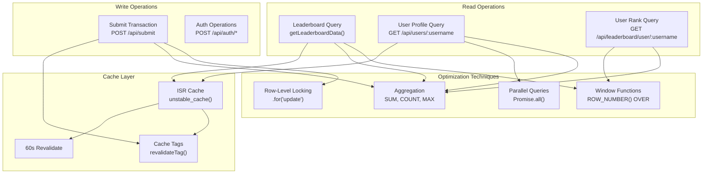
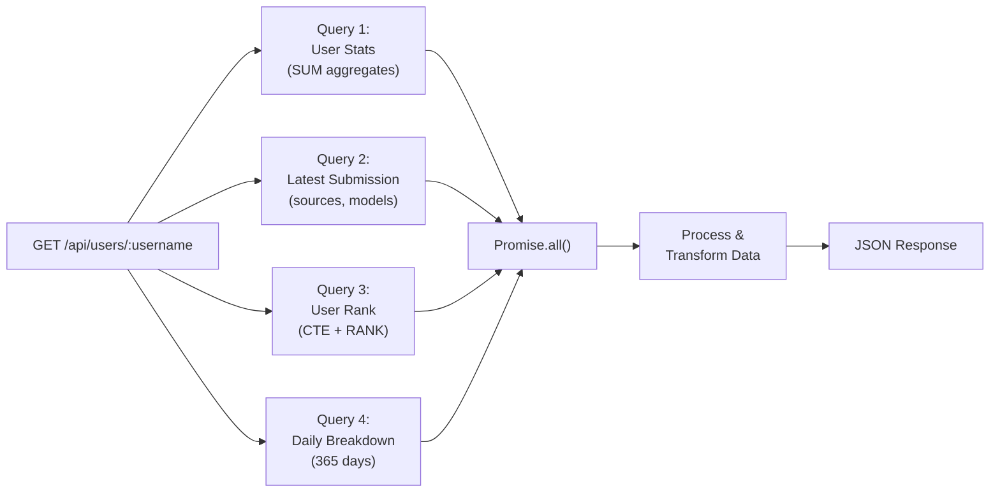
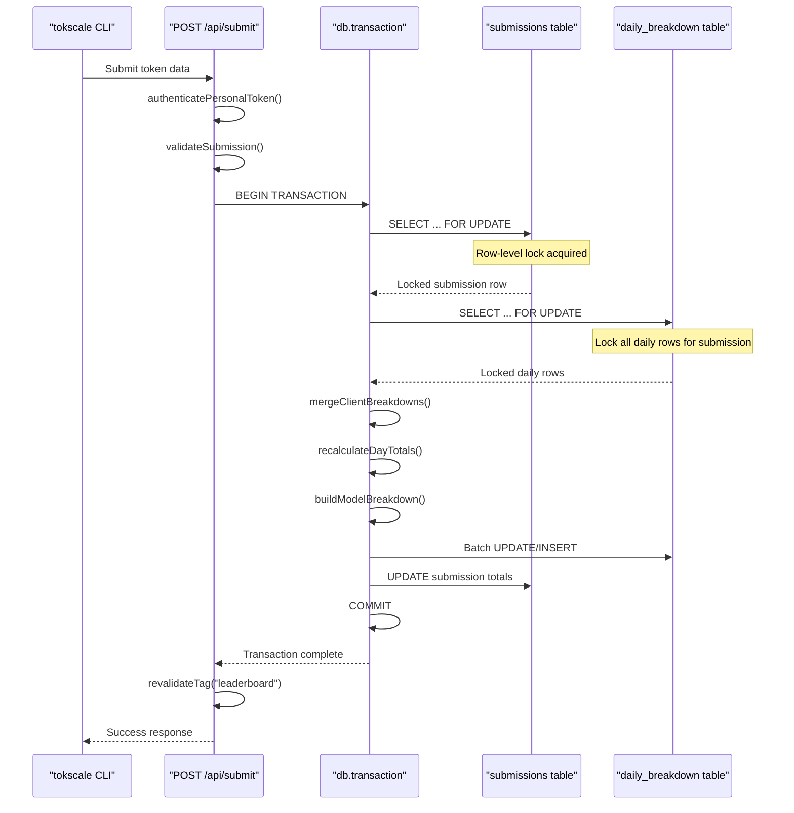
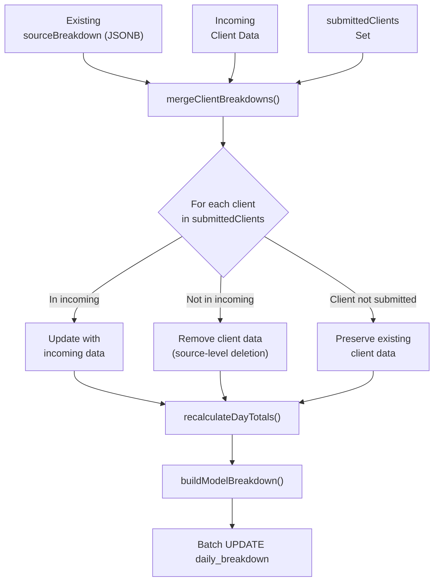

# 쿼리 패턴과 최적화

<details>
<summary>관련 소스 파일</summary>

다음 파일들은 이 위키 페이지를 생성하기 위한 컨텍스트로 사용되었습니다.

- [packages/frontend/src/app/api/submit/route.ts](packages/frontend/src/app/api/submit/route.ts)
- [packages/frontend/src/app/api/users/[username]/route.ts](packages/frontend/src/app/api/users/[username]/route.ts)
- [packages/frontend/src/lib/date-utils.ts](packages/frontend/src/lib/date-utils.ts)
- [packages/frontend/src/lib/db/helpers.ts](packages/frontend/src/lib/db/helpers.ts)
- [packages/frontend/src/lib/db/migrations/0000_add_user_id_unique_constraint.sql](packages/frontend/src/lib/db/migrations/0000_add_user_id_unique_constraint.sql)
- [packages/frontend/src/lib/db/migrations/0001_youthful_snowbird.sql](packages/frontend/src/lib/db/migrations/0001_youthful_snowbird.sql)
- [packages/frontend/src/lib/db/migrations/0002_square_lyja.sql](packages/frontend/src/lib/db/migrations/0002_square_lyja.sql)
- [packages/frontend/src/lib/db/migrations/0004_add_timestamp_and_schema_version.sql](packages/frontend/src/lib/db/migrations/0004_add_timestamp_and_schema_version.sql)
- [packages/frontend/src/lib/db/migrations/meta/0000_snapshot.json](packages/frontend/src/lib/db/migrations/meta/0000_snapshot.json)
- [packages/frontend/src/lib/db/migrations/meta/0002_snapshot.json](packages/frontend/src/lib/db/migrations/meta/0002_snapshot.json)
- [packages/frontend/src/lib/db/migrations/meta/_journal.json](packages/frontend/src/lib/db/migrations/meta/_journal.json)
- [packages/frontend/src/lib/db/schema.ts](packages/frontend/src/lib/db/schema.ts)

</details>


이 문서는 Tokscale 웹 애플리케이션 전반에서 사용되는 데이터베이스 쿼리 패턴, 인덱싱 전략, 동시성 제어 메커니즘, 성능 최적화를 자세히 설명합니다. 데이터베이스 스키마 구조와 테이블 관계에 대한 정보는 [Data Models and Relationships](6.1)를 참조하세요. API 엔드포인트 구현에 대한 정보는 [API Routes](5)를 참조하세요.

## 개요

애플리케이션은 Drizzle ORM과 함께 PostgreSQL을 사용하며 여러 최적화 전략을 구현합니다.
- 효율적인 순위 계산을 위한 윈도우 함수
- 동시 쓰기 작업을 위한 행 수준 잠금
- 트래픽이 많은 쿼리를 위한 전략적 인덱싱
- 태그 기반 무효화를 사용하는 ISR 캐싱
- 복잡한 데이터 가져오기를 위한 병렬 쿼리 실행
- 점진적 데이터 업데이트를 허용하는 클라이언트 수준 병합

---

## 쿼리 패턴 아키텍처



출처: [packages/frontend/src/app/api/users/[username]/route.ts:52-119](), [packages/frontend/src/app/api/submit/route.ts:141-356]()

---

## 사용자 프로필 쿼리 패턴

사용자 프로필 쿼리는 `users`, `submissions`, `daily_breakdown` 테이블에서 여러 관련 데이터셋을 가져올 때 지연 시간을 최소화하기 위해 병렬 실행을 사용합니다.

### 병렬 쿼리 실행



출처: [packages/frontend/src/app/api/users/[username]/route.ts:52-119]()

### 쿼리 세부 사항

사용자 프로필 엔드포인트는 `Promise.all()`을 사용해 네 개의 쿼리를 병렬로 실행합니다.

| 쿼리 | 목적 | 주요 작업 |
|-------|---------|----------------|
| 통계 집계 | 총 토큰, 비용, 개수 | `SUM(totalTokens)`, `SUM(totalCost)`, `MIN(dateStart)` |
| 최신 제출 | 사용된 소스와 모델 | `ORDER BY desc(submissions.updatedAt)` LIMIT 1 |
| 사용자 순위 | 전역 순위 | `RANK() OVER (ORDER BY total_tokens)`를 사용하는 CTE |
| 일별 세부 내역 | 365일 기여 그래프 | 날짜 필터 `gte(dailyBreakdown.date, oneYearAgo)`가 있는 JOIN |

그런 다음 결과는 레거시 클라이언트 별칭(예: `kilocode`를 `kilo`로 매핑)을 처리하고 서로 다른 클라이언트 전반의 모델 사용량에 대한 통합 보기를 만들기 위해 메모리에서 집계됩니다 [packages/frontend/src/app/api/users/[username]/route.ts:12-15](), [packages/frontend/src/app/api/users/[username]/route.ts:149-215]().

출처: [packages/frontend/src/app/api/users/[username]/route.ts:52-119](), [packages/frontend/src/app/api/users/[username]/route.ts:163-215]()

---

## 트랜잭션 및 동시성 제어

`POST /api/submit` 엔드포인트는 동일 사용자 계정에서 발생하는 동시 제출 중 경쟁 상태를 방지하기 위해 행 수준 잠금을 사용합니다.

### 제출 트랜잭션 흐름



출처: [packages/frontend/src/app/api/submit/route.ts:141-356]()

### 잠금 전략

submit 엔드포인트는 Drizzle의 `.for('update')` 수정자를 사용한 비관적 잠금을 구현하여, 하나의 제출이 병합되는 동안 다른 프로세스가 같은 사용자의 데이터를 수정할 수 없도록 보장합니다 [packages/frontend/src/app/api/submit/route.ts:154](), [packages/frontend/src/app/api/submit/route.ts:199]().

```typescript
// Lock the user's submission row
const [existingSubmission] = await tx
  .select({ id: submissions.id })
  .from(submissions)
  .where(eq(submissions.userId, tokenRecord.userId))
  .for('update')
  .limit(1);

// Lock all daily breakdown rows for this submission
const existingDays = await tx
  .select({ ... })
  .from(dailyBreakdown)
  .where(eq(dailyBreakdown.submissionId, submissionId))
  .for('update');
```

출처: [packages/frontend/src/app/api/submit/route.ts:150-155](), [packages/frontend/src/app/api/submit/route.ts:190-199]()

### 클라이언트 수준 병합 로직

시스템은 "Client-Level Merge" 전략을 구현합니다. 모든 데이터를 덮어쓰는 대신, 현재 제출에 포함된 클라이언트(Cursor, Claude Code 같은 도구)만 선택적으로 업데이트합니다 [packages/frontend/src/app/api/submit/route.ts:54-57]().



출처: [packages/frontend/src/lib/db/helpers.ts:72-88](), [packages/frontend/src/app/api/submit/route.ts:208-281]()

---

## 인덱스 전략

데이터베이스 스키마는 쓰기 경로 조회(인증)와 읽기 경로 집계(리더보드와 프로필)를 모두 최적화하기 위해 인덱스를 정의합니다.

### 인덱스 정의

| 테이블 | 인덱스 이름 | 열 | 목적 |
|-------|------------|-----------|---------|
| `users` | `idx_users_username` | `username` | 빠른 사용자 조회 [packages/frontend/src/lib/db/schema.ts:44]() |
| `users` | `USERS_USERNAME_LOWER_UNIQUE_INDEX` | `lower(username)` | 대소문자를 구분하지 않는 조회 [packages/frontend/src/lib/db/schema.ts:45-47]() |
| `submissions` | `idx_submissions_user_id` | `user_id` | 외래 키 조회 [packages/frontend/src/lib/db/schema.ts:192]() |
| `submissions` | `idx_submissions_leaderboard` | `user_id, total_tokens, total_cost, created_at` | 리더보드를 위한 복합 인덱스 [packages/frontend/src/lib/db/schema.ts:197]() |
| `daily_breakdown` | `idx_daily_breakdown_submission_id` | `submission_id` | 조인 최적화 [packages/frontend/src/lib/db/schema.ts:248]() |
| `daily_breakdown` | `idx_daily_breakdown_date` | `date` | 시계열 필터링 [packages/frontend/src/lib/db/schema.ts:249]() |
| `api_tokens` | `idx_api_tokens_token` | `token` | 인증 조회 [packages/frontend/src/lib/db/schema.ts:109]() |

출처: [packages/frontend/src/lib/db/schema.ts:26-255]()

---

## 캐시 무효화 및 ISR

웹 애플리케이션은 높은 성능을 유지하면서도 데이터 최신성을 보장하기 위해 Next.js Incremental Static Regeneration(ISR)과 태그 기반 무효화를 사용합니다.

- **재검증 간격**: 사용자 프로필 라우트는 60초마다 재검증됩니다 [packages/frontend/src/app/api/users/[username]/route.ts:17]().
- **온디맨드 무효화**: `POST /api/submit`을 통해 데이터가 제출되면, 시스템은 특정 사용자의 경로와 전역 리더보드에 대한 재검증을 트리거합니다 [packages/frontend/src/app/api/submit/route.ts:2](), [packages/frontend/src/app/api/submit/route.ts:20]().

```typescript
// Inside POST /api/submit
revalidateTag("leaderboard");
await revalidateUsernamePaths(tokenRecord.username);
```

출처: [packages/frontend/src/app/api/submit/route.ts:373-375](), [packages/frontend/src/app/api/users/[username]/route.ts:17]()

---

## 마이그레이션 이력

데이터베이스 스키마는 더 풍부한 토큰 추적(예: reasoning 토큰, cache 토큰)과 더 정확한 시간 추적을 지원하도록 발전해 왔습니다.

| 마이그레이션 태그 | 주요 변경 사항 |
|---------------|-------------|
| `0000_add_user_id_unique_constraint` | users, submissions, daily breakdowns를 포함한 초기 스키마 [packages/frontend/src/lib/db/migrations/0000_add_user_id_unique_constraint.sql:1-107]() |
| `0001_youthful_snowbird` | 총계에 cache 및 reasoning 토큰을 포함하도록 토큰 계산 로직 수정 [packages/frontend/src/lib/db/migrations/0001_youthful_snowbird.sql:1-49]() |
| `0002_square_lyja` | `submissions`에 `reasoning_tokens` 열 추가 [packages/frontend/src/lib/db/migrations/0002_square_lyja.sql:1]() |
| `0004_add_timestamp_and_schema_version` | 정확한 로컬 시간 매핑을 위해 `daily_breakdown`에 `timestamp_ms`를 추가하고 `submissions`에 `schema_version` 추가 [packages/frontend/src/lib/db/migrations/0004_add_timestamp_and_schema_version.sql:1-4]() |
| `0005_add_case_insensitive_username_index` | username 조회를 위한 대소문자 구분 없는 인덱스 추가 [packages/frontend/src/lib/db/migrations/meta/_journal.json:44-46]() |

출처: [packages/frontend/src/lib/db/migrations/meta/_journal.json:1-48](), [packages/frontend/src/lib/db/migrations/0001_youthful_snowbird.sql:1-49]()
