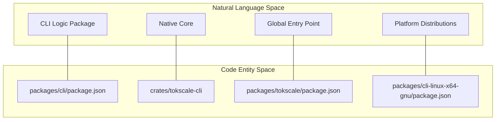
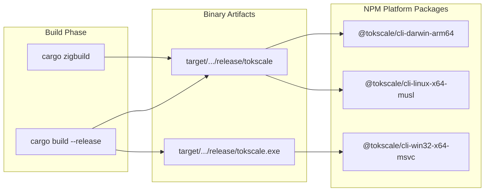

# 개발 및 빌드 시스템

<details>
<summary>관련 소스 파일</summary>

다음 파일들은 이 위키 페이지를 생성하기 위한 컨텍스트로 사용되었습니다.

- [.github/workflows/build-native.yml](.github/workflows/build-native.yml)
- [.github/workflows/launcher_validation.yml](.github/workflows/launcher_validation.yml)
- [.github/workflows/publish-cli.yml](.github/workflows/publish-cli.yml)
- [.github/workflows/test_coverage.yml](.github/workflows/test_coverage.yml)
- [.gitignore](.gitignore)
- [.npmrc](.npmrc)
- [package.json](package.json)
- [packages/cli/bin.js](packages/cli/bin.js)
- [packages/cli/tsconfig.json](packages/cli/tsconfig.json)
- [packages/tokscale/bin.js](packages/tokscale/bin.js)
- [scripts/check-version-coherence.sh](scripts/check-version-coherence.sh)
- [scripts/post-discord-release.sh](scripts/post-discord-release.sh)
- [scripts/test-package-launchers.sh](scripts/test-package-launchers.sh)

</details>


이 문서는 Tokscale 모노레포의 개발 워크플로, 빌드 시스템 아키텍처, CI/CD 파이프라인에 대한 개요를 제공합니다. 모노레포 구조, 네이티브 바이너리 컴파일, 다중 플랫폼 빌드 매트릭스, 자동 게시 워크플로를 다룹니다.

로컬 개발 환경 설정에 대한 자세한 지침은 [Local Development Setup](#7.1)을 참조하세요. 네이티브 모듈 컴파일과 크로스 플랫폼 빌드에 대한 심층 정보는 [Build Pipeline and Native Module Compilation](#7.2)을 참조하세요. CI/CD 자동화 세부 사항은 [CI/CD and Publishing](#7.3)을 참조하세요.

---

## 모노레포 아키텍처

Tokscale은 Bun workspaces를 사용하는 모노레포로 구성되어 있습니다 [package.json:7-9](). CLI, 편의 래퍼, Next.js 프론트엔드, 성능 벤치마크를 포함한 여러 패키지가 들어 있습니다.

### 워크스페이스 구조

모노레포는 여러 핵심 디렉터리 전반의 의존성과 버전을 관리합니다 [package.json:7-9]().

```
tokscale-monorepo/
├── packages/
│   ├── cli/           → @tokscale/cli (Main CLI logic & TS wrapper)
│   ├── tokscale/      → tokscale (Global binary entry point)
│   ├── frontend/      → tokscale.ai web application
│   ├── benchmarks/    → Performance testing suite
│   └── cli-{platform} → 8 platform-specific binary distributions
├── crates/            → Native Rust implementation
└── scripts/           → Build and validation utilities
```

게시되는 패키지는 `scripts/check-version-coherence.sh`가 관리하는 엄격한 버전 일관성을 유지합니다 [scripts/check-version-coherence.sh:1-121]().

**다이어그램: 시스템 엔티티 매핑**



출처: [package.json:1-9](), [scripts/check-version-coherence.sh:47-52]()

### 루트 수준 빌드 스크립트

루트 `package.json`은 통합 개발을 위한 스크립트를 정의합니다 [package.json:10-18]().

| 스크립트 | 명령 | 목적 |
|--------|---------|---------|
| `build` | `cargo build --release -p tokscale-cli && bun run build:cli` | Rust와 TS의 전체 프로덕션 빌드 |
| `build:cli` | `bun run --cwd packages/cli build` | TypeScript CLI 소스 컴파일 |
| `cli` | `./scripts/cli.sh` | 소스에서 CLI를 실행하기 위한 헬퍼 |
| `dev:frontend` | `bun run --cwd packages/frontend dev` | Next.js 개발 서버 시작 |
| `test:launchers` | `bash scripts/test-package-launchers.sh` | 런타임 전반의 바이너리 실행 검증 |

출처: [package.json:10-18]()

---

## 다중 플랫폼 빌드 매트릭스

네이티브 Rust core는 사용자가 Rust toolchain을 갖추지 않아도 폭넓은 호환성을 보장하기 위해 여덟 가지 플랫폼 대상으로 컴파일됩니다.

### 지원 플랫폼 대상

빌드 시스템은 주요 운영체제와 아키텍처를 대상으로 합니다 [.github/workflows/build-native.yml:23-64]().

| 플랫폼 | Target Triple | Host Runner | 빌드 도구 |
|----------|---------------|-------------|------------|
| macOS x64 | `x86_64-apple-darwin` | `macos-latest` | `cargo build` |
| macOS ARM64 | `aarch64-apple-darwin` | `macos-latest` | `cargo build` |
| Linux GNU x64 | `x86_64-unknown-linux-gnu` | `ubuntu-latest` | `cargo zigbuild` |
| Linux MUSL x64 | `x86_64-unknown-linux-musl` | `ubuntu-latest` | `cargo zigbuild` |
| Windows x64 | `x86_64-pc-windows-msvc` | `windows-latest` | `cargo build` |

출처: [.github/workflows/build-native.yml:23-64](), [.github/workflows/publish-cli.yml:160-185]()

**다이어그램: 네이티브 빌드에서 NPM 패키지로의 매핑**



출처: [.github/workflows/build-native.yml:23-64](), [.github/workflows/publish-cli.yml:187-219]()

---

## CI/CD 및 게시

Tokscale 릴리스 프로세스는 GitHub Actions를 통해 완전히 자동화되어 있으며, 버전 관리, 병렬 컴파일, 배포를 처리합니다.

### 버전 관리
`bump-versions` 작업은 `Cargo.toml`, `packages/cli/package.json`, 모든 플랫폼별 manifest 전반의 버전을 동기화합니다 [.github/workflows/publish-cli.yml:26-158](). Rust 바이너리가 npm 패키지와 동일한 버전을 보고하도록 보장합니다 [.github/workflows/publish-cli.yml:95-115]().

### 자동 테스트 및 린팅
모든 push와 pull request는 포괄적인 검사 모음을 트리거합니다.
- **린팅**: 자동 수정 기능과 함께 `cargo clippy`와 `cargo fmt`를 실행합니다 [.github/workflows/test_coverage.yml:34-91]().
- **커버리지**: `cargo tarpaulin`을 사용해 커버리지 보고서를 생성하고 배지를 업데이트합니다 [.github/workflows/test_coverage.yml:93-194]().
- **런처 검증**: `scripts/test-package-launchers.sh`를 실행하여 JS 래퍼가 다양한 환경(Node.js, Bun, 제한된 PATH)에서 네이티브 바이너리를 올바르게 찾고 실행하는지 확인합니다 [scripts/test-package-launchers.sh:1-168]().

### 게시 순서
1. **Bump**: 새 버전을 계산하고 모든 manifest에 적용합니다.
2. **Build**: 8개 플랫폼용 네이티브 바이너리를 병렬로 컴파일합니다 [.github/workflows/publish-cli.yml:159-219]().
3. **Publish**: 
    - 플랫폼별 패키지(예: `@tokscale/cli-linux-x64-gnu`)를 게시합니다.
    - 플랫폼 패키지를 `optionalDependencies`로 나열하는 `@tokscale/cli`를 게시합니다 [.github/workflows/publish-cli.yml:66-74]().
    - `tokscale` alias 패키지를 게시합니다.
4. **Notify**: 릴리스 노트를 Discord에 게시합니다 [.github/workflows/publish-cli.yml:364-372]().

출처: [.github/workflows/publish-cli.yml:1-372](), [.github/workflows/test_coverage.yml:1-194](), [scripts/test-package-launchers.sh:1-168]()
